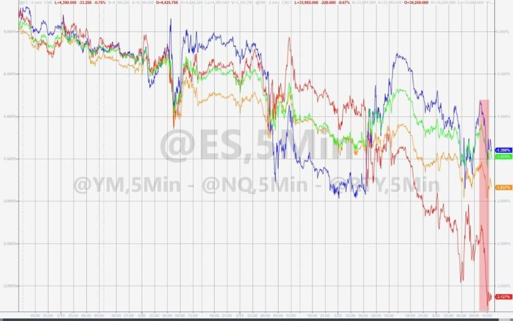
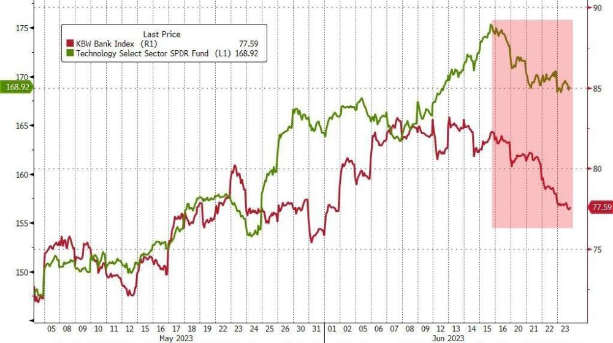
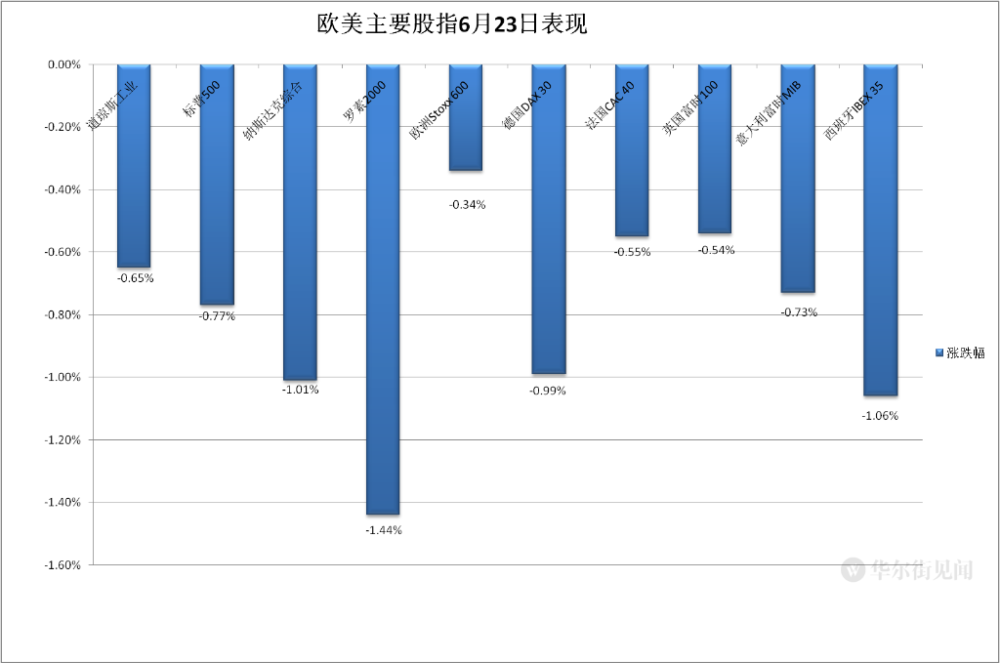
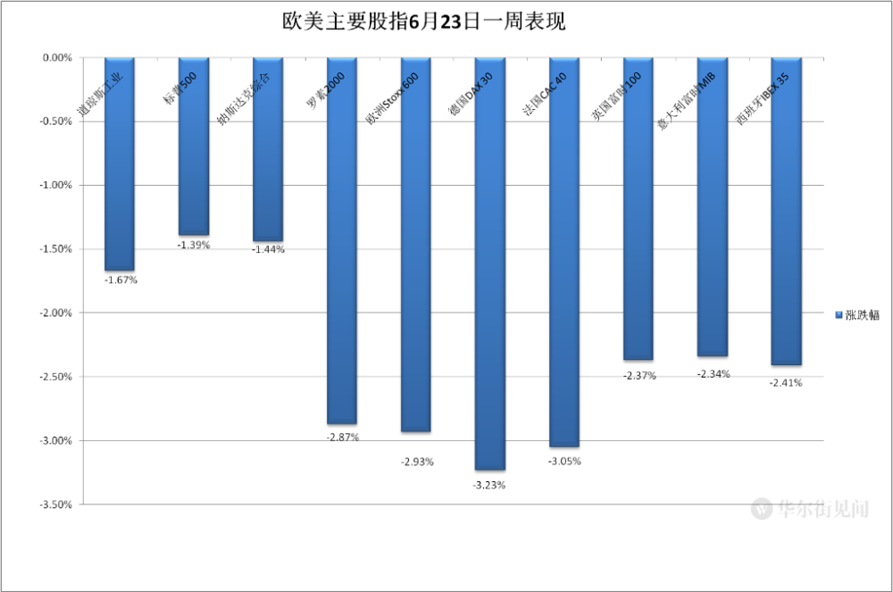
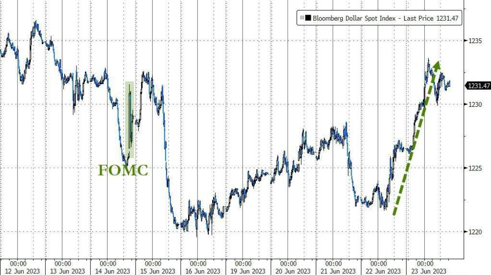
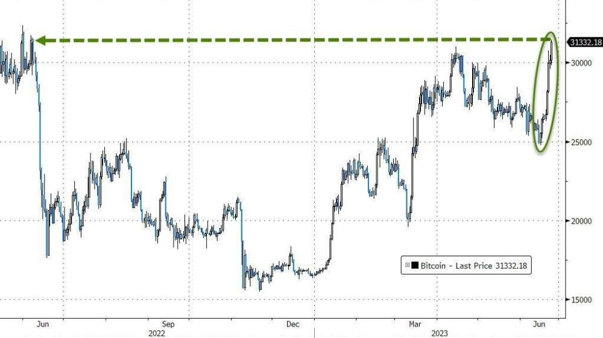
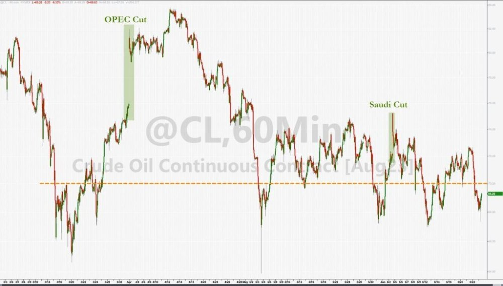

# 加息风暴激化衰退担忧，纳指终结八周连涨，创三个月最差表现

欧美央行或是采取行动或是强烈暗示将继续紧缩，全球央行掀起加息风暴。市场越发担心央行过度紧缩将导致经济大幅下滑。科技股重回跌势，拖累美股大盘，AI热潮掀起的科技股狂欢熄火。三大股指失去多周连涨的最大推手科技股支持，本周齐跌超1%。

周五又有美联储官员强调要降低通胀。亚特兰大联储主席博斯蒂克称，通胀太高，降通胀是首要工作。相比最近表态的其他联储官员，他的言论偏鸽派，称去年以来的紧缩可能足以让通胀降到联储的目标水平。

美国财长耶伦承认美国有经济衰退的风险，但认为风险在降低，因为劳动力市场有韧性、通胀在下降，并暗示降低通胀可能不得不让消费者支出放缓。虽然她试图安抚对衰退的担忧，但市场未受明显影响。

周五公布的企业活动先行指标均下滑：6月欧元区综合PMI初值超预期降至五个月低位，略高于荣枯分水岭50，显示企业活动扩张接近停滞，德国综合综合PMI超预期下降，法国综合PMI五个月来首次跌入收缩区间；6月美国综合PMI超预期下滑至三个月低位，制造业PMI创六个月新低。

市场担心央行将更高的利率保持更久打击全球经济复苏，欧美股市齐跌，避险情绪升温，欧美国债价格总体反弹、收益率回落，美元进一步反弹。基准十年期美债收益率盘中曾下降超过10个基点至一周低位，两年期美债收益率一度较三个月来高位回落逾10个基点。美元指数一周来首次盘中重上103.00，远离周四所创的5月上旬以来低位。但市场对英央行继续加息的预期高涨，两年期英债收益率在周四央行加息后加速攀升，刷新十五年来高位。

美元走强之际，日元进一步走软，在上周五日本央行会后宣布保持宽松后，一再创七个月新低。离岸人民币盘中曾失守7.22，徘徊七个月低位。在美国最高法院做出有利于美国最大加密货币交易所Coinbase的裁决后，加密货币全线走高，比特币盘中拉升超过1000美元，一年来首次站上3.1万美元。

大宗商品涨跌不一。经济担忧挫伤需求前景，国际原油和伦铜等工业金属下跌，本周普遍累跌；衰退担忧助长避险情绪，黄金顶住美元回涨的压力小幅反弹，仍受累于前几日美联储加息前景打击，全周大跌；气象预报未来两周的高温天气有望刺激降温需求，美国天然气加速上涨；德国签署又一进口美国液化天然气（LNG）的长期协议，欧洲天然气继续下挫，在连续两周累计大涨后本周回落。

纳指创三个月最大周跌幅 标普终结五周连涨 芯片、AI、中概股跑输大盘 特斯拉一度跌超4%

三大美国股指集体低开。纳斯达克综合指数开盘即跌超1%，盘初曾跌近1.4%。盘初道琼斯工业平均指数曾跌逾300点，和标普500指数均跌近0.9%，此后保持跌势，最终本周第三日集体收跌。

纳指收跌1.01%，报13492.52点，标普收跌0.77%，报4348.33点，回吐周四反弹的涨幅，刷新周三所创的6月12日上周一以来收盘低位。道指收跌0.65%，报33727.43点，连跌五日至6月7日以来低位。

价值股为主的小盘股指罗素2000收跌1.44%，连跌五日，连续两日跑输大盘、且两日均创6月5日以来新低。科技股为重的纳斯达克100指数收跌1%，在周四涨超1%反弹后，逼近周三刷新的6月12日以来低位。

在只有四个交易日的本周，主要美股指至少跌超1%。尽管周四收涨，连涨八周的纳指和连涨五周的标普仍分别累跌1.44%和1.39%，各自止步2019年3月以来和2021年11月以来最长连涨周，纳指创3月10日以来最大周跌幅。连涨三周的道指和罗素2000分别累跌1.67%和2.87%。上周涨逾3.8%反弹的纳斯达克100累跌1.28%。

_主要美股指本周走势_

标普500各大板块周五全军覆没。到收盘，芯片股所在的IT、特斯拉所在的非必需消费品、公用事业、房产板块都跌超1%。本周只有涨逾0.2%的医疗一个板块累涨，加息前景打击的房产跌约4%领跌，原油下跌影响的能源板块跌超3%，上周涨超4%领涨的IT跌约2%，金融也跌2%，材料跌近2%，亚马逊所在的非必需消费品微跌。

龙头科技股盘中齐跌，多数收跌。特斯拉早盘曾跌超4%，收跌3%，回落至6月15日以来低位，本周累跌1.5%，创两个月来最差单周表现，在截至6月2日一周和6月9日一周均每周涨超10%。

FAANMG六大科技股中，微软收跌近1.4%，逼近周三连跌三日刷新的6月12日以来低位；谷歌母公司Alphabet收跌近0.7%，开始靠近周三连跌三日所创的5月16日以来低位；周四反弹至去年9月以来低位的亚马逊收跌逾0.6%；苹果收跌近0.2%，跌落周四反弹所创的收盘历史高位；而周四反弹的Facebook母公司Meta收涨近1.4%，连续两日刷新周二反弹所创的去年1月以来高位；周四连跌两日至6月9日以来低位的奈飞收涨近0.4%。

本周这些科技股涨跌不一。微软累跌近3.4%，Alphabet跌近1%，奈飞跌超1.8%；而亚马逊涨近3.1%，Meta涨近2.8%，苹果涨近1%。

芯片股总体回落、跑输大盘。费城半导体指数和半导体行业ETF
SOXX均收跌近1.8%，最近六个交易日内第五日收跌，在上周涨超4%后本周累跌约4.5%。个股中，格罗方德收跌逾3%，Marvell
Technolog跌超2%，英伟达收跌1.9%，将连续第三日跌离周二所创的收盘历史高位，AMD跌逾0.6%，而英特尔涨约0.9%。

多只AI概念股重挫。
周四收跌4.1%的C3.ai（AI）收跌10.8%，连跌五日至6月2日以来低位。周四收涨逾8%的SoundHound.ai（SOUN）收跌10.3%。周四跌超3%的Guardforce
AI（GFAI）收跌近5.2%，周三跌超11%Bullfrog
AI（BFRGW）连续两日跌超1%，周四跌0.4%的BigBear.ai（BBAI）跌超2%，周四收跌4%的Palantir（PLTR）收跌逾0.1%，而周四微幅收涨的Adobe（ADBE）收涨1.5%。

银行股指数连跌五日。银行业指标KBW银行指数（BKX）收跌近1.1%，地区银行指数KBW Nasdaq Regional Banking
Index（KRX）收跌1.5%，均连续两日刷新6月1日以来低位，本周分别累跌约5%和7.4%，地区银行股ETF
SPDR标普地区银行ETF（KRE）跌超1.4%，跌至5月31日以来低位，本周累跌8.1%。

_银行股指数和科技股相关ETF两个月来走势_

大银行中，高盛、摩根士丹利、花旗、富国银行均跌超1%。重点地区银行中，Keycorp（KEY）收跌超2%， Zions
Bancorporation（ZION）跌超1%，阿莱恩斯西部银行（WAL）跌1%，而西太平洋合众银行（PACW）收涨近0.6%。

热门中概股总体跑输大盘。纳斯达克金龙中国指数（HXC）早盘曾跌超3%，收跌2.7%，连跌五日，本周累跌8.6%。中概ETF
KWEB和CQQQ分别收跌2.7%和2.4%。到收盘时，小鹏汽车跌超6%，蔚来汽车跌超5%、京东、拼多多、知乎、陆控、达达跌超4%，理想汽车跌超3%，阿里巴巴、腾讯粉单、B站跌超2%，百度、网易跌超1%。而生产比特币矿机的嘉楠科技收涨2%。

波动较大的个股中，披露寻求通过售股募资4亿美元的维珍银河（SPCE）收跌18.4%；周四公布其用于治疗杜兴氏肌肉营养不良症（DMD）的基因疗法获美国FDA批准用于4到5岁儿童后，生物医药公司Sarepta
Therapeutics（SRPT）收跌7.9%；而第一财季利润降幅低于预期的二手车零售商CarMax（KMX）收涨近10.1%；美国最大加密货币交易所Coinbase（COIN）收涨近7%。

欧股方面，泛欧股指连跌五日。欧洲斯托克600指数连续两日刷新5月31日以来收盘低位。主要欧洲国家股指继续齐跌，德法英股连跌五日，西班牙和意大利股指分别连跌三日和两日。

各板块中，原油下跌拖累的油气跌超2%，矿业股所在的基础资源跌1.7%，连跌七日，房产跌近1.3%，连跌五日，科技和银行也都跌超1%。个股中，在撤回本财年利润指引、称解决与风力涡轮机部件故障相关问题的成本可能超过10亿欧元后，西门子能源收跌逾37.3%。媒体称，黑石和KKR等私募公司短期内不可能重拾持股该司的兴趣。

本周斯托克600指数累跌近3%，创3月17日一周以来最大周跌幅，抹平上周反弹的涨幅。各国股指集体累跌，至少跌超2%，德股和法股跌超3%，和英股、西股均抹平上周反弹的涨幅，意股止步三周连涨。

各板块中，基础资源跌约7.9%，创两月最大周跌幅，上周逆市跌近2%的房产跌6.8%紧随其后，油气、科技、汽车、金融服务都跌超4%，上周涨近4%领涨的奢侈品所在板块个人与家庭用品跌超2%。

两年期英债收益率盘中升超10个基点创2008年来新高 十年期美债收益率盘中降逾10个基点

欧洲国债价格多数上涨，收益率大多下行，但短期英国国债收益率加速攀升，2年期的收益率盘中升超10个基点。

英国10年期基准国债收益率收报4.31%，日内降5个基点，远离周二逼近4.50%刷新的去年10月以来高位；2年期英债收益率收报5.14%，日内升10个基点，在美股盘中曾上测5.19%，刷新周三公布英国5月CPI意外未放缓后一度升近20个基点所创的2008年来高位。

基准10年期德国国债收益率收报2.35%，日内降14个基点，远离周一接近2.53%刷新的5月26日以来盘中高位；2年期德债收益率收报3.09%，日内降10个基点，在美股盘前曾下破3.10%刷新日低，较周四刷新的3月9日以来高位回落逾20个基点。

本周欧债收益率大多在连升两周后回落。10年期英债收益率累计下降约9个基点，10年期德债收益率降约12个基点，2年期德债收益率降约1个基点，而2年期英债收益率累计升约23个基点，凸显市场对英央行继续加息的预期高涨，但收益率的升幅较上周几乎减半。

美国10年期基准国债收益率在欧股盘前曾接近3.80%刷新日高，此后持续下行，美股盘前曾下破3.69%，日内降近11个基点，刷新6月13日上周二以来低位，远离6月14日接近3.85%刷新的5月26日以来高位，到债市尾盘时约为3.73%，日内降逾6个基点，在连升两周后本周累计降约3个基点，最近八周内第二周下行。

对利率前景更敏感的2年期美债收益率在欧股盘前曾靠近4.81%
，接近周四刷新的3月上旬以来约三个月来高位，美股盘前曾下破4.70%，日内降约10个基点、较日内高位回落约15个基点，到债市尾盘时约为4.74%，日内降约5个基点，本周累计升约3个基点，连升三周、最近七周内第六周攀升，但升幅远不及前两周的至少每周10个基点。

_各期限美债收益率本周走势_

美元指数创一周新高 日元六日连创七个月新低 离岸人民币失守7.22

追踪美元兑欧元等六种主要货币一篮子汇价的ICE美元指数（DXY）在亚市早盘刷新日低时处于102.40下方，日内微跌，后持续上涨，欧股早盘重上103.00后盘中曾涨破103.10，创6月15日上周四以来盘中新高，日内涨近0.8%。

到周五美股收盘时，美元指数略低于102.90，日内涨近0.5%，本周涨超0.5%；追踪美元兑其他十种货币汇率的彭博美元现货指数涨0.4%，处于6月13日以来高位，本周涨近0.8%，和美元指数均在周三止住三连阳后连涨两日、最近四周内首度单周累涨。

_彭博美元现货指数收复上周美联储公布加息以来失地_

非美货币总体下行。周四英国央行加息后先涨后跌的英镑跌幅扩大。英镑兑美元在欧股盘中曾跌破1.2690，刷新6月15日以来低位，日内跌0.5%，美股收盘时跌幅砍半。欧元兑美元在欧股早盘曾跌破1.0850，也创6月15日以来新低，日内跌约1%，后有所反弹，到美股收盘时日内跌约0.6%。

日元继续下跌。美元兑日元在周五美股早盘曾接近143.90，在连续四日刷新上周五日本央行会后所创的去年11月以来高位后，又创去年10月末以来新高，日内涨逾0.5%，美股收盘时涨超0.4%。

离岸人民币（CNH）兑美元在亚市早盘短线转涨时刷新日高至7.1932，亚市盘中曾跌至7.2286，在周三自去年11月29日以来首次盘中失守7.20后，连续第三日刷新去年11月29日以来低位，欧股盘中跌幅收窄，美股盘前曾收复7.21。北京时间6月24日4点59分，离岸人民币兑美元报7.2157元，较周四纽约尾盘跌201点，在周三凭借盘中转涨终结三连跌后连跌两日，本周累跌877点，在上周终结五周连跌后回落。

加密货币在Coinbase获得最高法院的有利裁决后大涨。在周二盘中涨超5%、周三一度涨10%、周四涨势暂歇后，比特币（BTC）周五拉升，美股盘中一度涨破3.14万美元，创去年6月以来盘中新高，较亚市早盘2.99万美元下方的日内低位回涨近1600美元、涨超5%，午盘跌落3.1万美元，美股收盘时徘徊3.09万美元一线，最近24小时涨超2%，最近七日累涨超17%。

_比特币周五盘中创一年来新高_

原油续创一周新低 全周跌超3%

国际原油期货继续下挫，跌幅较周四缓和。
美股盘前刷新日低时，周四盘中曾跌近5%的美国WTI原油跌至67.35美元，日内跌3.1%，周四盘中曾跌近4.6%的布伦特原油跌至72.3美元，日内跌近2.5%，美股开盘后逐步收窄多数跌幅。

最终，WTI
8月原油期货收跌0.50%，报69.16美元/桶，刷新周四收跌近4.2%所创的6月14日上周三以来低位；布伦特8月原油期货收跌0.39%，报73.85美元/桶，刷新周四收跌近3.9%所创的6月14日以来低位。

因周四大跌，本周美油累跌3.85%，布油累跌3.6%，均抹平上周扭转两周连跌的涨幅，上周均涨超2%、创4月6日一周以来最大周涨幅。

_美国WTI原油期货三个多月来走势_

欧洲天然气连跌三日，本周第四日收跌，继续创一周多来新低，在连续两周大涨后回落。英国天然气期货收跌5.94%，报80.28便士/千卡，连续两日刷新6月12日上周一以来低位，在上周涨逾12%后本周累跌7.94%；欧洲大陆TTF基准荷兰天然气期货收跌4.66%，报32.507欧元/兆瓦时，连续两日刷新6月12日以来低位，在上周涨超9%后本周累跌7.14%。

美国汽油和天然气期货继续涨跌互见。周四回落的NYMEX
7月汽油期货收跌1.3%，报2.517美元/加仑，连续两日刷新6月12日上周一以来收盘低位，在连涨两周后本周累跌6.1%；NYMEX
7月天然气期货收涨4.64%，报2.7290美元/百万英热单位，刷新3月7日以来收盘高位，在周二终结五连涨后连涨三日，本周累涨3.7%，连涨四周。

_美国天然气期货三个多月来走势_

黄金暂别三个月低位 本周跌超2% 白银创八个月最大周跌幅 伦铝再创八个月新低 伦镍一周跌超7%

连跌三日的纽约黄金期货反弹，美股盘初刷新日高至1949美元，日内涨逾1.3%，此后逐步回吐多数涨幅。最终，COMEX
8月黄金期货收涨0.30%，报1929.6美元/盎司，暂别周四刷新的3月16日以来收盘低位。

本周期金累计下跌2.11%，创2月3日跌3.54%以来最大周跌幅，其中周二和周四都跌超1%，周二收跌1.19%，创6月2日以来最大日跌幅。

纽约期银连跌四日，COMEX
7月白银期货收跌0.5%，报22.354美元/盎司，收创3月16日以来新低，本周累跌7.3%，创去年10月14日以来最大周跌幅，和期金均在连涨两周后连跌两周。

伦敦基本金属期货周五多数继续下跌。领跌的伦锌跌超3.7%，在连涨两日后大幅回落，逼近周二所创的一周来低位。伦铜跌超2%，自上周一以来首次收盘跌穿8400美元，远离周三突破8600美元所创的近两个月来高位，和伦锡、伦铅都连跌两日。伦锡跌超2%，和伦铅均跌至一周多来低位。伦铝连跌五日，连续两日创去年10月以来新低。而连跌四日的伦镍小幅反弹，暂别一周多来低位。

上周齐涨的基本金属本周全线累跌。上周涨近9%领涨的伦镍跌超7%领跌，在上周反弹后大幅回落，其周一和周二都跌超2%，周三跌超3%。伦锌跌超4%，和跌近0.5%的伦铅都止步两周连涨。此前连涨三周的伦铝、伦铜、伦锡分别跌超4%、2%和1%。

纽约期铜连跌两日，COMEX 7月期铜收跌2.2%，报3.8035美元/磅，刷新6月12日以来低位，在连涨三周后本周累跌2.2%。

_金银铜油及美国天然气上周五以来走势_

