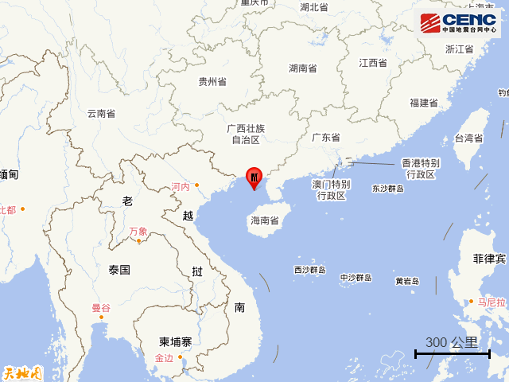
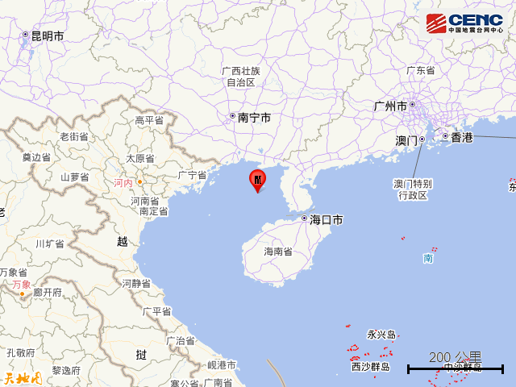
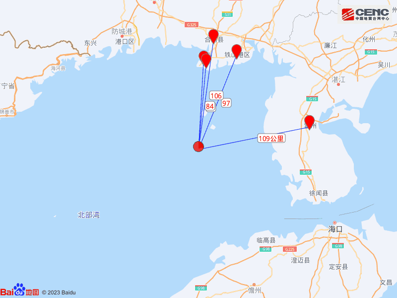
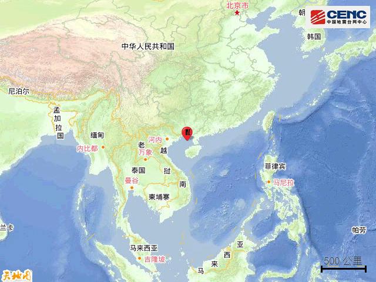
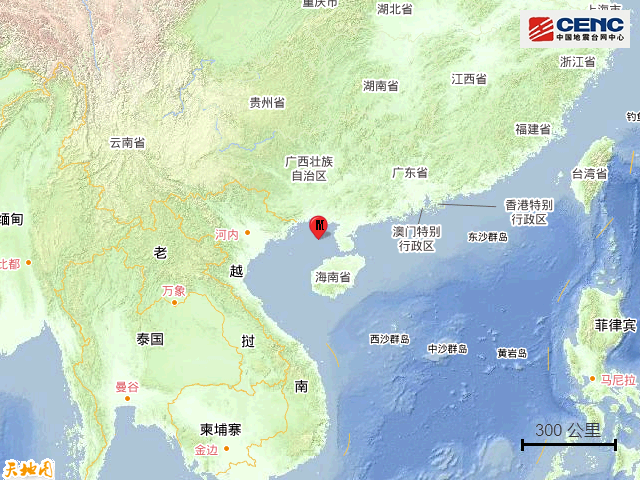
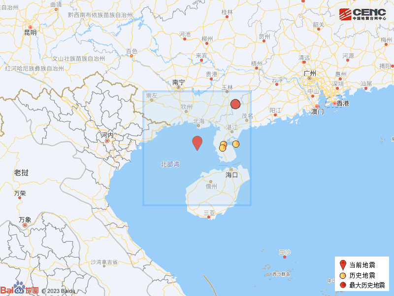

# 北部湾发生5.0级地震：震源深度20公里，距海岸线最近约64公里

据中国地震台网正式测定，6月24日3时7分在北部湾发生5.0级地震，震源深度20公里，震中位于北纬20.72度，东经109.07度，距海岸线最近约64公里。

震中距广西北海银海区82公里、距广西北海海城区84公里、距广西北海铁山港区97公里、距广西合浦县106公里、距广东雷州市109公里，距广西北海市85公里，距0公里，距0公里，距海口市155公里。

震中5公里范围内平均海拔约-31米。

根据中国地震台网速报目录，震中周边200公里内近5年来发生4级以上地震共2次，最大地震是2019年10月12日在广西玉林市北流市发生的5.2级地震（距离本次震中221公里），历史地震分布如图。

