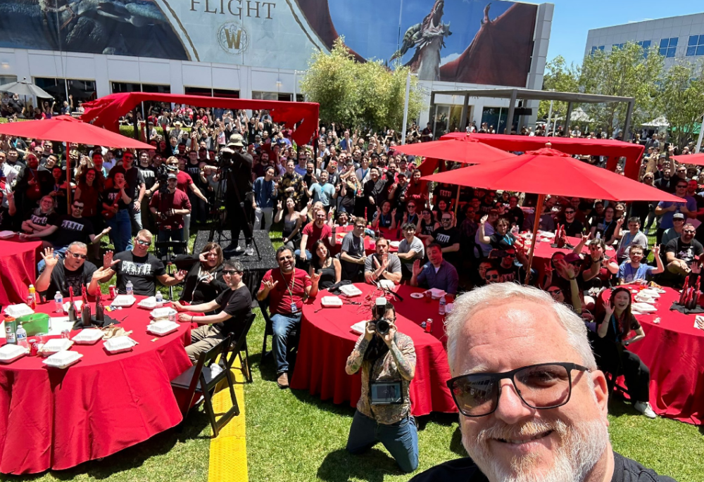
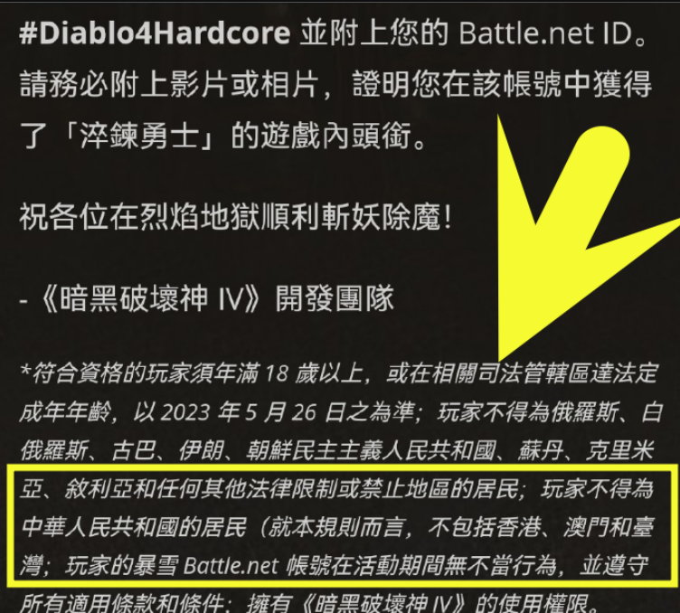
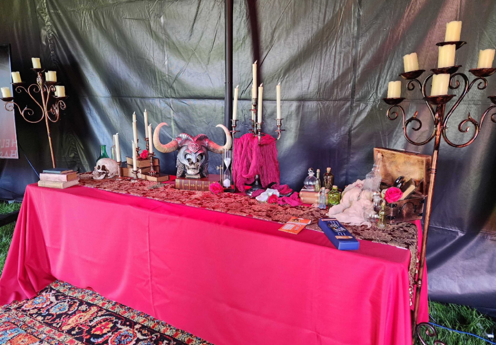
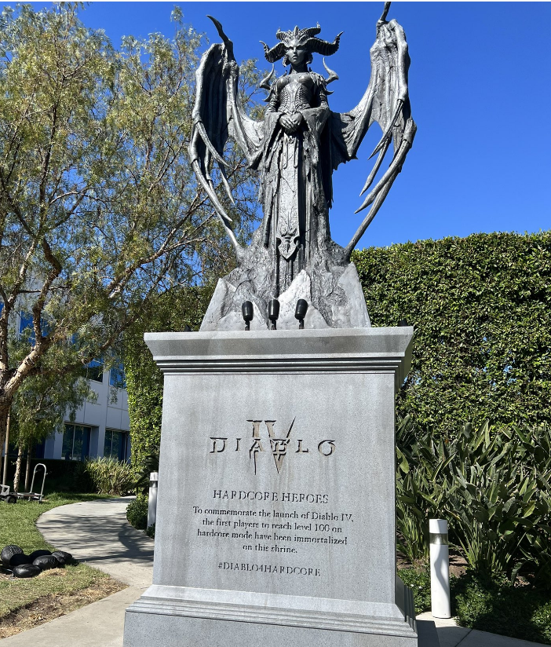
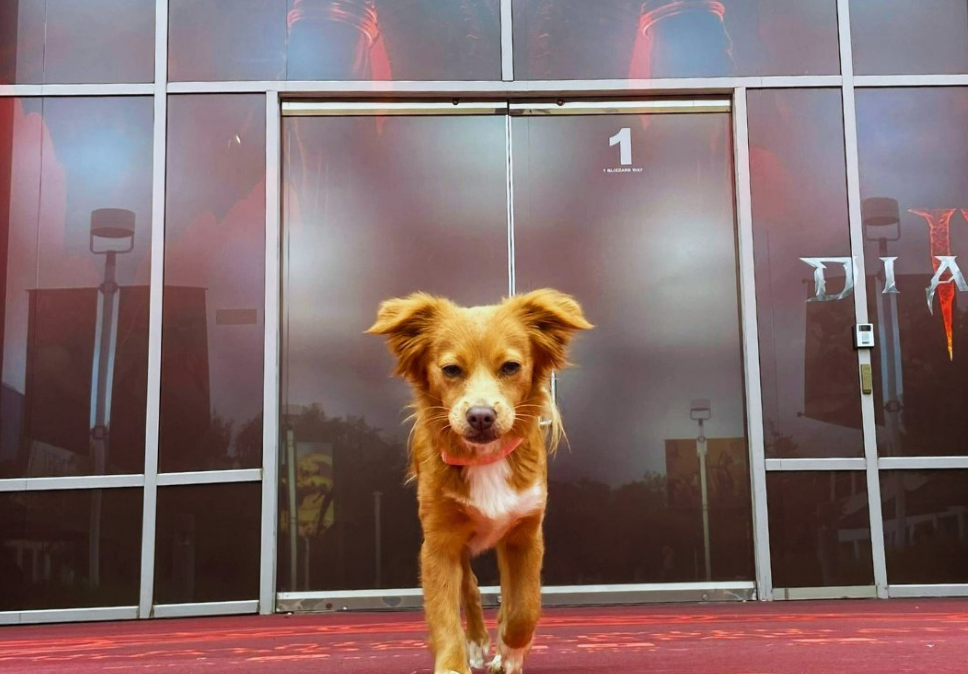
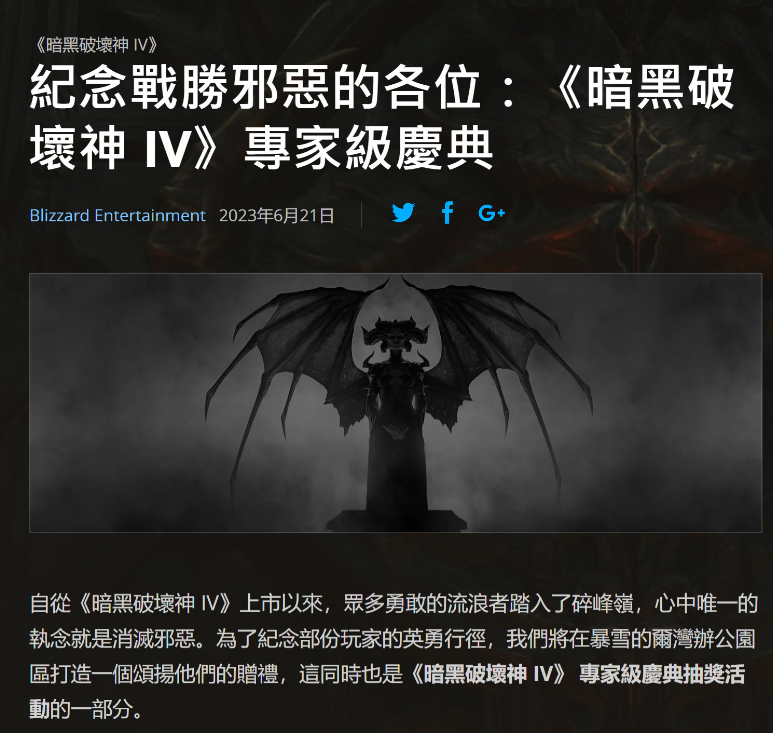
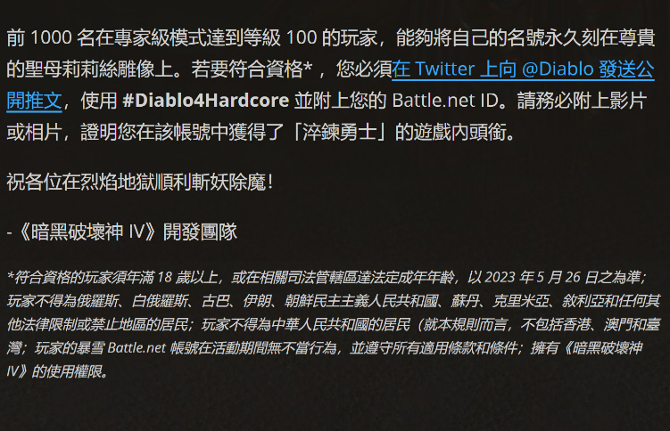

# 暴雪再现神操作：禁止中国大陆玩家参与暗黑4活动，引玩家不满

近期，一个暗黑4员工的庆功宴，在游戏圈被刷屏了。在这个庆功宴上，到处是欢声笑语。因为暗黑4取得的傲人销量，暴雪举办了盛大的庆功宴庆祝活动。在活动上，有非常多和暗黑4相关元素周边出现。的确，对于暗黑4来说，是值得去庆祝一下的。暗黑4发售后取得的巨大成功，单单是收入，已经超过暗黑破坏神不朽一年的营收了。但是，有细心的网友发现，随后暴雪发出的莉莉丝雕像条件的信函中，好像有一丝不对劲。

这是暴雪最新举办的一个线上线下结合的活动：在专家HC模式下，全球达到前一千名的满级（100级）的玩家，可以把自己的游戏TAG，永久刻录在一尊莉莉丝雕像上。这个活动初衷是很好的，因为是专家模式本身就只有一条命，能达到100级已经超过很多普通玩家了。在如此困难的情况下完成挑战，的确是值得把ID刻在莉莉丝雕像上的。

但是，在暴雪公布这个活动细则的补充说明中，明确表示，中国大陆的玩家被禁止参加这个活动。暴雪对于这段内容的描述是：玩家不得为中华人民共和国的居民（就本规则而言，不包括香港，澳门和台湾）。这段话，引起中国大陆部分玩家的不适，感觉像是赤裸裸的挑拨和歧视。有玩家说，气不过，要去卸载暗黑4，要去退款。但是暗黑4开服到现在都超过2周了，去哪里退款？这是买断制游戏，卸载也没有钱可以退，大陆玩家说多了都是泪。

的确，站在暴雪的角度，这个规则是有理论依据的。暴雪游戏的国服都没有，客户端都下架了，也就意味着根本没有国服的战网ID。连ID都没有，就算中国大陆玩家，能玩到暗黑4这款游戏，到时候填写ID的时候填什么？还有注册地，查IP地址这些连锁反应，真的越弄越麻烦。感觉暴雪策划这个活动初衷可能是好的，但是现在已经引起中国大陆玩家的不满了，希望暴雪公关可以尽快出来做个澄清。

对于此事，你有什么想说的呢?欢迎在评论区留言。

