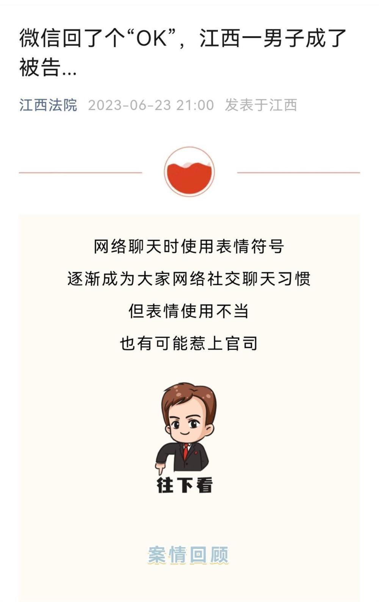
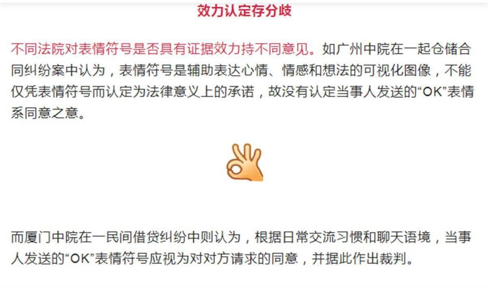
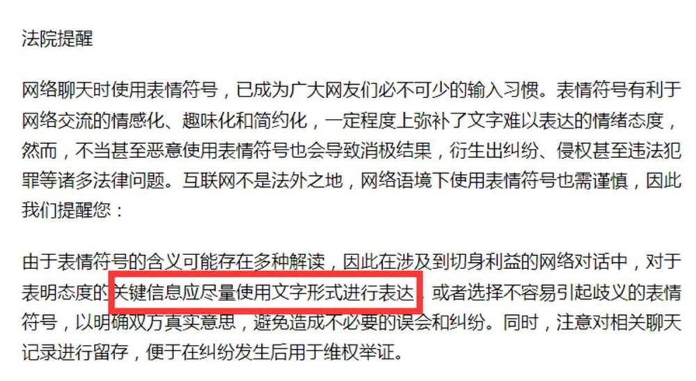

# 男子回了个“OK”符号成被告：表情成“呈堂证供”日益增多，法院提醒

6月23日，江西法院微信公众号一篇《回了个“OK”，江西一男子成了被告》文章引起网友高度关注。

_相关报道截图_

**微信回了个“OK”表情手势男子成了被告**

报道称，2022年12月22日，郭某某在微信上与刘某云商量其子刘某伟借款的还款事宜，郭某某发微信消息要求刘某云成为其子刘某伟借款事务的债务担保人，对此消息刘某云于12月24日回了一个“OK”的微信表情手势。

后因借款人刘某伟并未偿还有关欠款，郭某某于2023年1月6日，将刘某伟（具有民事行为能力）和其父亲刘某云以逾期未归还债务为由，一同告上了法院，要求其承担本金159118.4元和利息7907.88元的还款责任。

法院审理过程中，刘某云对原告提出的其作为刘某伟债务担保人的事实提出异议，认为其回复“OK”微信表情手势是在两三天后，没有义务偿还其子刘某伟向原告郭某某借的欠款。

江西省定南县人民法院经审理认为，被告刘某云对原告要求其作为被告刘某伟借款事务的债务担保人的微信消息回复“OK”
微信表情手势，表明其同意作为此笔债务的担保人，其有义务在被告刘某伟逾期未偿还借款时承担借款偿还责任。

最终，双方同意达成调解协议：被告刘某云与被告刘某伟共同承担还款责任，并在约定期限内偿还原告郭某某相关借款。

**表情符号成为“呈堂证供”案件日益增多**

据2022年6月大洋网报道，经检索裁判文书网，2018年以来，全国共有158起以表情符号作为证据的案件，其中2018年8件、2019年23件、2020年66件、2021年61件，增幅明显。

_相关报道截图_

不过，发送“OK”表情是否在表达“同意”的意思，各地法院持不同意见。

如广州中院在一起仓储合同纠纷案中认为，表情符号是辅助表达心情、情感和想法的可视化图像，不能仅凭表情符号而认定为法律意义上的承诺，故没有认定当事人发送的“OK”表情系同意之意。

而厦门中院在一起民间借贷纠纷中则认为，根据日常交流习惯和聊天语境，当事人发送的“OK”表情符号应视为对对方请求的同意，并据此作出裁判。

**法官提醒：尽量使用文字形式进行表达**

_相关报道截图_

网络聊天时使用表情符号，已成为广大网友们必不可少的输入习惯。表情符号有利于网络交流的情感化、趣味化和简约化，一定程度上弥补了文字难以表达的情绪态度，然而，不当甚至恶意使用表情符号也会导致消极结果，衍生出纠纷、侵权甚至违法犯罪等诸多法律问题。

有法院就此提醒：由于表情符号的含义可能存在多种解读，因此在涉及切身利益的网络对话中，对于表明态度的关键信息应尽量使用文字形式进行表达，或者选择不容易引起歧义的表情符号，以明确双方真实意思，避免造成不必要的误会和纠纷。同时，注意对相关聊天记录进行留存，便于在纠纷发生后用于维权举证。（极目新闻综合江西法院、大洋网、澎湃新闻等）

（来源：极目新闻）

