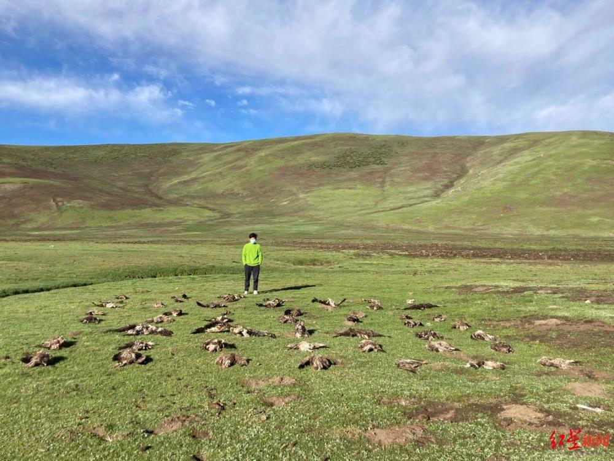
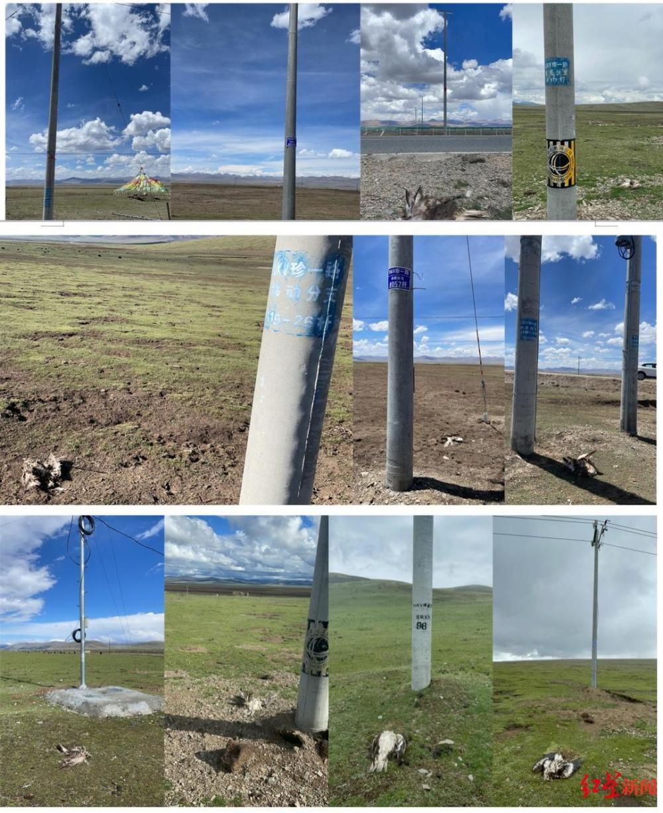
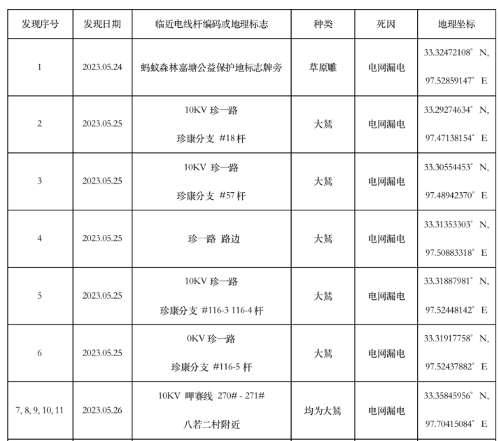

# 50余只国家级保护动物在嘉塘草原触电致死？官方：多部门正联合调查

近日，一环保志愿小组发起“嘉塘数鸟人”野生鸟类观察和保护项目因试用期月薪1万引发关注。该志愿小组发表的多篇调研文章称，招募的“数鸟人”近一个月在嘉塘草原的多处电线杆下发现约50余只死掉的猛禽，包括大鵟、草原雕、白尾海雕、猎隼等，均为国家重点保护野生动物，疑因电网漏电致死。

_↑受访者发布的5月24日-6月18日期间发现的猛禽尸体
受访者供图_

6月25日，嘉塘草原所属的称多县公安回应红星新闻记者称，目前该案件正在进一步调查当中，“公安、自然资源和林业草原局以及国家电网各个部门都在调查此事，之后会发布调查通告。”

**50余只国家级保护动物在三江源地区非正常死亡**

**当地公安回应**

5月，一环保志愿小组发起“嘉塘数鸟人”野生鸟类观察和保护项目因试用期月薪1万引发不少关注。近日，红星新闻记者从应聘成为数鸟人的常乐处获悉，上述项目实则为了观察、记录嘉塘草原野生鸟类生存状况，并调查野生鸟类因为电网漏电致死的情况。

_↑在配电线缆、电线杆下发现的猛禽尸体
受访者供图_

常乐告诉红星新闻记者，他于今年5月24日到达嘉塘草原，6月21日从嘉塘草原驱车离开，近一个月内在嘉塘草原电线杆下面共发现50余只非正常死亡的鸟类。他已将死亡猛禽的照片和视频资料、发现尸体时的轨迹点位文件分别进行了存档，且每张照片的原始信息中均包含该照片拍摄的地理坐标。据他初步统计，其中有50余只猛禽属国家重点保护野生动物，包括大鵟、草原雕、白尾海雕、猎隼。

_↑已死鸟类按照其被发现日期、临近的电线杆编码或地理标志、种类、死因推断以及纬度坐标列表
受访者供图_

“数鸟就是每天在草原开车50公里到100公里，用肉眼记录下来活的鸟类，另外观察电线和电线杆下有没有被电死的鸟。”常乐介绍称，死鸟尸体已于6月21号集中转交给称多县森林公安大队和当地林草部门。

对于猛禽死亡的原因，常乐推断是电网在雨雪天气漏电导致停落在电网上的猛禽触电死亡。他表示：“目前有50余只猛禽的尸体是发现于配电线缆、电线杆或者通信基站下。”在没有电网设施和通信基站分布的草原区域，他没有发现猛禽尸体。此外，他补充说明道，发现的猛禽中部分尸体不完整，或是尾部与身体分离，或是爪子与身体分离，其推测是电流过大导致猛禽的相关部位从身体上截断，而且部分鸟类尸体上有明显的灼烧痕迹。

公开资料显示，嘉塘草原位于青海省玉树藏族自治州称多县，是青海省玉树州第二大草原，这一地区是长江上游重要的水源涵养区，平均海拔4200米。这里分布有荒漠猫、雪豹等多种兽类，黑颈鹤等72种鸟类，龙胆等150多种高原特有植物。

6月25日，嘉塘草原所属的称多县公安回应红星新闻记者称，目前这个案件正在进一步调查当中，公安、自然资源和林业草原局以及国家电网各个部门都在调查此事，之后会发布调查通告。记者多次联系林业草原局、当地国家电网公司，截至发稿未获回复。

**鸟线双护问题何解？**

**电力部门和志愿者共同致力促进线鸟和谐**

据科技日报2019年报道，猛禽是三江源生态系统中的顶级捕食者，对维护生态系统的平衡具有重要作用，目前在青藏高原区域内的猛禽有大鵟、雕鴞、猎隼等，随着青海省玉树藏族自治州与青海主网联网等工程建设，部分地区鸟类遭电击、供电线路跳闸等问题也随之而来。

关于招募数鸟人的原因，上述环保志愿小组曾在招募文章中提到，电网建设与猛禽一直是个亟待解决的难题，国网玉树供电公司也曾通过绝缘线套、人工鸟窝等方式解决该问题。2023年春，环保志愿者途经玉树嘉塘草原时，几公里内就发现9只被电死的国家二级保护动物大鵟、一级保护动物草原雕等，因此出发前往调查。

红星新闻记者注意到，自2017年开始，国内从事物种和生态系统保护的著名公益组织山水自然保护中心已经在三江源地区合作参与了促进鸟类与电网和谐共存的项目。在调查中，他们也发现“鸟线冲突”这一议题一直困扰着电力部门和保护工作者。山水自然保护中心三江源项目主任赵翔受访时介绍，“电网建设与猛禽之间的冲突一直是一个全世界的难题，猛禽需要广阔的视野，因此会经常选择电网的普通杆和耐张杆栖息和驻足，从而增加了被电死的风险。”

业内人士介绍，由于鸟类常衔着铁丝、细绳等材料在输电铁塔上筑巢，极易诱发电击导致鸟类死伤、电路跳闸。传统做法是在铁塔中设置防鸟刺、倾斜横杆，阻止鸟类停留和筑巢。据山水自然保护中心文章介绍，触电可能发生于鸟类筑巢时带来的导电巢材，或者原本不导电的树枝被水打湿。“就算是鸟儿站在塔上排便，也有可能使得电网线路的绝缘距离不足，击穿空气而产生放电。体型较小的鸟类（如某些雀类、小型雉类）还有可能由于群飞而造成放电；而大型鸟类本身的翼展较大就可能引发放电。”而对于电网的安全运行而言，不论什么原因，放电都有可能引发跳闸事故。

2022年，山水自然保护中心与国家电网公益基金会合作，在甘肃、陕西、青海、四川、宁夏、新疆、内蒙和西藏8地，根据各地生态环境和鸟类活动特点，推广实施了国家电网“候鸟生命线”和“生命鸟巢”项目，从生物多样性保护的角度助力国家电网专业护线、科学护鸟公益事业。“调查发现，与输电线路互动较多、需要关注的鸟类物种主要是大中型猛禽和鸦科鸟类。”

目前，各地区现有防鸟护鸟装置有许多共性：主要为线路的绝缘化处理、鸟类的驱离，以及鸟巢的人工迁移。在线路的绝缘化处理方面，许多线路已经完成了绝缘化改造，可以从根本上杜绝鸟线冲突的发生。中国国家电网玉树供电公司运维检修部相关负责人介绍，“为实现生态保护和三江源电网发展的双赢，2017年开始将原有输电线路改造为绝缘导线、变‘驱鸟’为引鸟‘入住’、在猛禽栖息较多区域搭建‘生命鸟巢’等。”但值得注意的是，绝缘装置本身也有一定的时效性，在一段时间之后，其绝缘效果会有所降低。而由于鸟类自身的适应性，驱鸟器等设备有效性会逐渐降低。因此，绝缘装置和防鸟器都需要及时的清理、更换和维修才能达到最好的护鸟效果。

红星新闻记者 蔡晓仪 孙桂芳 实习生 徐三妹

编辑 郭宇 责任编辑 魏孔明

