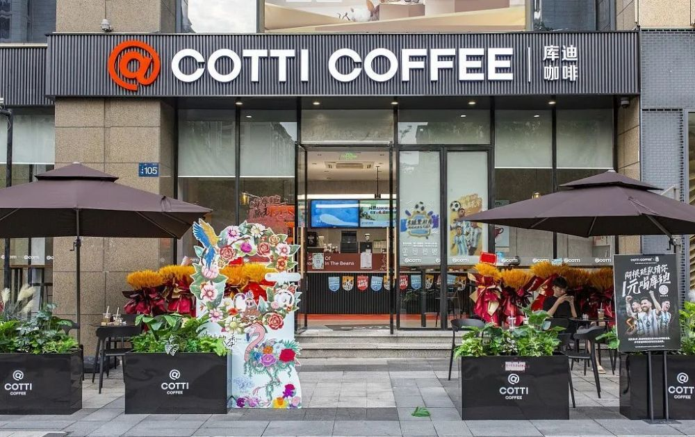

# 7月开店3000家，库迪咖啡高速扩张，加盟商却担心不赚钱“白白陪跑”

_来源：视觉中国_

特约作者 | 周珉

编辑 | 郭一非

出品 | 棱镜·腾讯小满工作室

因造假一事，从瑞幸咖啡狼狈出局后，陆正耀便酝酿“复仇”。在多次创业失败后，他重回最熟悉的咖啡领域，打造库迪咖啡，试图复制另一个瑞幸。

去年10月，从陆正耀老家福建开出第一家门店后，库迪开始全国跑马圈地，仅仅7个月后，便开出了3000家门店。这一扩张速度远比瑞幸激进，后者当年开出3000家店的用时约20个月。

陆正耀的套路并不新鲜，还是巨额补贴、低价引流、密集营销等，这帮助库迪快速打响品牌的同时，则是加盟商实际盈利的门店比例不高，且以微利为主，大多处于漫长的亏损期。

未来库迪能否摆脱补贴、靠产品发展，最终复制瑞幸长期亏损，如今盈利的道路，这仍需要时间观察。要想最终实现上市IPO，这位隐身背后的造假者陆正耀，也是库迪绕不过去的信誉风险。

**财务造假出局，陆正耀欲创业正名**

2020年，瑞幸咖啡自曝造假丑闻后，两名创始人陆正耀与钱治亚被踢出公司董事会和管理层，所持股权皆被清算。

这家创造了中国最快IPO记录的咖啡企业，尽管当时面临一系列诉讼，资本市场声誉败坏，但已拥有4500多家店面、圈住了3000多万消费者，绝不会轻易放弃瑞幸这个品牌。

因此，除了法律程序外，瑞幸首要做的，是彻底切割卷入造假的管理者，改善公司治理，挽回声誉。

陆正耀一手打造出瑞幸，后者一度成为消费行业最亮眼的“独角兽”，要他放弃并不容易。在陆正耀逐渐淡出瑞幸的过程中，他曾与瑞幸最大机构投资方大钲资本多轮拉扯，试图通过改变董事会的人员构成来延续对公司的控制权，但最终狼狈出局。

直至2021年初，一封联名举报信直指瑞幸董事长兼CEO郭谨一，列举“罪名”包括贪污腐败、能力不足、危害公司等。郭谨一原本就属于瑞幸的管理层，在陆正耀出局后成为一把手，负责公司经营。瑞幸在公司内部称，举报信是由陆正耀、钱治亚组织，签名的大多是瑞幸各大区中高层。

这一事件被瑞幸视为陆正耀未放弃公司，仍在想尽办法争夺。郭谨一否认了指控，举报信此后没有下文。

重掌瑞幸无望，作为知名的“连续创业者”，陆正耀开始围绕餐饮密集创业。2021年中起，他先后尝试了面馆、火锅煲等餐饮品类。但疫情反复，极大影响了餐厅到店客流和物业拓展。不到半年时间，陆正耀团队又转向到家业务，做配送到家（也可自提）的预制菜“舌尖工坊”。

陆正耀延续了瑞幸时期的高举高打风格：做面馆时，一开始就声称要开出五六百家门店。2022年初，舌尖工坊只试水了 10
家门店时，便放出消息已经签约3000个加盟商。

这些项目相继失败。面馆在2个月的尝试后翻牌更名为“火锅煲”，后者已在2022年关店停业。而舌尖工坊也早已停止招商，官网的咨询电话如今导向库迪咖啡。从舌尖工坊的App来看，仅剩一家贵州的店还在营业。

陆正耀最新一次的尝试是库迪咖啡。在离开瑞幸后，也唯有回到咖啡领域的这次创业，真正成了规模。库迪咖啡最新（6月7日）加盟资料显示，其在全国282座城市已经开出超3000家门店。

一名接近瑞幸、库迪的知情人士告诉作者，预制菜做不下去，加盟商根本不赚钱，陆正耀团队本就有重做一个咖啡品牌的想法，因此让愿意的加盟商转做咖啡。

从面馆到咖啡，陆正耀团队的核心人员大多是从神州租车时期就跟随他的“老人”，在陆正耀被踢出瑞幸后，这些人也陆续离开了瑞幸。

一名接近库迪咖啡人士告诉作者，库迪咖啡团队还包括李军、郭弋炜等参与联名举报信的前瑞幸高管。李军是瑞幸前副总裁、大区总经理，郭弋炜是瑞幸公关部前负责人之一。在指控郭谨一的举报信事件中，签名的高管都被视为陆正耀一派。

台前一号位仍是钱治亚，管理日常运营，她担任着库迪多家公司主体的法定代表人和高管，库迪咖啡官方的介绍则为“瑞幸咖啡创始人钱治亚携原核心团队倾力打造”。在招商宣传中，库迪咖啡也处处强调其核心管理团队来自瑞幸咖啡以及神州租车和神州优车。

值得注意的是，库迪咖啡的核心公司主体库迪咖啡（天津）有限公司，原本是王百因持有的惠医科技（天津）有限公司。随着公司更名，法定代表人也从王百因变更为钱治亚。王百因是陆正耀的旧识，充当了神州优车收购宝沃交易中的“白手套”。在瑞幸咖啡造假事件中，部分伪造的交易便来自王百因旗下的几家公司。

**贴身对垒瑞幸，加盟商担心白白陪跑**

库迪咖啡从2022年8月开始筹备，10月选择在福建福州开出第一家店。福建是陆正耀的家乡，瑞幸咖啡的总部也坐落于此。

微妙的竞争感随处可见，库迪从价位、饮品类型、营销手段等多方面对标瑞幸。一名瑞幸人士评价称，陆正耀做库迪咖啡有一种“复仇”心态。

打开库迪咖啡的App，生椰拿铁、厚乳拿铁、生酪拿铁等饮品与瑞幸高度相似，这几款产品是瑞幸创新的代表。2021年中起，当生椰拿铁成为行业爆款后，瑞幸开始高频推新，共同特点是各种风味与小料结合，不属于传统的咖啡饮品，而更像“奶茶化”的咖啡，这类饮品在瑞幸的SKU里约占三分之一。库迪的菜单设置也与之类似。

瑞幸的创始团队一手制定了低价引流、密集营销的策略，在2018-2019年期间，通过大量向新用户发放免费券、长期低于三折的折扣，迅速捕获千万用户，打响了瑞幸的品牌。

如今在库迪身上重现。库迪的产品原价设定于20-35元，但以5折价格销售，并长期发放9.9元、8.8元的优惠券；联名、活动赞助等营销手段也与瑞幸如出一辙，通过与王者荣耀联名、成为世界杯阿根廷国家足球队中国区赞助商等提升品牌曝光。

库迪的扩张速度比瑞幸当年更为激进，从0到2000家门店仅用时半年，从2000家迈上3000家门店更是仅用时一个月。而瑞幸开出2000家门店的用时是近一年半，速度之快已经令当时的咖啡行业甚至整个餐饮行业咂舌。眼下，双方仍有较大差距。截止6月5日，瑞幸咖啡门店数量已突破1万家。

这背后是两者模式最大的不同之处，库迪只做加盟，而瑞幸前期专注自营，造假事件爆发后才逐渐开放加盟，目前自营与加盟的门店数量七三开。

因此，库迪无需承担拓店的资金压力，也没有融资的急切需求。不似瑞幸，开店2000余家时，已在私募市场融资40亿元。前述知情人士认为，库迪做加盟也是唯一的选择，以陆正耀的声誉在资本市场很难再融资，大基金都不会投。

有库迪的加盟商告诉作者，库迪的加盟成本在业内并无明显优势，加盟商大多看重的是库迪团队打造咖啡品牌的成功经验，尤其是营销能力。

根据库迪官方资料，一家加盟店初期的一次性投入视店型而定在12万到51万不等，这仅包含设备、装修、柜体广告等成本。总部对门店的毛利按不同比例阶梯式抽成。

以40-150平米的标准店为例，初期投资包括14.5万元的设备，6.5万元的柜体广告，8万元的基础装修；另有5000元的设计费和5万元的保证金，合计近35万元。门店月毛利2万以下的部分均归属加盟商，毛利在2-3万、3-4万、4-8万、8万以上的部分，库迪分别抽成10%、15%、20%、25%。

加之店租、人工、水电等，据平安证券研报测算，加盟库迪第一年总投入通常在40-60万元，与其他小店模式的咖啡、茶饮品牌没有太大差异。

在目前大力补贴、低价引流的策略下，门店或许要承担很长一段时间的亏损期，这也是许多加盟商的顾虑。在社交媒体上，不少加盟商表达了担心两三年回不了本，白白“陪跑”。

一名库迪招商人士向作者介绍，总部对低价引流（售价低于9.5元）的饮品会统一按9.5元补贴。这是考虑到原材料、房租、人工、水电等折算至单杯饮品的成本。

但一方面，这个数字是按照日销售400杯、月房租1.5万的条件折算的，不具备普适性；另一方面，即便考虑到总部给出的补贴，也仅勉强维持收支平衡而难盈利。

据平安证券调研，今年3月，库迪实际盈利的门店比例不高，且以微利为主。

一名二线城市的加盟商告诉作者，在现阶段的折扣下，即便日销售能达到400杯，月租金在1万以上门店也难以盈利，这意味着一线城市门店短期内无法指望回本。据作者了解，根据城市层级、商圈位置等不同，门店之间生意表现差异较大，差的仅一两百杯，好的能做到五六百杯。

**瑞幸盈利难复制，陆正耀造假风险犹在**

库迪的目标是在今年7月底开到5000家店，高速扩张能否可持续，取决于加盟商长期能否赚到钱。换言之，当补贴退潮后，消费者是否还愿意为产品买单。

这和四年前瑞幸面临的质疑类似——烧钱补贴圈来的地盘是否稳固？彼时四处质疑声起。

不过，目前瑞幸已为库迪跑通了这条路，通过足够便捷的门店位置和不断推新吸引消费者，在逐渐降低折扣、提升售价的同时，门店、用户、订单也能稳定增长，最终扭亏为盈。

2021年三季度，瑞幸首次季度盈利。2022 年，全年扭亏为盈。今年一季度，瑞幸收入同比增长85% 达44.4
亿元，已达到星巴克中国同期的83%。刨去新开门店对收入的贡献，仅看直营门店的同店销售额，也有30%的增长。

前述瑞幸人士感慨称，瑞幸的财务数据转好，反而为库迪提供了背书，愿意投资的加盟商中，不乏有受瑞幸成绩的鼓舞。

但纯加盟模式难保品控和管理，而且从开店现状来看，库迪店与店之间并无区域保护，且不少门店紧贴着瑞幸选址，同质化严重。未来库迪能否摆脱补贴、靠产品发展，最终复制瑞幸道路，仍需要时间观察。

上述二线城市加盟商称，库迪在今年春天曾尝试减小折扣力度，将饮品售价提至13元左右，但效果不佳，复购率下降，因此很快又恢复了8.8元、9.9元的“好价”。

放眼整个咖啡行业，环境在转变。在 2018 年之前，中国咖啡市场被星巴克、COSTA等外资咖啡品牌主导，这些品牌完成了对中国消费者最早的咖啡教育。

2018 年起，瑞幸、连咖啡等互联网基因浓厚的咖啡品牌崛起，Manner、M Stand、Seesaw 等本土品牌冒头，更多外资品牌如 Peet's
coffee、Tim Hortons 进入中国。这些品牌在价位、口味创新、消费场景上呈现多元化，改变了咖啡作为功能性饮品的标签，和商务为主的消费场景。

咖啡变得更街头、更随意、消费更日常，不只是消费方式，逐渐也成为了一种生活方式。

因此，咖啡被视为餐饮赛道的一门绝佳生意，背后的驱动之一是中国咖啡市场的增长潜力巨大。灼识咨询的《中国咖啡行业蓝皮书》显示，2022年，中国人均年饮用咖啡量仅为
11.3 杯，远低于美国的288.9 杯和日本的207.4杯，即便与发展中国家市场相比，越南和印度尼西亚也分别有115.9杯和62.2杯。

在广阔的市场中，低线城市是兵家必争之地。瑞幸从2021年起，发力加盟模式便是为了拓展下沉市场。据餐饮行业数据库窄门餐眼监测数据，库迪在二线及以下城市的门店占
90% 以上。

低价、便捷的小店模式，在下沉市场竞争者众。在瑞幸的成功经验之后，各地纷纷涌现了平价的区域性咖啡品牌。除此之外，全国布局的，还有蜜雪冰城旗下的幸运咖，麦当劳、肯德基以及连锁便利店内设的现磨咖啡业务等，各有供应链、价格、门店网络等优劣势。

一个不容忽视的问题是，这场咖啡赛道激烈的竞争中，一旦库迪咖啡有幸突出重围，走至IPO阶段，陆正耀团队财务造假的前车之鉴，是否还会有投资者为其买单，目前仍不可知。

