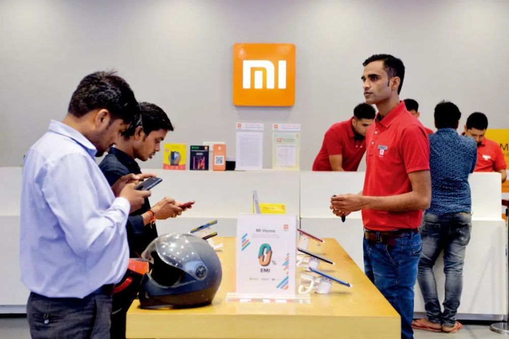

# “印度制造”挑战“中国制造”？

“对我们来说，印度是一个非常令人兴奋的市场，也是我们关注的焦点。”苹果CEO库克在2月份的一次财报电话会议上说，“从本质上讲，我们是在吸取多年前在中国扩展时学到的知识。”

苹果想在印度实现“中国制造”，但现实并不完全如愿。今年4月库克访问印度，与印度总理莫迪举行了会谈，希望在该国扩大生产规模和智能手机销量。苹果计划到2025年在印度生产四分之一的iPhone，到2027年生产一半。

但没过多久，苹果最主要的供应商之一、在印度苦心经营15年的果链代工厂纬创宣布“出逃”。纬创计划全面撤出印度市场，并向印度国家公司法法庭、公司注册处等机构提出一年内解散其在印度业务。据印度媒体报道，纬创退出后，本土巨头塔塔集团将收购纬创在印度的工厂，承接其在印的生产任务。

纬创还未就此做出任何解释，又传出中资企业小米被印度执法局扣押48亿元的消息。据称这是印度当局迄今为止最大数额的扣押。如今，48亿元还存在被没收的风险。

在世界银行的榜单上，期待成为“世界工厂”的印度仍被认为是“全球最难做生意的国家”之一。

01 小米会被没收48亿吗？

据英国路透社消息，印度执法局6月9日发布文件称，已经向小米技术印度私人有限公司、小米印度分公司、部分高管，及花旗、汇丰、德意志等三家银行发出正式通知，称其涉嫌违反印度《外汇管理法》。印度指控小米在当地的部门通过冒充“特许权使用费”向外国实体非法汇款。并扣押其555.1亿卢比资金，约合人民币48.2亿元。

小米相关人士对媒体回应称，对该案的态度与之前保持一致。此前针对法院驳回申诉的消息，小米方面表示：“正研究该事项，并等待书面判决。再次重申：在印度的业务，符合印度的相关法律和规定。”

_2019年8月20日，人们在印度哈里亚纳邦的一家小米门店选购手机。图/视觉中国_

此次小米被开罚单，还要追溯到去年4月开始的“非法汇款”纠纷。

当地时间2022年4月30日，印度金融犯罪打击机构表示，在发现小米科技印度私人有限公司向小米集团及另外两家外国实体汇出外币后，没收了小米银行账户资产。

小米集团当晚迅速做出回应，发布声明称：“小米印度所支付的这些专利使用费是用于我们印度版本产品的授权技术和IP，小米印度支付这样的特许权使用费是一种合法的商业安排。”

小米集团在声明中还表示，作为一个致力于在印度发展的品牌，所有的运营都严格遵守当地的法律法规。“我们仔细研究了政府当局的命令。我们相信我们支付给银行的版税和账单都是合法和真实的。不过我们会与政府部门紧密合作，以澄清任何误解。”

随后，小米向印度南部卡纳塔克邦的高等法院提起诉讼，反对印度打击金融犯罪机构的决定。去年8月，小米2022年第二季度财报分析会上，时任小米集团总裁王翔还表示，正在积极应对印度政府的调查，一切在印度的业务还在正常进行中，并且已经成功解冻了7亿多美元的被冻结资金。

然而，事情很快又发生反转。2022年10月，印度当局拒绝解冻小米相关资金。今年4月，小米印度公司对印度执法局扣押资产的申诉被印度法院驳回。

作为双方争论的关键，“特许权使用费是跨国企业进行合理税务筹划过程中的常用方式，分歧主要出现在对费用的认定上。”长期为中国企业赴印度投资提供法律服务的律师李钦对《中国新闻周刊》分析说，小米这场汇款纠纷的本质是税务问题，在用特许权使用费计算税基时，企业和当地政府对税法中成本的解释出现了争议。

举例来说，企业认为“特许权使用费”是合理的税务筹划，或是正常的服务贸易而将资金汇出，但当地政府认为企业的做法是对税法的滥用，将利润汇到境外，又涉及到相关外汇管理法。

印度金融犯罪打击机构此前曾在一份声明中表示，小米印度公司汇款给另外两个身份不明的、无关美国的实体，也是为了“小米集团实体的最终利益”。

小米则反驳称，小米印度支付的这些专利许可费都是为了印度版本手机上的授权技术和专利，并指出执法局扣押的数目中有超过84％是支付给高通公司的特许专利费。

今年6月9日，印度执法局再次发出正式通知，并补充声明，之所以通知银行，是因为据称它们在没有进行尽职调查和获取必要文件的情况下批准了被称为“特许权使用费”的外国汇款。

“目前事情还没到尘埃落定的地步。”李钦分析，根据印度《外汇管理法》，如对行政机关意见不服，可继续向外汇管理专门法庭及高等法院上诉。

02 印度成了“外企坟场”？

遭受“特别关照”的中资手机企业，远不止小米一家。

2022年7月，OPPO被指控逃避关税439亿印度卢比，约合人民币38亿元。印度税收情报局称，OPPO在进口手机零部件时错误使用了关税豁免，并在计算进口货物交易价值时未包括特许权使用费。

同一个月，vivo的119个印度相关银行账号被印度执法局封锁，总额达46.5亿卢比，约合人民币4亿元。印度执法局在相关声明中指控称，vivo印度公司为逃避纳税，将6247.6亿卢比（约合人民币455亿元）汇往中国等地，金额相当于该公司一半左右的营收规模。

在严格监管外资企业这件事上，印度不仅仅针对中资企业。

2008年，印度税务部门给微软开了张70亿卢比的“罚单”，IBM印度也曾在2013年被当地监管部门要求补交535.7亿卢比欠税税款，折合8.66亿美元。印度媒体称，印度监管部门认为IBM谎报了2009财年的营收。

三星电子不止一次被印度政府处罚。2014年，三星在印度被罚税2亿美元。2023年1月，印度税收情报局指控三星对远程无线电头错误分类，试图规避172.8亿卢比进口关税，约合2.12亿美元。

印度官方公布的数据显示，从2014年至2021年11月，有2783家在印度注册的外国公司关闭了在印度的业务，约占在印跨国公司的六分之一，撤离的公司包括法国零售巨头家乐福、美国摩托车制造商哈雷戴维森和美国汽车公司福特等。

由于外企在印度频频遭遇打压，印度也被称作“外企坟场”。李钦曾撰文分析，外资企业在印度遭受的各种调查、处罚，很大程度上是由于“魔幻”的印度法律制度所致。印度的法律可以用十五个字来概括：“高标准立法，普遍性违法，选择性执法。”

“高标准立法并不是指印度的立法技术高，而是指印度的立法者要求守法者需要达到的标准非常高。”李钦举例说，印度《公司法》（Companies
Act）法案本体就有近30章500条，基本每一条后面都跟着罚金、监禁等违法后果，而印度的执法部门一般不会主动通知企业更正其不合规行为，一旦违法行为被行政执法部门发现，其就会从违规第一日起开始计算罚金。

种种因素堆叠下，印度在世界银行发布的《2020年全球营商环境报告》中依旧被认为是 “全球最难做生意的国家”之一。

03 难以割舍的“印度市场”

即便如此，大量外资企业，尤其国内手机厂商依旧将印度作为重要的海外市场，并做出长期布局和规划。

“印度手机市场的空间与人口红利显而易见。”中印越电子协会（CMA）秘书长杨述成此前接受《中国新闻周刊》采访时表示。

印度庞大的人口基数和年轻的人口结构是未来消费增长的保障。长江证券在《智能手机产业专题报告》中分析，在经济、基建以及移动生态等多方面因素加持下，印度智能手机市场总销量连年提升，2016~2020年复合增长率达到了8.2％，远高于全球同期-3.4％的水平。

面对如此巨大的消费市场，印度却一直没能建立起自己的智能手机产业链。2012年起，在印布局七年的三星取代诺基亚成为了印度智能手机市场上的领头羊，并连续霸榜六年。期间，印度本土品牌Micromax、Intex、Lava和Karbonn凭借美国财团的风险投资，通过“进口贴牌”的方式，一度从三星手中夺回了中低端市场。这四大印度品牌被合称为“MILK”，基本不自产手机，而是寻找海外代工，据媒体报道，这些廉价手机定价最便宜的不到100元人民币。

为解决印度制造业长期存在的短板问题，2014年，莫迪政府提出“印度制造”（Made in
India）计划，要将制造业占印度国内生产总值（GDP）的比重从15％提升至25％。因此，印度向国外企业伸出了橄榄枝。

印度的劳动力成本优势最先体现出来。据杨述成介绍，中国的珠三角和长三角普工工资在4500元~5000元左右，中西部省份也要4000元，越南则在2500元~3000元左右，而印度的普工工资仅需1500元。

印度中国商会秘书长刘晓冬此前接受媒体采访时回忆，在十多年前，印度政府曾主动精简规章制度和审批程序，吸引了上千家中资企业前往投资，分布在家电、手机、工程机械、汽车、通讯、建材、新能源、风险投资等多个领域。

在国产手机品牌中，小米率先进军印度市场。小米首部官方授权传记《一往无前》披露，在很多竞争对手都开始在印度抢夺市场的时候，小米确定了境外市场“印度优先”（India
First）的战略，在所有海外市场里，小米的产品线和供货全线向印度倾斜。雷军更是从2015年亲自管理印度市场，每个季度都会飞往班加罗尔，每次至少待7天。

“当时国内智能手机市场已趋于饱和状态，而产品端又没有革命性技术出现，不能刺激新的消费需求，国内手机厂商纷纷到海外寻找新的市场。”杨述成说。

除了华为、OPPO、vivo等手机厂商，配套的上下游供应商也先后在印度落地。从最初个别零组件供应商进入印度，到后来，制造商已经可以从印度采购到包括主机板、充电线、电池模组、包材在内的80％的手机零组件，仅在诺伊达地区就聚集了瀛通通讯、合力泰、长盈精密、裕同科技、欣旺达等智能手机产业链企业。

为实现“印度制造”，莫迪政府推出了多项配套激励政策。2015年8月，印度提出的“分阶段制造计划”（简称PMP）可谓目的明确，通过对各阶段产品逐步加征区别性关税，促使外资企业不得不将生产制造逐步转移到印度本土，最终培育出完整的手机产业生态。

PMP政策层层加码，从整机生产不断向手机产业链上游蔓延，从2017年到2018年，印度手机整机进口关税税率由10％提升至15％，再到20％，电池、充电器、适配器等手机相关配件进口关税税率也在不断上调。为了控制供应链成本，各生产环节不得不转移到印度，否则就有丢失市场的可能。

统计显示，在2019年前三个月，小米就在印度进行了超过34.3亿元人民币的投资。OPPO和vivo也不示弱，OPPO进军印度建厂第一笔就投入了22亿元人民币，vivo则在2018年在印度追加投资建设新厂，一口气投入了近40亿元。

国产手机在印度的门店多到难以想象。从机场、商场到城市街区，几乎每家绿色门头的OPPO手机店附近就会有一家“蓝厂”vivo。到疫情前，vivo在印度团队已经从五年前的5人发展到近万人，门店拓展到7万多家。

据印度中国商会和印度中资手机企业协会数据显示，截至2021年，中国手机企业在印度工厂已经超过200家，贸易公司500多家，投资额达到30多亿美元，提供就业岗位超过50万个。

凭借“低价高质”的特色，国产“千元机”快速打开市场。2017年，三星的市场份额降至24％，中国品牌小米、vivo和OPPO紧随其后，三家总计占据了37％的市场份额，而原本靠低价畅销的印度本土品牌Micromax仅分到了5％。

到2017年第三季度，小米凭借920万台手机出货量以及23.5％的市场占有率，夺得印度市场占有率第一。与2016年同期相比，小米印度增长了约300％，成为印度市场发展最快的智能手机品牌。同时，印度也成为小米最大的海外市场。

或许印度自己也没有料到，原本走低价路线抢占中低端市场的本土品牌，因缺少在供应和制造环节的积累，在“印度制造”政策号召下，因国际品牌的强势竞争力，反而走向衰落。2021第二季度，小米、vivo、
Realme、OPPO、OnePlus、传音等中国品牌在印度的市场份额合计达到78.5％，而印度四大本土品牌“MILK”合计占比不足1％，基本宣告退出智能手机市场。

04 “印度制造”的野心

2020年后，印度先后出台多项政策以强化其本土制造业。

通过PMP政策吸引外资在本国建厂后，印度又推出了生产挂钩激励计划（PLI）。该计划打算用19.7万亿卢比（约合260亿美元）支持14个关键行业的生产，包括半导体、光伏、电子设备、制药、医疗器械，汽车等，其中大部分产业高度依赖中国制造。

2021年底，印度批准了一项价值约合100亿美元的激励计划，以吸引全球大型半导体制造商将印度作为生产基地，并将印度打造为电子系统设计和制造的全球中心，意图与中国和越南竞争全球手机生产市场。

印度信息和技术部长阿什维尼·瓦希诺表示，莫迪政府正致力于为芯片制造业开发一个完整的生态系统——从半导体芯片的设计到本土化制造、封装和测试，将从2022年1月1日开始根据其激励计划接受申请。这项最新刺激计划拟创造约3.5万个高质量职位，10万个间接就业机会，并吸引价值88亿美元投资。

在第二年4月召开的印度首届半导体会议上，瓦希诺再次强调，印度会争取更多激励，还需要更多半导体制造商的参与。瓦希诺直言：“我们的胃口很大。”

印度电子制造业2025~2026财年前的目标产值是3000亿美元，其中将消耗700亿~800亿美元的半导体产品。

为完善本土产业链，印度正加大引资力度，但似乎对中国企业不再那么友好。2020年4月18日，印度工业和内贸促进局（DPIIT）修改了外资政策，规定“任何来自与印度接壤的国家的投资者”都只能在印度政府准入路径下进行投资。与印度接壤的国家中，中国是最主要的投资国，因此这条政策也被认为是限制中国在印的投资自由。

在FDI新政出台后，明面上几乎已没有了中国企业投资的身影，仅有少量增资项目。中国商务部数据显示，2021年中国企业对印非金融类直接投资同比下降近七成，仅有6318万美元。

2022年8月初，印度科技部副部长在《商业标准报》上表示，中国智能手机厂商目前在印度占据了主要的市场份额，但它们的市场主导地位并非“建立在自由和公平竞争的基础上”。印度官员还认为，尽管中国手机品牌占据印度70％的市场份额，却常处于亏损状态，这加剧了市场的不平等。

不久后，彭博社发出消息，印度打算限制中国品牌在当地出售价格低于1.2万卢比（150美元）的智能手机，借此扶持印度本土手机产业。

当时印度份额前五的低价手机中，除三星外，其余品牌均来自中国。巧合的是，沉寂多年的印度本土品牌恰在此时卷土重来。2021年11月，Micromax推出新品牌“In
Mobiles”，Lava也推出了可定制的智能手机系列“MyZ”，Karbonn Mobiles也开始推出智能手机。

据印度媒体报道称，电信运营商Reliance
Jio已完成在印度1000个城市的5G覆盖规划。伴随印度5G网络的建设，新一轮“换机潮”或许即将到来，这或许正是印度智能手机厂商再次活跃的原因。

而被“非法汇款”缠身的小米在印度市场则开始走“下坡路”。

据Canalys数据，2022年小米（含子品牌POCO）在印度市场出货量2960万部，较2021年的4020万部下滑超26％，尽管仍是印度市场的销量冠军，但全年市场份额已经跌至20％，较2021年的25％减少了5个百分点。

到了2023年一季度，印度市场销量排名出现较大变化。三星以20％市场份额排名第一，vivo以17％市场份额排名第二，小米以16％市场份额排名第三，OPPO和realme排在其后。中国手机品牌在当地市场约占50％的市场份额。

中国社科院亚太与全球战略研究院副研究员刘小雪对《中国新闻周刊》分析说，中国手机厂商在印度市场仍占据绝对优势，但印度更迫切地希望发展本土制造业，中资企业自然成了印度“以市场换技术”的首要目标。

不久前，印度政府再度向包括小米、OPPO、vivo、realme
等在内的中国手机品牌提出要求：在印度运营的中国手机品牌，应当任命印籍人士担任首席执行官、首席运营官、首席财务官和首席技术官等高管职位。

此外，印度政府还指示这些企业将合同制造工作委托给印度公司，开发有当地企业参与的制造流程，并通过当地经销商出口。

事实上，不少在印度运营的中国手机厂商已经任命过印度籍高管，如 realme 的印度首席执行官为印度人 Madhav Sheth。

“印度市场的多样性超出想象，为顺利打入当地市场，很多公司在这项要求之前就已经开始聘用印度籍高管。”刘小雪说，从企业角度，只要还能在新市场获利，便会继续发力。跨国公司开辟新的海外市场的战略不会因个别政策而轻易改变，小米的经历也不意味着外资企业将大规模撤出。

不过，印度政府前首席经济顾问、布朗大学高级研究员阿文德·萨勃拉曼尼安（Arvind
Subramanian）去年在《外交》杂志上发表文章《为何印度不能取代中国》指出：如果印度不解决“投资风险过大、政策内向性过强、宏观经济失衡过大”这三大障碍，或将错失跨国企业的投资以及承接产业转移的机会。

发于2023.6.26总第1097期《中国新闻周刊》杂志

杂志标题：“印度制造”的野心与挑战

记者：李明子

