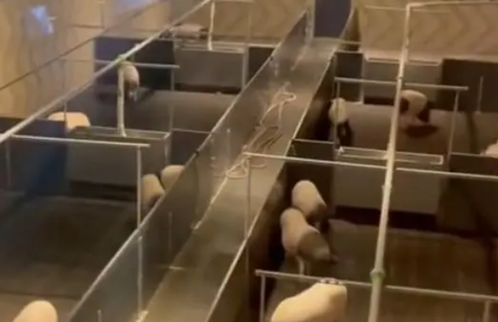

# “猪景房”一晚8888元：房间紧挨猪圈，隔着玻璃就能看到猪吃喝拉撒睡

住过海景房、湖景房，那你有没有住过“猪景房”？是的，就是字面那个意思：房间紧挨着猪圈，隔着玻璃就能看到大猪小猪齐聚一堂，吃喝拉撒睡。住一晚这样的猪景房很贵，要8888元，不过第二天离开时可以获得一头猪，或是一年的快递猪肉。一头猪能出100多斤肉，折合6000多元，算下来实际房费2000多元，也不便宜。

“猪景房”能卖这么贵，或者说整个“猪景房”的概念能够成立，全靠这头不一样的“熊猫猪”。它还有一个更广为人知的名字，叫金华两头乌。因为头尾乌黑、身躯粉白，跟大熊猫体色接近，再加上品种优良，被列入全国重点保护的8个地方猪种的首位，故而得了这么一个很萌的名字。

“猪景房”当然是噱头，但并非毫无意义的炒作。从“猪景房”里，我们能看到地标产品的带动力、文化旅游的好风光和乡村振兴的新气象。

两头乌主要用于制作金华火腿。这种靠时间发酵的食物滋味浓厚，制作的蜜汁火方QQ弹弹、梅菜扣肉肉酥味美，但在全国范围内消费量一直不高，还面临宣威火腿、诺邓火腿等同行的竞争。2002年，金华火腿获批地理标志产品，2007年注册金华市金华火腿证明商标，由金华火腿协会受市场监管部门委托管理和运行。在协会推动下，当地起草了“金华火腿保护条例”，修订了行业标准，让火腿品质更有保障，还承办了金华火腿购物节等多项活动，进一步打响知名度。目前，全行业具有地标使用资质的企业达57家，带动了本地养猪业发展，让越来越多人知道了金华火腿和两头乌。地标产品这块金字招牌，为“猪景房”提供了概念基础。

过去，两头乌只有两条腿可以做火腿，经济价值没有完全开发出来，当地农民并不爱养。随着金华火腿声名远播，新一代创业者回归乡村，把养猪变成了一桩能赚钱的生意。

猪景房所在地不是普通养猪场，而是一座花园般的“熊猫猪猪乐园”。最大的一座城堡就是猪舍，被花园和茶园围绕，弥漫着栀子花香。猪舍实行全封闭式管理，闻不到一丝臭味。乐园还特意将咖啡厅、会议大厅都安排在猪舍楼上，游客们可以在浓郁的咖啡香气里参观小猪从怀孕、哺乳、保育到育肥的养殖全过程。

乐园以熊猫猪为灵感，开发了一系列文创线路：逛完金华两头乌猪博物馆，再去欢乐小猪村，模仿综艺节目“跑男”在城堡花园里拍照打卡，去熊猫猪餐厅吃用两头乌制作的红烧肉。乐园收了门票、餐费，走的时候游客们还会购买玩偶、肉制品。熊猫猪猪牌鲜肉铺也在线上线下开卖，一斤排骨能卖到100多元。

老话说，“没吃过猪肉，还没见过猪跑吗？”可今天，这话得倒过来说了，多数年轻人和孩子都只吃过猪肉，还真没见过猪跑。据说，不少入住猪景房的小朋友趴在窗边看小猪，都舍不得睡觉。恰恰因为见过了奔跑的小猪，家长才舍得花钱买这么贵的猪肉；也恰恰是在旅游过程中，才能顺畅地把猪肉卖出文化的溢价。

从“猪景房”的落地窗里望去，养殖业已不是旧模样。一批又一批新农人带回了资金、技术和崭新的理念。他们中的许多人既了解农村，又熟悉城市消费，既尊重传统，又懂得新技术。看似匪夷所思的“猪景房”能成为现实，智慧养殖、5G技术、科学理念缺一不可。说穿了，“猪景房”只是一个有创意的引流工具，是现代猪舍为自己打造的卖点，大多数人只是看个热闹。它所反映的乡村振兴新气象、新思路，才是最值得期待的好风光。
（本文来源：经济日报 作者：佘 颖）

