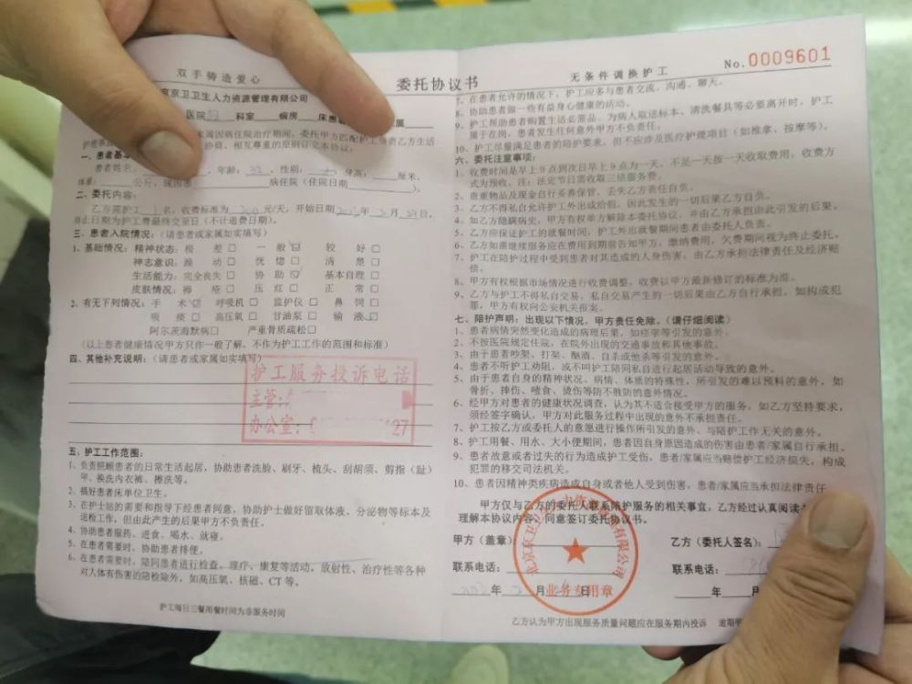
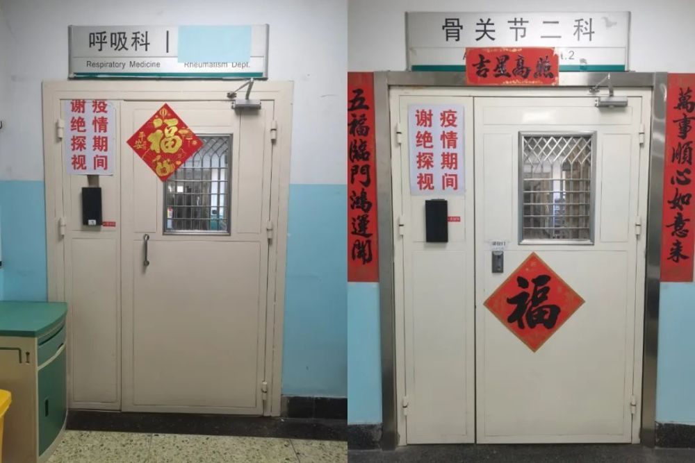
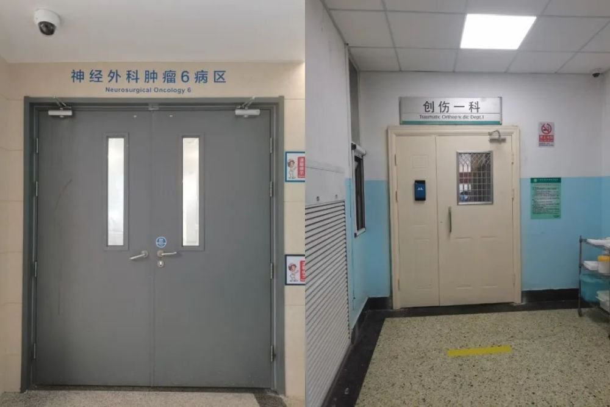
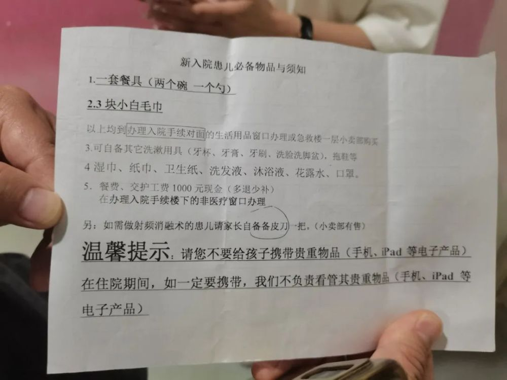

# 不允许家属陪护病人，只能花钱请护工？多家医院称沿用疫情管控规定

近日，云南一位王女士向央广网反映，今年4月中旬，她家人患有神经肿瘤，在北京某医院住院11天中，因医院不允许家属陪护，自己只能每天在病房外守候。“当时护工费都花了2000多元，现在还要承受价格不低的住宿费，经济压力很大。”

陈女士的家人也曾在北京住院时遇到类似情况。她觉得不合理，向有关部门投诉后，医院才同意陪护。“医院不允许陪护，只能花钱请护工，其实很多病人都想家人陪护。”

医院不允许家属陪护是个例，还是行业普遍现象？相关部门对此是否有明确规定？

近日，记者走访北京市多家医院发现，医院、病人和病人家属对陪护问题看法不一。医院不允许病人家属术后陪护，原因说法不一。

在北京工作的刘女士告诉央广网记者，今年3月份，她在通州某医院做腹腔镜手术，需要住院7天。手术后两三天，插了导流导尿管，她不能下床，在这种情况下，医院规定不允许家属进入病房陪护。

刘女士向医院咨询原因，院方解释，这是按照此前疫情期间医院的规定沿用至今，并称对于生活不能自理的患者和老年患者，允许一个家属陪护。

“我术后疼痛很厉害，需要家属帮忙拿饭、帮扶起身、去卫生间和换尿袋。我妈妈就在病房外面，但不让她进。”刘女士认为，医院对于“生活不能自理”的定义模糊，无奈之下，她只能请护工照顾，一天260元。

_北京一医院病人家属向记者出示的护工委托协议单（央广网记者
汪宁 摄）_

在北京的另一家医院，一名病人家属向记者出示的护工委托协议单显示，收费标准200元/天。护工工作范围：负责照顾患者的日常生活起居，协助患者洗脸、刷牙、梳头等，搞好患者床单位卫生，在护士站的需要和指导下经患者同意，协助护士做好留取体液、分泌物等标本及送检工作等。

“请不请护工，不是病人说了算，医生觉得你需要请护工，那就给你开单子。”北京某医院住院部的护理员说。另一家医院护士则称，“你问我原因，我也不知道，全院都是这样请护工。”

对于一些医院为何不允许家属陪护，记者走访多家医院科室，得到的解释也不尽相同。

_北京一医院多科室称病房是封闭式管理、无法陪护（央广网记者
汪宁 摄）_

北京望京医院住院部多名护士表示，按照三年前疫情管控措施规定，病房是封闭式管理，一般不允许家属陪护。如果家属要陪护，需要住院大夫决定，但也只能有一个家属陪护病人，且进入病房后不能外出，直到一起出院。

对于不能陪护原因，该医院住院部呼吸科的护士称，医院都是这样要求，之前是疫情，现在是甲流，为了防止交叉感染。该医院另一名来自骨关节四科的护士说，“该科室自开科以来，都不允许家属陪护。”

在另一家医院，一位住院部的护理员告诉记者，他们科室不让家属陪护，再大的手术也不行。“整个医院都是这样，还在沿用以前疫情时的规定。”

_北京儿童医院多科室称不允许陪护（央广网记者
汪宁 摄）_

记者探访北京市儿童医院肠胃科、耳鼻喉科、心外科等多个科室，不少病人家属和医护人员向记者表示，对于心外科，年龄小的孩子做手术可以陪护，其他大部分科室均不能陪护，原因是“病房空间有限”“建院以来一直如此”“疫情原因”等。

国内其他城市的医院允许家属陪护病人吗？河南、河北多家医院向记者表示可以陪护。其中，河北石家庄市某医院护士长张楠（化名）表示，她在基层医院从未听说过不允许家属陪护的类似规定，家属陪护在一定程度上可以减轻医院方面照护病人的压力。

**花钱请护工要算经济账**

**也要唯效果论**

对于北京部分医院不允许家属陪护，不少病人家属不理解。他们认为，请护工费用是一笔不小的开支，而病人家属照顾更加贴心和细致，不仅有利于病人康复，还能减轻患者经济负担。

特别是不少其他城市的病人到北京大医院住院，一般都是患有大病。如果住院天数久一些，加上额外的护工费，对经济条件本就不好的家庭来说，这是一笔很大的开支。

虽然，每天200多块钱的护工费听起来不算贵，但特别是对于孩子来说，生病时最需要家人的陪伴，护工再细致也不如家人贴心。

不过，也有家属认为，不让陪护有好处，减少病房留守人员数量，给病人提供一个相对安静的环境。

_记者走访北京市多家医院，均称不允许病人家属进行病房陪护（央广网记者
汪宁 摄）_

“既然都住院了，不少病人都不能自理，尤其是病人到大城市就医，如果患者经济状况较差，可能无法再承受护工费，而且病人在生病时最需要亲情。”张楠护士长（化名）说，医院应以人为本，按需施策，为方便管理可以固定陪护人员。

一名医疗专家称，家属陪护的优点是不需支付护工费，对于一些经济困难的患者来说，可以减轻经济负担，在某些情况下，家属的陪伴会对患者的治疗和康复产生积极影响。

但是，北京大学医学人文学院医学伦理与法律系教授王岳则表示，病房应该是最安静和最适合休养的地方。从优质护理角度来说，不应该提倡病人家属在病房陪护病人，不仅因为陪护专业性比较强，病人家属没有经过系统、专业训练的话，可能造成护理不当，会对患者造成新的伤害。另外，病人家属陪护会给其他患者带来不便与打扰，不利于其他患者的休养。

_一病人出示的入院提示单显示“交护工费1000元”（央广网记者
汪宁 摄）_

**护士缺口突出**

**地方探索建立医疗护理员制度**

2022年4月，国家卫健委印发《全国护理事业发展规划（2021—2025年）》，在补齐护理短板、弱项方面，提出“建立医疗护理员管理制度”“探索建立和发展医疗护理员职业队伍”。

对此，北京中医药大学法律系教授邓勇表示，从实际情况来看，除了个别地方外，医疗护理员制度迟迟没有建立，仅仅停留在理论层面，填补护士资源空缺的仍是护工。

邓勇告诉记者，据《关于推动公立医院高质量发展的意见》的指标计算，我国医疗机构的专业护理人员——注册护士缺口达350多万人。目前，临床护士往往更多关注危重患者的病情，普通病房的患者需要生活护理时，主要由家属或自聘护工承担。

“有必要探索建立各个地区的护理费收费标准，按照财政、医保、患者各负担一点的原则，由三方共同承担。”邓勇建议，各级政府可以拿出一部分财力作为撬动杠杆，激发社会资本和社会公众参与，有关政府部门可以落实促进就业及创业扶持政策，将符合条件的人员纳入护理员职业培训补贴范围，对医院护理员服务所需设施设备改造给予财政支持，根据人员数量对医院培训和使用护理员提供补助，减轻医院成本。

2022年，福建开始组织实施公立医院“无陪护”病房试点工作。2022年7月5日，福建省卫健委、人社厅、财政厅、医保局联合印发了《福建省“无陪护”病房试点工作方案》（以下简称《工作方案》）。该《工作方案》提出，按照财政、医保、患者各负担一点的原则，在全省范围内开展“无陪护”病房试点工作。护理员由试点医院统一聘用（或通过劳务派遣）、统一管理。此外，福建省卫健委还组织专家制定并印发《福建省“无陪护”病房服务规范》（以下简称《服务规范》）。

根据《工作方案》和《服务规范》，所谓“无陪护”并非无人陪护，而是由经过规范化培训的护理员为住院患者提供24小时连续不间断的生活照护等服务。护理员在护士指导和管理下，根据患者病情和需求以“一对多”模式提供有关陪护和生活照料服务。

邓勇认为，从现状来看，医疗护理员制度能否推行，关键在于医院。首先是经济效益问题，医院落实该制度需要大量资金投入。其次，医患纠纷问题，如果出现护理不到位等情况，护理员代表院方，一旦出现医患矛盾，将加大医患纠纷。另外，护理员的制度和标准需要细化，如果没有清晰的界定，就加大了医院的管理难度。

“从短期来看，取消护工不现实。”邓勇说，应加快探索建立医疗护理员制度，定期进行培训和服务质量监督考核，规范服务行为，优化医疗机构护理员结构，提升护理患者水平，解决护理服务的付费难题。

（来源：央广网）

