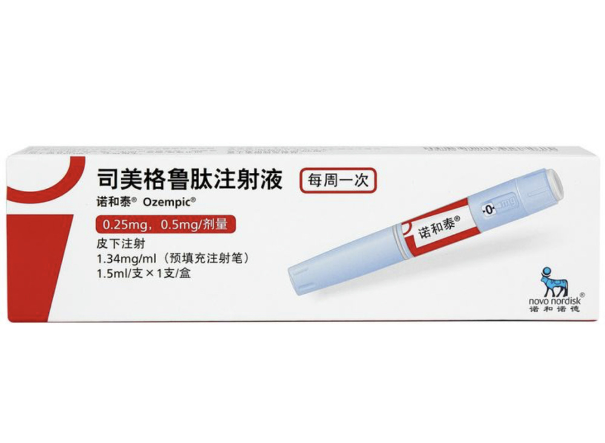

# 中国尚未获批的“减肥针”：年轻人因追求苗条用药，有女生打针后闭经

最近，诺和诺德公司用于长期体重管理的每周注射一次的司美格鲁肽2.4mg注射剂（境外商品名Wegovy，下称Wegovy）在国内递交上市申请并获国家药监局受理。此前，司美格鲁肽用于降糖适应症的药物“诺和泰”已经在中国上市并纳入医保，治疗领域为2型糖尿病，使用最高剂量为每周注射1mg。

第一财经记者近期在采访中注意到，尽管国内尚未批准司美格鲁肽用于减肥适应症，但不少非糖尿病患者也都在使用该药物以达到减重目的，甚至包括一些远不符合肥胖标准的人。对此，药企和专家呼吁，处方药有严格的审批流程，任何和疾病治疗相关的问题，务必遵照医嘱使用，切忌自行乱用药。

**有患者一年减重50多斤**

“诺和泰”于2021年4月在中国获批上市，此后纳入医保，这让不少中国患者受益。2021年年底公布的一项监测数据显示，中国18岁及以上成年人糖尿病患者将近1.4亿人，而且糖尿病患者年轻化的趋势显著。

刚刚30出头的文涛患有高胰岛素血症，他告诉第一财经记者，自从一年多前开始注射诺和泰之后，体重从过去的280斤减到现在的220多斤，一年里减重50多斤。

但今年以来文涛发现，“诺和泰”在医院的供应有时会不稳定，一些大型三甲医院也经常面临缺货。“我这个病需要长期稳定的用药，最多一次，我跑了三四家医院才配到，后来我就会自己多备一些以防万一。”他告诉第一财经记者。

40岁的张可在大约5年前查出患有糖尿病，他的体重顶峰时期曾接近260斤，通过运动，张可一度把体重控制到180斤左右，但疫情期间由于缺乏运动，他的体重又反弹到200斤以上。去年8月体检时，张可的空腹血糖高达16。“这着实把我吓了一跳。”他对第一财经记者表示。

在医生的指导建议下，去年年底，张可开始使用“诺和泰”联合二甲双胍和德古胰岛素进行胰岛素激活疗程。经过一个季度的治疗后，现在他的体重已经降到140多斤，并坚持监测血糖，空腹血糖已经能够保持在5左右。目前张可仍在服用二甲双胍配合“诺和泰”控制血糖。

和文涛一样，张可也发现“诺和泰”容易断货的情况。“尤其是月中以后断货情况会比较严重，上两个月没货的时候医生就开另一种GLP-1替代药物利拉鲁肽。”他告诉第一财经记者。利拉鲁肽是诺和诺德研发的上一代GLP-1药物，药效的持久性不如司美格鲁肽，需要更高的注射频率。

张可分析称，断货有可能是使用这种药物的患者增多导致的。“据我所知，我身边就有好几个肥胖的年轻人都在用这个药，是不是糖尿病就不清楚了。”他对第一财经记者表示。他还透露，他去看门诊的一些医院必须要挂专门的专家号才能配到。“有一家医院是挂了600元的专家门诊号配到的。”张可说道。

第一财经记者从多家三甲医院方面了解到，“诺和泰”的供货确实比较紧张。有医生告诉第一财经记者：“这属于处方药，挂内分泌专家号可以配到，不挂专家号可能就不行了。”

另据第一财经记者了解，今年“诺和泰”的生厂商已经增加了在中国市场的供应，以应对大量增长的需求。去年，诺和诺德GLP-1类药物的中国销售额达到37亿元人民币，同比增长约一倍。

**超适应症用药多为年轻人**

不到35岁的王宝宝也曾考虑购买“诺和泰”来减肥，他告诉第一财经记者自己并没有糖尿病，但感觉有些超重。经过自己查阅资料并分析后，王宝宝最终放弃了购买的念头。

“身边好多和我差不多年龄的朋友都在用‘诺和泰’减重，我也很认真地考虑过要不要买，毕竟能瘦下来，但我认为本质上还是需要做好长期生活习惯调整的心理建设，否则打了针之后短期体重下降了，长期恐怕还是会反弹。”他对第一财经记者表示。

像王宝宝这样超重的健康人，目前如果使用“诺和泰”，就属于典型的“超适应症”用药。北京大学人民医院内分泌科主任纪立农教授接受第一财经记者书面专访时表示：“目前‘诺和泰’在中国获批的治疗领域为2型糖尿病，是处方药，患者要严格遵照医嘱用药。该药物治疗糖尿病的临床试验最高剂量为1毫克/每周，有别于在中国开展的用于减重的研究，其最高剂量为2.4毫克/每周。”

纪立农补充道，降糖药用于成人2型糖尿病患者控制血糖同时减重，不属于超适应症使用；如果是糖尿病药物用于单纯性肥胖的治疗，则属于超适应症使用。

关于超重/肥胖的诊断标准，中国目前建议使用身体质量指数BMI≥24和≥28分别诊断成人超重和肥胖，这一标准略低于世卫组织对超重和肥胖的定义。世卫组织的标准为BMI≥25时为超重；BMI≥30时为肥胖。

根据《中国2型糖尿病合并肥胖综合管理专家共识》，针对合并肥胖的2型糖尿病患者，在选择药物时，应优选考虑或者联合使用有利于减轻体重或对体重影响呈中性的药物，如二甲双胍、GLP-1受体激动剂、α-糖苷酶抑制剂、DPP-4抑制剂等。

“对于2型糖尿病患者，体重波动，即体重时轻时重上下起伏是心血管疾病的危险因素之一，因此，糖尿病患者的体重管理应避免体重波动。”纪立农对第一财经记者表示。

对于处方药的超说明书用药，我国有相关的法律法规。《中华人民共和国医师法》规定：“医师应当坚持安全有效、经济合理的用药原则，遵循药品临床应用指导原则、临床诊疗指南和药品说明书等合理用药。在尚无有效或者更好治疗手段等特殊情况下，医师取得患者明确知情同意后，可以采用药品说明书中未明确但具有循证医学证据的药品用法实施治疗。”同时，医院对于医师用药行为均有相关的规定和流程加以规范。

第一财经记者了解到，一些医院对于“诺和泰”在医保范围的超适应症使用有严格的控制，但是对于自费购买“诺和泰”则会放松要求。

文涛告诉第一财经记者，他所在的一个“病友群”里，几乎有一半人都只是想单纯减重。“这些人大部分都是年轻人，也有一些是追求‘苗条’的女孩子。”他对第一财经记者说道。

文涛表示，他曾向一位女生提供过一针“诺和泰”。“那个女生打了一针后，体重从110斤直接降到100斤，结果导致闭经了。”他向第一财经记者透露道，“所以这个减肥针还是不能乱用，尤其是体重正常，或者BMI不是那么大的人。”

**各种院外购药渠道泛滥**

一些不想去医院挂号开药，或者血糖指标正常担心开不出药，但又想要用“诺和泰”作为单纯减重用途的人，开始寻求其他途径买药。其中也包括不少本身就是医疗行业的人。

医疗行业从业者李天40多岁，他告诉第一财经记者自己150多斤，但属于“中心肥胖”。所谓“中心肥胖”，可以用腰围判定，男性腰围≥90 cm，女性腰围≥85
cm为成人中心型肥胖。

李天目前血糖指标正常，空腹血糖约6，但他担心随着体重继续增长，血糖可能会升高。在朋友的推荐下，李天通过所谓的“经销商”渠道私下代购了“诺和泰”。“现在这个药的代购相当赚钱，就是抓住有些人去医院开药不方便，或者开不出药的心态，价格居高不下。”他告诉第一财经记者。

他还表示，虽然自己买的药价要高出医保价格近20%，但是现在用下来一周能瘦两三斤，还是“物有所值”。据他称，代购生意非常“火爆”，而且目前来看货源稳定。

适用于糖尿病的诺和泰纳入医保后，小剂量1.5毫升/支的院内售价为478元，大剂量3毫升/支890元。

另一个公开可以购买的渠道是互联网药房。第一财经记者在电商平台上搜索“诺和泰”，可以用“泛滥”来形容，1.5毫升/支零售价在600-700元；3毫升/支的价格一般都超过千元。第一财经记者试图在网上购买，在被要求填写适应症之后，提交医师网上审核，开具处方之后即可购买，整个过程不到5分钟。

不过李天对网上购药还是有一定的顾虑。他对第一财经记者说道：“我听说有一些仿制药，或者称之为假货，所以不敢轻易在互联网药房买，毕竟这是要注射到体内的。”

在欧美，Wegovy的“最强代言人”是马斯克；而在中国，年轻人对司美格鲁肽的认知大部分来自抖音、小红书等网络平台，这甚至成为平台和博主们的“流量密码”，一些相关视频的评论区充斥着成千上万条评论，这也给一些非正规的“地下渠道”提供了“带货空间”，并导致“黄牛”开始倒卖“诺和泰”赚取差价，并滋生了潜在的“三无”假药风险。

“其实有一些也不是专职黄牛，他们可能也是患者，从医院里面开出来的药自己不用，加点价卖给其他有需要的人。”文涛对第一财经记者表示。

他还向第一财经记者透露，今年3、4月份，他自己就在一些医院门口碰到过“黄牛”，问他有没有“诺和泰”。“‘诺和泰’需要冷藏，所以我每次配药的时候就会自己带一个小冰袋，黄牛可能就知道我有这个药。”文涛告诉第一财经记者。

他提醒称，司美格鲁肽对低温要求高，长时间室温保存会破坏药物的活性。“黄牛一般都不会考虑药物冷藏的问题，所以从黄牛那里买来的药很可能是已经失去活性的。”文涛说道。

诺和诺德公司也多次重申通过正规渠道获取“诺和泰”。去年6月，该公司就曾发布声明称，注意到社交媒体平台上出现涉及GLP-1类药物的不实或误导内容，并要求对此类药物加强监管，以避免对患者和公众带来困惑和误导。

“我们郑重提醒，‘诺和泰’为处方药，诺和诺德公司高度关注患者用药安全，不进行也不支持药品的非适应症推广。”诺和诺德声明强调。

**是否完全没有副作用？**

全球糖尿病患者数量的快速增长已经成为几乎所有国家卫生健康体系的巨大负担。根据美国华盛顿大学健康指标与评估研究所的研究人员在《柳叶刀》上最新发表的一项研究测算，目前全球约有5.3亿人患有糖尿病；到2050年，这一数字将增加超过一倍，达到约13亿人，发病率接近10%，远超目前6%的发病率。

糖尿病与包括心脏病在内的很多其他疾病发病相关。糖尿病患者人数不断增加，部分原因是肥胖率上升，部分原因是人口结构变化。但研究人员同时强调，大多数的糖尿病患者为2型糖尿病，这种疾病与肥胖有关，而且基本上是可以预防的。

减肥药的下一个竞争点在于能否有效预防相关的心血管事件发生。尽管减重与降低患心脏病的风险之间的关联并不难理解，但仍然需要临床数据来证明减重与改善心血管事件结果之间的相关性。

上个月美国Mayo
Clinic在欧洲肥胖大会上公布的一项小规模研究结果显示，患者使用司美格鲁肽一年后，未来十年内患心脏病或中风等疾病的风险将从7.6%降至6.3%。

巴克莱分析师认为，如果Wegovy被批准扩大用于治疗心血管疾病，那么在2030年之前，将推动Wegovy的使用率将提高约四分之一。

此外，诺和诺德等厂商还在开发口服版本的GLP-1类药物。一项后期临床数据显示，口服版Wegovy与注射剂的疗效也相当。诺和诺德预计将于本周日的美国糖尿病协会年会（ADA）上公布口服司美格鲁肽的疗效。

张可对第一财经记者表示，尽管在坚持用药半年后，他的血糖和体重都已保持在正常水平，但医生仍然建议他继续使用该药物，并且需要增加剂量。“据说是因为这能保护心脏，但小剂量对我已经没有作用了。”他说道。

文涛对第一财经记者表示，从280斤减到220斤后，他的体重目前进入到“缓慢下行”阶段，需要配合生活方式的改善。“医生是建议我把体重降到180斤之后，通过运动以及生活方式的改变，逐步可以停药。”他告诉第一财经记者。他还表示，期待能够早日用到口服药物。

今年4月，诺和诺德在国内启动一项评估口服制剂疗效的三期临床试验；此外，还在国内积极推进两款复方制剂的临床试验。

像Wegovy这样的GLP-1（胰高血糖素样肽-1）药物的作用机制是激活血糖调节、减缓胃排空和降低食欲。这种药物模仿肠道中产生的一种叫做GLP-1的激素，当人吃饱时，它会向大脑发出信号。
该药物通过调节这种“饱腹感”来控制人们对饮食的节制。这也可能会使得患者用药时产生一些副作用，并且这些副作用因人而异。

张可对第一财经记者表示：“用药之后，吃一点就饱了，吃多了就会拉肚子，随着剂量的加大，反应也会变得更强，有一段时间不得不减少剂量。”

李天也对第一财经记者说道：“用了这个药以后，没有食欲，也没有饥饿感，喝酒倒是没有影响，只是吃不下东西，但看在能瘦的份上。”

对此，纪立农再次提醒：“截至目前，已在国内上市的降糖药物均未获批在非糖尿病人群中超重/肥胖适应症。处方药有严格的审批流程，任何适应症均须建立在严谨的临床试验的基础之上，并经过国家药品监督管理局审批。任何和疾病治疗相关的问题，请务必听从和按照医生的建议，以确保治疗用药的安全和有效性。”

Wegovy用于减重的另一个风险是一旦停药，体重反弹的情况普遍。今年3月，诺和诺德就公开表示：“人们必须持续使用这种药物来保持体重，停药后体重会反弹，具体增加的速度因人而异，但工作还需要通过更多研究来了解是什么因素推动了体重的反弹。”

诺和诺德还称，现有数据表明，大多数人在停止使用Wegovy后的五年内会恢复大部分体重，并在两到三年后恢复大约50%的体重。

欧盟药品监管机构（EMA）上个月对诺和诺德、礼来、阿斯利康和赛诺菲的几种GLP-1药物发出了甲状腺癌的风险预警。对此，诺和诺德方面回应称，这是监测使用已批准药物的潜在不良事件的一种方法。
EMA发出的此类信号并不意味着该药物是导致不良事件的原因。

EMA和美国FDA此前都在诺和诺德Wegovy的药物标签上提到司美格鲁肽会导致啮齿类动物出现甲状腺肿瘤，但表示对人类的影响尚不清楚。美国FDA建议有甲状腺癌家族史的患者不要使用Wegovy。

（文内文涛、张可、王宝宝、李天均为化名）

