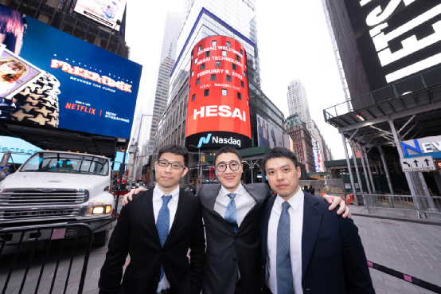
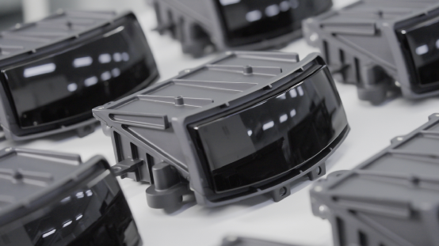
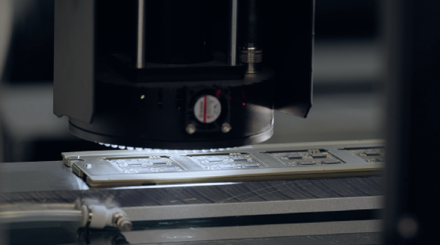

# 中国激光雷达逆袭欧美，创始人：十年前创业看北大，未来硬科技创新看清华

作者丨程潇熠

编辑丨康晓

出品丨深网·腾讯新闻小满工作室

智能制造时代，中国的全产业链制造积累成为了中国初创企业打赢欧美公司的底牌。车载激光雷达行业便是其中之一。激光雷达是目前L3级及以上自动驾驶的必备传感器，行业起步于欧美，但如今占据最多市场份额的是一家中国初创企业——禾赛科技。

今年一季度，禾赛销量超6家国际同行（Luminar、Ouster、Innoviz、Aeva、Cepton、AEye）之和，以近3.5万台销量蝉联全球车载激光雷达季度“销冠”。另据Yole
Gourp数据，禾赛在2021年还是全球全球车载激光雷达总营收第一、L4级自动驾驶激光雷达市占率第一（近60%）。

曾被行业忽视的量产制造环节成了多数海外车载激光雷达公司的噩梦，也成为了禾赛后发制人的关键。

“我们看到了车载激光雷达的量产会是很大的挑战，不是每家都能产出来。”禾赛科技CEO李一帆告诉《深网》，几年前业内的共识与禾赛的预测恰好相反，认为量产不是难点。

激光雷达上车7年后即2016年，禾赛才开始探索车载激光雷达市场。但在2018年，禾赛凭借性能、价格和本土制造优势，从车载激光雷达鼻祖美国公司Velodyne手中抢走了当时行业在国内的最大订单——百度无人车的订单。

禾赛营收利润因而飙升，营收从2017年不到2000万元跃升至2018年的1.33亿元，并在当年实现扭亏为盈。

2022年历史重演，被质疑“路线错误”、“只能卖给Robotaxi（无人驾驶出租车）公司做demo”的禾赛，在为理想汽车大规模供货后，一跃成为车载激光雷达头部玩家。

“早期你不承担风险，其实你承担了最大的风险。”李一帆称，虽然坚持自建工厂让禾赛在早期开拓客户时吃了不少苦头，丢了很多订单，但当年如果选择代工，现在会遇到质量和性能难以快速迭代的问题。

时至今日，量产仍然是激光雷达行业的一大难题。Yole Intelligence光电和传感高级分析师Pierrick Boulay在今年5月EE Times
Europe的采访中感慨，“在激光雷达市场上，真正能够向车企交付产品的玩家寥寥无几。”

在与《深网》的交谈中，李一帆分享了中国零部件供应商全球竞争的经验、自动驾驶激光雷达与视觉路线之争的看法，以及对工程师创业的理解。

_禾赛科技三位创始人，从右到左分别为：孙恺、李一帆、向少卿_

**以下为《深网》与李一帆的对话实录整理，在不改变原意的情况下有所删改：**

**工程师创业时代：从风险厌恶到兴趣驱动**

**《深网》：当初为什么会选择创业？**

**李一帆：**
打工太无聊。我当时在硅谷的另外一家大公司工作，很明显地看到你能做的事情是很有限的，公司对你的诉求也是把你变成一个可被替换的、略有一些无聊、只是收入还不错的一份工作，这个并不是我想要的。

那个时候我和两个合伙人已经认识好多年了。我们当时没说要做激光雷达，只是觉得要创业，并且想做一些硬件产品，即使这样，依然觉得比打工更有意思。

有点像去逛街，你不一定今天已经想好要买什么东西了，就觉得去看看挺有意思的，你相信在看的过程中就会有。我们觉得有机会做自己的产品，按自己的想法去发展一家公司，这个更有意思。在这个过程中大方向是定的，我们一直想做机器人技术相关领域的创业。这件事一直没有变。

**《深网》：在自动驾驶、AI等领域，我接触过的清华创业者很多，学校整体会有鼓励创业的氛围吗？**

**李一帆：**
清华我觉得是最近几年才多的，从实际数字来讲，十年前清华创业圈并没有那么活跃。我们有一个清华企业家协会，我们一直认为清华企业家协会当年的活跃度远远弱于北大企业家，那个时代北大有名的创业者更多。

在我看来有两个原因。一个原因是上一个时代更多是互联网和商业模式的创新，这不是清华人最擅长的。这个时代硬科技更多，清华人会更擅长。

第二点在我看来工程师创业都难。因为工程师天然是厌恶风险的，像我们从小的工程训练基本只做95%以上成功概率的事。比如盖一个大楼，有99.99%的概率能盖起来你都会害怕。而创业天然是偏好风险的，这个事你感觉只要有10%的概率可以干，你就得去干了。工程师很少做大概率失败的事。

为什么这个时代（工程师创业）会稍微多一点？因为工程师另外一面是他不为钱而做事情，他就觉得感兴趣。禾赛到今天为止还不是个商业公司，还是个技术公司，还是大家觉得这个事有意思，然后把它做出来了，是兴趣驱动的。

**《深网》：可以说，属于工程师的时代已经到来？**

**李一帆：** 上一个时代确实是商业大于技术，在互联网的推动下很多商业创新已经做完了，这个时代才刚开始，工程师时代不好说，但确实是技术创新会有更大的比例。

纯做技术的公司还是蛮难的，因为纯做技术可能不解决生活中的问题。

**《深网》：互联网的主战场在数字世界，自动驾驶则是对物理世界的改变。很多业内人认为改变物理世界远比改变数字世界困难，你怎么看？我们多久才能看到物理世界的改变？**

**李一帆：**
改变任何事都难。改变数字世界看起来容易的原因是方法论已经成熟了，而改变物理世界也不是真的难，而是这件事还没有形成足够好的方法论。就像移动互联网时代做APP，大家都知道怎么做，你只要去复制就好了。

改变物理世界可能是未来5到10年行业会去推动的，一旦推动形成了方法论，又会回到容易的模式，也就是所谓的AI或者是机器人技术+Everything。

一旦实现以后你就回不去了。你会觉得我为什么还要自己倒咖啡？为什么要自己做饭？为什么要自己扫地？你会觉得好像真的不需要人了。

**《深网》：你说过机器缺乏对物理世界的基础理解，激光雷达在解决机器人对物理世界的理解这件事上扮演什么角色？**

**李一帆：**
三维世界的感知倒不是激光雷达，激光雷达解决的是高精度的感知。这个感知不是所有的行业都需要的，只有非常重要并且有一定成本承受力的才需要，比如航空航天、汽车。

**《深网》：你曾在上市时说很喜欢一句话，伟大的成就必须要有两个条件：一个计划和不太够的时间。你是如何理解这句话的？**

**李一帆：**
一个计划很简单，就是明白你想要做什么。为什么是不太够的时间？任何一个、尤其像我们这样的创业公司能够不断地跑出来，大概率是因为你比别人跑得快。如果这件事是一个时代最好的机会，你也不是唯一看到它的人，你大概率时间是不够的。

创业者天然应该在一个不舒服的状态工作。我们生活的常态就是时间不够，就是压力很大，就是做那些低成功概率的事情。你永远都在被迫很努力地去解决一个在你看起来解决不了的问题，在这个过程中你才能前进。

马斯克在一个采访说过，创业者尤其是CEO，你的生活天然是很糟糕的。因为没那么糟糕的事都到不了你桌子上，基本上到你这儿都是一个很糟糕和更糟糕的事，而且怎么选你都很痛苦，这才是你需要做的决策，也是你需要适应的状态。

**激光雷达相当于安全气囊**

**《深网》：越来越多车企选择搭载高级别辅助驾驶，比如特斯拉FSD、理想汽车NOA、蔚来NOP+、小鹏汽车NGP等等。目前硬件方面仍有两种路线，一种是激光雷达路线，另一种是特斯拉主导的纯视觉路线。为什么会出现路线分歧？**

**李一帆：** L4、L5对激光雷达的依赖是极其明显的，全世界都没有争议。那做辅助驾驶到底要不要用激光雷达？这个讨论的核心其实很简单：钱。

原来用，为什么到这儿不用了？不是说这个技术弱到或者是强到不需要了，更多的是这个技术对钱更敏感。在我看来一旦做工程、做产品，最终都是商业问题，没有技术问题，技术问题一般都已经被解决了。

商业问题就要用商业的方法去看。整套系统多少钱？创造多少价值？今天创造多少价值？未来创造多少价值？在这个过程中整套系统分到我们这边的成本是多少？毛利率是多少？什么量级上可以做到什么价格？在什么价格上这个商业的case更成立？

今天激光雷达已经做到了几千人民币，同时它的价值、整个功能提升还有很大的空间。可能今年下半年开始，很多我们的客户推的功能和原来相比会明显有大幅的提升。也就是从1到10的阶段，你会有被服务感。

比如我自己特别喜欢买各种扫地机器人，过去几年扫地机器人进步蛮大的。原来每天早上我们家那个扫地机都骑在墙上或者是钻缝里面出不来了。现在我早上起来一看扫得都挺好的。

**《深网》：这种提升主要是软件OTA带来的？**

**李一帆：**
我认为软件是占绝大多数的。软件不是几行代码，软件是硬件产品和物理之间的连接。智能车第一代没有足够多的信息，今天各家都有10万台以上的车在实现这些功能，数据回流特别快。在我看来1到10是今年大概率会发生的。

**《深网》：激光雷达的价格已经从上百万元降到几千人民币，为什么有的车企在算经济账时仍然会选择舍掉激光雷达？比如特斯拉。**

**李一帆：**
对于车而言几千人民币其实是非常非常大的一笔钱。一个车上愿意花几千人民币买的部件一般是一个能显著被感知的。比如升级皮座最多也就几千块钱，你买了它就有，没买就没有。

如果你成本增加了一万块钱，理论上讲你增加的售价至少是两三万。所以如果你把激光雷达单独作为一个成本的中心，就是多花钱，你就不应该装。你应该想的是它实际结合你的软件到底提供了哪些消费者愿意买单的东西。

对用户而言，他能感知到的是基于激光雷达体系开发的辅助驾驶。这里面的一个问题是，我们（激光雷达）依赖于主机厂的产品，第一各家水平不一样，第二智能驾驶仍处于比较早期的开发阶段，也就是说，激光雷达今天还没有完全发挥出它的威力。未来3到5年内，再谈具体的合理成本是多少比较现实。

_禾赛AT128_

**《深网》：搭载激光雷达的智能驾驶系统会比纯视觉路线的更安全吗？有业内人士认为激光雷达只是过渡性产品。**

**李一帆：**
如果纯视觉解决的问题足够好，以后这个车永远都不会撞，完美了，那确实不需要激光雷达。但应该没有人会这么认为。任何东西都有它特定比例的失效，飞机也会失效，火箭也会失效。

长期来看，你的视觉做得再好，有激光雷达可能能解决你一半以上的事故。今天为止大家默认安全是至高无上的，人命是无价的，哪怕这个车特别便宜，车主也不会觉得自己的命不值钱。

有激光雷达安全提升至少一倍这件事就有点像安全气囊。大家一般不会去思考我是不是能少装两个气囊，因为好像我不需要那么安全。绝大多数会认为我只要能装的地方都装上就行了，车企替我做好这个选择就行了。长期来看激光雷达也是这样的。

我觉得今天更好的一个问题是用激光雷达能多给我带来哪些功能？因为安全本身是相对难量化的，只有撞车的时候才知道。今天我们看到各家车厂的做法是不牺牲安全的情况下，有激光雷达还能解锁更多场景。

**中国零部件供应商如何逆袭欧美**

**《深网》：作为一家中国零部件企业撬动海外市场时是否会遇见偏见与歧视？**

**李一帆：** 会，这是一个很常见的情况。一定程度上我觉得也是公平的，有几个原因：

第一，我们并不是最早做的。激光雷达行业，欧洲和美国是最早的一批，都比我们更早。那天然的你就不具备历史悠久这件事。作为一个后来者，刚出来的时候往往品牌（形象）都不如前面的好。

第二，中国的零部件供应商历史上确实没有出现过足够大的巨头。近几年像宁德时代、福耀已经非常棒了，但这也是非常近期的事情，历史上更多的是欧美传统Tier
1在做。

最后，出现一个高溢价的中国品牌会比较难。历史上外国人总会觉得中国的产品是平替——我成本比别人低50%，性能高80%。现在还有供应链安全的问题，中西方文化不同等等。作为一个中国供应商，你身上都是不利于你做国际化业务的这些标签。

所以经常有人问我一个问题，如果美国有一个和你一样好的激光雷达供应商，你怎么跟它竞争？美国人为什么选你？我的答案是，它就不会选你。

我遇到很多次，客户（对我）说你这些减分项我都明白，但这些都是虚的，实的东西是性能，是质量，是成本，如果这些你做的都好，那我还是得用你。我们的业务是中美均匀分布的，这说明美国人也觉得我们是不可替代的，别忘了我们还交25%关税呢。

**《深网》：禾赛是怎么做到后发制人的？**

**李一帆：**
你得看这个事的本质是什么。激光雷达的本质是一个极其复杂的高端制造业，在那个时间点，我们看到了车载激光雷达量产会是很大的挑战，不是每家都能产出来。

但这件事在好几年前不是共识，很多人会默认量产没问题。最开始禾赛自建工厂是很不被看好的。你想同样两家供应商，一家说我跟全世界最好的代工厂合作，而禾赛是说我们有几个很懂制造的人，我们决定自己建厂，所有流程自己学习，所有资质重新申请。

汽车行业并不是一个喜欢承担风险的行业，它更希望没风险。作为代价，我们早期很痛苦，也丢掉了很多订单。

但是我们当时为什么这么做？你在这个点不承担风险，其实你承担了最大的风险。现在看来我的判断基本是对的，如果当年选择了代工，会和很多代工模式的对手有一样的问题，质量和性能难以快速迭代。

_禾赛科技生产基地内_

**《深网》：大疆、华为等拥有大量研发制造人才的公司也在做激光雷达，在你看来禾赛目前跑赢这些大厂的关键是什么？**

**李一帆：**
我能想到的区别在于，我们公司只有一件事，就是把激光雷达做好。大家一条心，赌一口气，就做这样一个产品。更大的公司有更大的项目要去做，全集团最优秀的人不一定全放在激光雷达这个小项目上。而且大集团不一定非要自己做，有退路。

**《深网》：海外车企和国内车企对激光雷达产品的需求侧重点会有所不同吗？**

**李一帆：** 大家都关心质量，但海外车企会更关注性能，国内传统车企更关注成本，国内新势力有点像介于两者之间，既关注成本，也关注性能。

每个国家地域关注的就是不一样，如果你要在全球业务中持续存活下来，就要求你必须成为六边形战士，每个角都得占了。跟你谈性能的人，你得在性能上完全满足的同时有足够的降本空间。跟你谈价格，你的价格也得是最有竞争力的。

禾赛可能更像保时捷，保时捷这个品牌很有意思。它最便宜有五六十万的车，但最好的东西也足够好，911和GT3也可以跟同档的法拉利对标。这在我看来就是六边形战士，如果你的终局定位覆盖非常广，你就会发现每一部分能力都不能缺失。

**《深网》：如何在性能不断提升的同时压低成本？**

**李一帆：**
硬件公司一般就几个方法，第一个是贴钱卖，这个是我们最希望避免的。禾赛是上市公司，我们的毛利大家都能看得到，如果你永远拿投资人的钱去补贴这个事就没法做了。

历史上我们在Robotaxi的行业毛利也是比较高的。禾赛是个高端品牌，大家也接受在高质量和高性能的情况下有一定的溢价。

第二个做法是尽可能多拿订单。你是行业内最大的量，你的溢价能力就更强，供应链端相对高效。我们在行业内即使不是最大的，也是最大的之一。

我们绝大多数外部采购的元器件并不是针对激光雷达开发的，而是针对消费电子比如手机等行业，那个行业的量远大于激光雷达。

我们第三个做法是自研芯片，我们有更好的方法做集成，成本能进一步下降。原先我们可能从不同行业的供应商处采购100个元器件，买来再做集成。现在是我把每个元器件的功能想清楚，把冗余都去掉自己做成几颗芯片，再大量生产，成本就得到大幅降低。

**《深网》：现在许多科技、软硬件企业都在自研芯片，芯片研发门槛降低了吗？主要难点是什么？**

**李一帆：**
自研芯片本身不难，难的是你能做到什么程度？有点像一个公司以前总是点外卖，现在自己开了个食堂，这个事不难。难的是自己开的食堂能不能比外面做得还好吃，还便宜，菜品还多，甚至每天还能换。

比如说，自研芯片理论上可以覆盖20个功能，你做一个功能也可以说是自研芯片，做20个也是。像特斯拉、苹果可能做到接近20了，我们是2017年从1开始做。去年发FT第三代产品的时候，我们绝大多数需要外部采购的东西都变成自研了。

我觉得光说自研芯片不算是太强的特点，关键是说你到底做到了什么程度？也就是你推的新品是不是性能足够好？是不是有大幅降本空间？陷入价格战的时候能否从容？

**《深网》：禾赛未来在芯片制造环节是否会有供应“卡脖子”的风险？**

**李一帆：**
我们用的是成熟制程，很多代工厂都是本土供应商，所以没有这个问题。成熟制程不代表它不好。我们做的是偏模拟、偏光电方向的半导体，天然不需要那么好的制程。可预见的未来内我们都是整个行业里偏成熟的那一端。

**《深网》：禾赛是怎么拿下理想汽车这个重要客户的？**

**李一帆：** 就是一个比较典型的筛选过程，经历了很长的筛选时间，从很多家筛到两三家。

当时我们和理想已经做了比较深入的沟通，我们认为我们有长期降本的机会，这个机会不来自于量，而来自于技术的进步和我们芯片化的迭代。这个对理想也蛮重要的。

第三个是我们已经取得的商业成就。合作理想之前我们最大的客户是一家北美车企。合作过程中我们学到了大量传统汽车质量体系的经验、服务的经验和做大量产的经验。

**《深网》：你曾说李想本人的一些观点对你很有启发，其中最有启发的一个观点是什么？**

**李一帆：**
我很多时候看他朋友圈确实能感受到他是在以一个迭代组织的方式去迭代一个公司，是以一个做产品的方式在经营一家公司，这些理念都是比较领先的，在这个过程中能学到很多。

**《深网》：现在自动驾驶主流路线是多传感器融合感知，禾赛未来是否会做摄像头？或者融合感知的传感器解决方案？**

**李一帆：**
我们肯定不会去做摄像头，这（和激光雷达）又不是一个领域了。在我看来，我们没有道理比专注做摄像头的人做得更好。我们跟他们是完全不一样的商业模式，不觉得是在竞争或者替代。

为了让我们的客户把我们的激光雷达能够用好，我们是有一个团队做软件算法，提供完整的解决方案。但这不代表我们会把自己变成一家像博世或者地平线或者德赛西威这类做解决方案的公司。这还不是我们擅长的领域。

**《深网》：禾赛考虑在海外建厂吗？**

**李一帆：**
现在还没有决策，但这么多年我们一直都在评估。本地建厂一定会有一些优势，但也会有很多问题。比如它的整个体系是不是和你兼容？成本是不是可控？最重要的是真的有必要吗？如果你海外建的厂成本并不可控，是省了关税，但综合成本可能会增加很多。

**《深网》：禾赛预计什么时候能扭亏为盈？激光雷达行业是否有盈亏平衡点？**

**李一帆：** 这个涉及到监管和财务，我不能具体给数字。但是从全行业来看，我们属于毛利做得比较好的。如果你毛利做得不好，也谈不上什么盈亏平衡，这是第一点。

第二点，盈亏平衡不完全和量挂钩，取决于一家公司认为它的长期壁垒在哪儿。很简单，我们今天把研发全部裁掉，那今天不就盈利了吗？很多公司的问题是收入没上去，但是研发投入太多了。

我们历史研发投得也很多，因为早期一定要把产品线做起来。今天我们收入涨的不错，而研发投入是在收敛的，因为已经形成了几个成熟的产品线。成本可控、量在涨、毛利率趋于合理，你就能看到盈利的机会。

