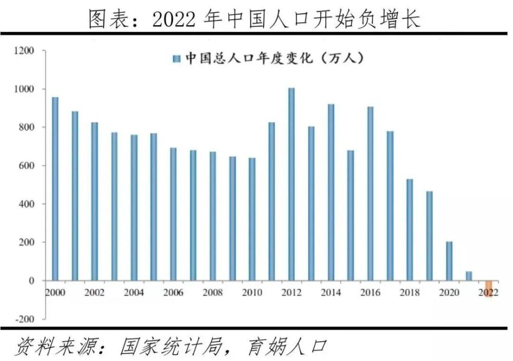
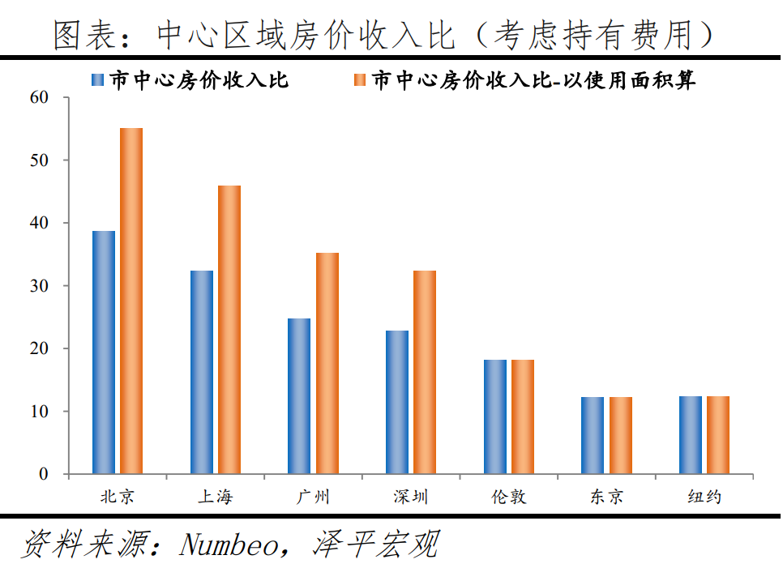
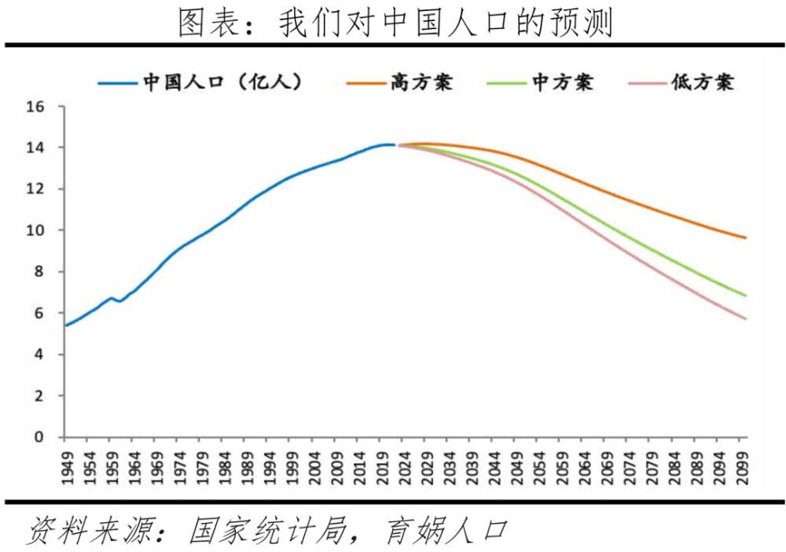
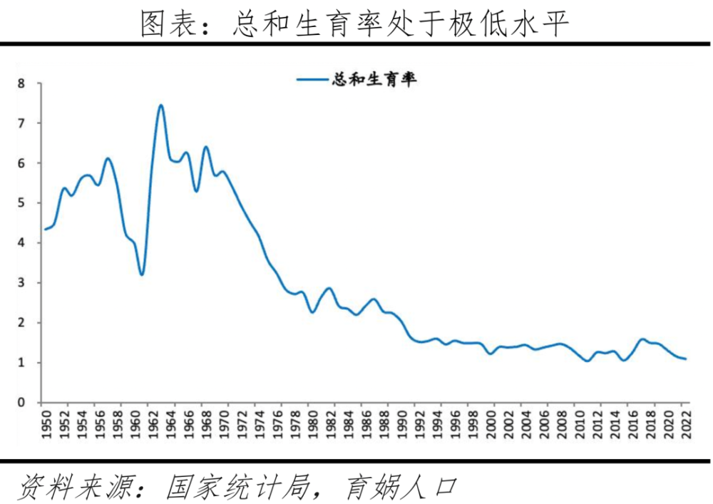
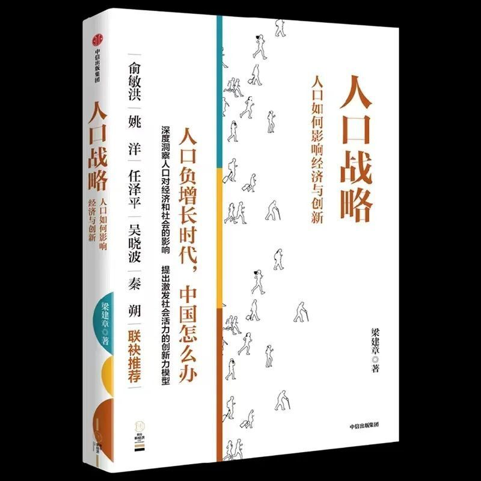

# 任泽平对谈梁建章：长期研究鼓励生育，如不干预到2100年只剩三四亿人

当中国经济进入创新经济阶段，在全球拥有足够的竞争力，创新力是根本。推进大众创业、万众创新，是发展的动力之源，也是富民之道、强国之策。人口负增长和老龄化，如何影响中国未来经济发展，如何应对。

中国人口有解题的方程式吗？人口负增长时代，我们该如何应对？研究人口经济学的意义是什么？

本期大咖会客厅，任泽平博士邀请到了好友，携程集团联合创始人、董事局主席梁建章先生做客大咖会客厅一起解疑答惑。

**大咖会客厅**

**人口问题**

**任泽平：** 梁老师，我印象当中您是最早在国内呼吁放开生育，应对人口老龄化少子化的少数学者之一。
**您是什么时候开始关心中国的人口问题的？为什么当时开始关心这个问题？**

**梁建章：**
我是2006年携程上市后三年开始想去做学术研究了，所以我那时候就辞掉了CEO，只是兼着董事长，去Stanford读经济学博士，研究整个经济创新方面，一个比较独特的角度就是从人口角度来研究创新。这个是一个比较新的领域，会研究到一些像日本这样的老龄化国家，为什么它的创新受到了人口的负面影响，然后就看到中国人口问题。

那时候人口结构已经出现了问题，就觉得自己很有责任去改变这事，在念完博士以后，在北大教了两年经济学，中间也是一直去研究，去写书写文章，做一些论文研究。当然2013年我回到携程去做CEO后，也是花了一半左右的时间呼吁改变人口政策，也跟很多学者一起交流，一直到现在已经十多年了，看着人口政策和人们的人口观念在逐步的转变。

那时候可能90%的人都认为中国人是太多了，到现在我觉得绝大多数人都知道了，
**中国人口不是太多了，而是生育率太低了。现在已经不是说是不是一定是要放开的，而是是不是一定要去鼓励生育了。**

这个观念有所转变，当然还没有完全到位，未来还是要有一些切实可行的方案。能够扭转中国的这个低生育率的问题，改善中国的人口结构。

**任泽平：** 原来有一个非常大的争论。你刚才也提到了，就是有人认为中国人口太多了，14亿人。
**如果中国人口降到7亿，我们就更容易跨进发达国家行列了。反而大家觉得，现在中国人口正好开始进入负增长，正好少子化了，不挺好的吗？你怎么看这个争论呢？**

**梁建章：**
当然这是一个非常复杂的问题，就是人口跟就业、养老、创新都有非常大的关系。人口少，表面上会缓解一些资源就业等等压力。但实际上从长远来看，它其实对整体的国家的这个养老体系，尤其是创新力会有很大的伤害，反而会影响共同富裕。

**但现在的问题，不是说中国人口是不是会增长，肯定不增长，肯定是下降，而且下降的速度太快了。**

**仅仅是七年前，中国还生了1800多万。过去一年只有900多万，几乎是腰斩。**
每七年就被腰斩。30年前，一代人前，中国是生了2000多万，那现在就是不到1000万，那比腰斩是更少。
**世界上仅仅只有一个国家的生育率比中国还低，就是韩国0.8。**

0.8什么概念，上一辈一百个人，下一辈只有30几个人，下降近2/3。这个是非常可怕的人口坍塌。有一些人在预测，今年可能只有800万新生人口。如果乘以80岁的这个人均寿命的话，我们7亿人都没有了，直奔6亿去了。

而且6亿不是个底，还在往下降，按照最悲观的预测，
**如果没有政策干预的话，到2100年我们可能只有三四亿人，新出生人口可能就一两百万。我们从一个曾经占世界30%的人口大国，一下子变成新出生人口不到世界1%的一个人口小国，人口密度将远远低于亚洲的其他国家，甚至于欧洲，变成个地广人稀的国家。**

而且如果说我们现在7亿是个理想人口，是一种421的结构，比如说老人4亿的，年轻人2亿，孩子1亿，这个也是极其糟糕的。4、2、1的7亿跟比较平衡的232的7亿不是同一个水平。我们的新生人口按照现在这个规模的话，一两代人以后可能就比美国还少。
**到那时如果我们还是个421的结构，美国还是相对平衡，未来跟美国的科技竞争，那我们就会处于一个非常被动的地位。原来的这个人口规模的优势、产业规模的优势、人才规模的优势，可能在一两代人以后就会失去。**

**当然这些都不是说一定会发生，如果我们现在采取积极的鼓励生育，也就是为生育减负的财政政策，还是有希望把我们的生育率恢复。**
并不一定能够恢复到人口的正增长，但至少不会比其他国家更差。像国际比较来说，我们的人口规模、人口结构、创新力不会受到太大的负面影响。

**生育成本**

**任泽平：** 我估计很多人都可能关心哈。原来中国的生育率这么高，像1962年到1970年，中国的总和生育率能达到六以上。现在已经三孩都放开了。
**但是为什么我们的生育率竟然还在不断往下降，甚至都要降到1以下？大家给出了各种各样的解释。你觉得这里最关键的是哪三个原因？**

**梁建章：** 其实主要就是一个原因嘛，就是 **生育成本。**
生育成本当然包括直接的财务成本跟机会成本。我们算下来，把一个孩子从出生养育到成年，直接财务成本在全国平均是50万左右，一线城市可能是翻倍，接近100万这个平均水平。然后我们把这个数字来除以人均GDP，也就是说这个数字是人均GDP的几倍。那倍数越高，说明这个负担越大。

来做一个国际比较吧， **中国的生育成本是人均GDP的6.9倍，也是世界上几乎最高的。**
日本是四倍，欧洲的一些国家平均是三四倍，做的特别好的像北欧这些高福利国家，只有人均收入的两到三倍，这样的话它就负担比较低。生育成本比中国还高的一个国家就是韩国，它是七到八倍。其他所有国家生育成本负担都比中国轻一些，所以生的也比中国多。

**那至于为什么说中国的生育成本比其他国家高呢？最主要是三个原因，一个是房价。** 房价相对于我们的收入几乎也是世界上最高的。 **第二个原因是教育，**
现在正好在高考吧，一切听高考的指挥棒。中考、高考，现在又多了考研，花大量的时间去复习，另外还有升学的压力，补课的压力，使得家长在小孩的教育方面花了太多的精力。
**第三个原因，主要是现在还没有落实鼓励生育的政策。** 我举个例子，北欧高福利国家，拿GDP的3%给有孩子的家庭，这样就大幅度降低了他们的这个养育成本。

知道这三个原因，我们在政策方面也可以做相应的改革了，就是房价怎么办，教育怎么改，最立竿见影最快速的可能就是要立刻推出这个财政补贴的政策。

**任泽平：** 因为我以前是学数学的哈，我发现这个相关性真的非常对。凡是生育成本高的国家生育率都低。凡是生育成本低的国家，生育率都高。
**生育成本韩国排第一，咱排第二。结果在生育上，韩国倒数第一，我们倒数第二。所以这个相关性真的是非常强。**

其实可以做检测，就是生育成本高，究竟能够解释多少我们的这个低生育率的问题。你感觉能解释多少？如果真的做因果检验的话。

**梁建章：**
这个样本量是以国家为单位，而且是要以工业化以后的国家，因为如果是农业社会完全是另外一个事情。样本量是几十个吧。但就这几十个这个样本量，如果把教育、房价跟生育成本这些都放进去的话，那解释也是几乎是相当高的。

另外当然还有一些原因是跟文化宗教有关，比如同样的其他的我们刚才说的这个因素差不多的情况下，穆斯林国家就生的稍微多一些。

**任泽平：** 梁总一直为中国的人口问题鼓呼，这一点我是非常的感佩。因为梁总应该是比我早了好多年呼吁这个人口问题。我觉得他的很多观点现在已经被验证。

中国原来是一个多子多福的文化。忽然短短几十年的时间，中国就变成了全球生育率倒数的一个国家。如果按照您刚才的解释，生育成本解释了大部分。
**那么为什么突然我们的生育成本就上来的这么高呀？**

**梁建章：** 其实我们国家的生育率下降也不是说这两年。但这两年是有加速下滑的这个趋势了
**。我们实际上从90年代开始已经降到更替水平以下了，当然这个有一胎政策的作用。但是在大城市里面双独的这样的可以生二胎的人，生的比例也没有那么高。**

我刚才说的这个房价，这十几年就升的非常快。教育，我们那一代人虽然也有高考，但似乎没有卷的那么厉害。现在的孩子学习的这个努力程度，补课程度，考试的压力程度远远超过上一代人，而且还有学制。

为什么我们教育改革其中一点就是学制可以缩短？我们那一代人是小学五年、初中三年、高中两年，就十年基础教育，现在加了两年，可能都用来去刷题了。

当然是个好事，教育的年限一直在增加，研究生成为普遍。包括女性的就业都是进步的一些表现了，但也是会造成生育意愿的这个下降。所以这些事情是随着工业化发展的必然结果。

但是 **中国特有的，比其他国家生育负担更重的两个因素，就是房价跟跟教育，还有就是现在还没有落实鼓励生育的政策，**
这是一个可以积极去探索，去做政策改变的一个地方。

**房 价**

**任泽平：** 有网友说，高房价是最好的避孕药。也就是说房价的成本可能是影响很多年轻人生育的一个很重要的原因。谈到这，你怎么看待中国的这个高房价问题？

**梁建章：**
中国的高房价不应该是个普遍现象吧，如果是稀缺地段，上海北京的稀缺地段永远是稀缺的，无论人口多少，那肯定是贵。但是一些并不那么稀缺的地方，北京、上海市中心以外的近郊这样的房子，或者其他的二线城市的房子，都不应该是一个稀缺资源，因为还有很多土地可以被利用。

我们知道新加坡只有700平方公里，住的也很宽敞，政府给很多补贴地价。北京的面积是远远超过新加坡的十倍，上海的面积也相当于新加坡的将近十倍。新加坡有近600万人，理论上北京、上海容纳6000万人都是可以的，所以
**现在的城市实际上可以把我们近郊的土地资源充分利用起来，使得北京上海整体的房价没有那么贵，其他的二线城市也是一样。**

中国广大的三四线城市，我们也知道房价肯定未来会降的很厉害，因为人口已经流出了。但是即使是人口还会继续流入的城市，也可以通过增加土地供应的办法。应该通过这个可以让整体的房价，即使在一二线城市人口流入地方也可以达到一个可以被承受的一个地步吧。

**任泽平：** 其实我原来研究过这个问题。 **缓解中国房价我觉得有一个特别好的办法，其实可以通过市场方式，而不是现在这种限价限售，而是通过人地挂钩。**

其实像北京上海按照它的都市圈的面积，人口再翻一倍都问题不大的。但问题是什么呢？就是我们现在有一个执念。这些大城市房价都这么高了。全球前十大高房价城市中国占了一半，北上广深加中国香港。但是我们这些城市还在为全国保18亿亩耕地红线。

人流进来了，但用地指标没有调过来。比如说东北的人口流到了深圳，他要在深圳买房子，就推高了深圳的房价。但是东北的用地指标没有调到深圳这边来。这就会导致深圳的高房价和东北的高库存。

**越是低能级城市，人口流出的城市，我们的国土的利用率其实非常低的。**
所以说人地挂钩是一个好政策。但是我觉得现在并没有去把这些问题好好的理顺。比如说就是人随地走，地随人走。

在保证18亿亩红线不变的情况下，可以大幅支撑我们大城市的人口的承载力。而且我们研究过，
**越是都市圈城市群，它更节约土地面积，更有活力，更有效率。因为产业是集聚的，所以人是集聚的。**

**梁建章：**
我非常同意任老师的这个观点。实际上在上海保留农田的话，是对土地利用率非常低效的一种手段。因为上海种地是极其不经济的一种手段，流出地可以开出更多的耕地来，这种利用方式才是更高效的。

而且现在房地产要解困，如果让中国继续有房子的需求，房子能够卖的出去，确实是有人住，那一定是要在大城市扩容，或者前20大城市扩容。因为有一半的三四线城市，可以说是不可能产生真实的一个需求，未来的房地产开发需求为零。如果大城市你再不增加供地的话，那怎么才能恢复房地产的这个支柱产业？

如果你前20大城市能够继续扩容，尤其是上海北京这种地方，至少还能够把房地产恢复一半。如果你这个都不做的话，中国1/3到1/4的地产相关产业，那可能就是长期萎靡不振。大城市继续扩容，这个对生育，对于降低抚养孩子成本，降低年轻人落户大城市的成本都是非常有帮助的。

**任泽平：**
你说我有时候也挺困惑的，我们研究的很多问题，我觉得从技术的层面，从科学的层面，应该都是有解的。比如说咱聊中国人口问题。降低生育成本，发生育补贴，这事就能解决一大部分。但是直到现在这事呢，都还没有大规模的推起来。看着这个中国的生育率往下掉，有时候真的挺着急。

再比如说
**解决中国房价问题，它很简单，人地挂钩。人来了，你给他供地，房价肯定就涨不起来，那地方人都跑了，你还给他供地，肯定高库存，造成中国用地指标浪费。**

**梁建章：确实这个社会共识还是没有那么到位**
。我觉得现在是什么状态呢？就是经济学家可能十个里九个都觉得人口少是一个很大的问题。但是如果是在普通民众，可能百分之七八十的人都还认为中国人太多了。没有意识到一个长远的一个问题。

短期当然了，你人少了，上学、就医也容易。但如果长远来说，人口少了，需求少了吧。人才少了，就业其实会变少，那就业岗位就少了，这些观念的话，还是需要一定的经济学的基础。

**未来的创新是最重要的，无论对个人来说，对企业来说，对国家来说，创新是否能够站在世界的前沿，就决定了将来在整个世界分配财富的能力，或者你个人分配财富的能力。**

中国之所以现在这个创新力可以跟美国比，确实是人才最多，市场最大。产业的升级程度，产业链的完整性都是世界第一了。得益于中国的这个人口规模，
**如果中国人口减半的话，立刻这样的优势就不存在了。**

尤其是现在智能设备，机器人、AI、互联网平台，用的人越多，它的算法越好，它的流程越优化。机器人用数据训练，它就会变得更加像个人，更加智能。这个都是中国的优势，未来在制造业机器人肯定是很领先的。如果中国的产业缩小一半，然后不断的缩小，那这些优势会逐步丧失，在创新方面就会下降，财富的创造能力和在世界的财富的分配能力都会下降。

日本就是很好的例子。
**日本人口没有严重老龄化问题的时候，80年代来它的人均收入比美国还高，那现在随着它的创新力逐步衰退，它的企业的竞争力下降，日本的人均收入现在只有美国的一半。**
日本未来最主要竞争力是中国后花园，旅游经济不错。但创新力下降的话，人均收入会倒退。人口少的话有很多坏处是经济学的逻辑。如果大家转变过来说，人口减少是我们未来中国经济最大的问题的话，那可能政策差不多就可能到位了，所以我们还是要继续做我们的工作吧。

**任泽平：** 像吴敬琏老师，厉以宁老师，他们那一代人做了市场经济的思想启蒙。我觉得我们这代学者也有一个使命。
**火炬已经传递到我们这一代学者身上，用知识来推动社会的进步。正好赶上中国到了一个这种大转型的时代。人口转型，科技创新转型等等，所以我们面临的很多的这种困惑挑战，研究上都是有解的，技术是有解的。**

我原来在公共政策部门工作，也参与过一些重大的文件和改革方案的起草。有一点就是有时候在体制内我们写文件的时候，也看社会共识，看阻力大不大。大部分人都有这个呼声，政策就顺水推舟，这事就成了。所以，学者的研究和呼声还有有一定积极作用的。

梁老师，现在网上有数据说，说 **现在中国的一孩生育率降到了0.5。这个您怎么看呢？会产生什么影响？**

**梁建章：**
某一年的一孩生育率降到0.5，并不能解释为有一半的妇女终身没有孩子。原因是，无论是总和生育率还是一孩生育率，不但与育龄女性生育的孩子数量有关，也与生育年龄的提早或推迟有关。即使终身生育的孩子数量不变，如果生育年龄推迟，也会导致某年的总和生育率或一孩生育率下降。根据国家统计局的抽样调查数据，从2008年至2021年，一孩生育率从1.01下降到0.52，几乎下降了一半。近年来一孩生育率快速下降，既与生育年龄推迟有关，也与不婚不育率上升有关。

我们可以看看韩国。韩国的生育率只有0.8左右，中国不是说没有可能到这样的一个水平。现在如果不干预的话，那很有可能就跟韩国一样。但如果能鼓励生育的话，像日本生育率这几年就到1.3左右。1.3要比我们好很多了，我们现在是奔着破1去了，就比我们要高30%。

日本生二孩的人比只生一孩的人要多，你看他们的家庭，要么不生，要么就生两三个。中国的情况比日本还要糟糕。一孩生育率0.5，虽然这个还是一个预测性的数字，但是确实是说明了我们未来非常不乐观。

**任泽平：** 梁总，我们有一位同学留言说你呼吁中国人口问题这件事对中国社会的贡献可能超过你创建携程。

**梁建章：**
携程当然是旅游业的贡献还是比较大，但人口问题是中国经济宏观而且是非常长远的一个问题，我一个人只能起一点点作用吧，当然需要更多的各界的精英来呼吁这个事情。我觉得这个是能够有所改变的。不要说我们能够恢复人口增长，这个几乎不可能，但是如果我们能够做到日本的这个水平，也比现在要好很多。

**激励政策**

**任泽平：** 我这些年也一直支持梁总的这些观点， **我们俩并肩战斗过，一起呼吁过生育问题。**

这些年，随着数据现实变得严峻，大家认识到中国人口问题、生育问题的重要性了。但在前几年数据还没那么难看的时候，大家还没认识到，梁总就一直在呼吁，经常在网上被怼。这几年内心有没有变得强大一点呢？

**梁建章：**
这个可能有些误解吧，好像是在鼓励年轻人多生孩子。一辈子很长，生孩子可能从年轻的时候会累一些，长远来说应该说是不会后悔的，但这个是次要的，因为确实我们看到了生育成本放在那。它作为一种经济活动的话，生孩子确实是回报跟投入有的时候是不相称。

最重要的还是让整个社会意识到生育是个问题，政府需要有政策性的倾斜来帮助年轻人，尤其是女性来降低生育成本。
**不是说鼓励大家生孩子，而是建议政府要出政策让更多的年轻人能够抚养得起孩子。**

生孩子少是个很大的问题的话，那大家自然会说我们有什么解决的办法。观念上的改变就是第二位。作为经济学家都知道，第一位的是我们要把正确的激励政策给到位。

钱如果放在企业里空转，人口也出现问题，企业也会悲观，对未来经济需求不足的悲观情绪会出现。发钱在银行体系或者是在企业里面，它可能是空转的，真的是要花钱到真正需要钱的，尤其是有孩子的家庭，才能起到经济的作用。

**任泽平：** 今天梁老师带来他的 **新书叫《人口战略》** ，特别棒的一本书，一本书就可以了解中国人口的所有重要问题。

关于生育问题，我提出过两次相关问题，一次是呼吁放开生育，呼吁放开三孩；二次是给生孩子生育补贴的事。

短时间内大家接受不了，但是现在大家意识到了，我们现在只有降低生育成本，发钱，才有可能从根本上扭转现在的低生育率陷阱。希望大家能够关注中国人口和生育问题，尽快的提升中国的生育率，降低年轻人的生育、养育和教育成本。尤其是生育成本，让大家愿意生，能生，敢生，想生。

应该三四年前，当时和梁老师在北京，是梁老师提出来说： **咱搞一个公益性的组织，后来起名叫：育娲人口。**
相当于做一个独立的第三方来呼吁中国人口问题，后来越来越多的人加入到我们这个行列，育娲人口的专家团队也越来越多来自全国各地的。梁老师，当时您想发起育娲人口的初心是什么？未来对育娲人口您有什么想法没有？

**梁建章：** 之前基本上就是个人的一些研究、文章。但我主要是从创新、从国家的长期的竞争力来考虑人口问题。

人口问题牵涉到经济的各个方面，包括教育、养育成本、房价、女性的职业发展等。要更多各个子领域的专家来共同参与，所以我们组建了一个专家团队，专业、全职的研究团队来做。这段时间不光是文章或是某几个领域的一些研究报告，也全方位地出了十几个不同的研究报告。

我刚才说的那几个方面有些确实是在领域独创的，填补了一些空白，受到的关注跟引用都是非常多。

**任泽平：**
最后再两个问题。一是梁老师您这次带了您的新书《人口战略》，我觉得是一本特别棒的书，非常少见的一本上乘之作。《人口战略》副标题是：人口如何影响经济创新。大致分为几章:人口与创新、人口与经济、人口与国际竞争力、中国的经济和人口形势、中国人口创新战略等，做了一些系统深入和专业的研究。二是请梁老师为我们介绍一下您的新书，里面主要讲了什么？您希望通过这本书想向社会传递一个什么样的理念或者信号？

**梁建章：** 对，刚才一些观点都已经讲到了，最主要先是讲人口跟经济的关系。

一部分主要讲为什么说人多可能会影响创新力，对创新力是一个正面的效果；人少可能会影响国家的综合国力各个方面，尤其是创新力。人口跟资源什么关系？人口跟就业什么关系？人口跟宏观经济的其他方面，比如说各行各业也做了一个分析，跟房地产，制造业跟这个包括旅游业、服务业是什么样一个关系？

另外一部分讲中国的人口形势，中国人为什么不生孩子了？全世界是碰到一个什么问题？中国特有的一个是什么问题？当然也牵涉到中国的生育成本，刚才说的房价、教育、补贴等这些政策的落实。

**鼓励生育有哪些办法？对我们说最立竿见影的可能就是补贴，是相对容易的一个政策，最难的政策就是教育改革。**
这个里面专门发了一章教育改革、减少内卷。主要的建议是 **要缩短学制**
，不要花太多的时间去刷题，也是增加了父母的成本。政策要为女性减负，直接的财务成本通过发钱，直接财务的成本可能是父母双方或男性女性一起出的，但时间成本是女性的负担更重，所以要为女性做好减负工作和政策的落地。里面有好多建议今天也没有办法一一介绍。

举个例子， **托儿所** 。政府应该建很多托儿所，至少0-3岁能够帮助你减少些负担，国家要花钱，提供些普惠性的。

**任泽平：** 梁老师，最后这个问题，也是网上讨论比较大的一个话题。今天咱两个大老爷们在讨论生育问题说我们俩：站着说话不腰疼，因为生孩子的是女性。

**站在女性的视角上，应该有哪些政策，能让女性愿意生，而且在生的过程当中，她们也能够感觉到没有那么大的负担以及来自各方面的幸福？**

**梁建章：** 刚才说的这些生育减负的政策，大部分是惠及家庭的，男方女方都会受益，但里面有专门一章女性职业发展跟女性生孩子。

**女性的平权跟生孩子并不是完全矛盾的。**
当女性平权做得很好，整个社会的福利很好。比如北欧国家，他的女性地位很高，参与工作的比例很高，女性从政、女性担任高管的比例也很高，生育各方面福利也很好，他的生育欲望反而是增加的。

**所以如果我们继续往女性平权的方向去做，继续增加福利，是可以做到既保障女性的平权、女性的职业生涯的发展，又能够提高生育欲望，这是有榜样有成功的例子。**

所以我们要朝着生育减负这个方向去。生育减负是刚才说的政策，比如说增加建设普惠性的托儿所，那确实也是能够帮助，尤其是在小孩0-3岁，能够减轻妈妈的一些养育的负担，能兼顾到工作。

还提了其他一些建议，
**比如我们要做男女平等的产假，女的休产假爸爸也要必须去休这些产假承担家务、承担相当一部分的家务，男女受到生育的时间上的负担就可以更加平衡一些。**

刚才说还有 **辅助生育的这些技术，这个任老师也是一直在做这样的一个呼吁**
，这也是能够帮助更多的不孕不育或者其他原因不能自已生的家庭或者延长生育的时间窗口，这些都是有帮助的。并不矛盾，减负是肯定是可以朝着发展的，不光是减男性的负，也是减轻女性生育负担，但是女性生育负担减少还有更多综合的很多政策可以配套去做。

**任泽平：** 对，我觉得特别棒，在这里我们大家一起 **为像梁建章老师这样一直正心正念，为中国的人口问题、社会问题一直呼吁的学者点赞**
。我也在这里对梁老师表达我的敬意。

梁老师在很多的领域都非常的成功了，但他为什么在前些年还顶着“骂名”来呼吁中国人口的问题，我觉得一个是科学家的精神、建设性的态度，第二个我觉得肯定是发自内心的希望这个社会好。
**希望我们社会的每个人都变得好，这样的人特别值得我们尊重，而且这么多年，十几年如一日的这种呼吁，是特别棒的一件事情。**

