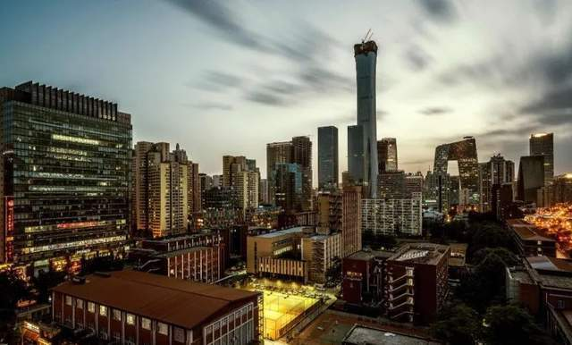

# 北京房价降了吗？

降价10万、仅两个月就向下调价30万……

当前，降价成为北京二手房市场的一大话题。

哪些区域、哪些房源正在降价？后市还将何去何从？

_图/图虫创意_

**上架两个月降价35万元**

国家统计局公布的数据显示，5月份，一线城市二手住宅销售价格环比由上月上涨0.2%转为下降0.4%，其中，北京环比下降0.6%。

对比4月份和5月份来看，北京二手房价的变化可以说是十分明显。

4月份，北京二手房价格环比上涨0.1%，而在随后的5月，北京二手房价格环比下降0.6%，一方面是变化趋势从涨到降，另一方面降幅远大于涨幅。

这样的下降情形，在北京楼市史上较为少见。

中国新闻周刊走访了多家中介门店，在北京市朝阳区潘家园区域，发现不少房源的价格处于下降态势，降幅很多在10万元左右，部分房子价格下调了20万元。

一名房产中介人员告诉中国新闻周刊，从价格来看，一是前期上架的部分房源正在向下调价，另外新上市的房源价格比之前要低。他还注意到，一些刚需买房者更加理性，会选择相对偏一些的新房。

哪些房子降幅更大？

从户型来看，数据显示，在北京二手房中，90平米以下的房子5月份环比下降0.8%，降幅是最大的；90-144平米的房子，降幅相对较小，降幅为0.4%；144平方米以上的二手房降幅为0.1%。

日前，链家北京团结湖区域的一家门店中介人员向中国新闻周刊检索展示了多套房源，这些房源大都是老旧房，基本上每十套房源里就有两三套处于降价的状态。

其中一套80平方米的小三居，今年初报价600万元出头，在半年时间里就已经有4次降价，降了25万元，目前销售价为570多万元。

中指研究院市场研究总监陈文静向中国新闻周刊表示，二手房市场有所分化，比如一些楼龄老、基础设施配套不全的“老破小”出现较大议价空间。当然，即使是老旧小区也出现了分化，一些具备一定资源优势，如优质的教育资源、相对完备的周边配套等“老破小”小区依然受到购房者青睐。

从区域来看，中指研究院监测显示，2023年5月，北京16区中，有11个区域的二手房价环比出现了下降，有五个区域房价环比仍然处于上涨之中。

11个下降的区域主要位于远郊区，比如怀柔、房山、平谷、密云这些远郊区的二手房价降幅居前。其中，平谷二手房价格环比下降0.82%，是北京16个区降价幅度最大的。

对此，陈文静表示，市场潜在购买需求出现下滑，二手房挂牌量处在高位，二手房交易周期逐渐拉长，二手房价格出现松动。

**北京房价要降了吗？**

但要做出北京房价下降的判断，恐怕为时尚早。

从二手房市场来看，尽管5月份二手房价环比出现较大幅度的下跌，但同比来看，今年5月仍然出现了一定幅度的增长。

国家统计局数据显示，今年5月，北京二手房价格同比上涨2.8%。

机构监测数据显示，今年5月北京二手房的成交价格达到了76346元/平方米，同比处于增长态势。从区域来看，在北京16区中，有多个区域的二手房价格比去年出现了上涨，其中朝阳区涨幅为1.65%、东城区涨幅为3.14%。

而在一手房市场，北京市场更是好于整体楼市。

统计数据显示，1—5月，北京市商品房销售面积432.2万平方米，同比增长36.9%，其中住宅销售面积313.7万平方米，增长35.1%。

与此同时，1—5月份，全国商品房销售面积46440万平方米，同比下降0.9%，其中住宅销售面积增长2.3%。

价格上更是如此。5月份，北京新建商品住宅价格环比上涨0.2%，同比上涨4.3%，均保持上涨态势。

更值得关注的是，近期北京土地市场热度较高。

6月14日，北京土地市场共推出三宗住宅用地，两宗位于海淀，一宗位于顺义，结果，三宗地块全部触顶成交，共计成交总价109.94亿元。

6月16日，北京市再推出三块土地，结果再次遭遇抢购。

尤其是亦庄X47地块早在网络报价阶段，就有近30次报价，价格由68.8亿元一直上涨到79.12亿元，已经达到触顶价，随后进入现场竞拍现房销售面积环节，又有多家房企及联合体积极参与竞拍，掀起了当天的拿地高潮。

最终，开拍即触顶的亦庄X47地块被中皋置业有限公司斩获，其竞得条件为成交价79.12亿元+5.3万㎡现房销售。

同一天出让的北京市朝阳奶西地块则吸引了金茂、城建、招商、智地+朝开等报名，最终北京城建以触顶价34.5亿元+1.2万㎡现房销售的条件拿下此地块。此外，北京市石景山广宁村地块吸引了中海新城、保利两家房企竞拍，该地块起始价32.3亿元，地价上限37.145亿元，中海新城和保利两家企业上演了一场拉锯战，最终，保利以36.2亿元拿下该地块，溢价率12.07%。

一家房企投拓部门的人士向中国新闻周刊表示，房企扎堆布局北京市场，看起来是报团取暖，本质上是仍看好北京楼市的前景。

陈文静告诉中国新闻周刊，在这一背景下，当前楼市整体上走弱，尤其是二手房市场面临较大的调整压力，市场上存在结构性压力。

**释放更多合理购房需求**

今年一季度，北京二手住宅成交45815套，较去年第四季度上升49%，较去年同期上升24.2%。其中，3月北京二手住宅成交22192套，环比上升44.9%，同比上升31.14%，单月成交创出多月新高。

相比于去年，今年北京二手房的小阳春更具成色。

但随后的4、5月，北京二手房成交快速下滑，由单月成交2万套降至1万套出头的水平。

对此，陈文静表示，今年年初，北京等重点城市二手房成交量、市场活跃度明显提升，这一方面是因为市场情绪好转，前期积压需求释放、部分考虑子女上学的购房者积极入市；另一方面“带押过户”、一年内换房退个税等政策持续优化，也带动置换需求入市。

上海中原地产研究总监卢文曦对此表示，北京等一线城市今年一季度较高的交易可以确认为季节性反弹，一旦反弹不再，成交价格最后转跌是必然趋势。

他进一步表示，一线城市政策没有明显松动，局部微调不会对交易量产生重大影响。此外，随着市场走弱，对政策的预期落空，因此市场预期进一步减弱。

相比而言，当前北京楼市的购房政策门槛是较高的。

从贷款政策来看，北京目前执行的是认房又认贷，即只要有购房或贷款记录均算作二套，而二套房的贷款利率为5.3—5.5%，这一利率水平也意味着较高的购房成本。

陈文静表示，当前市场上许多改善性购房者需要“卖一买一”，出售原有住房以置换资金及购房资格，当前二手房市场活跃度较弱，置换链条上各个环节的流通速度也在放缓，二手房销售变慢，进入新房市场的潜在需求也将进一步减弱，从而影响整体市场预期和情绪。

在她看来，当前最关键的是促进销售回暖，释放更多合理购房需求，畅通销售链条，稳定购房者和市场预期。政策端来看，目前多数二线、三四线城市限制性政策已较为宽松，核心一二线城市政策仍存在较大空间，这些城市因认房又认贷、二套首付比例高、购房条件严苛、普宅认定标准严等政策，不少合理购房需求被抑制，若政策能及时跟进优化调整，市场情绪将得到有效提振，购房需求入市节奏有望加快，有利于促进行业良性循环。

为此，陈文静建议，核心城市优化普宅认定标准，降低非普宅的首付比例和税费，降低合理购房需求的购房成本和购房门槛。按照一区一策原则，继续优化限购条件、取消认房又认贷政策等，同时结合生育政策，对多孩家庭的限购套数、首付比例、房贷利率、公积金贷款额度等给予支持。

首都经济贸易大学京津冀房地产研究院院长、北京市房地产法学会常务副会长兼秘书长赵秀池向中国新闻周刊表示，中国仍然处于城市化中期阶段，每年大约有1300万人口进城，房地产整体行业发展仍然是有潜力的。为稳定房地产市场，政策端仍需进一步发力，稳定购房者预期和信心。当前不少购房需求被抑制，若政策能及时跟进，市场情绪有望得到改善，二手房市场活跃度也有望提升。

作者：刘德炳

