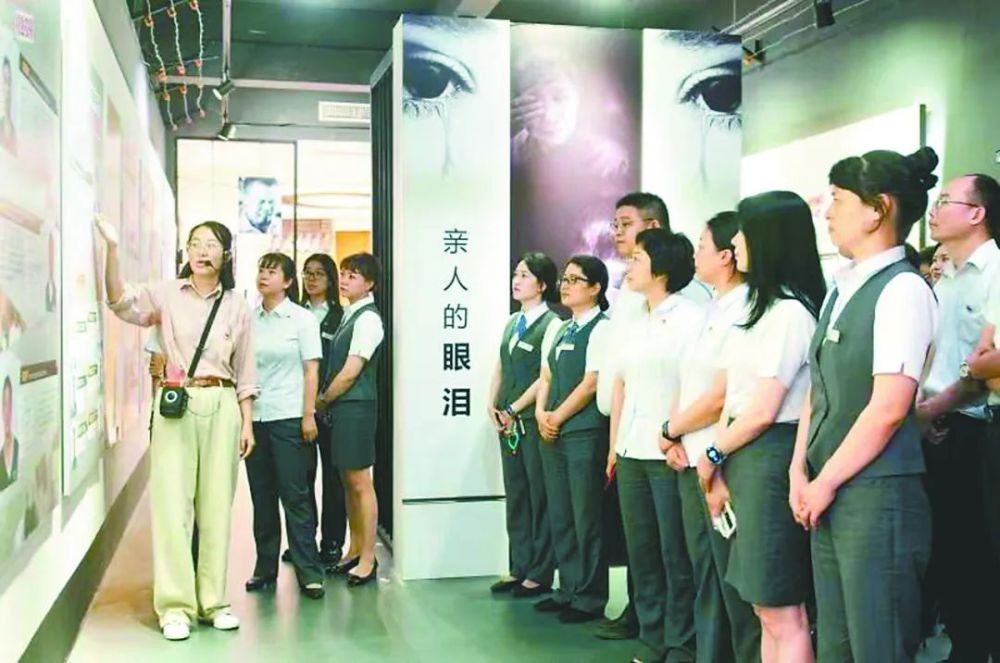

# 多名“90后”干部被查引关注：身处关键岗位，多为满足私欲违纪违法

**中央纪委国家监委网站 李云舒报道**
近日，多名“90后”干部接受审查调查通报引发关注。出生于1994年的河南省民权县人民法院综合办公室工作人员肖遥、出生于1992年的四川省长宁县住房城乡建设和城镇管理局市容管理股副股长刘芳秀、出生于1991年的黑龙江省七台河市茄子河区棚改办原鹿源社区认定组组长田博文……这些正值大好年华的年轻人，先后因涉嫌严重违纪违法接受审查调查。

作为“90后”，他们进入社会的时间并不长，却在事业刚起步的时刻倏然滑向腐败深渊。是什么让他们踏出了错误的第一步？应当如何帮助年轻干部“系好第一颗扣子”，在正确道路上行稳致远？

**身处关键岗位的年轻干部容易成为不法分子重点“围猎”对象**

“身处关键岗位的年轻干部很容易被‘围猎’。”多名纪检监察干部告诉记者，年轻干部通常涉世未深、理想信念未经磨砺，一旦掌握一定权力，便容易成为不法分子重点拉拢对象。

曾繁贤第一次受贿时只有27岁。入职国企重要岗位不到半年，管理服务对象唐某某便给了他6万元好处费。防线既破，从此一发不可收拾，2013年至2022年，曾繁贤在担任平桂城市建设投资有限公司项目部职员、项目二部经理期间，先后69次收受管理服务对象送的香烟、白酒、茶叶、月饼等礼品及礼金、购物卡共计8.7万余元，甚至在被留置前的春节仍未停手。

曾繁贤的经历，是个别年轻干部踏上违纪违法道路的典型： **走上重要岗位、手握一定权力后，被阿谀奉承、吹捧讨好冲昏了头，在权力和物欲中迷失自己。**

**“高学历、能力强的年轻干部往往被安排在重要岗位、关键环节，但因成长经历的局限性，少数干部抵抗诱惑能力和鉴别能力比较弱，极易成为被‘围猎’的对象。”**
浙江省杭州市萧山区监委委员蔡剑平告诉记者。

福建省莆田市秀屿区纪委常委、监委委员顾世雨分析，不法商人倾向于“围猎”年轻干部，主要原因在于， **一方面**
个别年轻干部思想防线不牢，在金钱、情感等多重诱惑下，容易掉入圈套； **另一方面**
“投资”回报率高，高学历的年轻干部很可能成为被重点培养的“领导干部后备军”，发展潜力大，是拉拢成本较低的“潜力股”，值得“趁早下手”。

**网络赌博、网络游戏、高档消费……少数年轻干部在不良嗜好中误入歧途**

除了遭到有心之人“围猎”，还有少数年轻干部在自身的不良嗜好、虚荣心与享乐欲的驱使下误入歧途。

**赌博，是一些年轻干部涉腐案卷的关键词。**
倪亚洲，1995年出生，中国邮政集团有限公司重庆市酉阳县分公司李溪邮政支局原综合柜员。倪亚洲出生在酉阳县浪坪乡的一个小村落，小时候由于家境不好，他的父母不得不离开他外出打工，这让倪亚洲十分向往条件优渥、团圆美满的家庭。
**然而，他却错误地选择通过网络赌博“快速致富”来实现梦想。**

“刚开始，每天能赢几十元，我想在年底就能购车购房，生活上、物质上得到提高，我会有一个幸福的家庭，梦想轻而易举就能成真……”沉迷网络赌博骗局、一次次希望“翻盘”的倪亚洲8次利用职务之便，窃取李溪邮政支局储汇资金共计34.8万元，通过网络赌博输了34.51万元。倪亚洲不仅没能实现自己的梦想，更葬送了前途。2020年9月，25岁的倪亚洲被开除公职；2020年12月，倪亚洲被判处有期徒刑一年十个月，并处罚金十万元。

**网络游戏“氪金”，也成为少数年轻干部深陷的泥沼。**
四川省泸州市公安局纳溪区分局刑侦大队原四级警长孙冰洁，家庭相对殷实。沉迷网络游戏和高档享受，是他滑落深渊的第一步。

“我花费大量时间和金钱在网络游戏上，在玩游戏的过程中花费高达百万元。”在忏悔书中，孙冰洁这样自述。长时间沉迷网络游戏，使他丧失了理想信念和工作激情，特别是在认识了建材老板欧某、陈某等人后，虚荣心、享乐欲更加膨胀，长期在各大酒店享受高档消费，出入歌舞娱乐场所，短短几年时间就欠下了300余万元的高额债务。

由于毫无节制的“超级享受”，孙冰洁只有靠着透支信用卡、网络贷款和向亲朋好友借款度日。虽然其父中途帮忙偿还了200余万元，但剩下的100余万元依旧压得他喘不过气来。
**由于资不抵债，孙冰洁竟试图利用主审专案涉案人员工作之便“靠案吃案”，以帮助聘请律师、为涉案人员提供便利等理由索要财物。**
2021年2月，孙冰洁受到开除党籍、开除公职处分；同年12月，他被判处有期徒刑七年六个月，并处罚金人民币五十万元。

“年轻干部起步早、成长快、思维活跃，但少数年轻干部在面对复杂社会思潮时容易犯糊涂，追求低级趣味，甚至开始违法犯罪。”蔡剑平表示，
**年轻干部腐败表现存在一定共性，例如贪腐资金主要用于奢侈品、兴趣爱好方面的个人高消费，也出现了网络赌博、网游充值、直播打赏等用途。**

**年轻干部党性锻炼、社会阅历、基层历练相对不足，受到不良诱惑或遭遇挫折时或因心态失衡而“偏航”**

浙江省玉环市纪委监委案件监督管理室主任杨春建告诉记者，年轻干部违纪违法案件呈现几个明显特点： **身处关键岗位，贪腐目的“单纯”，具有较强隐蔽性。**

**从查处的违纪违法案件看，年轻干部违纪违法目的相对“直接”，大多表现为赤裸裸地拿金钱满足私欲，与其年龄层级、心理状态有直接关联。**
有的是因为热衷攀比，入不敷出；有的是沾染不良嗜好，拆东墙补西墙，从而走上受贿或挪用公款的不归路。

随着社会发展变化，年轻干部违法犯罪采取的作案手法也更加多样化。“不少年轻干部受教育程度高，学习能力强，善于运用信息化手段，
**因此更多表现为‘单独作案’，违纪违法行为存在较强的隐蔽性，为发现和查处带来较大挑战。** ”杨春建说。

**年轻干部走上歪路的原因有哪些？**
江苏省连云港市纪委宣传部副部长王大明分析：“年轻干部大多是从‘家门’到‘校门’再到‘机关门’，一些年轻干部在上学、就业、晋升等方面一帆风顺，认为自己能力很强，
**但实际上党性锻炼、社会阅历、基层历练相对不足，容易受到不良诱惑的侵袭，遇到挫折时可能难以自我调节，从而心态失衡走上违纪违法道路。** ”

**另一方面，一些年轻干部刚刚走出校园，往往急于融入“小圈子”寻找归属感，不懂得拒绝他人不合理的要求。**

“年轻干部刚参加工作的时期是可塑性最强的阶段，直接影响干部的价值观与人生观，进入单位常常会有资历较深的党员干部以师傅的身份对年轻干部进行指导，一旦师傅自身不正领错了路，会直接导致‘上梁不正下梁歪’。”杭州市富阳区纪委监委党风政风监督室主任孙洪说。

**此外，部分单位重使用、轻监管，管理存在漏洞，也让年轻干部的“偏航”之举得不到及时纠正。**
“比如，有的单位把公章交由年轻干部保管，任其滥用却无人过问；有的单位会计和出纳由年轻干部一人兼任，领导审批形同虚设；还有的单位只是把制度挂在墙上、写在纸上，根本起不到监管作用。”浙江省龙游县纪委监委相关负责同志表示，一些单位的主要领导疏于履行监管责任，还美其名曰“对年轻干部充分信任”，实则是给年轻干部的成长之路挖下了深坑、埋下了隐患。

**对年轻干部要重视培养，更要加强教育、强化约束**

二十届中央纪委二次全会强调，要高度重视年轻领导干部纪律教育。对年轻干部要重视培养，更要加强教育、强化约束，在严管厚爱中激励年轻干部担当作为。

**入职教育是年轻干部向公职人员身份转变的第一阶段，也是扣好廉洁从政“第一颗扣子”的关键时期。**
杭州市富阳区纪委监委聚焦干部入职“黄金期”，实施“青蓝工程”，要求各单位作风过硬的优秀骨干与新入职年轻干部“一对一”师徒结对，既带业务更带作风。同时，将《廉心向未来》等警示教育书籍和《扣好廉洁从政“第一粒扣子”》等警示教育片加入区委党校培训课程体系，从公务员入职培训起就上好廉洁从业第一课。

_浙江省温岭市纪委监委坚持把加强年轻干部教育管理监督放在突出位置，常态化组织新提拔任用的年轻干部参观廉政警示教育基地，以身边案警示教育身边人，强化年轻干部纪律规矩意识，引导年轻干部扣好廉洁从政“第一颗扣子”。图为该市金融系统年轻干部参观市反腐倡廉暨预防职务犯罪教育中心。彭松云
摄_

**年轻干部的日常教育管理监督是一项系统工程。**
山东省济宁市任城区纪委监委把对年轻干部监督纳入日常监督的重点，督促各级各部门党委（党组）认真履行主体责任，加强对重点岗位年轻干部的监督。同时，坚持以案示警，用身边典型案例作为警示教育的“活教材”，持续开展以身边事警示教育身边人活动。组织“运河清风”宣讲团针对年轻干部特点开展“订单式”宣讲活动12场次，教育年轻干部2100余人。

**严明纪律规矩，筑牢廉洁防线。**
浙江省江山市制定实施《江山市完善容错免责机制激励干部担当作为的实施办法（试行）》《关心关爱干部暖心八条举措》，护航年轻干部健康成长。搭建清廉实践“大平台”，制定实施《关于选派优秀干部到市委巡察岗位实践锻炼的实施办法（试行）》，让年轻干部在巡察实践中看清一些事情该不该做、能不能干，时刻自重自省，严守纪法规矩。

**此外，对于违纪情节较轻、受到处分的年轻干部，做好帮扶教育，让他们尽快地“站起来”“赶上来”。**
浙江省玉环市纪委监委建立常态化回访教育机制，为受处分的年轻干部建立“一人一档”，分层分类落实帮扶，对整改到位、表现优秀的年轻干部，出具推荐使用建议，激发年轻干部知错改错后担当作为的信心。

