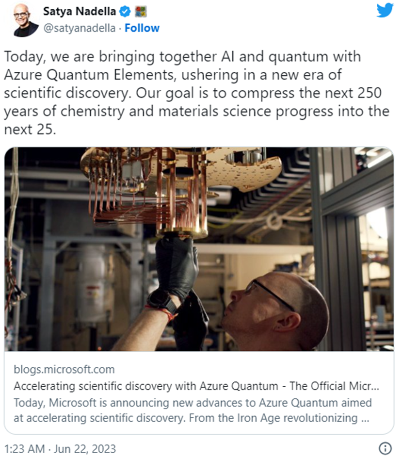

# 微软量子计算机有望十年内问世，声称能把250年的科研时间压缩到25年

财联社6月25日讯 微软本周三公布了其构建第一台量子超级计算机的路线图。据微软高级量子开发副总裁Krysta
Svore称，微软希望在十年内将这一超级计算机打造出来。

Sovre称这将是一项艰巨的任务，但也将成为微软的壮举，该计算机每秒预计可以进行一百万次量子操作。

量子计算机的工作原理是用量子位取代传统位，相较于传统方法用1和0来标记数据，量子计算机的单一量子可以同时处于两种物理状态，同时为1或0。

直观地看，传统计算机想要找出四位数中的某一组数字，需要最多尝试16次，平均尝试8次。而量子运算却可以在4次运算中直接得到16种可能性，大大缩短了计算时间。

强大的运算速度和能力也让量子计算机成为全球科学界和产业界竞相追逐的前沿技术。

2019年，谷歌率先宣布其Sycamore量子计算机能够在200秒内解决普通计算机花费一万年才能解决的问题；一年后，中科大发表论文，透露其建造的量子计算机计算速度比谷歌的机器快出100亿倍。

各国科研团队都在更新量子计算机的计算能力，而微软是最新公开其成果的那一家。

新技术

微软最新发表的论文（经美国物理学会刊物物理评论B的同行审阅）中指出，其开发出了一种新型的、基于马约拉纳的量子比特，这是一种量子超级计算机的基本组成部分，且更稳定，也更容易扩展，从而需要更少的量子位。

微软实际上花了相当长的时间来实现这一突破，不过，在微软看来，这是创建可靠实用的量子超级计算机里程上的第一个丰碑，标志着量子超级计算机将帮助解决地球上最困难问题的重要时刻。

微软首席执行官Satya Nadella则称，公司的目标是将化学和材料科学需要花费的研究时间，由250年压缩到25年。

而除了量子计算机之外，微软还推出了Azure Quantum
Elements，旨在通过人工智能和量子计算技术来帮助科学发现。Nadella所说的目标其中也包含了人工智能的辅助作用。

现在，微软需要在硬件上实现量子位的支持，但这并非太大的难题。微软这一份公告，除了展示自己的量子力量，另一方面也是在提醒客户和相关利益方：是时候入局了。

（财联社 马兰）

