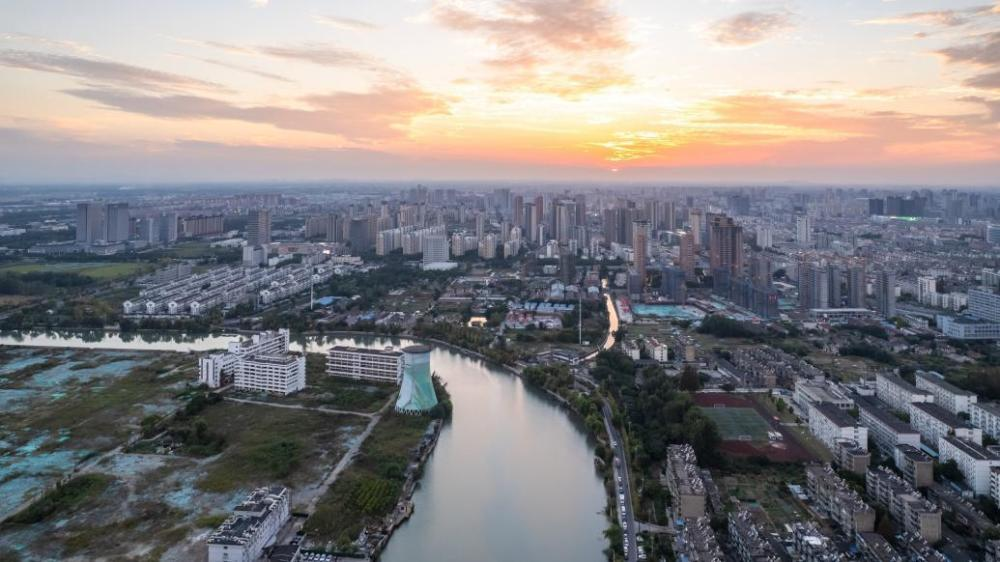

# 江苏扬州：在市区买改善性住房取消限购，其原有住房无需三年限售

据扬州发布6月25日消息，近日，扬州市住建局经与市财政、税务、资规、人民银行、银保监和住房公积金管理中心等多部门会商，自7月1日起，《关于促进市区房地产市场平稳健康发展的通知》正式实施，施行期1年，实施范围覆盖了扬州全部市区。

《通知》共8条措施，对市区过往部分政策进行了延续和优化，旨在认真贯彻落实党中央、国务院和省委、省政府决策部署，坚持“房住不炒”的定位，切实满足群众的合理住房需求，进一步做好稳地价、稳房价、稳预期工作，促进市区房地产市场平稳健康发展。

《通知》第1条提出：“在市区购买改善性住房的，不再执行限购政策，其原有住房不再执行限售政策。”

扬州市住建局房屋产权和交易管理中心相关负责人介绍，结合群众的多样化住房需求，该条政策旨在支持对住房有“以旧换新”“以小换大”等改善需求的家庭，一定程度上减轻其购房负担，进一步激发二手房市场活力。对于有住房改善性需求的客群，随着其在市区购入改善性住房，凭新签订的商品房购房合同，在持有原有房屋不动产权证书的基础上，可直接出售原房屋，不再执行原先网签三年限售规定。

同时，推广二手房按揭贷款“带押过户”模式。扬州市住建局上述负责人介绍，去年底，市区开始实施二手房“带抵押过户”业务。今年更大力度推广二手房“带押过户”模式，为市民买卖“二手房”提供更多便利。

通知还明确继续执行人才购房补贴政策，通知第4条提出：“继续执行在扬来扬大专及以上人才购买首套商品住房（含二手商品住房），给予所缴纳契税100%的一次性购房补贴政策；继续执行现行市区各地制定的支持人才和二孩以上家庭购房补贴政策。”

据了解，2023年2月20日，根据扬州市住建局出台的《关于积极支持刚需和改善性住房需求的通知》(扬建房【2023】7号)，2023年2月20日-2023年6月30日期间，对在扬来扬大专及以上人才在市区购买首套商品住房（含二手商品住房），给予所缴纳契税100%的一次性购房补贴。该项政策的延续，将继续帮助大专及以上刚需客群直接降低购房成本，满足群众美好购房愿景。

住房公积金贷款额度方面，《通知》第2条提出：“阶段性上调住房公积金贷款最高额度，缴存人在市区购买自住商品房且符合住房公积金贷款条件的，单缴存人、双缴存人的住房公积金贷款最高额度阶段性上调至60万元、100万元；多子女家庭住房公积金贷款额度支持政策根据调整后的贷款最高额度进行相应上浮。”

扬州市住房公积金管理中心相关负责人介绍，为进一步支持刚需和改善性住房需求，结合我市实际，在2023年6月30日前阶段性上调全市公积金贷款最高额度。

按照规定，2023年7月1日-2024年6月30日，全市各县(市、区)单缴存人、双缴存人的住房公积金贷款最高额度阶段性上调至60万元、100万元。多子女家庭住房公积金贷款额度支持政策则根据调整后的全市公积金贷款最高额度进行相应上浮。原扬州市人才贷款额度政策到期不再延续执行。

同时，住房公积金缴存人购买市区新建商品住房且符合购房提取条件的，在购房合同网签备案后，可申请提取个人住房公积金账户余额作为购房前期资金。

对房企而言，通知还调整优化居住地块规划管理的适用时间。通知提出：“将《关于助企纾困优化居住地块规划管理要求的通知》适用时间范围扩大至2018年1月份之后出让的非高品质居住地块。”

据悉，为进一步助企纾困，缓解企业去除库存的压力，2022年10月30日，市自然资源和规划局联合市住建局、市城管局共同出台了《关于助企纾困优化居住地块规划管理要求的通知》，对市区范围内已出让的非高品质居住地块规划管理从调优复式住宅公共空间，居住区配套设施容积率计算等四个方面深化落实市政府房企恳谈会的相关要求，适用时间范围为2020年10月30日以后已出让的非高品质住宅项目。

通知还提出土地招拍挂增加银行保函。通知提出，在土地招拍挂活动中增加银行保函（见索即付型）作为竞买人参加土地竞买的履约保证方式；继续延长土地出让金分期缴纳时限至6个月。

同时，支持各银行机构与房地产企业基于商业性原则自主协商，对房企存量贷款通过展期、调整还款安排等方式给予支持，并进一步优化审批流程，缩短审批期限。继续开展保函置换预售资金业务等。

