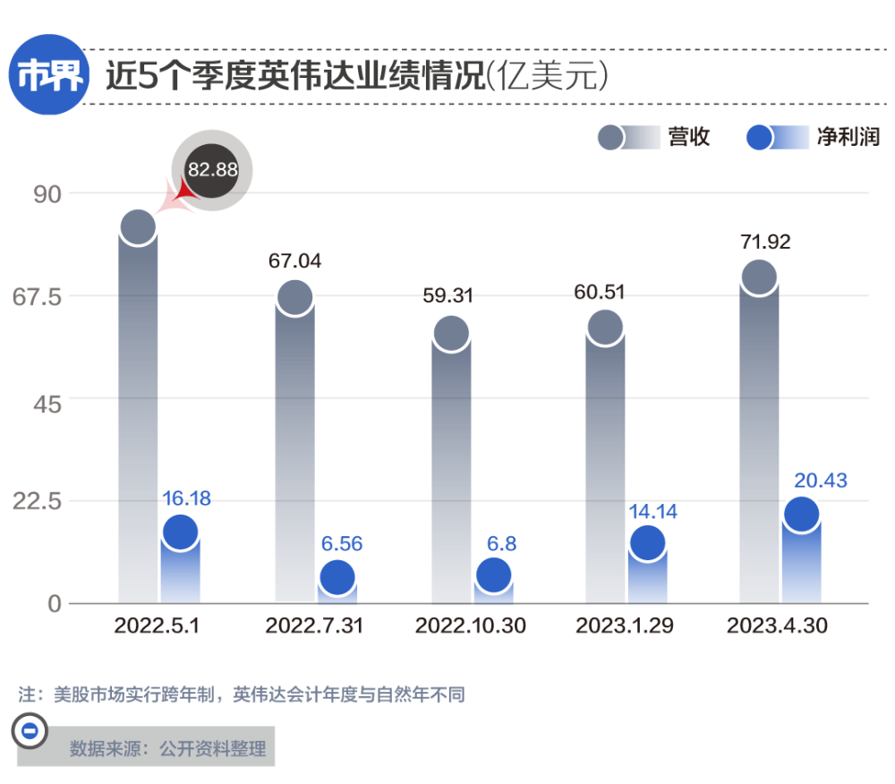
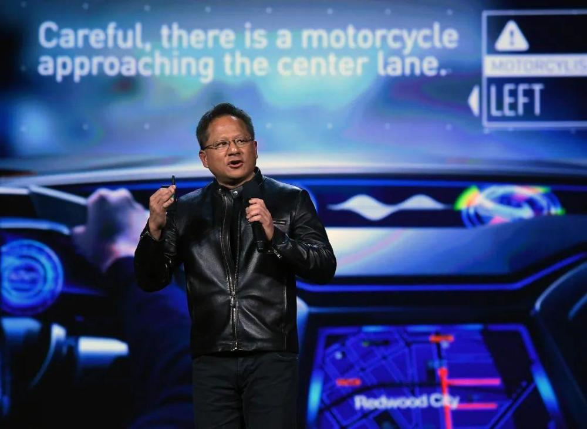

# 疯抢AI芯片：机房拆旧货，一片卖10万

01、像卖爱马仕一样卖芯片

今年以来，大模型和AI
2.0既是最火热的创富梦，也越来越成为一个昂贵的“权力的游戏”。在技术、资本、人才等构建出的种种门槛中，还有一张重要的入场门票——你有没有“门路”能搞到足够的英伟达高端显卡。

王非是华东地区一家服务器定制企业的销售部经理，他向「市界」描述了最近英伟达显卡的紧俏程度：“需求太火爆，有些人从机房里把芯片禁运政策生效前购买的A100
80GB拆出来倒卖。”这些旧芯片不只没有保修，相比于去年8月前后8万多元的单价，价格还涨到了10万多元。

即便已经旧货拆卖、物尽其用，显卡的供应还是严重不足。“需要拿现款去，对方才愿意卖给你。”而相对显存较小、训练效率低的A100
40GB即便有全新的，也乏人问津。“询价的多，成交的少。”

具体而言，这批抢手的显卡指的是英伟达旗下的“Tesla”系列产品。在训练AI大模型时，比传统CPU更高效的GPU（图形处理器，又称显示芯片），尤其是高端GPU一芯难求。

2020年和2022年，英伟达先后推出了A100芯片、H100芯片，其中A100显卡又提供80GB、40GB两个显存版本，H100则提供80GB显存。显存越大，所能运行的神经网络也就越大。

2022年9月开始，美国禁止英伟达等向中国出口高端GPU芯片。为应对禁运政策，英伟达又在2022年和2023年分别推出了特供中国版的显卡A800和H800。

不过如今，在政策允许范围内的A800芯片，在市场上也出现了供货周期拉长、价格上浮的现象。王非透露：“在大模型火爆之前，A800大概两周即可到货。但现在我跟客户保守估计要在8周内，即便是最乐观的情况，也需要4-6周。”

供职于北京一家显卡分销企业的郭丽婕对「市界」表示：现在公司的A800单卡报价为8.75万元，已经超出了A800在2022年11月时8万-8.5万元的价格区间。而且，8.75万元只是实时报价，显卡还有继续涨价的趋势。“我告诉客户确定要了再找我聊，现在的库存也不多。”

另一家位于深圳的显卡供应商，则给A800开出了8.95万元的报价——更高的溢价意味着等待时间较短，需要大约两周的货期。

作为算力基础设施，竞购英伟达高端显卡芯片已经成了一种“抢跑游戏”。而决定AI创业公司成败的要素之一，“就是你到底有没有能力调动最起码100张以上的英伟达显卡。”一家AI创业公司负责人对「市界」讲到。

他透露：“在去年8月之前，通过国内正规渠道，还能买到A100显卡，也可以采购海外版A100。在此之后，国内A100被切断了货源，从海外采购海关也不会放行。”

不过那些允许被特供中国的A800和H800芯片对于紧缺算力的AI中小公司而言，同样是遥不可及。

王非透露：“一般来说英伟达的货先到国内总代，再被我们这类厂家分走，销售给做AIGC项目的客户。目前H800虽然已经发售，预计单卡售价会在20万起，也没有进入我们这一级市场。现在能拿到H800的，应该只有阿里云、腾讯云这种有资格从英伟达原厂直接采购的大厂商。”

在市场紧俏的背景下，H800等高端芯片已经提前被大厂包揽。目前，国内仅有腾讯云官宣“用上”了H800。4月14日，腾讯云发布了基于H800的大规模算力集群，并将其定义为H800的“全国首发”。

据《晚点 LatePost》了解，字节今年向英伟达订购了超过 10 亿美元的 GPU，仅字节一家公司今年的订单可能已接近英伟达去年在中国销售的商用 GPU
总和。大公司的合作方式主要是和英伟达原厂直接谈采购，能否抢到卡，更多是看商业关系，比如以往是不是英伟达的大客户。

而在庞大的需求面前，据传英伟达甚至开始学起了爱马仕，在购买抢手的 GPU 时，也需购买其它产品作为取得优先供应权的“配货”。

在这场大模型研发竞速赛中，相比超级大厂，更多小玩家只能先把名字写进等待名单。而无论哪一方历经荡涤、最终胜出，作为算力供应者的英伟达都能稳拿订单，笑到最后。

02、黄仁勋的运气有多好？

在商界一直有一种说法：当淘金者蜂拥而至时，获得财富就变成了小概率事件。最后挣到钱的，更可能是站在淘金者身边“卖铲子”的人。

一位科技赛道的投资人对「市界」回忆：在前几年的AI行业资本寒冬中，“泡沫破灭时，投资人和企业突然意识到，（算法创业）成本极高，都是在亏钱，反而让上游赚钱了。”

而在AI这个近年来最大的科技风口面前，英伟达便是那个第一批站在上游、得以幸运“起飞”的公司。

在今年5月举办的英伟达业绩电话会上，英伟达创始人、总裁兼CEO黄仁勋直言：今年1月以来出现的新产品需求“不可思议地陡峭”，公司订单“多到难以置信”。

不仅市场对英伟达产品疯狂竞逐，资本也展现出了慷慨的态度。5月30日，英伟达成为全球首家市值突破万亿美元的芯片设计商。

_▲(2015年至今英伟达股价走势图)_

当有记者向黄仁勋提问：“（在新一轮AI浪潮中）英伟达获得的丰厚回报是因为运气，还是因为有先见之明？”黄仁勋并不讳言英伟达人气暴涨的“运气”成分：“我们只是相信总有一天会有新的东西发生，其余的需要一些偶然性。”

如今已经无人在意，短短一年之前，英伟达还陷在营收不及预期、股价滑坡的漩涡之中。如果没有AIGC的“天降神力”，看上去这将是一个已发生过无数次的“商业先行者”遗憾折戟的故事。

过去数年间，英伟达的高端显卡更多被用于PC游戏和虚拟货币“挖矿”之上。疫情之下，受益于消费电子需求暴增，英伟达股价也随之连番上涨。2021年，英伟达股价最高升至300多美元，创历史高点。

但进入到了后疫情时代，随着游戏市场遇冷，叠加虚拟货币持续波动，2023财年的前三个季度中，英伟达营收连续下滑，净利润大幅缩水。与之相应的，公司股价在2022年8月，跌至了年内最低的每股108美元。与2021年高点相比，市值仅余三分之一。

不过，到了2022年底，随着ChatGPT横空出世，英伟达一举扭转颓势，成为了被全球追捧的明星。截至6月23日美股收盘，英伟达股价已升至422.90美元。

在英伟达一飞冲天的同时，人们开始追溯，这是否是一个关于决策者“深谋远虑”的故事。而黄仁勋本人对此的定义是：“这不是先见之明。先见之明是加速计算。”

因为在某种程度上，用GPU训练AI模型的历史正是由英伟达开启的。

2010年，据媒体报道，英伟达首席科学家兼高级研究副总裁Bill
Dally与其好友、全球AI领域权威学者吴恩达某天在咖啡店里共进早餐。彼时，吴恩达正在谷歌进行AI研究，但在推进课题过程中遇到了算力不足问题。

如果想要补上吴恩达团队面临的算力缺口，谷歌需要新购置约1.6万块CPU（中央处理单元）。以英特尔在2010年发布的服务器CPU产品至强X5680为例，后者当年的单价约为1666美元，1.6万块合计需要约2700万美元。

这笔预算足够让吴恩达的研究胎死腹中。据数据分析机构“PitchBook”调研，2010年全球AI和机器学习领域获得的风险投资还不足5亿美元。

Bill
Dally听说了吴恩达的烦恼后，建议他用英伟达的GPU替代CPU来进行AI训练。由于CPU采用串行计算方式，更擅长逻辑控制，但数据处理效率较低。而英伟达的GPU产品采用了其自研的并行计算架构“CUDA”，能够将任务分解成若干部分同时解决。最终，吴恩达团队果然仅用48块GPU并联，就解决了问题。

在此之后，越来越多的研究团队开始将英伟达芯片用于AI训练使用。而黄仁勋也在看到AI市场的巨大机遇后，从2012年开始，将AI列为了重要的发展方向。

某种程度上，在10年前AI落地应用还是模糊一片的背景下，便在深度学习层面开始布局，确实代表了黄仁勋的“先见之明”。

就职于硅谷某AI芯片独角兽公司的Lee对「市界」讲到：对芯片企业而言，在2012年投入深度学习的计算是一个非常难得的选择。据他回忆：“2012年是大数据时代的巅峰，最赚钱的市场是互联网数据库、文件系统等等，做深度学习可以说是‘冷板凳’。而且英伟达是围绕着深度学习的主题进行全方位、点点滴滴的下注，包括完善语言设计、开发者工具等周边软件工具。”

03、国产GPU奋力追赶

对于英伟达的成功原因，黄仁勋曾这样总结：“我们很早地，大约在10年前就发现，（AI）这种制作软件的方式可以改变一切。我们从底层一直到顶层，从各个角度改变了公司。”

从2016年开始，英伟达旗下的加速计算GPU产品线（代号“Tesla”）开始专门针对AI训练任务进行设计。这一年推出的芯片型号为P100，同时配备有英伟达新研发的高速互联技术“NVLink”。而NVLink能够允许CPU、GPU芯片间进行高速交互，进一步提升了运算效率。

从底层到顶层搭建起的软硬件产品生态，也是英伟达在这轮AI风口，因其长期布局和最大的确定性，得以受到资本热捧的原因。但从市场、技术等角度考虑，英伟达当下构建的“算力帝国”也还远远谈不上固若金汤。

根据2023财年财报显示，中国是英伟达的第一大目标市场，英伟达在中国市场实现的营收占其全球市场营收的47%。而在政策限制下，英伟达难以向中国市场销售A100、H100高端芯片，无疑将对其营收造成重击。

黄仁勋个人，从不掩饰对于中国市场的期望。5月底他在接受《金融时报》采访时，抱怨美国政府对于半导体技术的出口限制使得英伟达束手束脚，警告持续升级的中美芯片战将令美国科技业面临遭受“巨大损害”的风险。“如果失去了中国市场，我们并没有应急计划。因为世界上没有其他中国，中国只有一个。”

但在英伟达高端显卡出口受阻的态势下，许多中国客户不得不转向其他选择。而细细数来，市场中英伟达的挑战者并不少。

王非告诉「市界」：“我一些做AIGC项目的客户选择了海光的国产显卡DCU Z100L。据我所知，海光的产品目前已经用到了多个国产大模型里。”

另一位大模型应用层的创业者则透露，由于买不到A800，其所在的团队紧急购置了一批英伟达的消费级显卡GeForce RTX
4090，“未来会考虑其他选择，或者更多配置云计算资源”。

在供应端，天数智芯、摩尔线程等国产GPU厂商已经开始积极推动产品落地于大模型训练领域。

6月10日，天数智芯对外宣布，经过验证，其研发的国内首款量产的通用GPU“天垓100”具备支持百亿级参数大模型训练的能力。据称，在天垓100加速卡的算力集群支持下，北京智源研究院70亿参数的“Aquila”语言基础模型完成了参数优化工作。6月上旬，摩尔线程则宣布其已经完成对智源研究院“悟道·天鹰”大模型的推理兼容适配，整个适配过程仅花费不到6小时时间。

除了国产GPU玩家，“AI芯片第一股”寒武纪、阿里巴巴旗下芯片企业“平头哥”的产品同样可以用于运行AI相关任务。

6月19日，“国产CPU第一股”龙芯中科在投资者交流平台公开表示，其已完成通用GPU相关IP设计，预计第一个集成自研通用GPU核心的SOC芯片（系统级芯片）计划于2024年Q1流片，在此基础上将研制兼顾显卡和计算加速卡功能的通用GPU芯片，计划于2024年下半年流片。

服务器厂商南京坤前计算机的一位客户经理总结道，在AIGC等大模型应用领域中，国产产品已经可以部分满足客户需求。他讲道：“不仅是现在，在未来的一段时间内英伟达GPU供不应求也是可预见的，但我认为不必过于追求英伟达。只要算力集群足够大，国产卡也够用，就算国产卡带宽少一点，运算的时间多一点，起码可以实现自主。”

此外，从6月上旬开始，市场便不断传出知名资管机构与大股东对英伟达的减持计划。实际上，英伟达“算力帝国”的缝隙也已经开始显现。

6月6日，背后站着老牌欧洲金融世家罗斯柴尔德家族、管理资产近900亿美元的爱德蒙得洛希尔资产管理公司透露，已经将部分英伟达头寸获利了结。主要原因是：AI估值太高，越来越不确定。如果估值继续上涨，机构会变得谨慎。知名投资估值专家Aswath
Damodaran也表示，卖掉了英伟达的股票，因为“这轮上涨太惊人”。

事实上，黄仁勋自己便可能是硅谷最具危机感的企业家，他曾多次公开提到：“我一直认为我们距离倒闭只有30天的时间。”最近，他也在采访中表达了担心：认为在英伟达因政策而“缺席”的这段时间，中国的GPU初创企业会很快追赶上来。

（文中王非、郭丽婕为化名）

作者 | 董温淑

编辑 | 李 原

运营 | 刘 珊

