# 白俄罗斯总统打了几通电话，“瓦格纳”掉头撤了

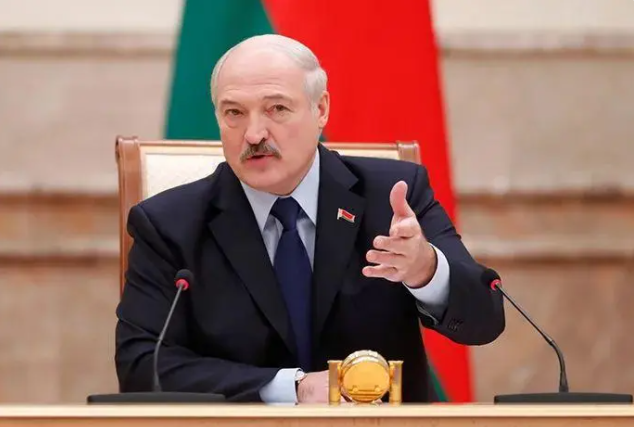

_调停者卢卡申科，不简单。_

作者：冯璐 余奇瑶

美编：徐雪梅

刚刚过去的48小时，世界的眼光紧盯着俄罗斯。

俄雇佣兵集团“瓦格纳”突然出事，做出向莫斯科开进的动作。俄官方将其定性为“叛乱”，对“瓦格纳”创始人普里戈任“刑事立案”，多地进入紧急状态和“反恐”模式。

一夜间，俄罗斯似乎“山雨欲来风满楼”。

但也是转眼间，随着白俄罗斯总统卢卡申科的介入，突如其来的风波旋风般收场，“且无云气亦无雷”。“瓦格纳”收兵，普里戈任则获“撤案”，并将离开。

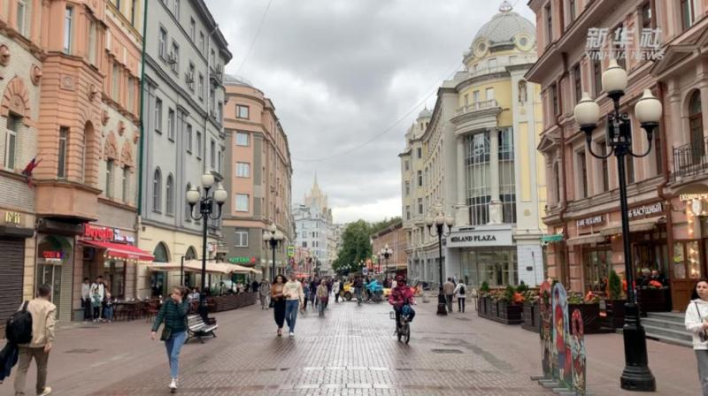

_·6月24日的莫斯科街头。（图源：新华社）_

调停者卢卡申科，不简单。

**打了几通电话**

6月24日，“我们正面对一场叛乱！”俄总统普京发表全国电视讲话，为“瓦格纳”的行动定性。普里戈任则辩称，自己并非发动“叛乱”，而是进行“正义的游行”。

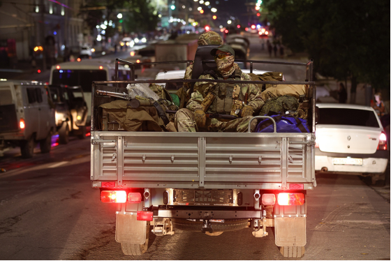

_·"瓦格纳”集团武装人员在俄罗斯顿河畔罗斯托夫的军用车辆上。_

剑拔弩张之时，普里戈任接到了卢卡申科的电话谈判邀请。

卢卡申科向普里戈任提出建议，劝他停止“瓦格纳”武装人员在俄罗斯领土上的行动，并采取进一步措施，缓解紧张局势。

与此同时，卢卡申科也提出了对普里戈任方面“绝对有利”也可以接受的解决方案。按这一方案，“瓦格纳”部队的安全可以得到保障。

在局势出现进一步升级、造成更大损失前，普里戈任最终接受了卢卡申科的提议。双方达成了“不允许在俄领土上发动血腥屠杀”的共识，让外界松了口气。

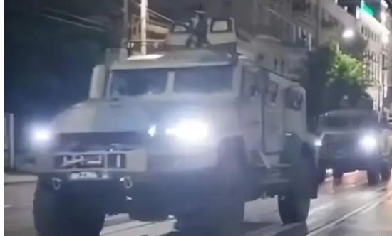

_·"瓦格纳”集团车队撤离画面。_

卢卡申科出面斡旋前，普京向他介绍了“瓦格纳”在俄南部的情况。双方同意采取联合行动，应对复杂的局势。

据俄媒引述俄总统新闻秘书佩斯科夫的话说：“最高目标是避免流血事件和内部对峙，同时也避免遭遇不可预测的结果。为了这些目标，卢卡申科努力进行调停，普京总统也作出相应的决定。”

当晚9时，卢卡申科再次同普京通电话，向普京介绍了与普里戈任谈判的情况。普京对卢卡申科所作的工作表示支持和感谢。这一次，两人谈话持续的时间非常长，谈得“坦率、亲切且极具建设性”。

此外，普京分别同乌兹别克斯坦总统米尔济约耶夫、哈萨克斯坦总统托卡耶夫通电话。同一天，普京还与亚美尼亚总理帕希尼扬通电话，向其详细通报了所发生的情况，并讨论俄国内局势。

根据卢卡申科斡旋达成的协议，针对普里戈任“叛乱”的“刑事立案”将被撤销，普里戈任将移居白俄罗斯。

事件起因之一是，普里戈任拒绝了俄国防部要求“瓦格纳”等雇佣兵组织签署服役合同，纳入俄军指挥系统。现在，拒绝参与“叛乱”的“瓦格纳”人员将与俄国防部签署服役合同。

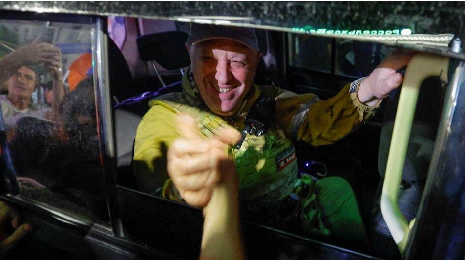

_·普里戈任笑着离开罗斯托夫。_

考虑到“瓦格纳”在对乌特别军事行动中的参与，其余“瓦格纳”人员也不会被追责。

当地时间25日凌晨，俄罗斯所有联邦公路交通管制的措施均被取消。普里戈任与“瓦格纳”武装人员已全部从俄南部军区司令部撤离，前往其野战营地。

公开画面显示，普里戈任坐在车中，与送别者握手。他在社交媒体上发布消息说：“我意识到让俄罗斯人流血所需承担的责任，因此我们调转车队，按计划开始返回前线营地。”

据俄媒报道，6月25日，俄沃罗涅日州州长古谢夫在社交网络上发布消息称，“瓦格纳”私人军事集团部队正完成经过沃罗涅日州的行进，没有破坏社会秩序的行为。

俄总统发言人佩斯科夫说，“瓦格纳”事件不会影响乌境内的特别军事行动进程。

**老朋友和老熟人**

为什么卢卡申科能谈妥此事？首先自然是他和普京交情深。卢卡申科曾公开表示：“有人嫉妒我和普京频繁会面。”

2018年，卢卡申科访问俄罗斯，在克里姆林宫会晤普京，两人热情拥抱，大秀“兄弟情”。

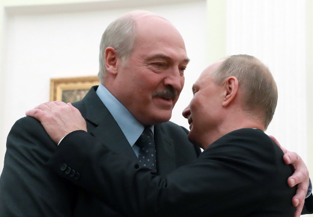

_·当地时间2018年12月29日，卢卡申科和普京在克里姆林宫会晤。_

2019年，卢卡申科应普京邀请，一起去索契滑雪。两人一起尝试了两条蓝色滑雪道，每条一公里左右，共同滑雪长达一小时。

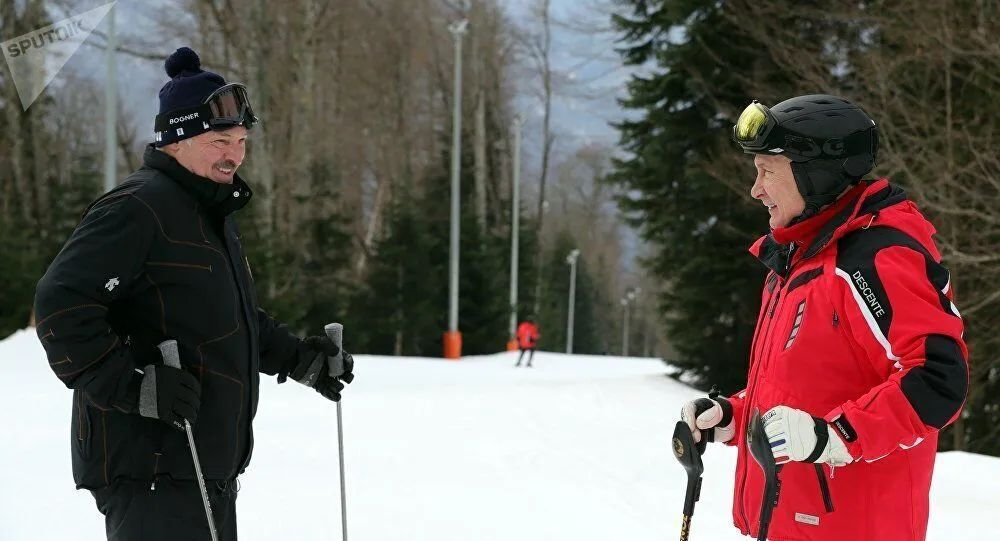

_·普京（右）和卢卡申科（左）一起滑雪。_

2021年，普京与卢卡申科身穿白色球衣，参加了在圣彼得堡郊区一冰球场举行的友谊赛。

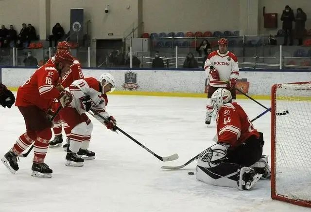

2022年，普京70大寿，卢卡申科准备了一辆“白俄罗斯”牌拖拉机作为礼物。

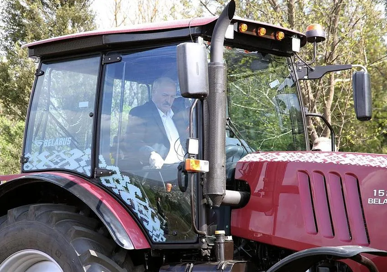

_·卢卡申科开拖拉机。_

普京和卢卡申科有私交，更是政治盟友。2020年，白俄罗斯大选后发生动荡，普京向卢卡申科提供了重要的支持。乌克兰危机发生后，俄白两国在军事、金融等方面都有合作。白俄罗斯已同意将在领土上部署俄战术核武器。

今年6月，卢卡申科在向普京祝贺“俄罗斯日”的信件中表示：“我相信，通过数个世纪友谊和兄弟情谊、我们的共同努力所连接的明斯克和莫斯科的关系将继续稳步扩大和加深。”

卢卡申科和普京是“老朋友”，和普里戈任也是“老熟人”。

佩斯科夫说：“为什么是卢卡申科总统（成为调停人）？事情是这样的，卢卡申科个人认识普里戈任很久了，大约20年，这是他个人的提议，并与普京总统协调。”

暨南大学国际战略传播研究中心主任吴非告诉《环球人物》记者，卢卡申科在上世纪70年代曾在苏军服役，当时白俄罗斯和俄罗斯都是苏联的加盟共和国。他对军队系统很熟悉。而“瓦格纳”很多成员是俄罗斯的退伍军人。这是他作为调停者不容忽视的一个背景。

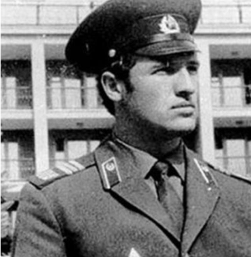

_·年轻时的卢卡申科。_

此外，“瓦格纳”是雇佣军，为客户提供安全服务。卢卡申科和普里戈任如果在工作中有交集也不奇怪。2020年白俄罗斯大选期间，发生过这样一件事：32名“瓦格纳”人员在白俄罗斯首都明斯克郊外被拘留。白方曾指控这些人“意图破坏大选期间的局势稳定”。俄驻白大使解释，这些人暂时逗留是因为在明斯克转机时没有赶上航班。他们是去第三国提供安保服务。后来，卢卡申科将这些人员释放。

“卢卡申科可能与‘瓦格纳’这样的机构打过交道，而‘瓦格纳’过去在执行安全任务时也展现了出色的能力。作为在政界的辈分和级别都非常高的‘老资格’，卢卡申科和普里戈任协商起来会容易很多。”吴非说。

有看法认为，普里戈任的举动，是在为“瓦格纳”争取待遇，同时表达对俄国防部高层的不满。双方并没有更深的矛盾，只是利益分配问题。“所以，在‘前辈’卢卡申科的劝阻下，普里戈任听进去了相关的意见。”吴非说。

当然，这样一来，作为调停者的卢卡申科，不仅要为俄联邦的谈判许诺提供政治担保，也要为普里戈任的安全提供政治保护。

克里姆林宫表示，俄罗斯总统保证普里戈任能够前往白俄罗斯。但佩斯科夫没有具体说明普里戈任在白俄罗斯将做什么。

**“爱好和平的总统”**

事实上，这不是卢卡申科第一次努力促和。

在俄乌冲突初期，卢卡申科就给联合国秘书长古特雷斯写公开信，要求他秉持公正，尽快调停冲突，维持和平，否则后果严重。卢卡申科直言：“国际社会加强对乌克兰的援助，可能会导致俄乌冲突扩大为第三次世界大战。”

卢卡申科也列举了避免冲突升级的方法：“不提供武器，不发动信息战和有任何挑衅行为，不在媒体上放大仇恨言论，不以民族、文化、语言和宗教归属为由宣扬种族主义和歧视，不将雇佣军合法化和派遣雇佣军。我们必须共同抵制限制性贸易措施。”

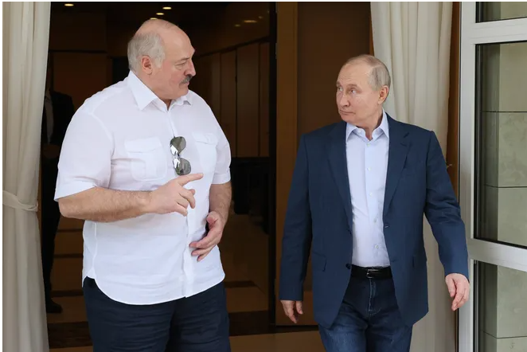

_·2023年6月9日，普京与卢卡申科在俄罗斯会面交谈。_

卢卡申科给自己的定位是“爱好和平的总统”。2023年2月16日，在俄乌冲突爆发一周年之际，卢卡申科向美国总统拜登、俄罗斯总统普京发出邀请，希望在明斯克举行三边会晤，商讨和平协议。

今年3月底，卢卡申科发表国情咨文时再次强调，白俄罗斯是和平国家，不想和任何国家发生战争，也不希望看到战火在周边点燃。他表示，俄乌冲突给各方带来巨大损失，并再次呼吁冲突双方通过谈判解决问题。

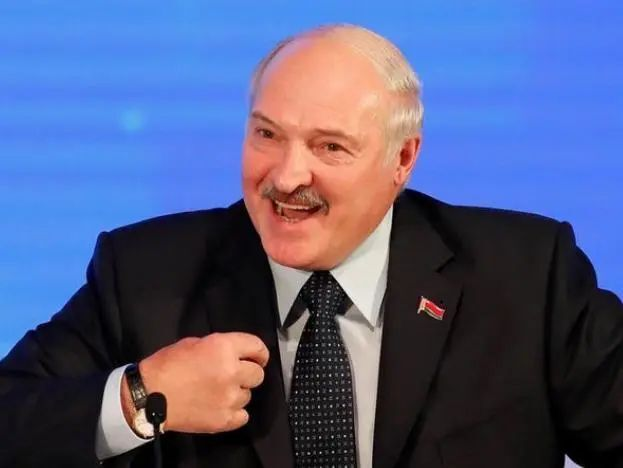

而“瓦格纳”的“叛乱”，如果任其发展，无疑对俄罗斯不利，更可能对俄乌冲突的走向造成重要影响，最终也影响到白俄罗斯的国家利益。卢卡申科在关键时刻主动站出来斡旋，也符合他一贯的做法。

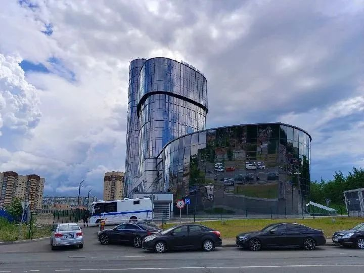

_·"瓦格纳”总部。（图源：新华社）_

总监制： 吕 鸿

监 制： 张建魁

主 编： 许陈静

编 审： 凌 云

（文章未经授权不得转载，转载请加微信“HQRW2H”了解细则。欢迎大家提供新闻线索，可发至邮箱tougao@hqrw.com.cn。）

