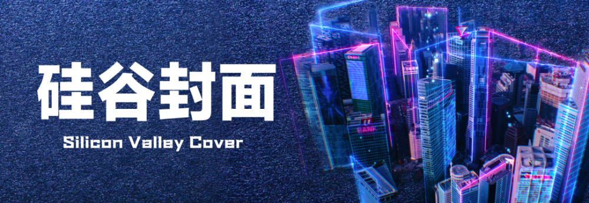
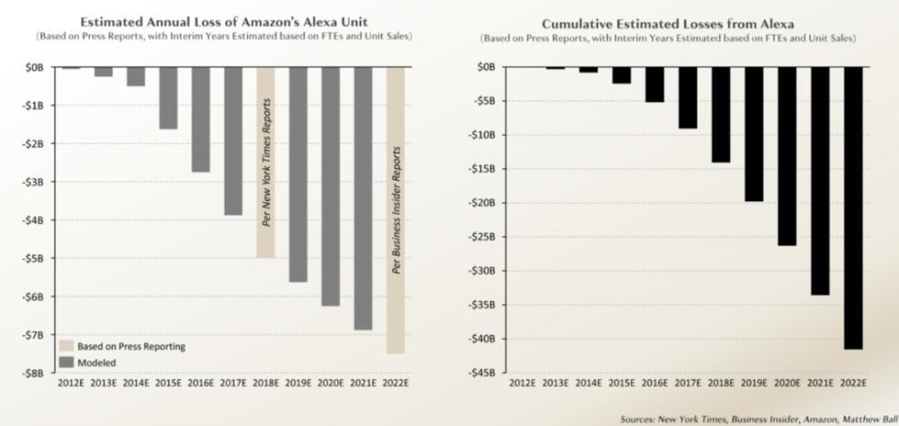
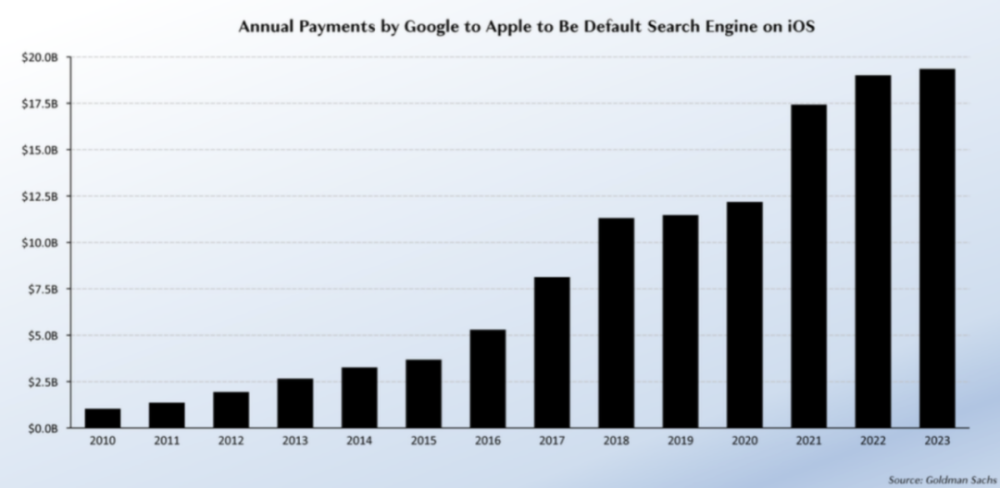

# 科技巨头硬碰硬，库克和扎克伯格为何看中同一个“吞金兽”？

**划重点**

  * _1_ 硅谷大佬对“梦幻业务”的定义：客户喜欢，可以发展到非常大的规模，很高的资本回报率，经得起时间的考验。随着公司的发展，一切都需要规模化，包括失败。如果失败的规模没有扩大，就无法真正推动变革。
  * _2_ 目前，科技巨头们探索新硬件和新业务的终极是搭建新的平台和生态。除了攫取利润，好的生态价值还体现在进攻手段和防御能力方面。如果要取代受平台保护的应用需要付出高昂代价，挣脱束缚重塑新平台愈发艰难。
  * _3_ 苹果入局MR竞争，可能会像iOS那样再赢一次：用户数量排第二，但软件收入和总利润远远领先。不过即使如此，仍然给Meta留下很大的增长空间。

_本期为硅谷封面第12期，由硅谷封面和RockFlowUniverse联合发布。未经允许，请勿转载。_

【编者按】 前段时间，苹果Vision
Pro发布，这款由2000多名苹果设计师、工程师用了7年时间，花费数百亿美金打造而成的产品，成为XR领域的希望。在过去很长的时间里，VR/AR处于低迷期。行业烧钱，前路不明，很多科技巨头也纷纷收缩相关业务线，连Meta也因为相关业务线加重了亏损。XR领域一直被视为“吞金兽”，未来是否还有迎来又一波新热潮的可能？硬件产业未来还有哪些新的探索方向？本期《硅谷封面》，窥探科技巨头投入重金探索新硬件平台的背后动机。

01 Meta和苹果的“吞金兽”

目前，Meta持续为元宇宙开发一系列硬件产品，并且已经投入巨大。Meta创始人扎克伯格一直坚信元宇宙是继手机之后下一个伟大的计算平台，但AR/VR一直未赢得消费市场的青睐。这场豪赌似乎让Meta正陷入“骑虎难下”的局面，一方面传统业务增长放缓，另一方面布局新业务太猛，低估元宇宙的“烧钱能力”。

从2012年到2023年第二季度，Meta已经在Reality
Labs部门投入约560亿美元。这笔支出涵盖营销、制造和硬件补贴（大多数设备以低于成本的价格出售）以及软件、研发和并购投资，其中包括尚未发布的设备、技术（如神经接口、肌电腕带），也包括已停产（Portal
智能屏幕）或关闭（智能手表）的产品。Reality Labs（Meta
Platforms的业务和研究部门）的累计营收约为70亿美元，即该部门迄今净亏损了490亿美元。

_图：Meta的Reality
Labs的累计支出、收入和净亏损_

不过，最近有一个好消息是，因为最新款产品Quest 3将于10月首次亮相，2023年和2024年Reality
Labs的营收可能会创下新高。相比2020年发布的Quest 2，3代将有实质性改进：分辨率提高30%，采用标准化的120
FPS、混合现实模式以及更轻更薄的外形。与此同时，兼容虚拟世界、休闲游戏和自建内容的 Roblox也将登陆Meta
Store，它很可能成为该平台最受欢迎的应用，有望比Horizon Worlds高出几个数量级。

不久前，苹果推出自己最新的XR设备，虽然给当下市占率达90%的Meta带来竞争压力，但也将产生光环效应。毕竟，它此前曾多次证明过自己是科技领域前沿趋势的非凡预测者和塑造者：乔布斯曾在上世纪80年代初预见了个人计算机的兴起；2001年，它又凭借iPod进军MP3播放器市场获得了不错的战略胜利；2007年的iPhone更是一举彻底颠覆了当时的手机市场，进而奠定了当今的巨头地位。

作为消费电子领域最为成功的公司，苹果涉足XR不仅为同行者的探索带来了充足信心，也会帮助消费者更好地了解这一新兴产品的用例和好处。它对用户界面设计的关注，以及对屏幕设计、材料科学、芯片架构和电池方面的有力整合，或许会帮助同行打开新的局面。-当然，这条业务线的“烧钱”是毋庸置疑的，苹果直接把这款设备定价3499美元，是Quest
3的7倍，这可能使得二者产生更明显的错位竞争，让很多想要XR设备的家庭转而选择Meta。要知道，此前亚马逊比iPad晚一年推出Fire平板电脑时也看到了类似好处（其价格是iPad的40%），而Quest
3相比 Vision Pro足足便宜了85%。

在最初的12个月左右，Quest 2的销量是Quest 1的10倍（1000万:100万）。如此迅猛的增长不太可能出现在Quest
3上，但大家依然可以有所期待。此外Meta表示，Quest 3的售价将不再低于成本价（此前每卖出一台 Quest2，Meta 亏损约 150
美元）。考虑到这一点，Meta 的亏损很可能在 2023 年达到峰值——而后逐步改善。

不过，距离真正的扭亏为盈还很遥远。有分析师预计，Meta在VR/AR设备的累计亏损或将超过800亿美元。这个数字有些骇人。实际上，生产新兴类别硬件的挑战，已经迫使除苹果之外
Meta 的大多数竞争对手放弃/暂时搁置了他们的野心，等待该领域新的外部进展。

社交新星Snap在过去五年至少斥资15亿美元收购AR初创公司，此外还投入数十亿美元研发资金（到2022年5000+名员工中仍有
20%专注于AR硬件)，并推出了四款公开的Spectacles AR
机型。考虑到它市值仅有数百亿，如此巨额投入很难持续。对Meta来说，这既是好消息也是坏消息：竞争者确实少了，但它的“逆势而动”已经给上市公司的利润带来巨大压力。

要使这些投资产生正向回报，该业务未来需要产生至少1000亿美元现金流。这个数字理论上可以达到，因为它们旨在取代的产品——智能手机——在过去十年带来的经济价值早已数十倍于此。而对这一看似“疯狂”的举动，硅谷巨头们早已见怪不怪。毕竟AR/VR
并不是唯一的吞金兽，投入巨资探索新业务进而孵化全新平台和生态，是所有科技公司的野望。

_图：亚马逊2014年推出的智能手机Fire
Phone_

02 亚马逊的豪赌

让时间先回到2015年。在2015年4月的致股东信中，亚马逊创始人杰夫·贝佐斯列出了“梦幻业务”（Dreamy
Business）的四个要素：“客户喜欢，可以发展到非常大的规模，很高的资本回报率，经得起时间的考验。”他补充说，亚马逊有三个这样的业务——Marketplace、Prime和AWS，他希望建立更多。

事实上，亚马逊已经开创了几十项新兴业务——通常是在它之前没有经验的领域。Kindle虽然并不完全“梦幻”，但它帮助建立了电子书业务，并助力了该公司在硬件方面后来的投资。创建新业务是一种非凡的才能，从长远来看，甚至是一家公司所拥有的最重要的能力。

但在2014年，亚马逊遭遇了公司历史上最大的新业务失败。2014年7月，该公司发布了第一款（也是唯一一款）智能手机 Fire
Phone。与亚马逊的其他硬件产品不同，FirePhone进入市场的时间相当晚。Kindle虽并不是第一款电子阅读器，但也算该领域的先驱，Kindle
Fire平板电脑也是在iPad之后不久面世。Fire Phone足足比iPhone晚了7年，比 Android 晚了6年，但价格却相当。

当时亚马逊希望通过整合自己的电商平台，以及使用先进的“3D 摄像头和传感器”来突出Fire
Phone的差异化（理想情况下，可以帮助用户购买吸引他们眼球的东西）。但最终这款设备彻底失败，在首次亮相仅三个月后就终止销售。亚马逊录得1.7亿美元的财务减记（其中近一半是未售出的库存）。

通常情况下，Fire
Phone这样的失败品会粉碎一家公司的雄心壮志。但亚马逊并未就此止步：“梦幻业务”的探索并不容易，且不便宜。此前AWS的启动成本就高达数百亿美元。贝佐斯坦言：“如果你认为我们曾经遭遇失败，那我想说，我们还会面临更大的失败。若干年后Fire
Phone会变得毫不起眼。”

在第二年给股东的信中，他重申：“随着公司的发展，一切都需要规模化，包括失败。如果失败的规模没有扩大，你就无法真正推动变革。棒球和商业的区别在于，当你挥杆时，无论表现有多好，最多只能得4分。但在商业中，每隔一段时间，当你真正取得成功时，你可以得到1000分。”

到目前为止，亚马逊还算成功的“第四支柱”是PrimeVideo和Alexa。PrimeVideo在最初阶段每年内容支出约30亿美元，目前已增长至近70亿美元。据估算，累计内容投资可能在350亿美元左右。

反观回报，Prime
Video看似无利可图，但好处显而易见。视频是全球最有价值的娱乐类别，产生超过7000亿美元的收入，但目前流媒体收入不到1500亿美元。在订阅视频服务中，Prime
Video目前位列全球第三。它还帮助亚马逊进入了数字视频领域的其他市场，比如TVOD、订阅转售和联网电视。此外它也为亚马逊庞大的广告业务提供了更多广告库存，并将其广告产品扩展到视频和直播。

Alexa是亚马逊更大的赌注。除了为亚马逊打造一条全新业务线，Alexa还力驱动了亚马逊的整个业务——从电子商务到AWS，从Audible到Kindle。Alexa起步很慢，头两年设备销量为280万台。2016年开始起飞，850万台，2017年增长300%达到2500
万台。2021年，出货量超6500万台。

到现在，其累计销量估计超过3亿。Alexa拥有了三分之二的智能音箱市场，成功击败了谷歌智能音箱和苹果的
HomePod。此外，它已被广泛部署到福特、丰田等家用车以及 Sonos 等扬声器系统。而在这些成就的背后，亚马逊承担了不可忽视的巨额亏损。

与Meta的Reality
Labs不同，Alexa并未单独披露损失。据《纽约时报》报道，该部门2018年亏损50亿美元。据相关销售数据，Alexa在2012年至2017年累计亏损约110亿美元。而Business
Insider曾透露，亚马逊设备和服务部门2022年损失100 亿美元（这包括其他亏损业务，如云游戏平台 Luna 等）。综合估计，Alexa 当年损失约
80 亿美元。依据上述数字建立简单模型可以拟合得到下图，即2012年到2022年Alexa的逐年亏损情况：

可以发现，过去十年间 Alexa累计损失约430亿美元。换句话说，Alexa之于亚马逊的意义与Reality Labs之于Meta别无二致。

03 探索新业务的终极形态——“做平台”

不难发现，科技巨头们探索新硬件和新业务的终极是搭建一个新的平台和生态。平台的盈利方式有很多，可以选择向最终用户或第三方收费，当前最常见的形式是向第三方“收租”。平台既可以直接从他们创造的价值中获益，还可利用其所有合作伙伴的投资进入更广阔的目标市场。世界上几乎所有最有价值的公司都运营着每天承载数十亿用户和数百亿美元经济价值的平台，比如：

○ iOS由世界上最有价值的公司苹果拥有；

○ 市值第二大的公司微软拥有Windows操作系统，以及云服务Azure；

○ 安卓由排名第三的公司谷歌拥有，它还运营着互联网两大头部平台——谷歌搜索和Chrome；

○ 世界第四大公司亚马逊也有自己的操作系统Fire，以及云服务平台AWS。值得强调的是，Marketplace
虽然不是一个严格意义上的平台，但亚马逊四分之三的电商销售通过其进行；

○ 全球第九大公司Facebook，运营着全球最大的社交网络，成千上万的网站和应用程序支持使用其账号注册登录。

Epic Games创始人Tim
Sweeney认为，“当人们花时间在其中的大部分内容都是由其他人创造的时候，它就是一个平台。”而比尔·盖茨将平台定义为“使用它的每个人的经济价值超过创造它的公司的价值”。

不管定义如何，让平台如此强大的是生态。一个合格的生态不仅产生“租金”，为用户提供额外价值，还给拥有者带来无尽便利，以及给竞争对手设置强大的进入障碍。在过去十年中，随着不同数字生态在规模、复杂性和重要性方面迅速增长，其内生能力也在变强。这反过来又使这些平台更具经济价值，更难以复制。在这方面，苹果是一个重要的研究案例。

在苹果最初的几十年里，其优势通常被归功于硬件和操作系统的高度整合。而近年来，苹果的业务已经扩展到第一方软件和服务、第三方软件和服务分销、数字和现实世界的支付、用户身份和行业标准。这种不断增长的捆绑服务不仅给苹果带来了更多的利润来源，使其生态系统对用户和开发者更具吸引力，还为苹果提供了进一步“开疆扩土”的潜力。

财务回报方面，iOS 目前在美国占据近 60% 市场份额，在青少年中占据 90% 以上份额。在全球手机市场苹果市占率低于
25%，但由于其手握最有价值的用户并能有效将之货币化，它获得了全行业超过三分之二的移动软件收入。据悉，该公司的硬件利润率超过 40%，综合软件利润率则超过
90%。2022 财年营收 3943 亿美元，净利润达到 998 亿美元，营业现金流接近1250亿美元。

_图：历史上最成功的公司——苹果，年度经营现金流_

除了借助平台攫取经济价值，苹果也在通过自身的设备、浏览器和应用商店对互联网的标准和发展进程施加影响：因为苹果在浏览器缓慢且不完全采用 WebGL 和
OpenGL，基于网页的游戏无法适配丰富的 2D/3D 图形，其增长被极大限制；2000 年代末苹果拒绝了最流行的多媒体软件平台
Flash，实际上判了它死刑。一些人认为，苹果拒绝云游戏服务也是出于类似动机，云渲染的兴起威胁到移动硬件的重要性，第三方游戏捆绑包有可能使开发者和用户最终脱离苹果，因此它绝不会愿意。

而在进攻手段方面，苹果在2021年调整政策，选择弃用广告商标识符（IDFA）和应用跟踪透明度（ATT），这一改变立即对另一科技巨头造成严重伤害——2022年，Meta
因 IDFA/ATT 政策影响预计损失100亿美元利润。

类似的，平台所有者可以利用其影响力，在竞争对手早已征服的领域迅速获得市场份额。2021 年，苹果强制要求任何支持第三方账户的应用也需要支持 iCloud
登录。由此，它迅速成为互联网上最大的账号服务提供商之一，尽管它比市场领先者晚几十年才进入市场，而且提供的差异化体验有限。此外，苹果推广 Apple
Pay、政府身份验证项目、FaceID 以及自带地图应用等过程，也无不利用了自己平台掌控者的独特优势。

如今，苹果自身的完善生态已经建立数十年之久。与此同时，全球智能手机的更换周期从 24
个月延长到36个月以上，这意味着苹果牢牢把控手机这一重要硬件类别的时间同步延长了50%以上。因此，它超然的平台地位愈发难以撼动。

04 平台的防御能力，高昂的代价

上文讨论了平台如何从运行其上的应用中获取价值，以及掌握生态所带来的优势。理解这种权力的另一种方法是反过来看——研究攻击受平台保护的应用程序需要付出什么代价，以及挣脱现有束缚重塑新平台究竟有多难。

过去15年来，谷歌一直在向苹果支付巨额费用以便让自己成为iOS和Mac的默认搜索引擎。据高盛估计，这个数字已超过 1200
亿美元。2022年，谷歌支付的费用相当于它当年利润的三分之一（250亿：750亿）。

_图：谷歌向苹果支付的年度费用，以成为iOS默认搜索引擎_

为何谷歌宁愿持续分享自己的盈利，而不是投资建立一个新的平台？据估计，谷歌支付给苹果的费用相当于谷歌从基于iOS的广告业务产生收入的25%。也就是说，其本身付费买下默认位置是一种能够持续产生正收益的套利行为。当然，相比之下，谷歌在安卓系统的广告业务更有利可图，因为它平均只需向安卓合作伙伴支付11%的收入。

面对谷歌与苹果的结盟，微软要如何另辟蹊径？至少从传统思路来看，在手机端的广告业务很难打开局面。25亿安卓用户，每台设备都默认使用谷歌搜索和谷歌浏览器；剩下13亿iOS用户（和18亿iOS设备），微软能付出比谷歌每年250亿美元更高的价格？很不现实。250亿已经是微软总广告收入的两倍多，微软无法拿下这笔交易。

因此，微软近些年也在求变。目前较为明晰的两条主线——向OpenAI投资超百亿美元，以及750亿美元巨额收购动视暴雪，前者是希望借助人工智能打开多条业务线获取新市场的突破口，后者则是计划于欧盟数字市场法案实施后在欧洲手机市场推出自己的游戏应用商店。

毕竟微软目前在游戏领域已初具规模：6000万+ Xbox用户，1亿+ Xbox Live月活用户，1.5亿《我的世界》玩家，2500万 Game
Pass用户。外加动视暴雪旗下《使命召唤》、《糖果传奇》等系列游戏的数亿月活用户（其中大多数是移动用户），或可在游戏应用商店开辟新的天地。而除了科技巨头之间的平台攻防战之外，游戏领域借助平台优势进行防御的经典案例莫过于Steam
VS Epic。

当Epic在2018年推出针对 PC 的游戏商店 Epic Games Store（后文缩写为
EGS）时，它自认为已经解决了“冷启动”问题，并为玩家和发行商提供了重要的差异化因素。为了给该平台提供初始动力，Epic
选择将《堡垒之夜》与其绑定；为了吸引开发者，Epic 宣布仅提成 12%（相比之下 Steam 提成 30%）。而如果开发者使用 Epic
虚幻引擎，则该引擎的 5% 版税也可计入 12% 中——即，EGS 最低佣金仅为 7%，不足 Steam 的四分之一。

除此之外，Epic还承诺第三方开发者和游戏发行方拥有用户的游戏相关数据等所有权，发行方甚至可以无需使用 EGS
自己的支付解决方案（从而进一步降低佣金）。与此同时，Epic 针对用户侧也开出非常优厚的条件：玩家将能够保留并使用他们在 EGS
上购买的任何游戏，即使游戏方不再使用 EGS 发行游戏（与 Steam 不同）。为了吸引新玩家和留住老玩家，Epic
还宣布每周提供1-2款游戏免费下载。考虑到EGS上游戏的平均售价为22.50
美元，从2019年至2022年，总共364款游戏的名义价值为8222美元。在此期间，玩家购买 24亿份游戏，相当于Epic累计补贴了556亿美元。

_图：Epic Games商店游戏赠品的总零售价值，以及Epic
Games商店（不包括EpicGames自己游戏在内的）玩家总消费_

即便Epic已经使出浑身解数，结果并不如人意。2022年，用户在EGS第三方游戏的支出为3.55亿美元，自4年前发行以来仅增长 1
亿美元。考虑到平均10%的佣金，该平台每年从第三方游戏中获得的净收入不足 4000 万美元，自2019年以来总计收入不到1.25
亿美元。这意味着，EGS仍然是一个第一方游戏发行平台，而非它梦寐以求的蓬勃生态。

随着EGS即将迎来五周年纪念，我们很难看到它的转机。因为与苹果的诉讼案，该公司2020年8月泄露的损益表显示，预计 EGS 最早要到 2027
年才能实现盈亏平衡。更重要的是，EGS 的 2020 年、2021 年和 2022 年收入全都低于 2020 年 8 月的预测。

EGS的核心挑战在于，游戏商店是一个太过复杂的生态。不像 Prime Video、iTunes 或 Audible
等内容商店，如果用户可以获得更便宜、更丰富的内容就可以轻松离开；游戏和玩家自己的成就、奖励、多人体验、社交圈紧密相关，游戏商店和持续多年的运营是不可分割的。过去
20 年的运营使得 Steam 锁定了数亿用户的数百亿游戏体验和彼此之间的连接。这种复杂性使 Steam 几乎无懈可击。

在EGS 之前，2011年游戏巨头EA也曾推出自己的商店EA Origin，专门销售其游戏的PC版本。这样做的好处很多：分销费用从 30%
降至3%或更低；完全控制实时服务（如多人音频聊天，游戏更新）；提高推广自己游戏的能力等等。8年后，EA宣布重返Steam
平台。此外，动视暴雪花了20年时间试图离开 Steam，但除了《使命召唤：战区》等免费游戏外，其大多数游戏至今仍在该平台上销售。

与Steam的斗争表明，建立一个新的游戏平台是多么困难。有太多的游戏玩家与Steam牢牢绑定，这种稳固的防御能力助力Steam每年产生80亿美元收入和数十亿美元的利润。

05 巨额下注依然值得

平台的财务回报、进攻手段以及防御能力解释了扎克伯格为什么决心斥资数百亿推动Reality Labs
的发展，以及贝佐斯为什么要拓展更多类似Alexa的新业务。虽然损失惊人，但与潜在利润以及拥有自己的平台所带来的安全性相比，一切投入都显得值得。

_图：苹果公司的综合经营现金流与Meta
Reality Labs和亚马逊Alexa部门预计的亏损对比_

人们很容易忽视，即便是科技巨头，其日常运营也在被竞争对手平台影响。Meta因依赖广告收入而广受批评，然而它想提供订阅产品真的可行吗？即便被渠道允许，苹果&谷歌抽成30%，Meta抽成一部分，几乎没有任何东西可以留给创作者。

困扰巨头发展的问题从来不会消失。而且随着平台在规模、多样性、复杂性、重要性方面持续增长，其结果是，强者恒强。过去十年，苹果创造了 6000
亿美元的营业利润；在过去的20年里，AWS 产生的利润中有 25% 是在过去12个月里产生的。

当前的经济发展比以往任何时候都更依赖互联网平台。在其基础层、中间层和应用层存在充分竞争才符合用户的共同利益。而为了不被甩在身后，亚马逊、Meta、谷歌等公司付出的成本高达数百亿。即便是当前的创业公司，如
OpenAI、Starlink等，也正在依靠外部融资或母公司支持参与这场看不到尽头的军备竞赛。

当然，一个成功的互联网平台所带来的潜在好处，并不足以证明无休止的投资是合理的。微软Windows
Mobile和黑莓的失败，归根结底是其决策出现错误。它们曾坚信：获胜的智能手机必须拥有可续航数天的电池，而不是只能使用几个小时的电池；智能手机将成为普通人的辅助电脑，而不是主要电脑；市场将由商业客户主导，而不是普通消费者；价格必须在
200 美元以下，而不是500美元以上；电子设备必须能够抵御跌落和事故，不能易碎；等等......

另一个问题是时间点。在错误的时间提出正确的想法也会被证明无效——如果你把iPhone带到1995年，会发现3G还没有发明，2G
的速度只能用于纯文本，没有人能构建它的组件。iPhone 之所以获胜，是因为它在正确时间推出了正确的产品，而且根植于蓬勃发展的iTunes 生态。

智能手机的历史有益于帮我们理解（或者说预判 XR设备的未来。微软和黑莓，安卓和 iOS
之间的竞争很可能不只会发生一次。当下，苹果、微软、Meta、亚马逊和谷歌都在以不同的价格推出各自的平台（Meta 的价格为400-500
美元，苹果和微软的价格在 3000 美元以上），并在不同的时间以不同的功能优先考虑不同的客户（Meta
针对所有人，微软专注于军事和工业应用，苹果专注于高端家庭和中产阶层）。

苹果的到来并不意味着Meta就完蛋了。苹果的介入很可能使这个类别得到更多投资者、用户和开发者的支持，这一切都有望间接推动Quest
3的销售。但是，我们也绝不能小觑苹果的投入、决心以及其诸多优势。从研发预算看，自 2010 年以来，苹果已经在研发上投入 1450 亿美元，仅在 2022
年就投入超过 250 亿美元。这是Meta 2022 年对 Reality Labs 投资的两倍，但仅占苹果收入的 7%。

_图：苹果公司年度研发支出_

考虑到苹果庞大的研发预算，它是世界上最大的专利申请者之一显然不足为奇。仅在2022年，苹果公司就在美国获得了2300项专利，这个数字是Meta的2.3倍。

我们无从得知苹果的研发支出中有多少与XR设备有关，而且该公司从未披露其产品的直接损益。在2023年6月发布Vision
Pro设备时，蒂姆·库克表示，该设备拥有超过5000项专利。有报告显示，Vision Pro的开发始于 2018
年，这意味着自2018年以来授予该公司的专利中有41%是针对Vision Pro的。假设苹果自2018年以来970亿美元研发支出中有41%分配给Vision
Pro，那就是400 亿美元——在考虑并购、设备营销和设备补贴后，这与Meta的Reality Labs部门支出相当。

今年4月，在接受《GQ》杂志采访时，蒂姆•库克含蓄解释了为什么苹果的XR设备开发时间如此之长，以及它与Meta设备的区别。他表示，在考虑进入一个现有市场时，内部团队会慎重评估自己能否做出其他人做不了的重大贡献。苹果对把别人的东西拼凑起来不感兴趣，他们希望引领真正的创新。

时间会告诉我们谁能赢得XR设备的战争：苹果可能会像iOS那样再赢一次——用户数量排第二，但软件收入和总利润远远排在第一——但这仍然给Meta留下很大空间，就像智能手机领域拥有超过25亿用户的安卓。不管怎样，可以确信的是，XR绝不会是科技巨头们的唯一战场，类似故事仍将继续发生。

【本期由硅谷封面和RockFlow Universe联合发布，未经作者授权，请勿转载。】

