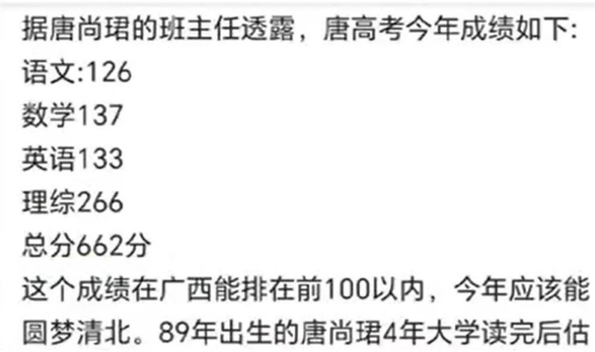
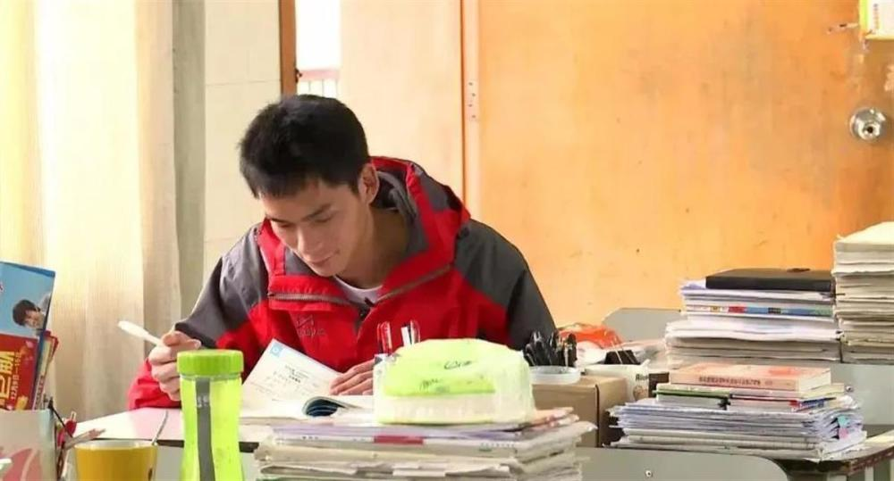

# 第15次高考今年考了662分将圆梦清华？唐尚珺本人回应：消息不实

15次参加高考，只为圆自己的清华梦。广西考生唐尚珺25日回应称，网传他2023年高考成绩662分的消息不实。

_唐尚珺（图源：视频截图）_

记者注意到，25日上午，多个社交平台流传唐尚珺2023年高考成绩出炉的消息。该消息称，根据班主任透露，唐尚珺今年高考成绩如下：语文126、数学137、英语133、理综266，总分662分，考上清华大学的梦想即将实现。

25日中午11时许，唐尚珺本人以短信形式回复称上述消息为“谣言”，但他未透露2023高考的实际分数。35岁的广西考生唐尚珺因想上清华大学，多次参加高考而为人熟知。

_网传的成绩单（图源：社交媒体）_

唐尚珺的微博认证写着：为上清华复读13年考生。对于清华大学，他是向往的，因为在他几岁时，他的父亲曾跟他讲过同村人考上清华的故事。他还认为，清华大学是国内理科生最好的选择。

2009年，第一次参加高考的唐尚珺考了372分，没上本科线，父亲得知后很失望。

_唐尚珺（图源：视频截图）_

第二年，他考了405分，考上广西机电职业技术学院。第三年，他考了475分，此后几年，他的成绩不断提升。近几年，他的成绩在600分左右摇摆。这么多年，他先后被西南政法大学、吉林大学、中国政法大学、厦门大学、广西大学、上海交通大学等在内的多所高校录取，但他都没有去读。

此前，唐尚珺在接受记者采访时曾表示，无论是否考上清华，2023年是他最后一次参加高考。

（极目新闻综合半岛都市报、白鹿视频报道）

（来源：极目新闻）

