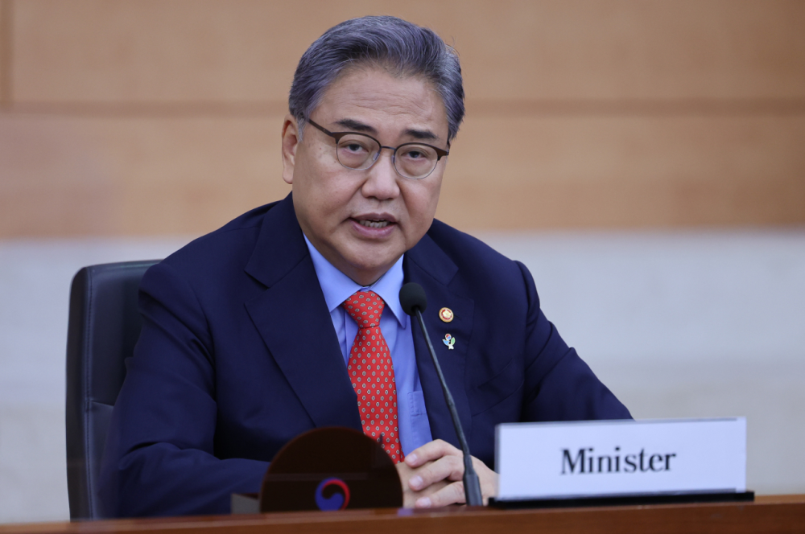

# 韩外长：韩政府没理由与中方反目，将继续加强与中方沟通增进友谊

【环球网报道】据韩联社刚刚消息，韩国外交部长官朴振25日表示，韩国政府没有理由与中国反目，也不愿看到这种情况发生，韩方将继续加强与中方战略沟通，增进双边友谊。

报道说，朴振当天上午做客韩联社TV一档节目，就韩中关系做出上述表态。他表示，本着互尊互惠精神推动韩中关系成熟健康发展是尹锡悦政府基本立场。

_韩国外交部长官朴振
资料图 图自《韩国先驱报》报道配图_

但报道同时声称，朴振还就中国驻韩大使邢海明日前涉韩发言引发争议一事重申了韩方原有立场。

根据中国驻韩大使馆网站发布的新闻稿，6月8日，中国驻韩大使邢海明会见韩国在野党领导人时警告说，有的人赌美国赢、中国输，这显然是误判，没看清历史大势。现在赌中国输的人今后一定会后悔。然而中方大使的表态被韩国方面一再拿来炒作。中国外交部发言人汪文斌12日在记者会上就我方大使言论相关提问表示，邢海明大使同韩各界人士广泛接触交流，是其职责所在，目的是增进理解，促进合作，维护和推动中韩关系发展。

韩联社称，被问及美方如何向韩方介绍美国国务卿布林肯的访华结果时，朴振25日在受访时回答说，美方说明的核心内容是，将稳控美中关系，力争推动双边关系朝着竞争与合作的方向前进，而非对抗与矛盾。韩美双方就今后有必要为解决朝鲜核问题进一步密切合作，以及中方发挥建设性作用极其重要形成了共识。

布林肯于本月18日至19日访华，并在访华前后同朴振通话，就对华关系发展方向交换了意见。中国社科院亚太与全球战略研究院研究员董向荣本月18日对《环球时报》记者表示，此次到访中国之前，布林肯与日韩方面进行沟通的做法早有先例，表面上是美国听取其他盟友的声音、尊重其他盟友，实际上凸显的是美国作为庞大盟友体系盟主地位。董向荣表示，尹锡悦政府的亲美亲日外交与韩国国内政治社会分裂、国际局势变化、领导人的历史观价值观等都有直接的关系。总体而言，尹锡悦政府因为外交调整过快过猛，一系列副作用已经显现，需要较长时间来消化和缓解。“作为两个重要邻国，韩国对华关系不应附属于与美国的关系，这是中韩关系稳步发展的基础。”

而在朴振上述表态出现之际，彭博社24日援引韩联社报道称，一些韩国航空公司暂停了部分飞往中国的航班，韩联社认为，这对中韩关系来说是一个坏消息。彭博社在报道中提到了中韩之间近期爆发的外交争议。事实上，近来韩国政府对华政策备受争议。在涉及中国核心利益的台湾问题上，韩方有“失当、错误甚至危险”的言论，在中国社会引起了强烈反感和警惕。

