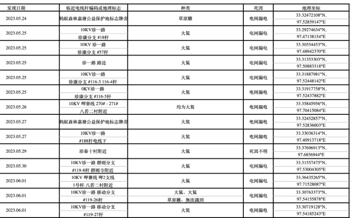

# 50余只国家级保护动物被电死？三江源国家公园回应：不在公园范围内

潮新闻客户端 记者 朱高祥

6月26日，三江源国家公园（下称“三江源”）公众号发文回应“53只国家级保护动物非正常死亡”一事，称网文提到的地点在玉树州称多县珍秦乡境内，这片区域称嘉塘，不在三江源国家公园范围内。而且，被电死一说并不属实，目前死亡原因不明，调查人员正委托相关机构对死亡鸟类原因做鉴定。

此前，6月24日，有自媒体发布标题为《三江源国家公园成坟场，53只国家级保护动物非正常死亡》的文章，当事人常乐提到，“我与同伴从5月24日到达嘉塘草原到6月21日从嘉塘草原驱车离开，在电线杆下面，共发现55只非正常死亡的鸟类。经过重新检查，从55只中排除2只死掉的渡鸦之外，剩余共53只死掉的猛禽，包括大鵟（音同“狂”）、草原雕、白尾海雕、猎隼等。”

常乐告诉潮新闻记者，自己在微信上被称多县森林公安传唤，但自己目前已回成都，没有过去。

**大部分死亡鸟类发现在电线杆下**

常乐自称“数鸟人”，每天的工作就是数嘉塘草原活鸟和被电死的鸟的数量，并将照片和鸟的数量记录发布在社交媒体平台。

4月23日，一环保志愿小组发起“嘉塘数鸟人”野生鸟类观察和保护项目，因试用期月薪1万引发关注。

项目发起人“坚果兄弟”回应潮新闻记者称，3月份我们途径嘉塘草原，短短一两个小时就发现9只猛禽死亡，后来就有了‘数鸟人’这个项目，招募感兴趣的环保志愿者来花更长时间调查。

“2023年5月中旬，我应聘获得了‘嘉塘数鸟人’这一短期工作。于是在准备妥当之后，5月22日一早，我和同伴租车从成都出发，前往青海玉树方向，并且于5月24日到达嘉塘草原，随即开始数鸟工作。”常乐告诉潮新闻记者。

_图据受访者_

常乐向记者展示了这段时间的记录与拍摄的照片，他表示已将死亡猛禽的照片和视频资料、发现尸体时的轨迹点位文件分别进行了存档，且每张照片的原始信息中均包含该照片拍摄的地理坐标。据他初步统计，其中有50余只猛禽属国家重点保护野生动物，包括大鵟、草原雕、白尾海雕、猎隼。

_图据受访者_

常乐觉得，因为这些鸟类大部分都是在电线杆下面发现的，一些鸟类尸体上有灼烧的痕迹，所以有可能是被电死的。

常乐向记者举例，比如6月18日下午，他在电线杆10KV珍一路珍康分支杆下面，发现了一具死掉大鵟的尸体。嘉塘草原所在的玉树州称多县珍秦镇，于6月9日至6月20日因为电路检修停电。但是在6月18日，他们从玉树市回到嘉塘草原后发现当天有半天时间短暂恢复供电，仅仅在这短暂恢复电力的当天，他们即在该电线杆下发现这具尸体，而此处先前从没发现过猛禽尸体。

6月20日深夜，称多县森林公安找到常乐，询问其数鸟目的以及为何没有报备。次日，称多县林草局带走所有发现的猛禽尸体，以便检测死因。

_图据受访者_

6月25日，称多县森林公安在微信上传唤常乐，但常乐并未回到称多县。

**“三江源”称被电死一说并不属实**

6月26日，三江源国家公园在微信公众号对此事进行了回应。

_三江源国家公园微信公众号截图_

文章称，事件发生后，在迅速跟进的同时，玉树州委、州政府，称多县委、县政府也对相关情况做了初步调查。称多县自然资源和林业草原局调查结果显示，6月20日，称多县珍秦镇牧民举报，在嘉塘草原附近有2位可疑人员在收集野生动物尸体。称多县公安局森林警察大队和县自然资源和林草局相关人员立刻赶赴现场调查核实，发现外来人员常某和同伴苏某近半月来，在珍秦镇境内及四川边界捡拾近几年鸟类尸体、尸骨、残留的羽毛等50只。

同时，被电死一说并不属实，目前死亡原因不明，调查人员正委托相关机构对死亡鸟类原因做鉴定。文章还称，网文提到的地点在玉树州称多县珍秦乡境内，这片区域称嘉塘，不在三江源国家公园范围内。

“三江源”还对自媒体文章中提到的“蚂蚁森林公益保护地”进行了回应。

该保护地是称多县和蚂蚁森林合作的公益保护项目，其地块也不在三江源国家公园范围之内，三江源国家公园只是指导单位。同时，这个标志牌提到的“高寒草甸生态系统、荒漠猫、黑颈鹤”是三江源几个标志性的物种，事实上近20年来，三江源区域所有受保护物种、“三有”物种及所有野生动物的保护都得到了有效加强，国内外认可。

_图据三江源国家公园官网_

据悉，三江源位于青海省南部，地处“地球第三极”，是长江、黄河、澜沧江（湄公河）的源头。三江源国家公园作为中国第一个国家公园体制试点，是全国首批、排名首位，中国面积最大、世界海拔最高的国家公园。

“三江源”认为，标题以三江源国家公园成坟场为噱头，有污名化三江源国家公园之嫌。

项目发起人“坚果兄弟”告诉潮新闻记者，电网建设与猛禽生存是个亟待解决的难题，国网玉树供电公司也曾通过绝缘线套、人工鸟窝等方式解决该问题。项目最终希望国家电网整改，更多人关注到国家级保护动物的生死。

事实上，伴随着我国经济社会的快速发展，输电线路与鸟类活动之间的矛盾日益凸显。

在中国生物多样性保护与绿色发展基金会的公众号上，记者了解到，随着电力基础设施继续增加，解决鸟类和电力线之间的冲突仍然是全球鸟类保护工作的一个重要重点。

在树木稀少的开阔地区（尤其是草原、高原等地），输电线路、输配电塔可以为鸟类提供稀缺的“高枝”，视野良好，对于筑巢的安全和觅食的便利都至关重要。就算在林区，高大的电塔也在林地中鹤立鸡群，受到青睐。鸟类于高压输电线路上的筑巢、育雏、觅食、排便、迁徙、停歇、争斗等活动都可能引发高压输电线路跳闸断电。

“转载请注明出处”

