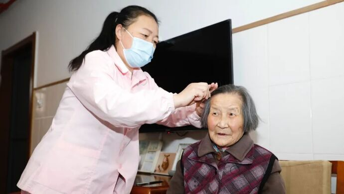
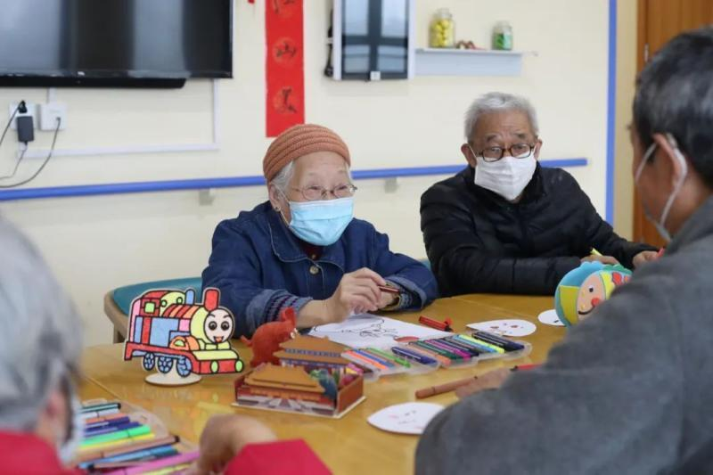

# 上海养老院里老人越来越少了？养老机构：经营成本问题更为突出

“过去我们96张床位常年是满的，现在空了将近20张。”地处上海黄浦老城厢的一家养老机构负责人说。位于浦东的一家养老院床位空缺也持续了一段时间，“最多的时候住了160多位老人，现在不到当时的一半。”两位机构负责人均表示，除自然离世的老人外，入住率降低的主要原因是，“老人回家了”。

目前民营养老机构是上海养老行业的主体。上海475家养老机构中，民建民营机构超过50%，公建养老院中，亦有相当比例是由民营机构托管或承包的。记者在疫情前后持续关注浦西、浦东多家养老院运营情况，得到养老院负责人的普遍反馈：

过去几年，行业内机构或多或少都受疫情带来的“严进严出”影响，流失了部分老人，这带来了成本的增长，也进一步暴露了养老产业发展存在的客观短板。人们更想知道的是，这些行业问题，究竟是短期困境，还是深层焦虑，会不会引一次发全行业的震动和“洗牌”？

**有人急着走，有人赶着来，医养结合需求突出**

位于普陀区长寿路街道的申养望年荟养老院，在老人流失的同时也发现，现在主动找来的老年人，入住的渴望度和迫切度反而比疫情前更高。原因是这里紧邻上海岳养中医门诊部，老人担心住在家里，万一再遇到疫情这样的突发事件，无人照护、用药困难。

入住申养望年荟的老人，依托临近的中医门诊部，可解决相当一部分配药、验血验尿、中医问诊需求，还可做B超和心电图。此外，还能通过社区卫生服务中心的绿色通道便捷就医，解决难配药的问题。但是，在普陀区60多家养老机构中，拥有这般条件的机构并不多。而放眼全市，设在医疗机构旁的养老院更是少之又少。

记者调查发现，决定一家养老院的运营水平，医疗能力是关键因素。多家养老机构负责人提到，能提供便捷就医问诊服务的机构往往更受老人及家属青睐。不过，记者也注意到，目前上海养老院邻近的医院普遍为社区医院，能够解决的问题相对有限，老人真正出现急症，还是要求助三甲医院。专家也普遍认为，国内现阶段的“医养结合”，还停留在初级阶段。

**服务供给较单一，难以满足市场多元化需求**

记者了解到，不少公办养老机构、公建民营养老机构内，主要提供的床位还是多人间床位。哪怕是在定位中高端的民办养老机构，单人间比例也不高。这样的单一市场供给，把许多有消费能力的老人挡在门外。

“老人鼓起勇气踏入养老院，当然希望能够找到一个舒适的空间度过时光。最好还能是独立的房间，保障个人隐私，也避免与同住人产生摩擦。”一些养老院院长表示。对此，业内专家也表示，上海新设的机构养老床位不应一味追求数量，还应该合理调整结构，综合现代人的需求和消费观念，设置个性化、差异化、多等级的床位，以服务质量为先。

上海交通大学教授、上海市老年学学会常务理事章晓懿指出，目前市场上出现结构性的需求不平衡，有的养老院“过热”，有的却濒临关门，原因之一是市场不缺床位，但缺少多层次的梯度供给。“随着人们生活水平的普遍提高，保基本之外，社会也需要配置各类不同标准的养老床位，去匹配不同的人群。”

**床位空了、招人难了，成本问题更加突出**

在上海经营多家民营养老机构的王海水告诉记者，院内收入主要由三部分构成：护理费、床位费、伙食费。一家经营状况良好的养老院基本能做到以床位费抵房租支出，以护理费和伙食费抵人力支出，实现“平进平出”，或“少有盈余”。“现在床位费收不够，护工护士用原来的价格招不到，成本就上去了。”

疫情过后，床位收入整体下降了。由于市场入住意愿的变动，以及此前疫情期间“不得招新”的政策规定，春馨养老院从2020年以前的基本满额，到今天仍有40%的空床。

拥有96个核定床位的黄浦区快乐之家养老院，3年前需要排队“抢位”，现在则刚住满80人。记者调查的另外四家分别位于杨浦、奉贤、普陀、浦东的养老院，也或多或少出现了入住率下降的情况。

一端是床位的收入少了，另一端，人力支出却不得不增加。一些专家在既往研究中发现，上海相当数量养老机构的运营成本长期处于高位。为了缓解其运营困难，近年来，上海陆续出台了一套从软件到硬件的补贴机制，但当下随着床位空置问题和用人成本增高问题的出现，成本难题更加突出。

国内一位民政领域专家也指出，床位空置和人才短缺问题是全国普遍的。根据民政部2020年底公布的数据，我国当年已建养老机构床位429.1万张，床位空置率就高达50%，并长期存在着结构性矛盾。例如：交通便捷地段的养老院空置床位少；收费更高的中高端民办机构空置反而少等等。

人才方面，上海自2018年全面推行长护险以后，有相当一部分养老院护理员转行为社区老人提供居家养老服务。“全市护理人才总盘子有限的情况下，居家养老市场激增，养老机构招人、留人难度就变大了。”多家养老院院长表达了类似的观点。

**建议“精准滴灌”，构建金字塔型养老服务体系**

业内专家普遍担心，养老机构成本高了，可能会影响其服务品质。比如，养老院可能会为了降低成本调整服务方式，减少每个老人的护工配比。“这是养老行业努力多年最不愿意看到的结果。”章晓懿说。

对此，不少业内专家建议，一方面应通过将现有的针对养老机构的“撒胡椒面式”补贴方式，逐步转变为向老百姓满意的优质机构“精准滴灌”，树立全行业新的价值导向。

另一方面，可以从顶层设计出发，构建新型金字塔型的养老服务体系。金字塔的下层以公建机构为主导，政府可以通过购买服务的方式引入民营机构运营，制定服务标准，确保老百姓享受到更公平、一致的基本养老服务。中间一层强调市场的自我调节，让民办机构充分竞争，并强化监管，逐渐引导形成一批真正具备市场竞争力和口碑的机构。顶层聚焦精品养老机构的打造，强调探索创新，不断丰富市场养老产品供给。

