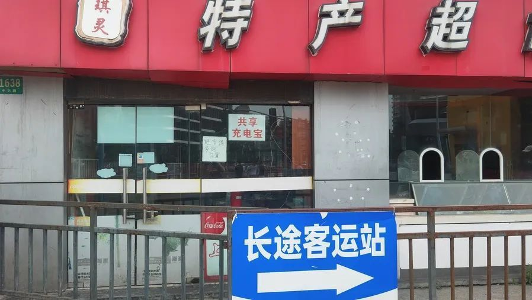
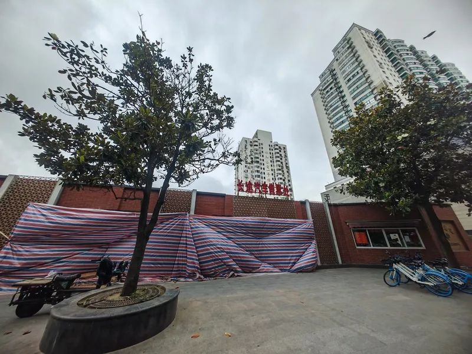
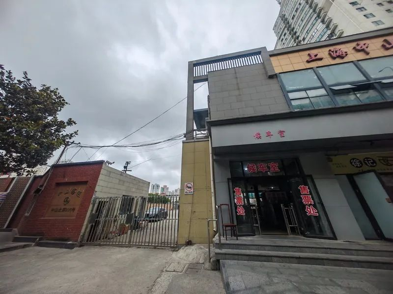
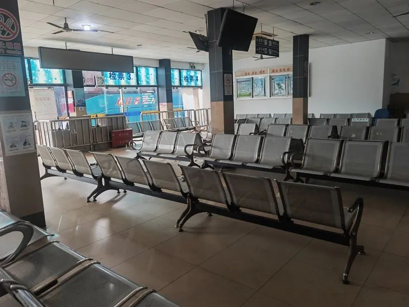
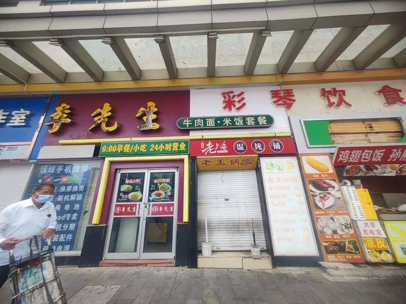
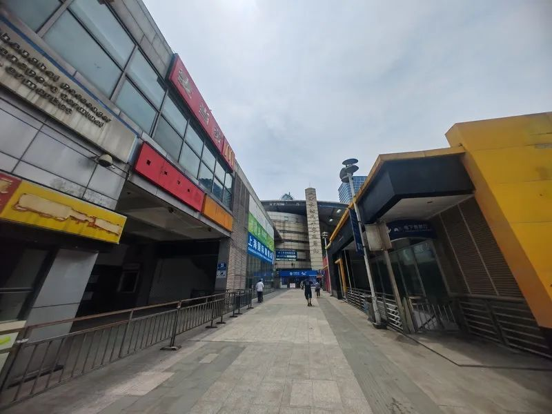
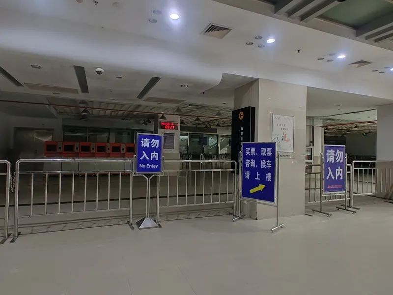
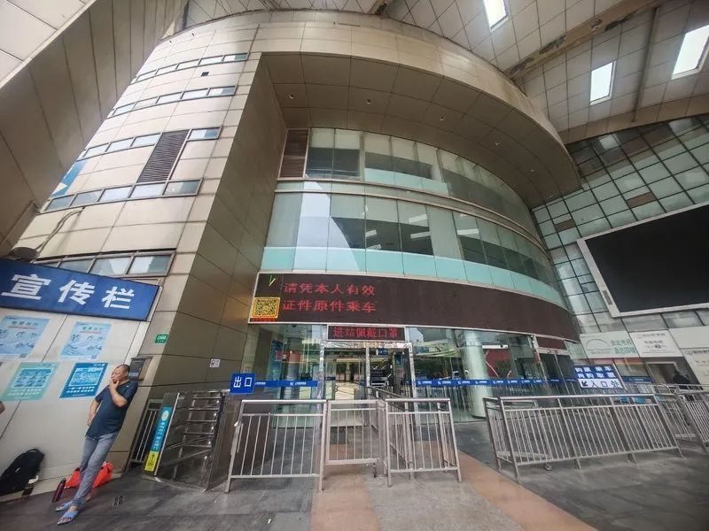
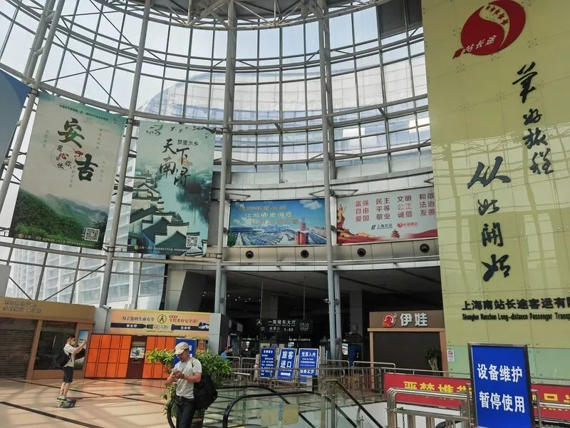
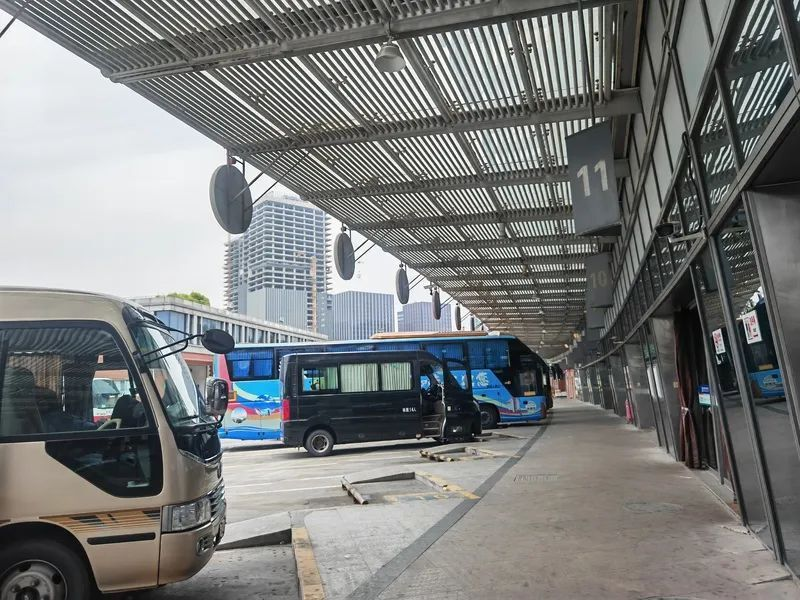

# 上海长途客运站的落寞，客流量比巅峰期已跌去近九成

“去费县。”老杨提着有些分量的编织袋，操着一口方言打算买张回家的长途汽车票。然而，他却被售票员告知，上海中山客运站开往费县的班次已经取消。站在空空荡荡的候车厅内，老杨一时有些茫然。

长途客运站正无奈地走下坡路。在上海，它们曾如地铁开通前的公交一般，创造并见证过属于自己的高光时刻。最鼎盛的时期，客流繁忙，一座难求。
**如今，荣耀已经不再，一个又一个客运站接连停运，原先的三四十家缩减近一半。**

它的没落，似乎隐秘且无声。而对于那些仍然依赖长途客运出行的农民工、老人等群体，面对行业 **“生存还是死亡”** 这一哈姆雷特之问，他们的答案其实很明了。

是顺着时代洪流无奈退场，抑或在困境之下转型求生？从业者正作出自己的选择。

**数量近乎腰斩**

中山北路大统路口的中山客运站， **给人的第一感受，就是萧条**
。沿马路的售票室近期已经关闭，墙面上覆盖着大大的彩色尼龙布，售票室被迁移至候车大厅内。走入大厅，占地上百平方米的空间显得很空荡，原先四个检票口仅有一个开放，现场并无一名乘客。站内的设施设备显得陈旧老化，透着一股年代感。

_沿马路的售票室近期已经关闭，墙面上覆盖着大大的彩色尼龙布，售票室被迁移至候车大厅内。_

_原先四个检票口仅有一个开放，现场并无一名乘客。_

当天仅有张阿姨一名工作人员在岗，不仅负责售票，还承担安检、检票等工作。她给记者看了一下发车记录，共有十多班，发往宿迁、江都、武坚等地。四五十座的车辆，
**载客最多的也只有十个人** ，其余更是少得可怜，有的乘客甚至为零。

“以前生意好的时候，我们这里日发班次有120多班，发往江苏、浙江、山东、安徽、福建等方向，上座率最少也有70%。”中山客运站管理人员老夏告诉记者，在行业鼎盛时期，上海最多有三四十家客运站，客流之多，同行之间甚至不将彼此视为竞争者。随着辉煌不再，小型客运站的日子变得越发难熬。“一两公里之外的上海长途客运总站吃饱了，我们才有得吃。”

而现实是，紧靠市区火车站、自带人流的上海长途汽车客运总站，也正经历生存的考验。它于2005年启动运营，与交通枢纽上海火车站仅一街之隔，虽坐拥良好的区位，却呈现出与火车站迥异的暗淡景象。

客运站大门右侧的地下售票厅已关闭，另一侧商业体内的商家大多已撤出，周边餐饮店有的挂上了门锁，有的拉下了门帘， **整体空置情况明显**
。在客运站内部，一层的候车大厅已经关闭，乘客全部集中在二楼。 **原有的多家店铺几乎都已闭门停业** ，仅有两家小型超市为来往的乘客提供食物等必需品。

_总站大门右侧的地下售票厅已关闭，另一侧商业体内的商家大多已撤出，周边餐饮店有的挂上了门锁，有的拉下了门帘，整体空置情况明显。_

“客流最高峰的时候，总站日发班次达到1280班，工作人员有300多人。 **现在日发班次约200班**
，工作人员在60人左右。”上海长途客运总站总经理肖峰说。

与总站几乎同时启用的上海长途客运南站，也是相似的境遇。地下一层的售票处和候车室已经停用，20个检票口缩减至8个，只有4个口子对外开放。
**当前日发班次约200班，客流在2000人左右** 。它与总站的客流之和，占了上海长途客运市场的 **近7成** 。

_上海长途客运南站地下一层的售票处和候车室已经停用。_

“上海长途客运站经历关停并转，从原先的三四十家缩减至当前的22家，数量近乎腰斩，且 **还将进一步减少** 。”业内人士告诉记者。

**高光时刻**

正如地铁路网还未形成前，公交是上海市内出行的“老大哥”一般，在特定的时期内，长途客运承担着跨省市出行的重要职责，连接着乘客们浓浓的流动乡愁。

_2008年2月6日，多名滞留在沪的外来务工者在长途客运大厅吃了一顿别开生面的年夜饭。（资料图
金定根 摄）_

老夏仍能清晰回忆起当时的场景。“到了节假日的时候，客运站24小时灯火通明。准备回家的农民工们也很辛苦，搬来板凳通宵排队，
**队伍能排到门口三四百米开外的小巷子里** ，甚至还有警察过来维持秩序。”

上海长途客运总站原先设计有16个检票口，随着2008年奥运会以及2010年世博会的召开，以及沪宁线、沪杭线等高速公路的发展，长途客运客流持续走高，日发班次从1000班不到增加至1280班，最终
**在2010年迎来了最高峰，节假日一度高达1800班**
。总站地下室以及东区空间全部打开，检票口经改造一度增至24个。“那时候，候客大厅乌泱泱的都是人，总站场地、人员、车辆都用到了极限。”

_上海长途客运总站原先设计有16个检票口，在客流高峰期经改造一度增至24个。_

长途客运南站总经理助理赵国揆还记得客运站刚开张时的情景，公司所有管理人员到站外迎客，就像星级酒店的服务一般。“我们的 **软硬件设施在业内属于一流**
，很多人在门外好奇地张望：这真的是客运站吗？”

_长途客运南站的软硬件设施在业内属于一流，刚开业时很多人在门外好奇地张望。_

它的客流转折点，来得比其他站晚一些。管理人员早早看到了高铁带来的冲击并提前布局，设置发往高铁未通达、位置较偏远地区的线路，一定程度上缓解了下跌的趋势。2013年国庆节期间，长途客运南站迎来最辉煌的时刻，最高一天发送1400班，客流高达5.8万人次。

也是从这一年开始，不仅是上海，全国范围内的长途客运都走向了命运的拐点。

**困坐愁城**

自沪宁城际铁路开通以来，上海高铁与长途客运客流呈现出此长彼消之势。

以长途客运南站为例，自2013年起以每年15%的速度下跌，六年时间内载客量下降一半，2019年日发班次为688班，客流下降至1万人。交通运输部数据也显示，全国公路营业性客运量在2012年达到顶峰355.7亿人次，后续每年下降，2019年为130亿人次。

在高铁之外，顺风车、拼车等网约出行方式也对长途客运形成降维打击。以上海到启东为例，乘坐总站班线出发，票价大约为五六十元。搭乘顺风车的价格虽然翻了近一番，但可以点对点接送，免去赶往站点耗费的成本与时间，且身处舒适的环境内，避免长途客车可能出现的环境不佳、中途接客等烦恼，成为不少人的出行选择。

在业内人士看来， **客流走低背后还有更为复杂的经济成因**
。一方面，交通出行是解决流动的问题。“有些‘工二代’‘工三代’在上海稳定下来，很少回老家。还有一些人不再向外寻求机会，在各地推进均衡发展的背景下，直接留在了家乡。”另一方面，上海近年来劳动密集型和资源密集型产业向中西部地区转移，而这些产业的从业人员正是长途客运的重要客源，也随着经济结构调整而相应减少。

意想不到的疫情，更是给了长途客运行业重重一击。它 **极大改变了大众的出行习惯**
，相较于公共交通，不少人更倾向于私家车出行。加之长途客运经历了多天关停，私人拼车出行越发流行，它们频繁往返于上海及热门目的地之间，进一步蚕食长途客运市场。“疫情期间，老乡们建起了微信群，不仅在节假日相约一同回乡，有的甚至已经常态化开行。比如上海到高邮之间，大概就有30多部这样的车子。”老夏告诉记者。

关于客流何时能恢复，从业者们目前仍然难以准确预判，大多持观望的态度。“就看暑假以及国庆假期的表现，来预测明后年的客流趋势。当然，即便后期有所恢复，也到不了2019年之前的水平。”赵国揆坦言。

**路在何方**

长途客运班线悄然消失，对于习惯高铁飞机出行的人来说，掀不起多少波澜。可是，还有这样一群人，也许是农民工，也许是不善操作智能手机的老人，习惯于依靠传统的大巴连通回家的路，希望在快速发展的时代保留住“慢选项”。

_上海长途客运总站内，乘客们正在候车。_

客运站也在想办法生存。当载客量逐步走低，有的客运站出现了这样的“潜规则”——保底补票。即便乘客数为零，客运企业也要保底买十张票，以确保客运站每条班线都有收益。

客运站保底了，空车的客运企业如何维持自身的运营？ **答案在站外，即通过沿途载人来获取收益。** 这一做法，在很长一段时间内 **属于违规行为**
，但也从侧面反映了，长途客运仍有一定的生意空间。

当前，国家正鼓励发展小型化、灵活化的定制客运，通过政策解绑为行业发展提供可行的路径。去年，交通运输部办公厅印发《班车客运定制服务操作指南》，明确班车客运经营者可基于已经取得经营许可的道路客运班线开展定制客运。

在此基础上，上海市道运局于今年五月份印发《关于开展上海市道路旅客运输省际班车客运定制服务试点的实施意见》，明确符合资质的企业可按照旅客需求灵活确定发车时间、上下旅客地点并提供“门对门”“点到点”的班车客运运营方式。

“关键在于，真正以市场需求为导向，抓住商务、旅游、就医等细分需求，定制大众需要的产品。”市道运局客运处副处长殷波以上海恒栋客运有限公司为例，该企业自营发往普陀山的旅游线路，采用套票模式，车身内部舒适度高，座椅为媲美航空商务舱的豪华座椅，车型大小可依乘客需求定制，颇受市场欢迎。

长途客运南站也早早开始探索，延伸客运班线的前后端开发产品。2014年，企业开通游运专线，以定制客运的方式将乘客直接送往外地相应景点。2017年12月，试点开行“就医直通车”，实现病人到肿瘤医院、中山医院等上海五大医院的无缝衔接。“对于客运站来说，‘就医直通车’没有直接收益，但可以提高相关长途班线的客户粘度。”赵国揆说。

_在上海长途客运南站，记者看到已有客运企业运营小型化的车辆。_

**车辆小型化及服务精品化，是上海长途客运转型的重点。**
“从现状来看，行业整体转型内生动力不足，且因缺乏新鲜血液的进入，在互联网时代下很难实现理念与技术的更新，导致转型艰难而曲折。”殷波坦言。

需要注意的是，在定制客运的趋势下，长途客运的未来，并不能完全代表客运站的未来。当客运企业可以灵活选择停车点位，强调“站对站”运输的客运站，将会面对进一步削弱的现实。殷波认为，设施较为简陋、客流稀少的客运站，也许会在经营压力下成为历史。在交通枢纽等特殊地理位置、客流相对稳定的客运站将继续保留。

“客运站转型已经势在必行。在新的客流环境下，可探索以交通设施为基础的综合利用模式。”比如，保留足够的场地满足基本的客运需求，其他空间在与属地政府沟通合规的情况下，开展仓储、停车场开发等业务，提高自身的造血能力。长途客运总站已经做出尝试，原本一楼的候车大厅变成了眼镜城，美团也租用了站点场地作为物流仓储之用。

**“不仅是外界，很多业内人士都在看衰这个行业。但是，长途客运的未来，不是一句简单的夕阳产业就结束了，我们还在呐喊，在思考。”**
赵国揆将此形容为“有限的乐观”。

**解放日报·上观新闻原创稿件，未经允许严禁转载**

**作者：束涵**

