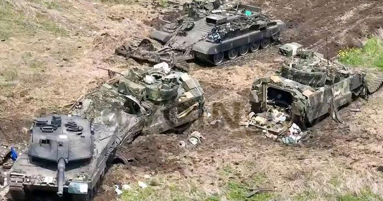

# 乌军趁乱反攻无果：严密防守的俄军战线前，还隐藏着密集的地雷阵

趁着俄罗斯私营武装瓦格纳集团在24日掀起的“叛乱”，乌克兰国防部副部长汉娜·马利亚尔表示，乌军利用俄罗斯的动荡局势，同时向多个方向发起反攻——但从各方消息反馈来看，似乎乌军这次反攻仍没有取得明显进展。

对此，俄罗斯方面倒显得风平浪静。原因无它——部署在俄乌冲突一线的俄军尚未因为瓦格纳集团之事而出现大规模调动，何况在严密防守的俄军战线面前，还隐藏着“永不松懈”的潜伏者——密集的地雷阵。

俄罗斯《消息报》25日称，正是依靠大规模和灵活部署的各种地雷，俄军才以相对较小的代价成功抵挡住了乌军近来的一系列反攻。西方军事专家也感叹称，俄军依靠地雷等构建的战场防御体系，是他们在乌克兰取得的罕见成功之一。

那么俄军都使用了哪些地雷呢？

俄媒率先举例称，各种可以利用远程火力快速部署的新型智能地雷首当其冲。例如俄军最著名的远程布雷系统是2021年投入使用的“耕作”系统，它是俄军在乌克兰部署的最新一代远程布雷系统，基于卡玛兹-6560型8×8军用卡车底盘研制而成，配备两组25个122毫米发射器，能发射反坦克地雷或人员杀伤地雷。该系统在几分钟内发射的地雷足以覆盖几个足球场那么大的区域，射程为5-15公里。它的主要特征之一是智能性，地雷可以编程设置为仅对付特定类型的目标，例如敌方装甲车或人员。该系统的传感器还可以检测友军，从而防止地雷误炸友军车辆。同时，地雷配备了定时自毁系统，从而降低平民伤亡风险。

2023年6月，面对乌军在顿涅茨克地区的弗列梅夫斯基突出部发起的反攻，俄军迅速在道路上利用“耕作”系统布设地雷，阻挡了乌军摩托化部队的快速推进，并导致多辆“布雷德利”步兵战车和“豹2”坦克被该系统部署的地雷所困和摧毁。

著名的“龙卷风”多管火箭炮系统也可以用于布雷，它的优点是一次齐射就可覆盖约500×800米的面积，地雷之间的距离通常不超过13-15米，从而严重迟滞乌军装甲部队的通过效率。

相比之下，采用T-72坦克底盘的“壁虱”近程布雷车具备更好的战场机动性，它可以携带多达270枚地雷。该系统可以布设POM-3型智能杀伤人员地雷，并配有一个弹跳式弹头，可击中8-12米范围内的目标。此外，该系统还配备有非接触式磁性目标传感器的PTM-4现代反坦克地雷。最近几周，该系统在扎波罗热地区成功使用，阻止了乌军进攻。

除了这些高效的新型地雷和布雷装备，俄军还在绵延的防御阵地上部署了大量老式地雷，包括“物美价廉”的TM-62M反坦克地雷。这种苏联时代研制和大批量生产的老式地雷被广泛用于俄乌冲突，双方都有大量坦克装甲车辆因此被炸毁炸伤。社交媒体上的照片显示，很多TM-62M反坦克地雷干脆就没有任何遮拦地摆在地面上——其实这样“摆明此处有地雷”的做法，反而更增加了雷区的威慑效果。

其实乌克兰也在想办法对付俄军地雷和障碍物。西方提供了多种加装扫雷犁的“豹2”坦克装甲车辆。但问题是乌军有限的专业工程设备不足以突破俄军密集的防御工事，并让乌克兰装甲部队利用缺口发起进攻。

_在这张著名的乌军战损照片中，就可以看到被摧毁的扫雷坦克_

最典型的战例就发生在6月8日，当时乌军第33旅和第47旅在马拉托马奇卡以南利用扫雷爆破索在俄军雷区开辟通道，然后装甲部队跟在装有扫雷犁的“豹2R”和BMR-2扫雷车后面试图突破雷区，但俄军侦察兵发现乌军动向后呼叫了武装直升机和火炮实施打击。由于在雷区开辟的通道过于狭窄，在俄军导弹、炮弹和地雷的联合打击下，乌军至少一辆“豹2”坦克、十几辆M2A2装甲车和3辆扫雷车受重创，进攻也没有取得进展。

面对俄军的地雷阵，乌军似乎还没有找到好办法。这正如专家所言，“对付高端装备，往往仅需要简单的打击方式”。

