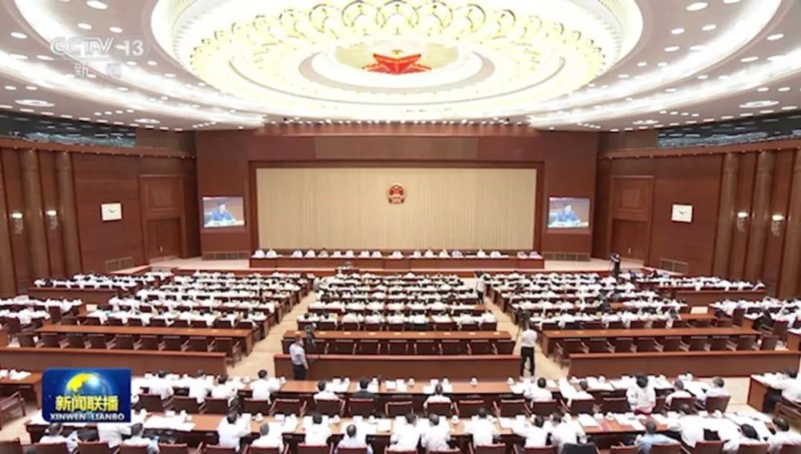
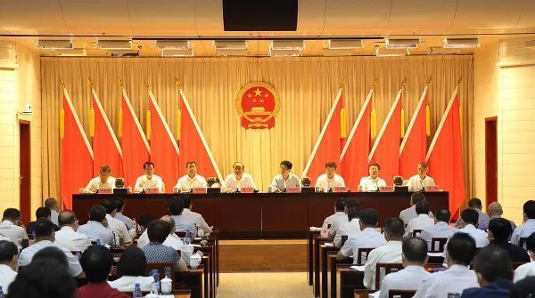

# 二十届中央审计委第一次会议后，重要报告披露，一些“毒瘤”已被铲除

**撰文 | 余晖**

6月26日上午，十四届全国人大常委会第三次会议在北京人民大会堂开幕。

据审计署官方报道，当日，受国务院委托，审计署审计长侯凯作了《国务院关于2022年度中央预算执行和其他财政收支的审计工作报告》。

**一个月前，中央审计委员会听取汇报**

政知君注意到，十四届全国人大常委会之前的两次会议是在3月和4月召开：

2023年3月14日，十四届全国人大常委会第一次会议召开。

2023年4月24日至26日，十四届全国人大常委会第二次会议召开。

十四届全国人大常委会第三次会议会期3天，将在6月28日闭幕。

这次会议一项议程是审议2022年度审计工作报告，6月26日作报告的是审计署审计长侯凯。

侯凯在2020年6月任审计署党组书记、审计长，至今3年。

5月23日，中共中央总书记、国家主席、中央军委主席、中央审计委员会主任习近平主持召开了二十届中央审计委员会第一次会议。

那是二十届中央审计委员会首次亮相。

据《新闻联播》报道， **二十届中央审计委员会第一次会议听取了中央审计委员会办公室关于2022年度中央预算执行和其他财政支出情况的审计报告的汇报。**

中央审计委员会是党中央决策议事协调机构。

2018年3月，中共中央印发了《深化党和国家机构改革方案》。方案中明确，组建中央审计委员会。

上述方案提到，组建中央审计委员会意在“加强党中央对审计工作的领导，构建集中统一、全面覆盖、权威高效的审计监督体系，更好发挥审计监督作用”。

**中央审计委员会办公室设在审计署。** 另据中央纪委国家监委官网显示，目前中央审计委员会办公室主任是侯凯。

**提要求**

政知君注意到，二十届中央审计委员会第一次会议对审计工作提出了一系列要求，其中提到：

聚焦推动兜牢民生底线， **紧盯人民群众最关心最直接最现实的利益问题** ，推动惠民富民政策落实。

聚焦权力规范运行，充分发挥审计在 **反腐治乱**
方面的重要作用，坚决查处政治问题和经济问题交织的腐败，坚决查处权力集中、资金密集、资源富集领域的腐败，坚决查处群众身边的“蝇贪蚁腐”。

在二十届中央审计委员会第一次会议之后，6月15日至16日，审计署党组理论学习中心组举办了贯彻落实二十届中央审计委员会第一次会议精神专题学习研讨。

审计署党组书记、审计长侯凯提到， **要进一步健全完善审计委员会和审计办运行机制，做到如臂使指。**

侯凯说， **“审计作为”能否适应“审计地位”的要求，成为当前和今后一个时期需要着力解决的重要问题。**

要围绕中央经济工作会议部署的 **财政、货币、产业、科技、社会**
5大政策，突出纲举目张的重大问题加大审计力度，促进各地方、部门和单位把党中央决策部署贯彻好、落实好。

**民生、反腐治乱**

“关注民生”“坚持反腐治乱”等也体现在了2022年的审计工作报告中。

先来看民生。

政知君注意到，去年，面对抗击疫情与稳定经济的双重挑战，在中央稳岗位保就业的政策大背景下，国务院和多个地方出台了援企稳岗的政策。

但审计报告显示，稳岗补贴却被某些公司滞留截留甚至骗取。

据央视报道，审计报告显示：

审计署重点审计了24省市和新疆生产建设兵团83个地区， **发现稳岗补贴被劳务派遣公司滞留截留和骗取等现象。** 此外，
**还存在部分地方职业技能培训弄虚作假；以及失业补助被蚕食等问题。**

接下来看反腐治乱。

央视报道，审计报告显示， **2022年5月以来，审计共发现并移送重大违纪违法问题线索300多起，涉及1800多人。**

6月26日，审计署官方网站发布了2022年度审计工作报告解读。

解读中提到，一年来，审计坚决查处政治问题和经济问题交织的腐败，坚决查处权力集中、资金密集、资源富集领域的腐败，坚决查处群众身边的“蝇贪蚁腐”。

审计工作报告对重大问题线索逐条梳理，深入剖析出相关违纪违法问题的4个特征：

一是 **行业性、系统性腐败突出，资金密集、资源富集领域是重灾区** 。

二是政商关系边界不清， **公器私用问题凸显** 。

三是 **基层“微腐败”和“小官大贪”** 时有发现，啃食群众获得感。

四是 **财经纪律执行松弛** ，扰乱财经秩序。

审计署还提到，下一步，审计机关将“加大对审计工作报告反映问题整改情况的跟踪督促力度， **全面整改情况将于年底前依法公告** ”。

政知君注意到，资金密集、资源富集领域的反腐工作，也是今年纪委的工作重点。

在2023年1月举行的二十届中央纪委二次全会上，中共中央政治局常委、中央纪律检查委员会书记李希指出：

深化整治 **金融、国有企业、政法等权力集中、资金密集、资源富集领域和粮食购销**
等行业的腐败，坚决纠治政商“旋转门”、“逃逸式辞职”问题，坚决清理风险隐患大的行业性、系统性、地域性腐败。

审计署官方发布的解读中还提到：

**审计与纪检监察部门建立健全审计查出重大问题线索及时移送、及时查办、及时反馈机制**
，以审计监督为起点、以案件查办为切入点、以地方主体责任落实为落脚点的贯通协同工作机制初步形成，
**铲除了一些严重阻碍改革发展的“毒瘤”，惩治了一批侵害群众切身利益的“蝇贪”。**

**资料｜新华社 审计署官网 央视**

**【版权声明】本文著作权归政知新媒体独家所有，未经授权，不得转载。**

