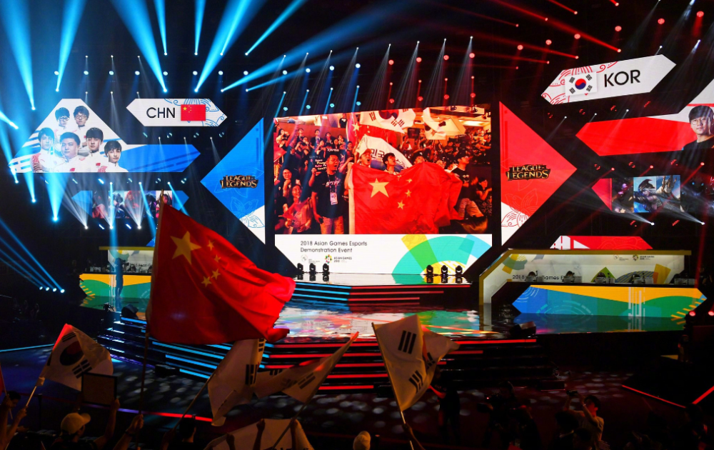
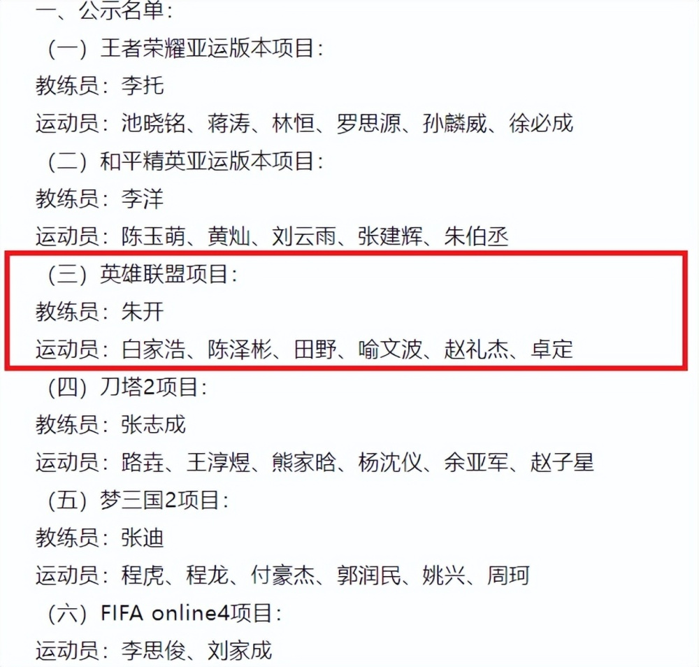
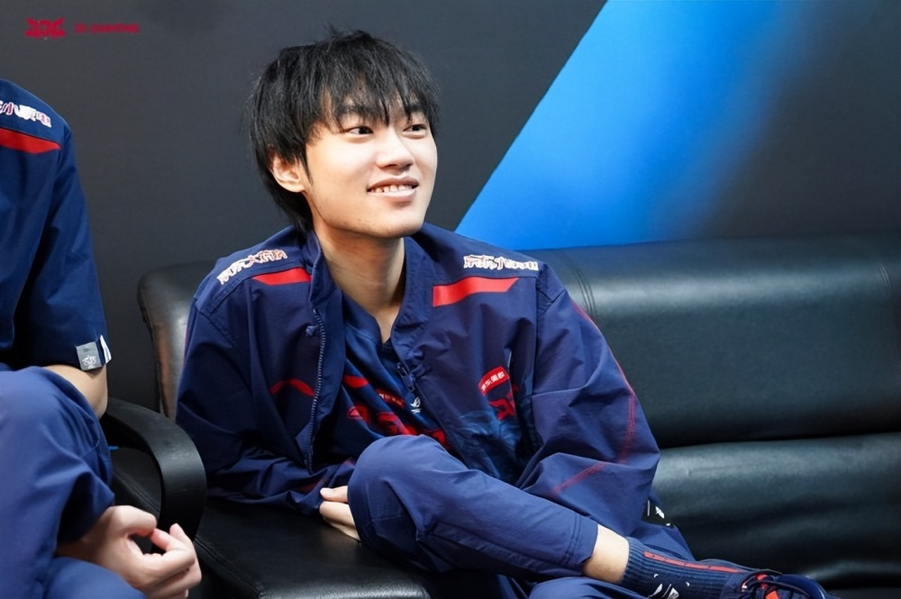
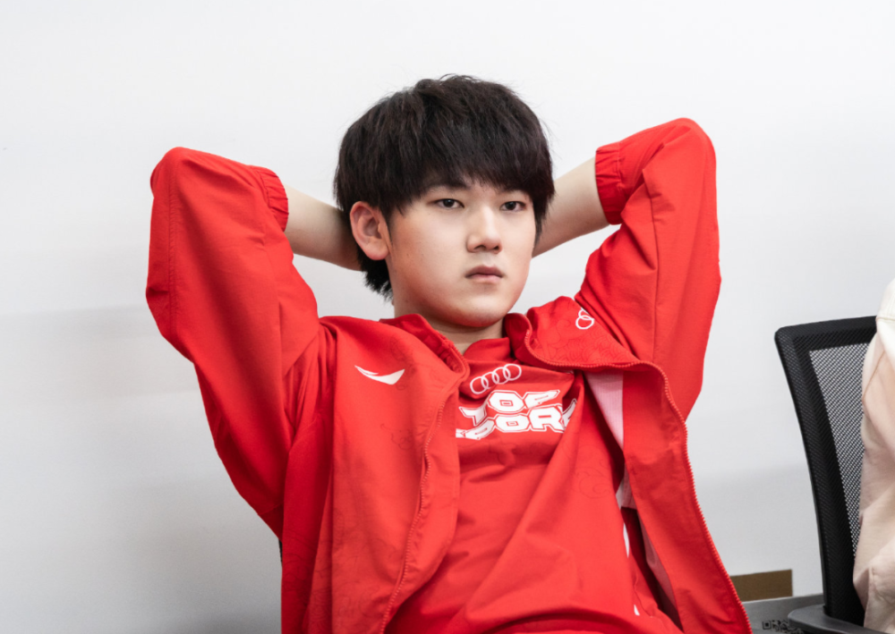
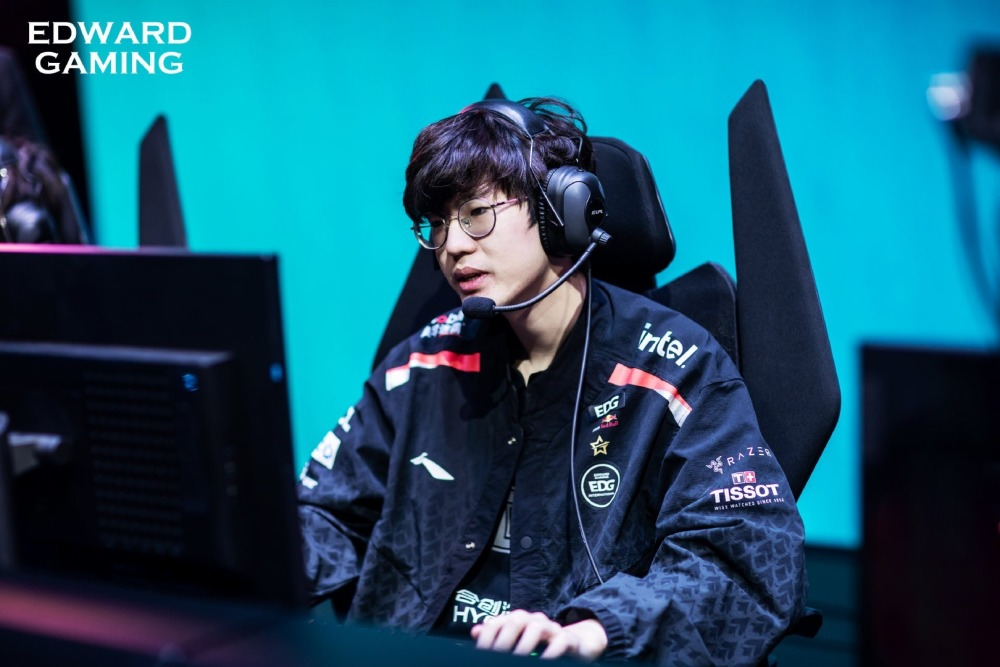
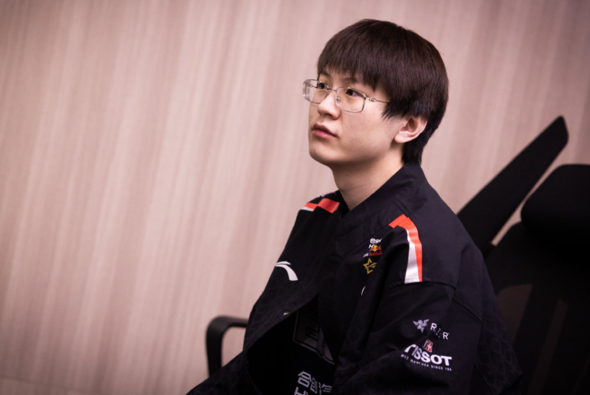

# 亚运会LOL国家队大名单公布！上单2人，打野jiejie，下路JKL加Meiko

今年LPL夏季赛的赛程安排得非常紧凑，就是为了亚运会让步。今年亚运会英雄联盟成为了正式比赛的项目，含金量和竞争力都提高了不少，特别是中韩两国都特别重视，都想要拿到英雄联盟项目的金牌。在夏季赛开赛之前，韩国队这边官宣了自己亚运会的最终大名单，而就在最近，中国队的亚运会LOL大名单也终于公布，一起来看看结果是什么吧！

具体名单如下，中国电子竞技国家集训队深夜发布了官宣，英雄联盟项目这一块，教练是EDG的教练朱开，选手是上单369和bin，打野jiejie，中单knight，下路JKL加meiko。

这个名单和之前爆料的非常接近，但是并不能让大家满意。按照队员的归属来看，JDG刚刚拿下春季赛冠军和MSI冠军，所以上中两人入选，可以理解，BLG拿到了春季赛亚军和MSI亚军，只有bin一个人入选，也勉强能接受。

下路AD这块，虽然说春季赛TES的成绩不如BLG，ELK也确实打得很好。但是在面对Ruler的时候，他几乎每次都被暴打，感觉被Ruler严重克制，所以由夏季赛状态更好的JKL来担任亚运会AD，也说得过去。当然还有一个原因就是，目前LPL这么多AD中，确实没人能在Ruler面前打出优势，好像也只能选择JKL了。

最让大家不满意的就是野辅，EDG的打野jiejie和辅助meiko入选。春季赛EDG没能打进MSI，夏季赛目前EDG成绩排名后半段，而且jiejie和meiko的状态都比较差。特别是jiejie，几乎每场比赛都在失误，感觉问题很大，而且打野位置明明有状态更好、今年成绩也更好的xun可以选择，结果还是选择了jiejie，只能希望亚运会的时候，jiejie状态不会这么差吧。

辅助这边也是一样，missing和ON目前都打得非常好，而且两人春季赛的成绩也很好，但是最后还是选择了meiko。meiko这个夏季赛的表现也不是特别好，但是被入选了，只能猜测是集训时打得特别好吧。

其实总体阵容看起来还行，2个MSI冠军加上3个S赛冠军，只是S赛冠军都是几年前拿的了，现在都不是当年夺冠的状态了。既然选出来了，还是相信吧，希望今年杭州亚运会上不会让大家失望吧！

那么，对于这份亚运会的最终大名单，你们有什么想说的吗？欢迎在评论区留言探讨。

