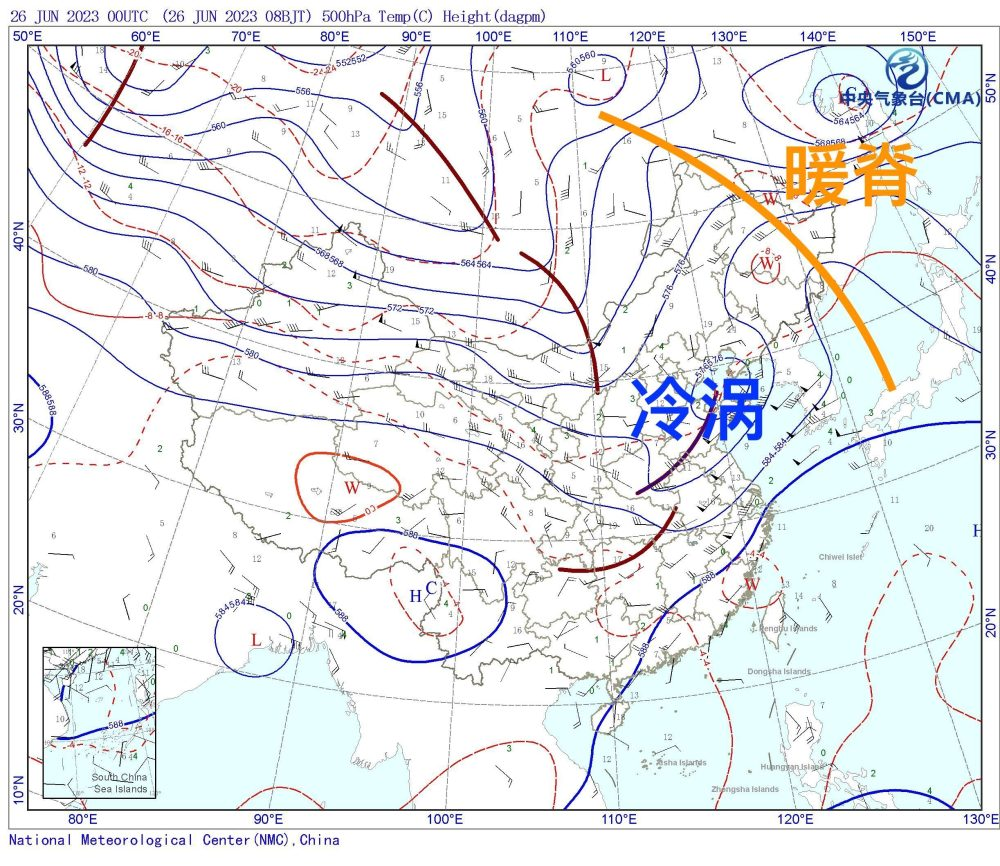
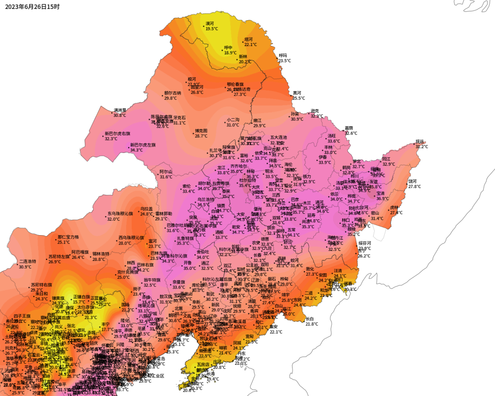
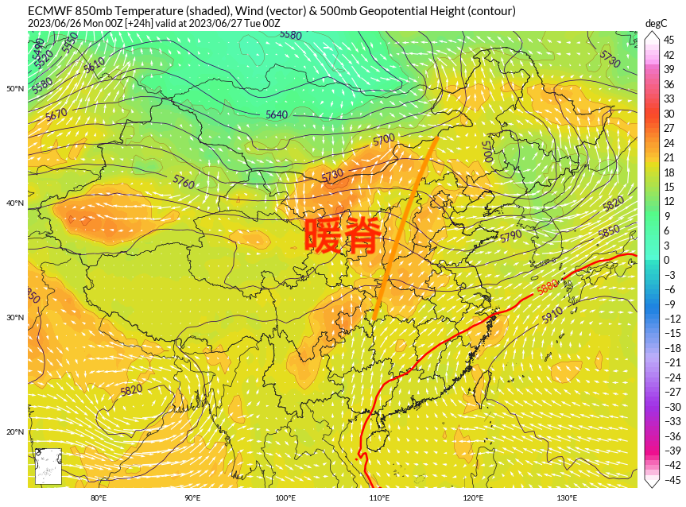
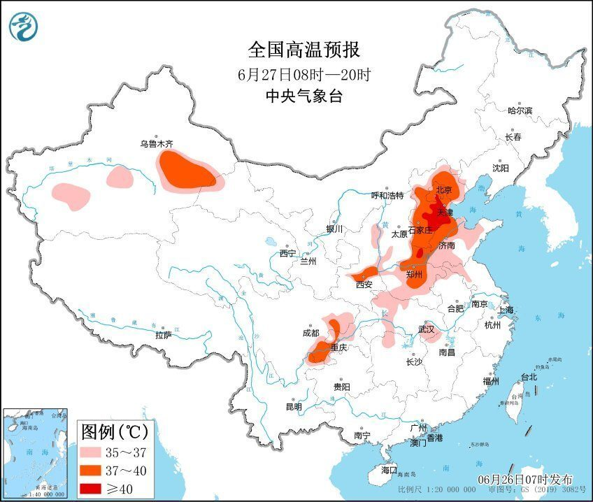
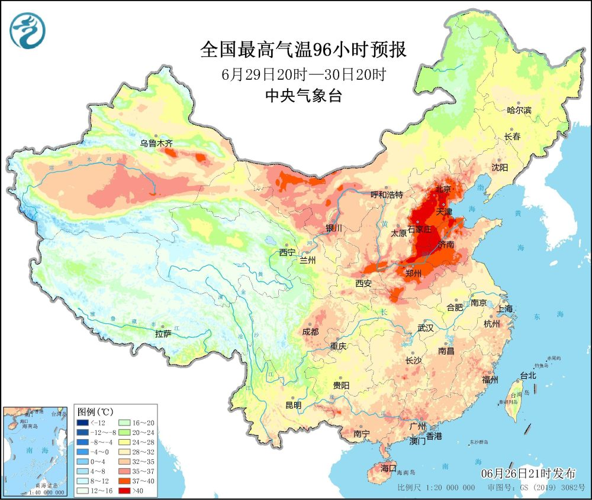
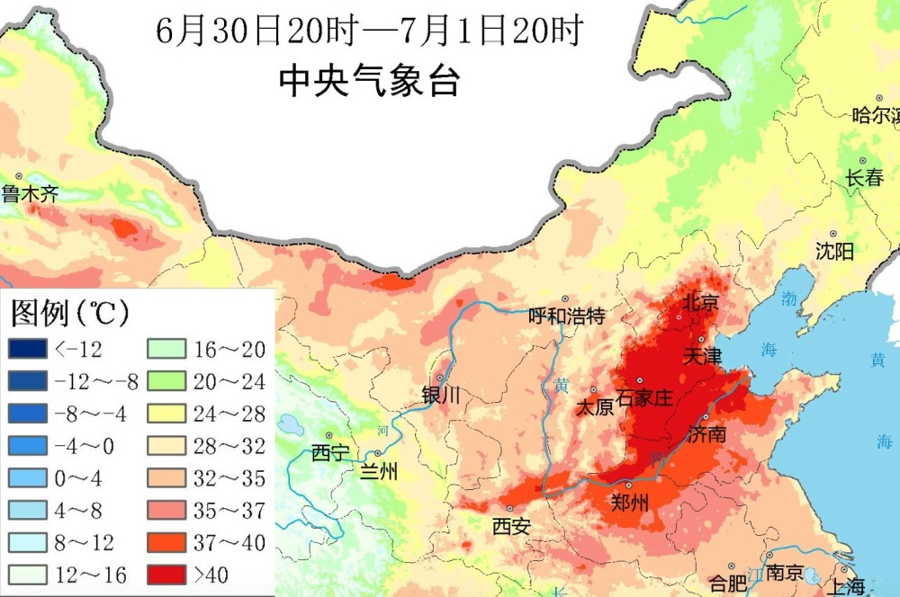
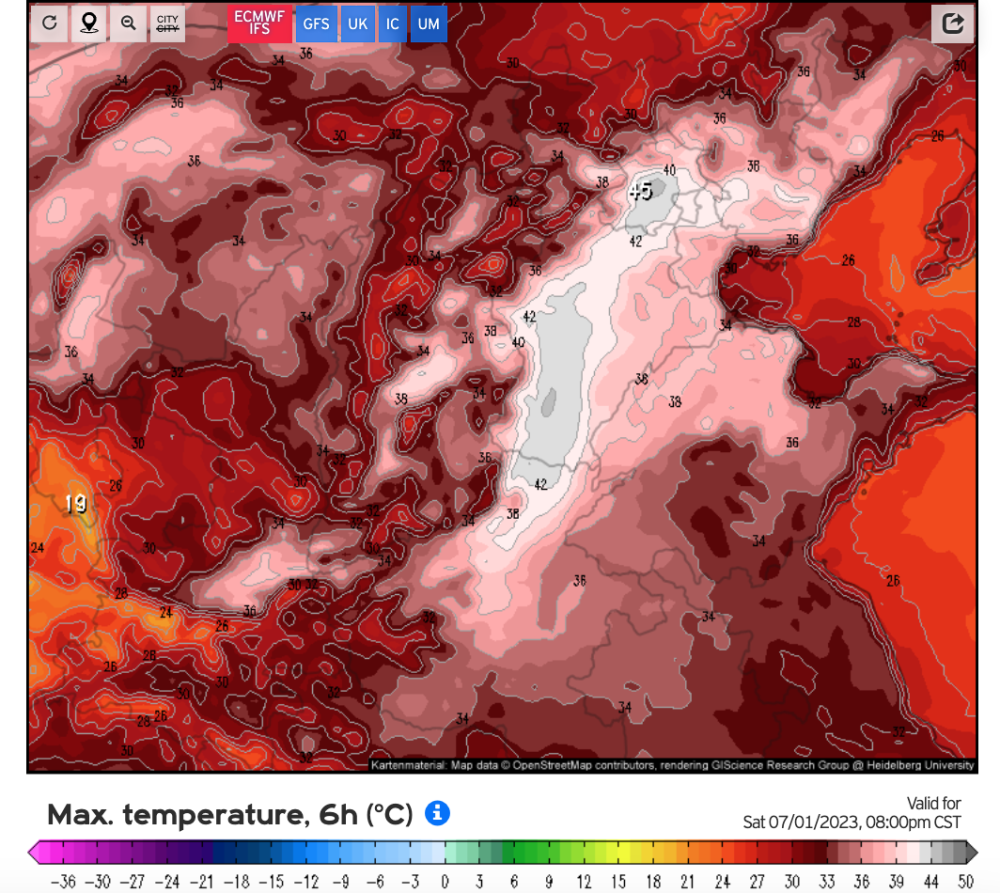
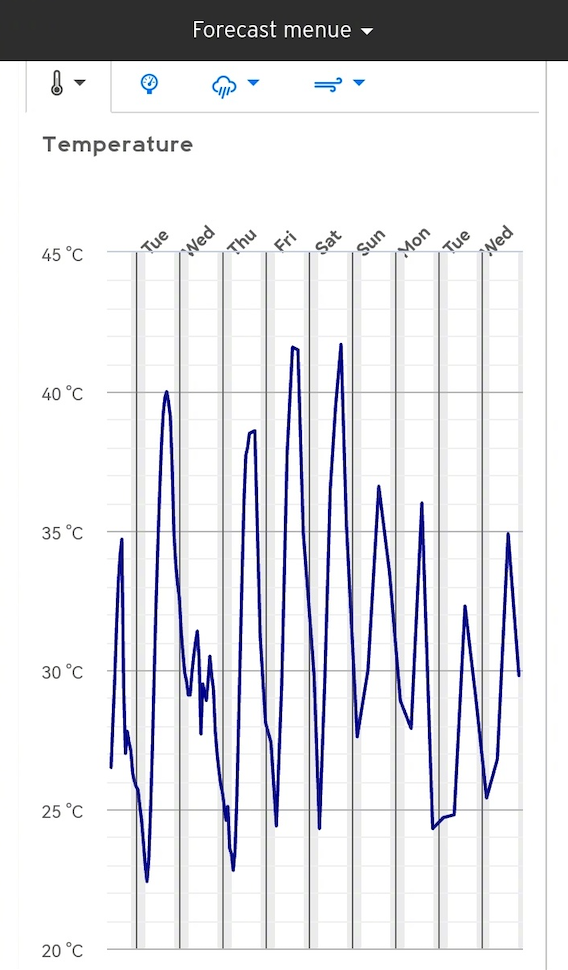
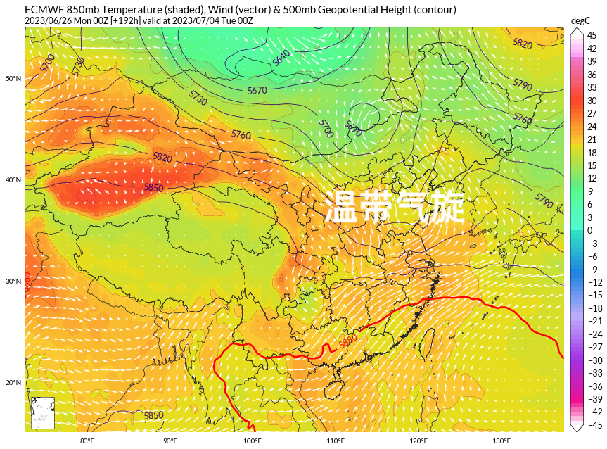
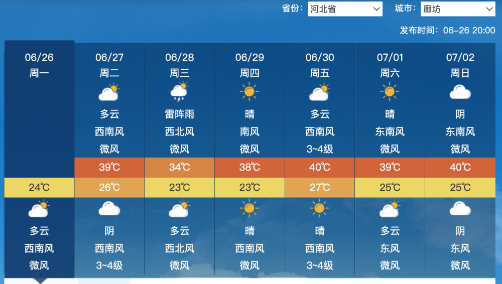

# 北方40度区域即将扩大！新一轮热浪或极端化，超算预测最高将达42度

6月26日上午8点，从500百帕层面天气图上看，今天随着冷涡南下，暖脊东移，我国中东部不少地方的高温正持续减弱。但处在暖脊影响下的东北，迎来了相当炎热的一天。

一、北方40度即将扩大

监测数据显示，下午15点，东北平原上已经大范围的出现35度以上的高温天气。比如今天下午，黑龙江哈尔滨冲上35度高温线，这是自2019年5月24日以来哈尔滨首次出现35度高温！除哈尔滨外，大庆、佳木斯、牡丹江和鸡西等站点也迎来高温。
​​​

但实际上，今年的西风带确实非常不平静，在冷涡快速东移后，又有一波暖脊正在向东移动。超级计算机的预测认为，6月27日，新形成的西风带暖脊就要再度爬上我国华北、黄淮等地。因此这两天短暂减弱的高温，马上就要增强。

中央气象台认为，从6月27日开始，新一轮高温天气就要在华北黄淮等地展开。中央气象台6月26日18时发布高温黄色预警：预计6月27日白天，华北东部、黄淮、汾渭平原以及新疆东部、四川盆地等地有35～36度高温天气，其中，北京、天津、河北大部、山东北部和西部、河南中北部以及陕西关中、四川盆地东南部和中部、云南东北部、新疆东部等地的部分地区最高气温有37～39度，河北中部、北京东南部、天津西部局地可达40度以上。

二、有极端化趋势

根据中央气象台的最新预报，在6月27日北方地区的高温热浪迅速发展起来后，6月29日起，40度以上的高温范围将进一步扩大。在最高气温预报上可见，华北黄淮40度以上热浪区将进一步扩大，涉及河北、河南、北京、天津、山东等省市。

尤其是6月30日-7月1日的高温预报可见，大范围的40度以上热浪区将广泛覆盖山东河南北京天津河北五省市，范围可能比上一波6月21日-6月24日的40度范围还要大，这种高温热浪的持续时间和强度都超过了历史同期的平均水平，具有明显的极端化特征。

三、调弱到最高42度

部分超级计算机此前的预报中，认为7月1日前后我国华北平原局部气温可达45度，让很多网友感到恐慌。

但超级计算机在随后的预报中逐渐调弱了华北平原北部的高温，比如北京，调弱到最高42度。当然，这样的预报还是非常惊人，因为北京南郊观象台历史最高气温也仅为41.9度，42度的气温足以打破纪录，显示出接下来的热浪可能非常猛烈。

那么，在进入7月之后，北方地区的高温热浪会有缓解吗？根据超级计算机的模拟结果，未来一周内，北方地区的高温热浪将呈现出先扩大后缩小、先加剧后减弱的趋势。具体来看，7月1日前后可能是我国北方地区的高温巅峰，40度以上的高温范围可能达到近期最大，并且部分地区的高温也将达到最强。但很快华北黄淮“热极生风”，7月3日起将逐渐有温带气旋系统发展起来，带来降温和降水，因此北方地区的高温热浪将逐渐缩小和减弱。

总的来说，接下来的一周内，北方地区的高温热浪将迅速发展，40度以上的高温范围将再次扩大，华北平原部分城市的预报中可见，可能出现多次40度酷热气温。这将对人们的生活和健康带来了严峻的考验，也给电力、交通、农业等部门带来了压力。因此，建议华北黄淮多省接下来要注意防暑降温，避免长时间在户外活动，尤其是中午时段。

