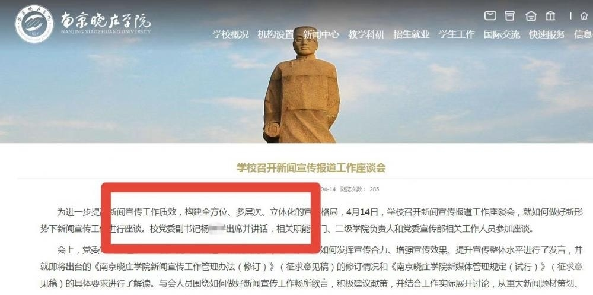

# 南京一高校领导被举报与他人妻子保持不正当男女关系 学校：调查中

6月26日，有人在短视频平台举报称，江苏南京一高校男领导与他人妻子长期保持不正当男女关系，引发关注。

_▲电梯内两人抱在一起。图片来源/举报视频截图_

该举报称，南京晓庄学院党委副书记杨某某，与他人妻子长期保持不正当男女关系。相关视频显示，电梯内，一名白衣眼镜男子与一名黑衣长发女子抱在一起，男子不停抚摸女子头发，随后二人走出电梯。

_▲南京晓庄学院官网显示，杨某某为该校党委副书记。图片来源/学院官网截图_

上游新闻（报料邮箱baoliaosy@163.com）记者在南京晓庄学院官网查询发现，杨某某确为该校党委副书记。

上游新闻记者联系上南京晓庄学院，该校宣传部工作人员介绍，学校已经注意到此事，已经开展调查，包括市里也对此展开调查，正在对杨某某本人进行谈话当中。对于调查结果，学校稍后将发布声明。

上游新闻记者 朱婷 实习生 张栩之

编辑：朱亮

责编：王蓉 官毅

审核：冯飞

