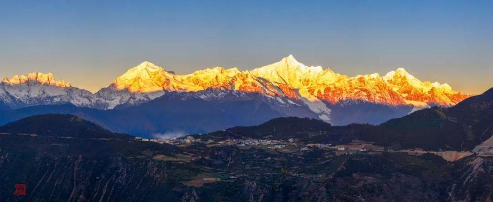

# 围墙挡景，“严禁偷窥祖国大好河山”？

近日，一则关于云南省迪庆州德钦县梅里雪山国家公园附近214国道旁修建围墙的新闻引起了争议。

据报道，这些围墙挡住了游客原本在公路边就能欣赏到梅里雪山全貌的机会，游客只能付费买票才能进入景区修建的观景平台赏景。

“过去远远就可以看到梅里雪山，现在一眼望去只有一堵堵围墙，大煞风景。”刚从云南旅游回来的张泽告诉中国新闻周刊，围墙很长，正常情况下绝对看不到围墙内的风光。

更让张泽感叹的是，如果游客想要借助无人机等高科技手段一睹雪山真容，抬眼就会看到不远处立着一块警示牌，上面写着“此区域禁止放飞无人机”。

可以说，为了防止游客“偷窥”，景区建立起了一道全方位无死角的“立体封锁线”。

虽然后续为了不让同行的朋友扫兴，选择买票进行参观，但张泽坦言“以后应该不会再来了”。他说，在川藏各地随处可见“免费”的雪山风光，不明白为何到了云南就被围起来不让看。

不止在德钦县，当下全国多地出现类似的情况。为了防止景区风景被“偷窥”，不少地方修建起了高高的围墙，阻拦了原本抬眼可见的自然风光。

景区的“严防死守”，自然引发了关于景区是否有必要“围墙挡景”的讨论，有网友甚至吐槽这是“严禁偷窥祖国大好河山”。

**并非个例**

对于“围墙挡景”一事，云南德钦县文旅局工作人员用“扶持村民”“旅游反哺”等说法来解释，称由于当地经济条件不好，委托德钦梅里雪山国家公园开发经营有限公司对景点进行日常经营和维护，旅游收益再发放给村民。

_梅里雪山。图/图虫创意_

该工作人员表示，随着当地旅游发展，景点可能会“扩大化”，也会慢慢取消（围挡），将来游客或无须前往观景平台付费即可赏景。

中国新闻周刊就梅里雪山的经营权，以及如何“旅游反哺”“扶持村民”等事宜多次致电德钦县文旅局，该局工作人员多次表示相关领导外出开会，后表示不方便直接接受采访，让记者联系德钦县宣传部。

德钦县宣传部相关工作人员则回复称，和领导汇报后再回电。但直至发稿，未得到任何回复。

事实上，“围墙挡景”并不是梅里雪山独创。今年“五一”假期，黄河壶口瀑布沿途公路被景区管理方砌墙围挡的新闻，就引发过舆论的关注与批评。

壶口瀑布东濒山西省临汾市吉县壶口镇，西临陕西省延安市宜川县壶口镇，为两省共有旅游景区。由于景区面积庞大，无论身处陕西还是山西境内，只要沿着毗邻壶口主景区的路段通行，都能观赏到壶口瀑布的壮观景色。

但不管是壶口瀑布山西侧，还是陕西侧的道路，如今都被围墙隔挡得严严实实，不少网友调侃，“黄河是我们的母亲河，进家门看望母亲难道还需要先买个门票？”

就此，陕西省延安市宜川县文旅局一工作人员称，在这里修建围墙，初衷是为保证游客安全。山西省临汾市文旅局一工作人员则回应，壶口瀑布景区正在进行内部扩建，出于安全考虑，在部分路段外围修建了围墙，并非为了防止游客偷窥景色。

一方称“关切游客安全”，另一方表示“正在施工”，网友似乎并不买账，并质疑：“弄个矮矮的防撞墩可以解决的问题，为何偏偏弄一个高墙？”

相比起部分景区在国道、省道上“筑墙”防偷窥，一些景区甚至在国道上收“过境费”，只有在规定时间内通过方可退款。

此前，一名博主发布视频称，他骑摩托车沿248国道行驶经过甘肃省甘南藏族自治州扎尕那景区时，被要求购买“过境票”，称如果在1个半小时内走完40公里的路程，抵达景区北门，那里的工作人员就会把费用退回。

但在该博主拍摄到的扎尕那门票收费标准中，并没有“过境票”一项。他认为，景区应该把“过境票”的规则解释得更清晰一些，以免有路过的行人不知道门票可以退，没有下车旅游，却还是花了门票钱。

南开大学旅游与服务学院副教授于海波向中国新闻周刊表示，当代游客的旅游需求重点之一是情绪和情感消费，“景区高墙遮挡的是风景，隔开的是人心”。

景区遮拦风景的目的是增加收入，但从网友爆料和评论来看，不仅途经现场的游客愤懑不满且绕路寻找平替观赏点，时不时涌上热搜的舆情，更是阻拦了潜在游客的出行步伐。

“没有美誉度带来的旅游人次，景区经济中的吃、住、行、游、娱、购，以及二次、三次和多元消费收入都难以实现，更不用提可持续发展。而且，由于负面口碑冲击，景区所在目的地或整个区域旅游经济都将受到潜在影响。”她说。

**“围墙挡景”背后**

刘长曾在某市旅游局担任领导职务，他告诉中国新闻周刊，以资源换取资金，是各地景区主要采取的开发模式之一。

他坦言，政府在对景区规划时通常会考虑其可持续综合发展，对基础设施和相关服务设施建设等非常重视。但企业在获得经营权之后，往往会急于寻求快速变现，为将景区资源尽快转化为资金，容易忽略其长远发展。

据刘长介绍，通常来说，景区的开发与发展往往需要大量资金的持续投入，无论是基础设施建设还是服务设施的建设，都需要耗费大量资金，因而政府在景区开发方面也很为难。

此外，即便让文旅局全权负责景区建设，也会由于缺乏专业知识和经验，无法胜任。再加上大部分政府面临资金紧缺困境，因此往往会和企业进行合作开发。而此类企业大多为国资控股，具备整合当地资源的能力。

以德钦县为例，据企查查显示，负责经营梅里雪山的梅里雪山国家公园开发经营有限公司由迪庆州旅游集团有限公司100%控股，为国有独资公司。迪庆州旅游集团有限公司由云南民族文化旅游产业有限公司、迪庆藏族自治州财政局分别持股51%、49%。

刘长还提到，一些地方的景色和资源相对较一般，但为了发展旅游业，当地政府会将这些地方围起来，强行打造成景区，并投入大量的资源与资金进行开发。

“这种模式就是企业出钱，政府提供资源。”刘长透露，一般政府和企业合作的前几年，会收一笔资源补偿费，之后企业开始政策经营，税收正常缴纳。

由于景区开发投资金额非常高，回报周期长，具有一定投资风险，因此一般经营权转让年限会比较长。

因此，政府和企业通常会签订一份合同，如当景区营收或门票收入达到一定额度时，政府会和企业共同分账，当地政府会从中抽取一定比例资金作为地区资源的回报。

刘长表示，从企业角度来看，企业要生存要发展，肯定会想方设法进行创收，门票是其中很重要的一项收益，各地“筑墙”行为自然难以杜绝。

“虽然各地都在讨论减少对门票经济的依赖，但实际上，对于一些欠发达地区，门票的确会对当地旅游收益产生影响。”他提到，某些景区虽然没有建围栏，却不是因为不想建，而是没必要，因为大部分景点只有进了景区才能看到。

“如果你在景区外就能看到好风光，你会选择买票吗？”在刘长看来，一些旅游收益模式比较单一的地方，这种门票损失是当地无法忍受的“亏损”。

不过，也有评论认为，即便明知门票收入对于诸多景区乃至地方政府非常重要，但若游客都选择远观而不愿去体验游玩，就应该反思，究竟是门票定价过高，还是服务没有跟上？

世界旅游城市联合会特聘专家王笑宇曾在多个大型文旅集团、主题度假区和景区担任项目负责人，他对中国新闻周刊表示，表面看“围墙挡景”是行政配置资源的滞后思维模式，以及短视的资源变现的投机行为，而底层逻辑则是景区开发及运营主体创新意识不足、创新能力匮乏，缺少市场配置资源的专业能力，只能依靠行政配置资源去解决问题。

他说，中国的社会经济已经进入后高速增长阶段，这对文旅市场提出了新的要求，即观光旅游品质化，休闲度假旅游主题化、体验化、多元化。传统景区因为意识不足、能力缺失，行政配置资源逻辑依旧，就造成了产品单一、体验缺失，又强化短期资源变现，就出现了这些违背市场的行为。

至于各地景区外修筑的围墙、围挡等能否拆除，刘长直言“难说”。他说，一些地方由于景区经营权和自主权已经被一并转让，兼之背后成因复杂，很难“一拆了事”。

于海波认为，景区开发与旅游者权益不冲突，但一些地方封闭型发展思维以及门票经济思维，使得部分景区与游客关系紧张，负外部性效应明显。

她说，口碑是区域旅游发展的生命线，各地区尤其是边远地区、欠发达地区应重视当今旅游市场中的游客足迹跨区域化但口碑一体化的特点，重视区域旅游品牌，强化区域旅游协作。

她认为，高墙极大破坏周边大地景观完整性，需要整改，更重要的是对此类事件要防微杜渐，建议景区开发在审批阶段就要进行景区建设风貌与大尺度环境景观协调性的评审论证，同时对途经游客大地景观观光权的相应保障也要进行评审论证。

**是否涉嫌违规？**

那么，景区“围墙挡景”是否有法律依据？

北京合川律师事务所律师李雷对中国新闻周刊表示，我国有《旅游法》和《风景名胜区条例》，分别属于法律和行政法规，都具有很高的法律位阶。对于风景名胜区，从申请设立到日常管理都是有法可依的。

《旅游法》第四条规定：旅游业发展应当遵循社会效益、经济效益和生态效益相统一的原则。国家鼓励各类市场主体在有效保护旅游资源的前提下，依法合理利用旅游资源。利用公共资源建设的游览场所应当体现公益性质。

李雷认为，从上述法律条文来看，经济效益并非是旅游业应当追求的唯一目的，尤其是依托名山大川等公共资源建设的风景名胜区，更要体现出公益性质，更应该把社会效益放在经济效益之前。

但显然，从目前各地来看，风景名胜区管理部门修建围墙（或围挡）的主要目的是获取更大的经济利益，只有少数考虑了社会效益、经济效益和生态效益之间的平衡。

“我们不能认为《旅游法》第四条的规定只是宣示性的口号，而是应该以实际行动贯彻立法者的价值判断，尤其是对于政府旅游部门的管理者而言。”李雷说。

此外，《风景名胜区条例》第二十一条规定：风景名胜区内的单位和个人应当遵守经批准的风景名胜区规划，服从规划管理。风景名胜区规划未经批准的，不得在风景名胜区内进行各类建设活动。

第十八条规定：编制风景名胜区规划，应当广泛征求有关部门、公众和专家的意见；必要时，应当进行听证。风景名胜区规划报送审批的材料应当包括社会各界的意见以及意见采纳的情况和未予采纳的理由。

在李雷看来，景区修建围墙应当符合相关规定。修筑此类围墙在当初编制规划时是否征求了意见、进行了听证，也应该对社会进行相应的说明。

李雷认为，在实践中，政府管理部门通过和公司合作，来经营风景名胜区，但是政府部门不应把风景名胜区的管理完全当作一种经济行为，而是仍然要坚持依法行政，避免公法遁入私法。

值得一提的是，疫情之后各地文旅行业都“卷”了起来，前有淄博烧烤出圈，后有文旅局长纷纷上阵，邀请游客前来“打卡”，美丽的风景已不再是景区唯一的吸引力。

王笑宇认为，随着社会经济由高速增长的工业型生产社会，向后工业型的消费社会转向，商品经济向体验经济转型，原有的观光景区和体验度假需求，逐渐转变为品质观光和多元细化的主题休闲度假体验。

张泽坦言，当下可供旅游的选择很多，如果一个地方口碑坏了，他们完全可以选择去另一个地方。“大好河山，雪山不止一座，河流不止一条，主题公园不止一座，能替代的还有很多。”他说。

于海波说，自然资源依托的景区门票经济日渐式微，探寻景区门票经济的补偿、替代、升级方案势在必行。

（应受访者要求，刘长为化名）

作者：陈淑莲

