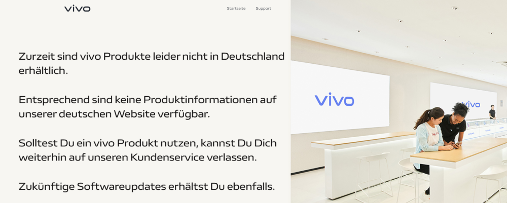
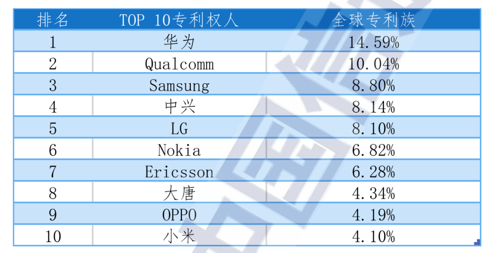
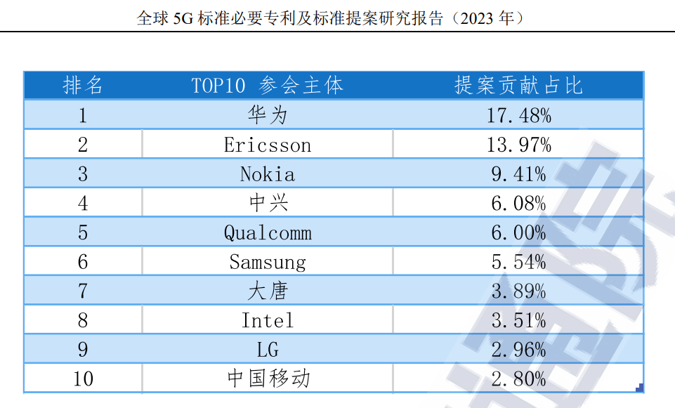
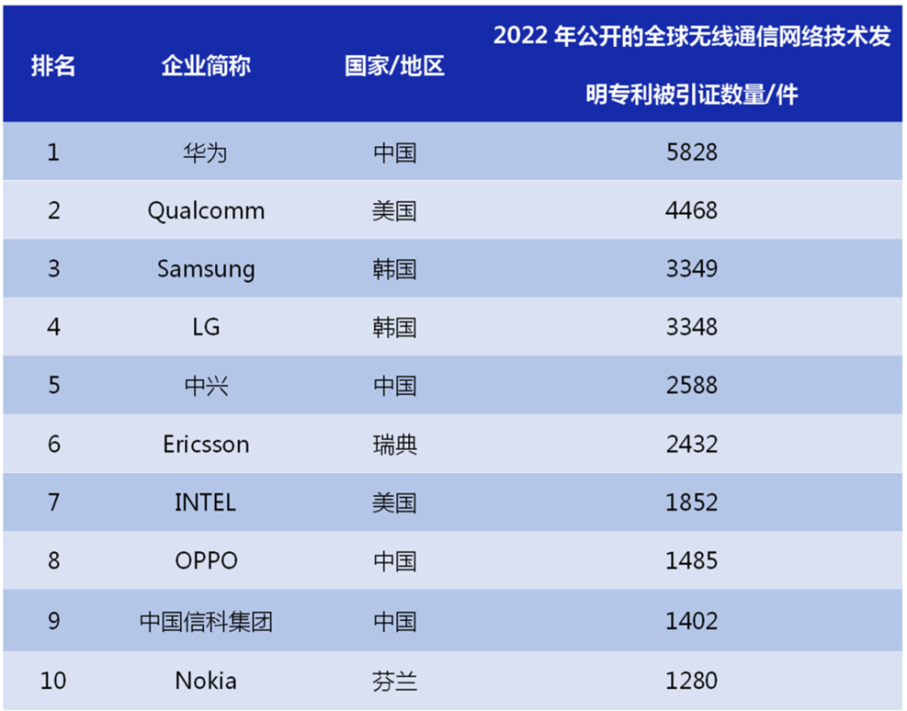

# 多个中国手机品牌暂停在德国销售，怎么回事？

【文/观察者网 吕栋】

尽管在与诺基亚的专利诉讼中“折戟”，但“坚决反对专利不合理高价收费”，OPPO、一加、vivo等中国手机厂商已相继暂停在德国的产品销售。

如今，“步步高系”的最后一个手机品牌realme也正经历相同的事情，有可能退出德国市场。

日前，据国外关注电子产品的媒体“Nextpit”报道，realme负责欧洲市场的办公室证实，由于和诺基亚的诉讼“未决”，在经过一些内部磋商后，该公司在德国的业务已经“放缓”。

Nextpit的报道指出，realme并没有明确表示会退出德国市场，但“结果应该是相似的”。

另外一家科技媒体androidauthority则直接写道：“realme关闭了在德国的智能手机业务，标志着步步高电子彻底退出了德国市场。”但这并没有得到realme的证实。

观察者网就相关报道联系realme方面，截至发稿，暂未获置评。

宁愿停售产品甚至退出市场也不妥协，中国手机品牌为何要在欧洲“硬刚”诺基亚？

_Nextpit报道截图_

**“要价太高确实很难承受”**

根据Nextpit的报道，realme仍在等待与诺基亚专利许可谈判的积极信息，以便可以在德国恢复选定的营销措施。但在那之前，该公司将把预算转向欧洲其他市场。因此，消费者可能不会在德国商店看到最新发布的realme
11系列，同样的停售情况也很可能出现在法国。

在Nextpit看来，realme的德国业务将因诺基亚专利诉讼而受到“限制”，基本上只是时间问题。

早在去年8月，德国《经济周刊》（Wirtschaftswoche）就曾报道，由于诺基亚提起专利诉讼，慕尼黑的一家法院对OPPO和一加（OnePlus）下达了销售禁令。此前几个月，德国法官已做出不利于OPPO的判决，而诺基亚选择强制执行。在此背景下，OPPO可能会彻底退出德国，受影响的还有其他手机品牌。

OPPO就此事向观察者网回应指出，OPPO尊重知识产权并倡导合理收费，倡导以友好协商的方式解决许可人和被许可人之间的知识产权争议，互相尊重专利价值。另一方面，OPPO坚决反对专利不合理高价收费，坚决反对以诉讼胁迫被许可人谈判和接受不合理高价许可费的恶意行为，倡导建立长期健康的知识产权生态。

_OPPO德国官网已没有产品信息_

在德国《经济周刊》看来，OPPO之所以选择“告别”德国，纯粹是出于经济层面的考虑。

根据报道，OPPO手机在全球的出货量接近2亿部，而在德国的销售占比只有1%。为了这1%的销售额，OPPO将被迫寻求诺基亚在全球的专利许可。而诺基亚提出的每部智能手机2.50欧元（约合人民币19.56元）的许可费用，可能会导致OPPO很快丧失竞争力，因为OPPO在亚非拉等中低收入国家的利润率很低。

受诺基亚专利诉讼“大棒”影响的还有vivo。今年4月，德国曼海姆地区法院在一审判决中裁定vivo侵犯诺基亚的三项蜂窝标准必要专利（SEP），该法院同样授予了诺基亚针对vivo的禁令。5月底，vivo已清空德国官网，并决定暂时停止在德国市场销售产品。

与OPPO的诉讼案类似，专利费率的合理性同样是诺基亚和vivo的争议焦点。

_vivo德国官网_

诺基亚方面表示，vivo用于支付其设备使用的诺基亚专利技术的专利许可协议于2021年12月底到期。而在许可协议到期之前，诺基亚已与vivo进行了续约谈判。“遗憾的是vivo拒绝接受我们公平合理的报价。我们还提出进行独立和中立的仲裁，但也被vivo再次拒绝。”

但vivo认为，诺基亚的专利报价并不合理。该公司向观察者网表示：“近年来，我们与多家头部公司在互相尊重专利价值的共识下达成了交叉许可。同时，我们持续在与诺基亚协商交叉许可续约事宜，但我们认为诺基亚没有履行以‘FRAND’（公平、合理和无歧视）原则提供合理许可的义务，双方暂时未能达成一致。”

观察者网了解到，并非传言中的5G，vivo此次与诺基亚的专利诉讼主要涉及4G相关专利。

市场上有接近vivo的业内人士透露，在新的协议报价中，诺基亚提出了远超于之前协议的报价，一旦接受，行业效应将会对中国手机厂商带来更大负面影响。“虽然打的是3G、4G的官司，但是诺基亚采取这种激进的方式，其实是试图通过诉讼的手段压迫vivo接受之后包括5G专利费用在内的专利收费条款。”

OPPO方面的观点也类似。该公司首席知识产权官冯英坦言，“4G的时候我们已经和诺基亚签订了合作协议，5G的时候要价太高确实很难承受，现在硬件的利润率并不高，收取专利费的公司越来越多，每一家公司都水涨船高，会导致硬件的成本越来越高。如果按照诺基亚的费用标准，手机厂商不可能有盈利空间。”

实际上，相比OPPO和vivo等品牌来说，小米在德国市场的出货量更大。根据可查到的Canalys数据，2021年三季度，小米手机在德国市场的份额23%，仅次于苹果（32%）和三星（29%）；而OPPO的份额只有3%，排在第四；第五是诺基亚品牌手机授权制造商HMD，份额同样为3%；vivo则没有进入前五。

由此可以看出，对OPPO和vivo来说，暂停在德国销售确实影响不算大，甚至在整个欧洲，vivo也基本上没有进过前五，中国和印度市场才是重中之重，这可能也是OV选择在欧洲“硬刚”诺基亚的底气所在。但另一个问题是，为何出货量更大的小米可以在诺基亚的“专利战”中独善其身？

科技自媒体“智东西”曾在文章中写道，2021年，在新一轮的知识产权续约周期里，小米选择了OV不一样的路，在OV“硬刚”诺基亚时，小米继续承受着诺基亚开出“条件”。对于小米而言，在2017年与其诺基亚签署协议时就有购买行为。而且小米在长期的专利纠纷中，已经选择了“打不过就买”的模式。

而对OV来说，随着二者手机在全球市场的快速崛起，OV身上所蕴藏的知识产权授权许可费用，也被全球各个专利人所觊觎。如果此时向诺基亚低头，那接下来将会面临更多的“专利战”。

**“既然华为贡献率排第一，凭什么其他企业收得更多？”**

众所周知，通信行业的标准化程度非常高，而标准必要专利（SEP）是实施标准技术时必不可少的。

根据中国信通院今年4月发布的《全球5G标准必要专利及标准提案研究报告》，从有效全球专利族的占比来看，华为的有效全球专利族数量占比为14.59%，排名第一；高通排在第二，占比为10.04%；三星排在第三，其占比为8.80%。排名第四至第十的依次是中兴、LG、诺基亚、爱立信、大唐、OPPO和小米。

_数据来源：中国信通院_

然而，对于具体的专利怎么收费问题，行业中却一直没有统一的标准。

在国外厂商中，爱立信早在2017年就公布5G多模手机专利费标准，主要根据手机售价不同有所调整，单台手机专利费用上限5美元；诺基亚2018年将5G
SEP组合的许可费上限为每台设备3欧元；高通的标准是5G单模手机将按照手机售价2.275%来收取，5G多模手机按售价的3.25%收取，以单价500美元的手机算，高通单模和多模手机分别收取的费用为11.4美元和16.25美元。

在中国厂商中，2021年3月，华为知识产权部部长丁建新透露，华为将从2021年开始收取5G专利授权许可费，并将提供适用于5G手机售价的合理百分比费率，单台手机许可费不超过2.5美元。从定价上看，华为的收费标准远低于其他海外专利权人已公布的费率。

根据中国信通院发布的前述5G专利报告，华为的5G提案贡献度为17.48%，排名第一；爱立信的占比是13.97%，排名第二；诺基亚以9.41%的占比排在第三。而根据公开的5G许可费标准，诺基亚的5G许可费（3欧元每台）至少是华为的1.4倍。

_数据来源：中国信通院_

这也引起了一些中国手机厂商的不满，“既然华为贡献率排第一，凭什么其他企业收得更多？”、“4G时代，国产手机的专利确实少，但5G不一样了，现在华为的专利最多，但诺基亚收取的专利费比华为的还高，就是想靠专利收钱。”

想靠专利赚钱，对诺基亚来说确实是事实。

过去五年，诺基亚的专利许可业务年营收一直保持在10亿欧元以上。2021财年，诺基亚专利授权业务的营收占比虽然只有5.72%，净利润占比却达到了40%。2022财年，诺基亚的专利授权费用收入也高达15.95亿欧元（约合人民币125亿元，），在该公司整体收入中的占比提高至6.4%，利润率高达99.7%。

为了专利费这块“肥肉”，诺基亚已经在全球范围内对中国手机品牌采取了行动。

不完全统计显示，从2021年开始，诺基亚在英国、德国、荷兰、巴西和印度等10余国起诉OPPO，累计案件超过100多起。仅在德国，双方的专利交叉起诉就多达十几个，诺基亚方面对OPPO发起了30多起诉讼，原因包括双方未能就5G专利许可达成一致等。

2022年，诺基亚又因相似的理由在德国、印度尼西亚、印度、中国等全球多个司法管辖地区起诉vivo，诉讼聚焦于蜂窝标准必要专利以及覆盖连接的实施专利的组合。

在德国《经济周刊》看来，如果法国、西班牙、英国、荷兰、芬兰和瑞典等欧洲国家的法院遵循德国的判决，OPPO存在彻底退出西欧市场的风险。而与之相反的是，诺基亚在新兴国家的法庭上，可能难以构建类似的威胁。有专利专家指出，德国与世界其他国家之间不同的法律理念，加深了东西方之间的地缘政治分歧。

根据市场调研机构Canalys数据，2023年一季度，三星、苹果、小米、传音和联想在欧洲手机市场出货量排名前五。而在去年同期，排名前五的是三星、苹果、小米、realme和OPPO，彼时realme增速高达177%。

对欧洲消费者来说，中国手机厂商退出市场不一定是好事。德国《经济周刊》文章指出，OPPO和vivo各提供德国10%的手机供应，如果他们的手机从德国货架上消失，这对消费者可能意味着更高的手机售价。

**中企如何维护自身合法权益？**

对中国手机品牌来说，在海外遭遇专利纠纷，首先是要积极使用法律武器维护正常权益。

多年前有个典型案例，美国公司IDC拟授权给华为的专利许可费，远远高于苹果、三星等公司。当华为不接受时，IDC将华为起诉至美国特拉华州法院，并向美国国际贸委会（ITC）起诉，称华为侵犯其7项标准必要专利，请求对华为启动“337调查”，并禁止华为制造、销售、进口相关产品。

华为则选择将IDC诉至深圳市中级人民法院，认为IDC违背了其承诺的义务，请求法院判令其按照“公平、合理、无歧视”（FRAND）原则，确定IDC就其标准必要专利许可华为的许可费率或费率范围。

最终，深圳中院裁定，根据FRAND原则，标准必要专利许可使用费率应为0.019%，大大低于此前IDC要求的2%。IDC不服，上诉至广东高院，后者于2013年10月作出终审，基本维持一审的裁决。

后来，华为又向发改委举报IDC滥用市场支配地位。自从发改委对IDC启动反垄断调查后，IDC开始不断降低与华为的谈判条件，并最终不仅将之前几年没有发生的专利费撤销，而且全面撤销了在美国对华为提起的337调查。经过一系列博弈，华为最终和IDC达成和解。

当然，在法律武器之外，积极布局相关专利“自我防卫”也必不可少。5年前，OPPO在全球的专利不到1万件，而目前OPPO已在全球40多个国家及区域布局专利，申请专利接近9万件，其中发明专利占比达90%。

截至2022年5月，vivo累计共申请4000多项5G发明专利，向3GPP标准化组织提交5G提案近8000篇。而截至2022年底，小米全球专利授权达到30000多件，正在审查中的专利申请超过25000件。

根据第三方公布的2022年全球无线通信网络技术发明专利排行榜（TOP100），华为、OPPO、vivo、中兴、小米等5家中国厂商进入TOP10，其中华为仅次于高通排名第二。另外，中国信科集团、中国移动、中国电信、紫光展锐、中国联通等中国厂商也在TOP100榜单内。

但专利的价值不能只看数量，只有把专利建立在极强的自主创新能力上，才有可能突破其他专利巨头的封锁，或与之签署交叉专利许可协议。在这方面，华为与诺基亚等巨头的专利较量可能同样值得研究。

_2022年全球无线通信网络技术百强企业专利被引证数量TOP10
数据来源：incoPat_

目前已开始收专利费的华为，虽然引发了外媒的关注，但并未落下“不合理”收费的名声。

近期，日媒在报道华为向30家日企收取专利费一事时提到，华为要求的专利使用费是每台通信设备50日元（约合2.5元人民币）以下的固定费用、系统售价的0.1%以下的费率。熟悉知识产权授权交涉的东京大学客座研究员二又俊文坦言，“这是国际上合理的水平”。

2019年6月，华为总裁任正非曾表示，华为很多知识产权不会武器化，知识产权是相互交叉许可，“我们太忙了，发展太快了，没时间收取专利费，当我们不忙的时候，闲下来的时候，即使要专利费，也不会像高通一样要那么多”。

