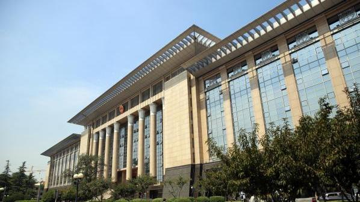

# 戒毒医院医生向多名吸贩毒人员贩卖精神药品牟利，被判处有期徒刑六年

_最高人民法院 视觉中国 图_

涉麻精药品犯罪引发最高法关注。6月26日，最高人民法院公布10起毒品犯罪和涉毒次生犯罪典型案例。澎湃新闻注意到，在一起贩卖毒品案中，有医务人员多次向吸贩毒人员贩卖国家规定管制的能够使人形成瘾癖的精神药品。

最高法院刑五庭庭长李睿懿表示，近年来，我国毒情呈现整体向好态势，但受国际国内多种因素影响，禁毒工作仍面临诸多风险挑战。其中，医疗用途的麻精药品和依托咪酯、“笑气”等非列管物质流入涉毒渠道问题不容忽视。

澎湃新闻注意到，前述典型的案例中有4起涉有医疗用途麻精药品，占比为历年最高，旨在进一步提高广大群众遵规守法和安全用药意识。

案情显示，被告人夏继欢系重庆市某营利性戒毒医院医生，具有开具国家管制的第一类精神药品盐酸丁丙诺啡舌下片处方资格。2020年7月至2021年5月，夏继欢冒用他人名义开具虚假处方，以每盒170元的价格从医院骗购盐酸丁丙诺啡舌下片，明知购买者系吸贩毒人员，仍多次以每盒350元至450元不等的价格向多人贩卖，且均未开具相应处方，共计出售422盒（10片/盒）。

此案由重庆市万州区人民法院一审，重庆市第二中级人民法院二审。法院认为，被告人夏继欢身为依法从事管理、使用国家管制的精神药品的人员，向贩卖毒品的犯罪分子或者以牟利为目的向吸食、注射毒品的人提供国家规定管制的能够使人形成瘾癖的精神药品，其行为已构成贩卖毒品罪。夏继欢为谋取非法利益，多次向多名吸贩毒人员贩卖盐酸丁丙诺啡舌下片，情节严重。据此，依法对被告人夏继欢判处有期徒刑六年，并处罚金人民币十二万元。

最高法在阐述案例典型意义时指出，近年来，随着我国对毒品犯罪的打击力度持续加强，部分常见毒品逐渐较难获得，一些吸毒人员转而通过非法手段获取医疗用麻精药品作为替代物滥用，以满足吸毒瘾癖，具有医疗用途的麻精药品流入非法渠道的情况时有发生。

“本案系一起戒毒医院医生向吸贩毒人员贩卖国家管制的精神药品牟利的典型案例。”最高法表示，盐酸丁丙诺啡舌下片属于国家管制的第一类精神药品，具有医疗用途，但被滥用极易形成瘾癖，兼具药品与毒品双重属性。被告人夏继欢身为戒毒医院执业医师，利用职业便利，冒用患者名义虚开处方套取盐酸丁丙诺啡舌下片，多次加价贩卖给多名吸贩毒人员牟利，犯罪情节严重。夏继欢的行为违背职业操守，扰乱正常医疗秩序，导致医疗用精神药品流入涉毒渠道，社会危害大。

最高法表示，人民法院依法对夏继欢以贩卖毒品罪定罪处刑，并处以高额罚金，彰显了严惩此类犯罪的严正立场。对于推动强化麻精药品源头管控，促进加强相关机构和人员管理，严防医疗用麻精药品流入涉毒渠道具有积极意义。

澎湃新闻注意到，2023年4月，针对近年来麻精药品替代滥用较为突出、涉麻精药品案件数量增长问题，最高法院曾向全国高院下发通知，明确了当前和今后一段时期涉麻精药品案件审判工作的基本任务和总体要求。

