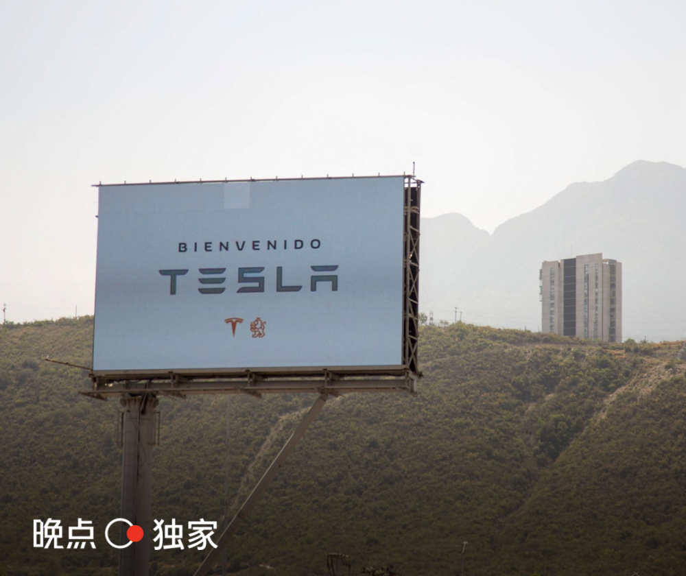
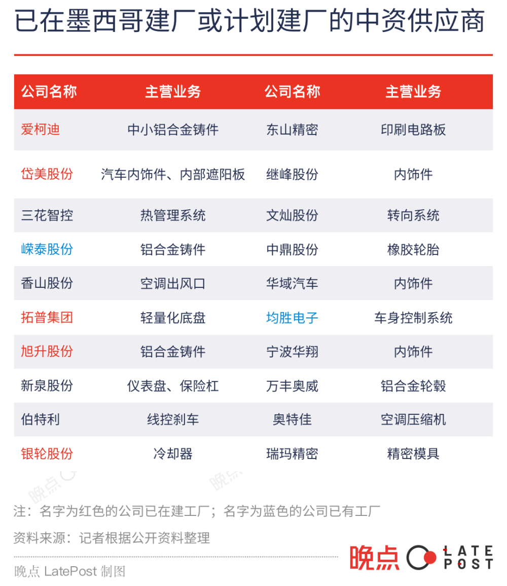
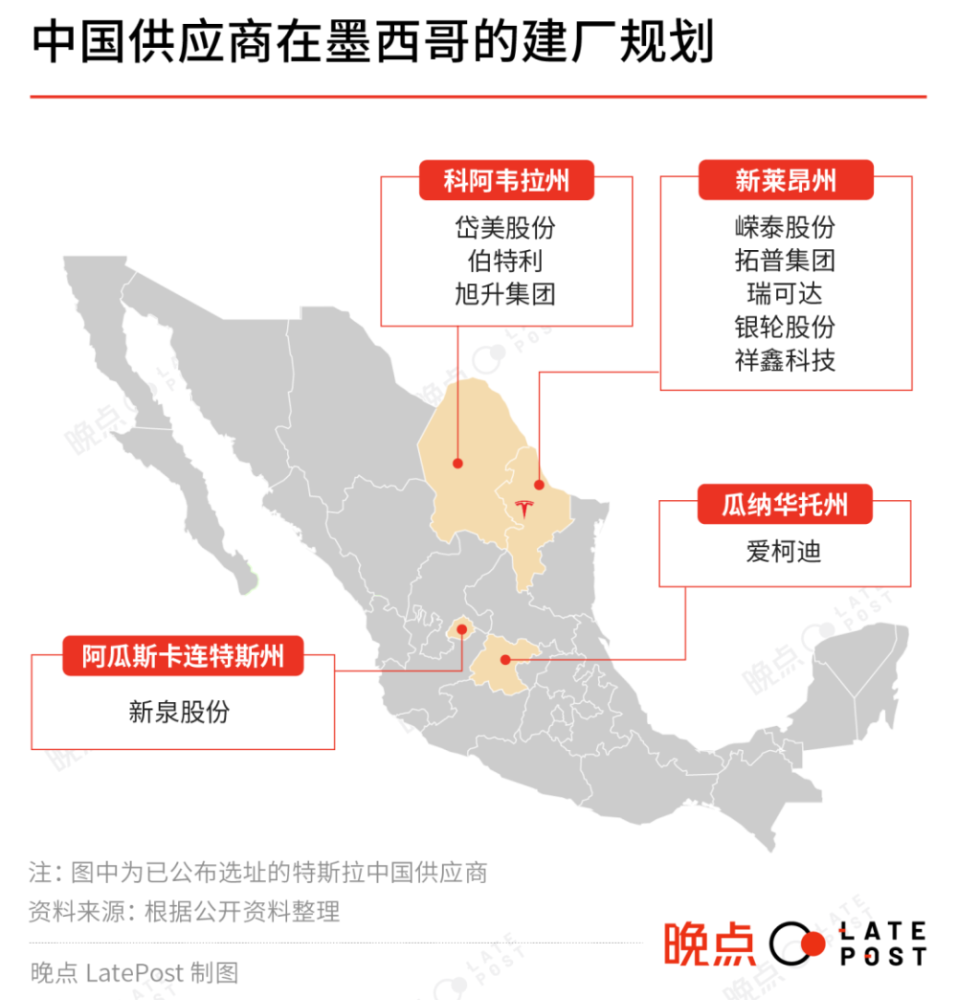

# 特斯拉的墨西哥计划：2025年一季度投产、中国供应链再造上海工厂

至少 20 多家中国供应商已启程。

**文丨李梓楠**

**编辑丨程曼祺**

《晚点 LatePost》独家获悉，特斯拉墨西哥新莱昂州工厂的最新计划建成投产时间为 2025
年一季度，特斯拉已将新的时间表同步给零部件供应商，这比市场预计的晚了 1-2 个季度。接近特斯拉供应商的人士称，特斯拉此前低估了在墨西哥建厂的难度。

综合多位中国供应商的信息，他们收到了特斯拉的明确要求：如果在 2025
年前，未能完成墨西哥本地化生产，不仅难以获得墨西哥新工厂订单，也可能会丢失原本出口给特斯拉美国工厂的订单。

特斯拉并未对远赴墨西哥建厂的供应商提供额外帮助，也没有许诺一定会给出海墨西哥的中国企业订单。不过一位供应商称，对已圈定的合作伙伴，特斯拉在墨西哥的采购定价较其在中国订单高
18%-20% 。这位供应商测算，同一个零部件在墨西哥的生产成本比中国高约 15%，去墨西哥建厂能提高约 3 个点的毛利率。

特斯拉墨西哥工厂年产能将达到 200 万辆，是目前全球设计产能最大的汽车工厂。墨西哥媒体《改革报》称该工厂投资额达 100 亿美元，计划雇佣约 7000
名工人，占地面积 2.5 万亩。

这是已进入特链，或想进入特链的中国汽车供应商都不想错过的机会。借助特斯拉新工厂，更多中国汽车产业链的公司瞄准出海赚钱。

**去墨西哥再造上海工厂**

特斯拉 CEO
马斯克固执地认为，阻碍消费者购买特斯拉的唯一理由是特斯拉汽车不够便宜，特斯拉获取增长的主要途径即是用更低的成本、更高的效率制造更有竞争力的汽车。

在墨西哥工厂之前，上海工厂是特斯拉最高效的工厂，它生产最多且最便宜的特斯拉汽车。上海工厂去年生产了 71 万辆车，占特斯拉全球产量
54%。在中国你只需要花费 23.19 万元就能买到一辆特斯拉 Model 3，在美国需要 3.699 万美元（约合人民币 26.69 万元），在德国需要
3.99 万欧元（约合人民币 31.4 万元）。

马斯克将上海工厂的成功归结于中国政府的帮助、中国勤奋且便宜的用工成本以及本地化的供应链，上海工厂制造的 Model 3 有 95% 的零部件在中国本土生产。

除了自动驾驶芯片等少量高端芯片，特斯拉在中国能买到所有零部件。长三角地区集齐了中国 50%
以上的动力电池、电机、电池控制系统和汽车电子产能，绝大部分汽车零部件工厂都在上海工厂 300
公里范围内。宁德时代生产的电池从江苏溧阳下线到装上汽车，只需不到 6 个小时，博世在苏州的刹车系统工厂到上海工厂直线距离不到 150
公里。这让特斯拉能以极低的零件库存生产汽车，工厂门口和行驶在路上的集装箱车就是特斯拉的库房。

去年下半年开始，特斯拉计划将这套供应链搬到墨西哥新莱昂州。

特斯拉墨西哥新工厂的计划年产能为 200 万辆，是上海工厂去年的产能（70 万辆）的 2.85
倍。特斯拉将在墨西哥工厂应用最新的生产制造技术制造两款售价约在 2.5 万（约合 17.5
万元人民币）美元的新车型及部分汽车零部件，这是特斯拉迄今为止最便宜的车，它将帮特斯拉实现下一阶段的大规模扩张，是特斯拉完成 2030 年年产 2000
万辆汽车目标的重要一步。

这家重要的新工厂之所以落地墨西哥，与美国去年颁布的《通胀削减法案》有关。该法案对符合 “北美原产地规则” 的电动车提供 7500 美元 /
辆车的税收减免，条件是，一辆新能源车价值 75% 以上的零部件要在北美，即美国、加拿大和墨西哥生产，整车组装要在北美完成；动力电池 40% 以上的原材料和
50% 以上的组件需在 “美国及其贸易伙伴国家” 生产，这一范围包含墨西哥、加拿大和日本等二十多个国家。

特斯拉墨西哥工厂距美墨边境 200 多公里，距特斯拉得州工厂 600 公里。两家工厂将共享部分供应链。

多位特斯拉供应商人士告诉《晚点
LatePost》，特斯拉于去年开始与中国供应商洽谈墨西哥工厂的供应链订单，前提是零部件供应商必须在墨西哥实现本地化生产。通用、福特等美国车企也对希望供应它们北美工厂的中国供应商提出了同样的要求。

据《晚点 LatePost》不完全统计，目前已有超过 20 家特斯拉的中资供应商宣布墨西哥建厂计划或已在墨西哥建厂。

据了解，特斯拉已告诉部分已在合作的供应商，如果 2025 年前未能实现墨西哥本地生产，可能丢失目前出口至特斯拉美国加州和得州工厂的订单。

吸引力则是更多的利润。一位供应商透露，特斯拉在墨西哥的采购定价较其在中国的订单高 18%-20%
。据其测算，叠加人工、原材料等成本的上涨，同一个零部件在墨西哥的生产成本比中国高约 15%，去墨西哥建厂仍能提高 3% 左右的毛利率。

还未进入特斯拉供应链的中国企业也想趁此抓住新业务。一位供应商称，特斯拉的并未给全部已有供应商承诺一定会采购：“整个招标过程是市场化的，有些没进特斯拉供应链的公司也计划去墨西哥建厂，争取进入特斯拉供应链。”

特斯拉同时需要这些中国供应商。特斯拉会像苹果公司那样，帮助供应商提升制造技术，中国供应商在服务特斯拉的过程中，也发展了自己的配套研发能力，它们不止提供标准品，也会根据特斯拉的需求进行零部件和制造工艺的研发。如特斯拉与力劲集团在
2019 年合作研发了 6000 吨一体压铸机。特斯拉耗费精力在中国培养的高效供应链，短时间内无法被取代。

**去墨西哥有风险，但特斯拉可预见的增长更诱人**

去墨西哥建厂，中国公司需要巨额的资本支出、更高的人力成本、更差的基建、迥异的文化等挑战。

一位接近供应商的人士透露，新莱昂州墨西哥制造业工人的时薪约为 4.8 美元，略高于中国的 4.5
美元，一些已在墨西哥建厂、培训工人的中国供应商认为，墨西哥制造业工人的熟练度不如中国，且有高额的加班费。

中国汽车制造业普遍为二至三班制，三班制每人每天工作 8 小时，两班制每人每天工作 12 个小时，企业需支付 4 小时加班费。但在墨西哥，加班 2
个小时需支付 200% 时薪的加班费，加班 4 小时需支付 300% 时薪的加班费。“算上各类补贴和强势的工会，整体人工成本会比中国高 10% 以上。”
一位供应商认为自动化率高的供应商更适合去墨西哥。

墨西哥当地的交通运输也对供应商造成挑战。一位供应商人士称，新冠疫情期间曾有在墨西哥建厂的中国公司找不到足够的运输卡车，最终只能选择空运将零部件送去美国。目前多数供应商在去墨西哥建厂后都选择自建物流网络，在中国的普遍做法是寻找外包的物流供应商。

但多数特斯拉的中国供应商仍选择去墨西哥建厂，他们认为特斯拉墨西哥工厂的增长是可预见且前所未有的。即使无法给特斯拉供货，墨西哥依然是一片蓝海。

墨西哥是全球第 4 大汽车零部件生产国和第 6
大汽车生产国，通用、日产、大众、福特等大型传统车企均在墨西哥设有生产基地。墨西哥目前仍是美国最大的零部件进口国，占进口比例超
30%。但墨西哥目前缺乏完善的电动车供应链，供应商可以在当地寻找特斯拉以外的客户。电动车需要的电动化、热管理和智能化的供应商占墨西哥整体汽车供应链的数量比例只有
2.2%，而中国是 8.8%。

20
多家已在墨西哥有工厂，或计划建厂的中国汽车供应商，大部分都选址在特斯拉墨西哥工厂所在地新莱昂州，及相邻的科阿韦拉州。这两个州靠近美墨边境，本身就是墨西哥的汽车产业集聚地，特斯拉之前，起亚、通用在这两个州已建有汽车工厂。

特斯拉宣布在墨西哥新工厂前，已有一些中国汽车供应商出海墨西哥，有在当地运营工厂的经验，如生产汽车电子的均胜电子于 2010
年在墨西哥建设工厂，供应通用等客户，生产铝合金铸件的嵘泰股份在 2017 年于墨西哥建设工厂。

更多企业是这次跟随特斯拉新进入墨西哥或北美市场的公司。其中有些已有出海其他地区的经验，如做汽车内饰的华域汽车和做转向系统的文灿股份。

不过对特斯拉成本影响最大的供应商，动力电池公司宁德时代，已放弃墨西哥建厂计划，它大概率会采尝试取技术授权方式在美国与特斯拉合作，类似宁德时代与福特的合作：宁德时代提供产品和制造技术，收取技术授权和服务费用，但并不出资建设工厂，不持有工厂所有权。宁德时代与福特的合资计划现在进展缓慢，它与特斯拉在北美的合作有更大不确定性。

墨西哥汽车产业链在上世纪 70
年代的石油危机中崛起，当时大批日本汽车和零部件公司奔赴墨西哥建厂。在新能源汽车浪潮的当下，又有一批中国公司跟随特斯拉去墨西哥建厂，这是中国汽车供应链发展至此遇到的最好的去全球赚钱的机会。

