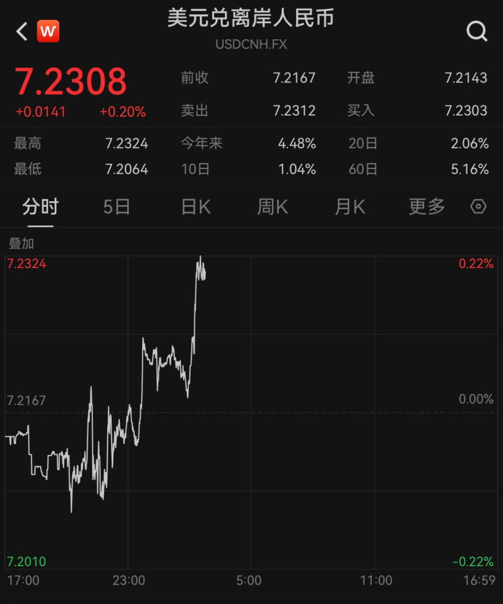
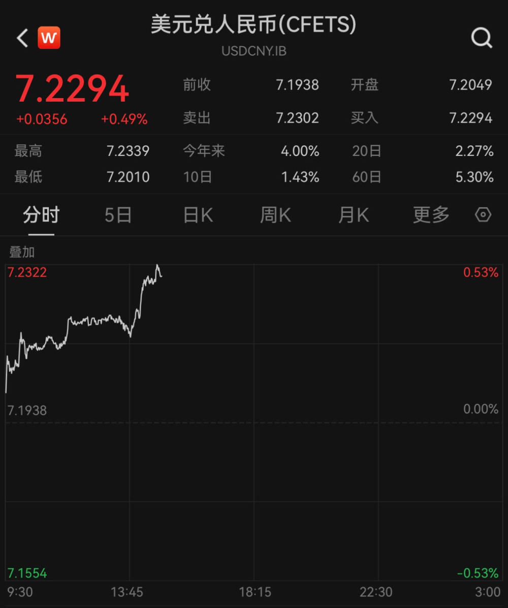

# 继续走低，在岸、离岸人民币对美元汇率双双跌破7.23

人民币对美元汇率在在岸和离岸市场继续双双走低。

6月26日，离岸人民币对美元汇率接连跌破7.22和7.23关口，继续刷新2022年11月末以来的新低。

人民币对美元汇率在在岸市场同样疲软。

人民币对美元即期汇率6月26日开盘即跌破7.20关口，随后进一步走低，接连跌破7.21、7.22和7.23关口，日内一度下跌超过350个基点。

今年以来，人民币对美元即期汇率累计贬值约4%，离岸人民币对美元汇率累计下跌约4.5%。

兴业研究在最新后市展望中指出，美国财政部发布的最新一期汇率观察半年报中并未指控我国汇率操纵，但仍保留在观察名单中。中美关系近期边际缓和，仍需关注俄乌等海外地缘政治变化对市场情绪的牵动并波及人民币汇率。美元兑人民币目前来到整数关口附近，未有足够证据表明本轮上行已经结束。

