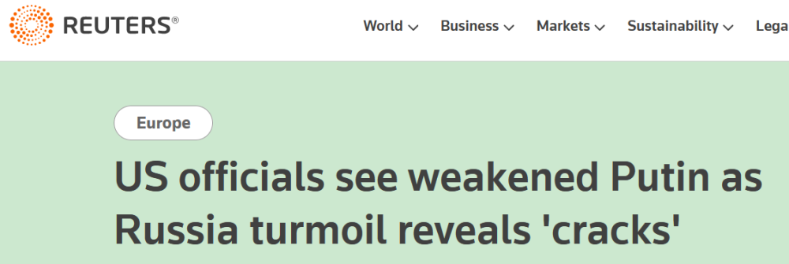
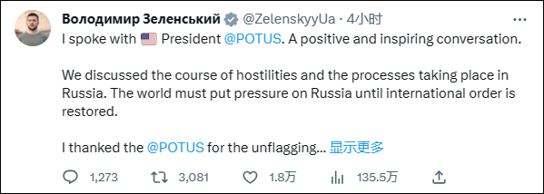

# 美西方对瓦格纳事件“集体闭麦”后，布林肯宣称有助于乌克兰反攻

（观察者网讯）

“瓦格纳事件”发生后，一向高调反俄的美西方似乎一反常态，在重申支持乌克兰后便集体“保持沉默”。
截至当地时间25日，美国总统拜登仍未作出具体表态，但他当天同乌总统泽连斯基通话，讨论了包括瓦格纳事件在内的俄罗斯局势。

综合路透社、“今日俄罗斯”（RT）等外媒26日报道，美国国务卿布林肯接受多家美媒采访，声称俄罗斯“后院着火”，乌克兰基辅方面能在瓦格纳事件中“渔翁得利”，为反攻行动“创造机会”。

6月24日，俄罗斯瓦格纳雇佣兵集团的“哗变”让整个国际社会高度关注。经过一天左右的时间，在白俄罗斯总统卢卡申科介入调停后，瓦格纳创始人普里戈任宣布“掉头回营”，这场“武装叛乱”戛然而止。

当地时间25日，美国务卿布林肯在一系列美媒的电话采访中谈论此事。他将瓦格纳事件描述为普京政府的“内部事务”，并称尽管这场“叛乱”以“流产”告终，但可能预示俄政府将更加不稳定。

“我们正在非常密切关注此事。16个月前，俄罗斯军队来到乌克兰基辅的门口，以为他们会在几天内拿下这座城市，以为他们会把乌克兰这样一个独立国家从地图上抹去。而这个周末，他们不得不转而保卫俄罗斯首都莫斯科，对抗自己制造的雇佣兵。”布林肯说。

在美国全国广播公司（NBC）“会见媒体”（Meet the Press）节目上，布林肯称，这起事件表明俄罗斯出了“更多的裂痕”。

“我们无法得知或推测这件事的具体发展方向，现在要确切地说还为时过早。但毫无疑问，普京在未来几周和几个月内必须解决各种各样的新问题。”

布林肯还声称，在这场“深刻的内部分歧”中，俄罗斯接下来会发生什么，由俄罗斯人民来决定，“现在还不是时候断言这本书的最后一章是什么，我认为我们还没有看到最后一幕。”

路透社称，美国官员预计将尽快更多地了解瓦格纳事件的进展，包括调停后俄政府与普里戈任达成协议的细节。谈及白俄罗斯总统卢卡申科担任调停人，布林肯揣测称，“可能是普京不想把自己的身份降低到直接与普里戈任谈判的水平。”

布林肯认为，瓦格纳事件将有助于基辅在顿巴斯地区反击俄罗斯军队方面“创造机会”，同时也有利于包括波兰和波罗的海国家在内的俄罗斯邻国，“俄罗斯人心的分散和分裂可能会使他们在乌克兰的军事行动更加困难。”

“我们的重点仍然是坚定且坚持不懈地关注乌克兰，确保它拥有自卫和夺回被俄控制领土所需的东西。”布林肯在接受美国广播公司（ABC）采访时说，“从某种程度上看，这事确实分散了普京和俄罗斯当局的注意力，他们不得不在努力应对反攻和乌克兰的同时关注自己的后方，我认为这为乌克兰人创造了更大的机会。”

他还补充道，拜登政府总是为“俄罗斯发生的每一次突发事件”做好准备，“当我们与一个大国，尤其是一个拥有核武器的大国打交道时，这是一件令人担忧的事情，也是我们非常关注的事情。我们没有看到俄罗斯的核态势发生任何变化。”

另据美国有线电视新闻网（CNN）24日报道，乌克兰国防部副部长汉娜·马利亚尔表示，乌克兰军队利用瓦格纳事件引发的莫斯科局势动荡，同时向包括巴赫穆特和亚希丁在内的多个方向发起反攻。

她宣称“各方面都取得了进展”，但没有透露更多细节。俄方则对此表示，瓦格纳事件不会影响俄罗斯特别军事行动的进程。

与拜登通话后，乌总统泽连斯基则亦在个人推特发文称他同拜登的谈话“积极且鼓舞人心”，双方讨论了“敌对行动的进程以及俄罗斯正在发生的事件”，他称“国际社会必须向俄罗斯施压，直到国际秩序得到恢复”。

布林肯还声称，瓦格纳事件削弱了俄罗斯的领导力量，此事的进一步后果“将在数周或数月后显现”。

但观察者网专栏作者“尤金少将”分析认为，此事件并不会动摇俄罗斯领导层：“普京和他的政治盟友们完成了对各方势力的试探和敲打，证明了自身依旧是俄罗斯唯一受各方认可的领导集体，并进一步强化了自身统治与决策的合法性。且成功让与自己直接与间接交战的各国都意识到了对俄罗斯政权实施干涉和颠覆可能会产生恐怖的后果——任何取代普京与统俄党上台的人，都只会更加激进和不吝惜使用更强有力的武力。”

截至目前，一向反俄的美西方国家领导人均未就此事做出公开具体表态，仅重申支持乌克兰。美媒《华尔街日报》24日报道称，美国及其盟友打算避免采取可能会卷入争端的举动，不在瓦格纳和俄政府间“选边站”。

但不表态并不意味着没有动作。在俄局势平息之前，有知情人士透露，美国国务院为避免“无意中帮助普京”，决定推迟针对瓦格纳的新制裁。

**本文系观察者网独家稿件，未经授权，不得转载。**

