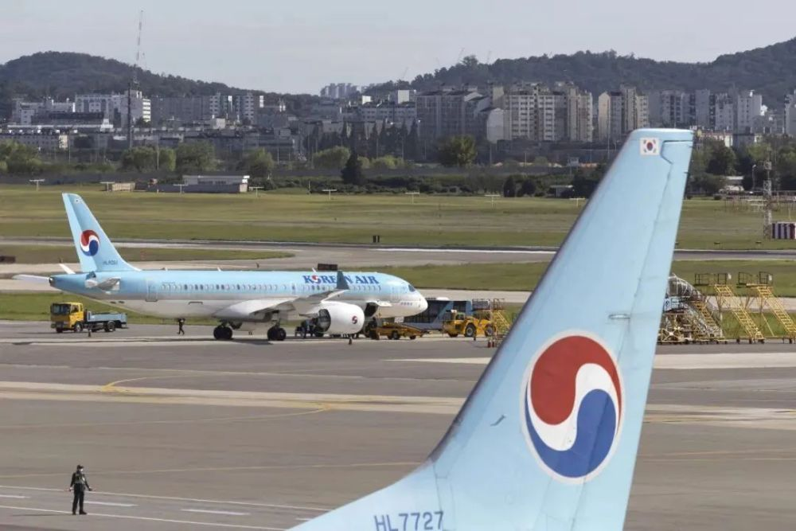

# 韩国还在赌吗？韩外长表示增进双边友谊之际，航司暂停部分韩中航线

“韩国政府没有理由与中国反目为仇，也不愿看到这种情况发生。”

据韩联社25日报道，韩国外交部长朴振当日在一档节目中，对韩中关系做出了最新表态，并表示韩方将继续加强与中方的战略沟通，增进双边友谊。

_韩国外交部长朴振
资料图 图源：视觉中国‍‍‍_

而就在十多天前，韩国政府刚“怒不可遏”，直指中国驻韩大使邢海明“涉韩政策言论不当，令韩国国民不悦”。

事件的源头是，邢海明大使在会见韩国在野党领导人时发出基于事实的警告，“有的人赌美国赢、中国输，这显然是误判，没看清历史大势”，“现在赌中国输的人今后一定会后悔”。这样一席话，立刻刺激到了韩方的神经，在一些人大做文章之下，中韩本就紧张的关系再次触及冰点。

短短两周后，韩方的态度突变，究竟是看清了历史大势，还是在紧跟美国的步伐？

**“没有理由与中国反目”‍**

在上述节目中，朴振强调，本着互尊互惠的精神推动韩中关系成熟健康发展是尹锡悦政府的基本立场。

此外，朴振又就邢海明大使日前作出涉韩发言引发争议一事，重申原有立场，将其定义为“违背外交官本职的行为”。

那韩方在面对外交纷争时，又是如何履行“职责”的，不禁令人好奇。

长安街知事（微信ID：Capitalnews）注意到，美国国务卿布林肯于本月18日至19日访华，并在此前后同朴振通话，随后更是单独派出陪同其访华的助理国务卿丹尼尔·克里滕布林克（负责东亚和太平洋事务）前往韩国，介绍访华成果。

报道称，朴振将美方说明的核心内容总结为，“稳控美中关系，力争推动双边关系朝着竞争与合作的方向前进，而非对抗与矛盾”。然而他的总结中，还省略了一些关键信息。

_21日，丹尼尔·克里滕布林克访韩期间举行记者会。图源：视觉中国_

据韩媒报道，21日，克里滕布林克分别与韩国外交部次官补（部长助理）崔泳杉、第一次官（副部长）张虎镇进行了会面。除了美中关系之外，双方再次提及了今年5月以G7峰会为契机举行的韩美日首脑会谈，以及今年4月韩美领导人会谈形成的成果文件之一——《华盛顿宣言》。

双方一致决定，为快速推进宣言内容，将尽快召开新设立的“核咨商小组”（NCG）会议，以及延伸威慑战略协商机制（EDSCG）会议。

而针对《华盛顿宣言》中方已多次表态，这是美方为实现一己地缘私利之举，与朝鲜半岛无核化目标背道而驰，只会挑动阵营对抗，加剧半岛紧张局势，破坏地区和平稳定，完全无助于化解冲突、增进互信，中方坚决反对。

显然，韩国并未真正重视中方的态度。

与此同时，在上述会面中，韩美一致认为朝鲜无核化是包括中国在内的整个国际社会的共同利益，并敦促中国为此继续发挥建设性作用。

一面期待中国在朝鲜半岛问题上起到关键作用，另一面又对中方的表态充耳不闻，还频频在台湾等问题上挑战中国底线，韩方此举，堪称分裂。

**“应尽快修复与中国的关系”**

就在朴振表示“增进双边友谊”之际，一些韩国航空公司却开始暂停部分韩中航线。

韩联社援引知情人士消息称，大韩航空、韩亚航空等韩国航空公司将在整个夏航季暂停部分韩中往返航线。虽然两家航司均表示，同一时期还会有其他航线的恢复或增加，但报道指出，暂停原因与近期韩中关系遇冷，往返于两国间的乘客数量增长缓慢密切相关。

上述报道称，3月10日，中国公布了第二批恢复出境团队旅游的国家名单，韩国并未入围。根据韩国国土交通部的航空统计数据，今年1月至5月，前往中国的旅客人数为120.6374万，仅为2019年同期乘客人数（721.338万）的16.7%。

_大韩航空
图源：视觉中国_

紧跟美国步伐的回报还没等到，代价却抢先一步到来。

15日，韩国最大在野党共同民主党第一批访华议员团一行7人抵达北京。在随后召开的记者会上，议员洪翼杓表示，议员团向中方提及了出境团队游对象国名单不含韩国的问题，中方承诺将积极考虑把韩国列入出境跟团游对象国。

当然，中方的承诺也必然是建立在韩方表现出沟通诚意的基础之上。自今年4月，韩国总统尹锡悦发表不当涉台言论之后，中韩对话几乎停止，关系持续恶化。

中国外交部发言人汪文斌在15日举行的例行记者会上表示，越是在双边关系面临困难的时候，两国政府和各界人士越要加强沟通，共同为推动中韩关系健康稳定发展发挥积极作用。

伴随着布林肯访华，韩国国内出现了不少呼吁修复对华关系的声音。

《韩民族日报》日前指出，在严重矛盾和紧张局势下，中美都明确表示管控局势，积极开展对话，其他主要国家也纷纷与中国展开密集外交活动，这与不顾风险的尹锡悦政府形成了鲜明的对比。如果持续对抗的中美突然转向对话，韩国又会站在哪里呢？韩国国民对尹锡悦的外交动向感到不安，这种担忧要持续到何时？希望尹锡悦能够正视国际局势。

另据《韩国先驱报》援引专家的话称，韩国应该尽快修复和中国的关系，最好在今年年底前。韩国世宗研究所研究委员郑载兴表示，首尔需要改善与北京的关系，虽然这种改变需要付出代价。

这一次，究竟是该明辨是非，还是继续在错误道路上走下去，就看刚释放出积极信号的韩国会如何选择了。

