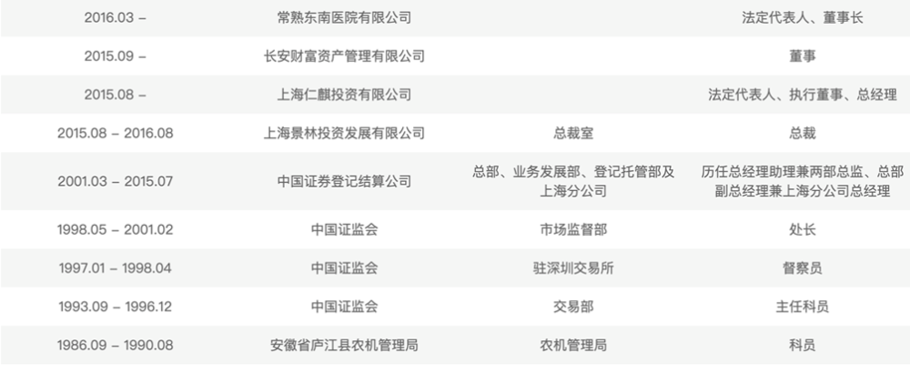

# 中纪委盯上了证监会“离职”官员：既有副省长，也有千亿私募老总

_来源：视觉中国_

作者 | 肖望

编辑 | 郭一非

出品 | 棱镜·腾讯小满工作室

金融反腐风暴劲吹，数位从证监会离任多年的官员或金融机构高管纷纷落马。

据财新6月15日报道，上海景林股权投资管理有限公司原法定代表人、董事长及总经理高斌被有关部门带走，失联至今。

成立于2004年的景林管理规模超过200亿美元，也是国内成立时间最长的私募机构，与高毅资产、幻方量化、淡水泉以及高瓴资本旗下的礼仁投资，同属国内私募龙头。

2015年加入景林前，高斌在证监会系统工作长达22年，曾任证监会市场监督部处长、中国证券登记结算公司副总经理等职。尽管已离开证监会系统8年，但高斌失联事件中，最惹人注目的仍是其监管履历。

与高斌类似，2023年以来，原浙江省副省长朱从玖、民生证券董事长冯鹤年、中信建投总经理李格平等相继被有关部门调查，他们都有过证监会工作履历，且已离任多年，但远未称得上安全落地。

**22年证监会任职后下海创业**

高斌被查，内部似乎已有风声。

天眼查信息显示，6月14日，景林股权投资进行了工商变更，其法定代表人由高斌变更为杨志坚，同时高斌退出景林资产董事之列，不过他仍在景林旗下部分机构及投资企业担任法人或董事等席位。

澎湃新闻援引接近景林股权投资人士称，高斌于上个月已经因个人原因离职，与景林没有任何关系。另外景林股权投资和景林资产是两家公司，分属一二级市场，一直是独立运营，跟二级更没有关系。

公开资料显示，景林从二级市场起家，后拓展至一级市场，分别通过“景林投资”和“景林资产”两个主体管理上市前的一级市场和上市后的二级市场。其曾公开称，“一二级联动效应是其核心优势之一，在严格执行一二级防火墙基础上,
共享行业研究成果、人脉和专家网络以及优秀企业家资源。”

与此同时，财新则援引知情人士的说法称，高斌此番被带走，主要与他在证监系统的经历有关，起源指向了5月初确认被调查的朱从玖案，“高斌与朱从玖是安徽合肥老乡，圈内人近期才得知两人私下关系不错，倒是颇感意外。”

资料显示，现年55岁的高斌，1993年毕业于北大经济学院国民经济计划与管理专业，硕士研究生毕业后随即进入证监会工作。

在一次校友走访活动中，高斌称，“长期的机关工作环境让他萌生了创业的想法，愈演愈烈。”在47岁时，已任证监会高职的高斌毅然辞职下海，后加入景林至今。

中国基金业协会备案信息显示，高斌在2015年7月辞任中证登副总经理，当年8月即出任上海景林投资发展有限公司总裁。

_高斌加入景林前个人履历，据中国证券基金业协会备案信息_

加入景林后，高斌专注医院收购、管理及其他医疗健康产业的投资。

作为项目负责人，他主导南京扬子医院的收购， 并负责上海仁济医疗集团、南京扬子医院、常熟东南医院等医疗服务机构的日常管理,
实现医疗服务机构规模、业绩较大幅度增长。并以医疗服务机构为中心，拓展到医院托管、药品耗材供应链采购、医疗设备采购管理、互联网医疗等各相关领域。

**监管背景人士备受市场青睐**

一般而言，证监会官员下海，首选通常是券商机构或公募基金公司，如高斌这样首站选择私募机构的实属罕见。不过，景林也并非一般的私募。

如果说高中毕业即炒股的“私募一哥”徐翔创立的泽熙更具草莽江湖气，景林资产创始人蒋锦志及其团队则是金融科班出身，精英范十足。

蒋锦志本科毕业于武汉大学国际金融专业，硕士就读于有“金融黄埔军校”之称的中国人民银行总行研究生部，即现清华大学五道口金融学院。1992年，他毕业后即加入了刚成立不久的深交所，此后负责筹建了国债期货部门，担任部门总经理。

1996年，蒋下海加入国信证券任总裁助理，后又出国游学研习金融和房地产，回国后便开始了其证券投资和创业之路，于2004年创办景林资产。

在一次公开采访中，蒋曾提到，原央行副行长、证监会首任主席刘鸿儒曾担任景林资产顾问。一些员工拥有国内外著名金融和监管机构工作的经验，如深交所、南方基金、摩根大通等。

作者还注意到，景林一位基金经理助理，此前就职于上交所市场监察部，职责是通过证券市场实时监控预警系统发现交易异动背后的违法违规行为。

景林近年鲜少在公开渠道发声或露面，但凭借其长期超越市场的业绩表现，在高净值客户中颇具号召力。在高斌加入前的2013年，景林管理的资产规模就已达200亿之巨。按业内标准测算，其能为合伙人提供的年薪在数百万元甚至更多。

私募产品仅面向合格投资者发售，100万元起购。而要成为合格投资者，除需要具备一定的金融投资知识外，要求金融资产不低于300万元或最近三年年均收入不低于50万元。在这样严格的投资者要求下，景林当前管理规模超过千亿元，景林投资管理规模超30亿美元。

在2014年《投资界》采访中，时任景林股权投资基金创始及管理合伙人的黄晓黎介绍，景林的美元PE基金LP（有限合伙人，即出资人）大致可以分为三类，一、富有的海外家族基金；二、世界著名的FOF（Fund
of Funds，以基金为投资标的的管理基金）；另外一部分是成功国内企业家的境外资产。

近年来崛起的国内财富家族们是景林人民币基金的主力LP。此外，在业内，景林投资以管理人出资比例高而著称。景林在蒋锦志的带领下，自有资金积累丰富，在当时自有一级市场投资就已逾10亿元。

在成立5周年的论坛上，杉杉控股董事长郑永刚、青啤董事长金志国以及远东控股董事长蒋锡培、美特斯邦威董事长周成建等企业家，皆为景林的座上宾。

2021年7月，景林资产的首只FOF产品上线时，有渠道半小时额度即被一抢而空，产品募集金额迅速超过100亿元。当年12月份，仅交通银行私人银行渠道开放的10亿元预约额度半天抢光。景林在高净值客户中的追捧程度可见一斑。

或许是树大招风。2019年7月，蒋锦志被传涉原证监会主席助理张育军案失联，传言称其从2015年股灾救市中靠关系获得信息优势从而获利，未在香港办公室出现3个月、未在上海总部出现3年零5个月。随后，蒋锦志公开现身香港出席内部客户投资策略分享会，景林资产总经理高云程也接受采访对相关传言予以澄清。

**多人牵扯朱从玖案**

此次高斌失联，对景林影响尚未可知。作者注意到，高斌还是拟上市公司保定维赛新材料科技股份有限公司的独立董事。

财新称，高斌或涉朱从玖案。2023年5月4日，据中纪委网站消息，浙江省政协党组成员、副主席朱从玖涉嫌严重违纪违法，正接受中纪委纪律审查和监察调查。

朱从玖毕业于中国人民银行研究生部，于1992年11月进入证监会工作；1999年至2008年间赴上交所任职，历任上交所副总经理、总经理；2008年回到证监会任主席助理，并主管证券发行工作。在证监会系统工作20年后，他在2012年5月转任浙江省副省长，一干又是十年。

目前来看，朱从玖一案，已牵扯多人。

在时间线上，高斌与朱从玖共事时间颇长，但两者的更多关联尚待有关部门披露。而在朱从玖落马之前，原浙商证券总裁王青山、上交所原副总经理刘逖已于2023年3月、4月先后被调查。

据《中国新闻周刊》，朱从玖在上交所任职期间，刘逖一直是他的直接下属，并在其任内升任上交所研究中心副主任。而王青山自2006年北大法学院毕业后进入证监会发行部工作，两年后成为时任证监会主席助理朱从玖的秘书。

6月1日，头部券商中信建投公告，总经理李格平因个人原因辞职。财新报道，李格平被有关部门带走协助调查，事关在监管系统任职期间的事。

资料显示，李格平自2011年至2014年担任中国证券业协会秘书长；2014年至2016年任证监会证券基金机构监管部副主任；自2016年至2018年任中央汇金投资有限责任公司证券机构管理部/保险机构管理部主任。中央汇金是工行、建行等多家国有重点金融企业的大股东。2018年2月，他转身加入中信建投。

**监管发声整治政商“旋转门”**

高斌加入景林时，适逢证监会的一波“下海离职潮”。

《第一财经日报》当时报道，2014年全年，证监会约有30名处级以上干部离职，其中大多数投身市场机构；2015年3月，尚有20多人在办理离职手续。

在官员们晋升遭遇瓶颈之际，由于金融领域利益诱惑巨大，监管人士流向市场机构背后的权力寻租、“旋转门”腐败问题引发关注，监管部门执法不严、“投鼠忌器”等担忧不绝于耳。

2015年9月份之后，证监会要求，副处级以上干部三年内不得到证监会监管对象任职。但此类现象并未完全杜绝。

2022年2月时，中央第六巡视组向证监会党委反馈巡视情况时提到，重点领域和关键岗位存在廉洁风险，政商“旋转门”问题比较突出，违反中央八项规定精神问题仍有发生。

国泰君安原投行部总经理朱毅，以及民生证券董事长冯鹤年即是“旋转门”典型案例。中纪委指出，朱毅在职时提前筑巢，发审委委员任期届满后迅速离职，是“旋转门”治理典型。冯鹤年在职时积极谋划“出路”，离职后持续利用原职务身份价值大肆敛财。

股票发行注册制已经全面实行，维护市场公平尤为重要。证监会有关部门负责人在2月份答记者问时强调，从严管理审核注册人员、“两委”委员，坚决整治政商“旋转门”。

2023年4月，证监会在全面从严治党暨纪检监察工作会议中明确要求，持续发力加强“不敢腐”的震慑，加强证券发行审核领域腐败问题全链条治理，深化政商“旋转门”和“逃逸式”辞职专项治理，从严打击新型腐败和隐性腐败问题，推动加强年轻干部教育管理。

可以预见，在朱从玖、冯鹤年、高斌等人之后，这场金融监管的反腐风暴远未停息。

