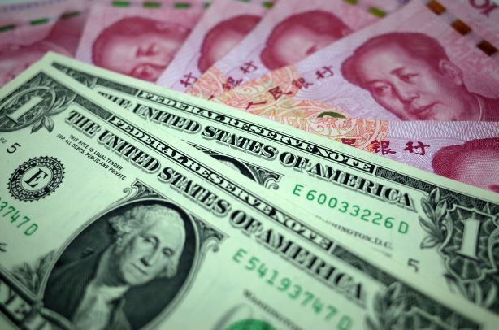
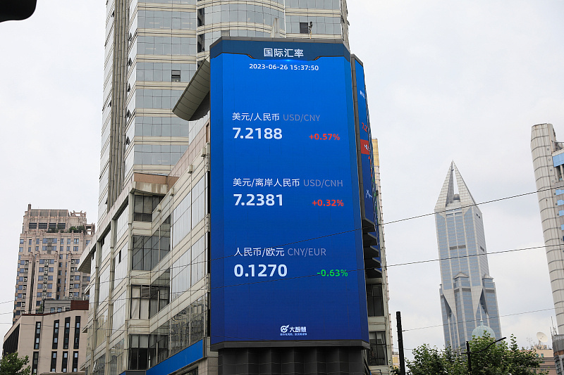
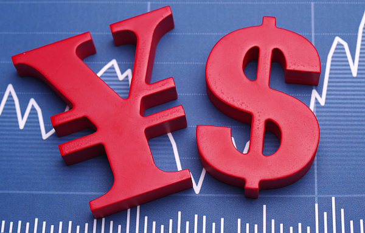
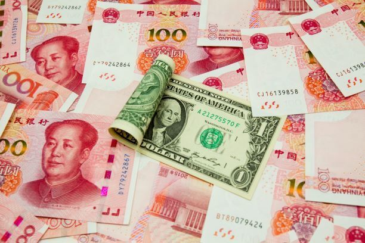
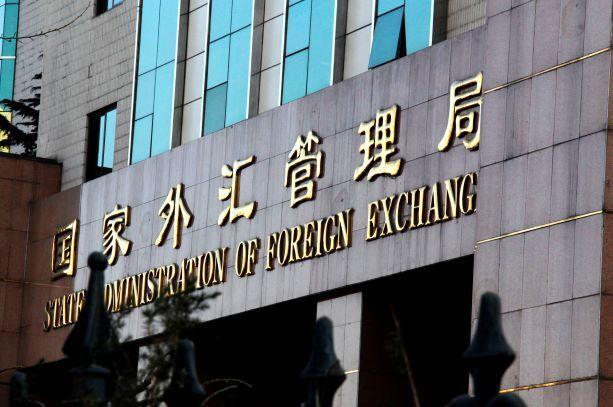

# 人民币对美元汇率今日反弹 专家预计下半年会重新走强

6月27日，中国人民银行授权中国外汇交易中心公布，2023年6月27日银行间外汇市场人民币汇率中间价为1美元对人民币7.2098元，较前一交易日下跌42个基点（1基点=0.0001），创去年11月10日以来的新低。在岸和离岸人民币今日明显反弹，截至上午9点48分，双双上涨逾200基点，均收复7.22关口。

**在岸、离岸人民币汇率昨日大跌今日反弹**

今日凌晨3点，在岸人民币兑美元汇率夜盘收报7.2425，较上一交易日夜盘收盘价大跌685个基点。

6月26日，在岸、离岸人民币对美元汇率则双双跌破7.23关口。Wind数据显示，截至26日16时30分，在岸人民币对美元汇率盘中最低下探至7.238，刷新去年11月29日以来新低；更多反映国际投资者预期的离岸人民币对美元汇率盘中则一度跌破7.24，最低触及7.2408，创去年11月30日以来新低。

今日在岸人民币开盘后出现明显反弹，一路走高，很快收复7.22关口。截至9点50分，报7.2110，上涨近300基点。

交易员表示，今日人民币汇率的反弹主要是因为美元指数前夜出现大跌。截至6月26日纽约汇市尾盘，衡量美元对六种主要货币的美元指数下跌0.21%至102.6936。

**人民币汇率近期回调受内外部多重因素影响**

去年10月底，人民币曾出现过一波快速升值行情，离岸人民币汇率从当时的7.37一路涨至今年1月中旬的6.69附近。但今年4月中旬以后，人民币汇率便一路下行。5月17日，在岸、离岸人民币对美元汇率双双破7，离岸人民币对美元人民币汇率于5月30日失守7.1，在岸人民币对美元汇率则于5月31日跌破7.1。5月份以来，在岸人民币对美元汇率跌幅接近4%，离岸人民币汇率跌幅超过4%。今年以来，人民币对美元中间价贬值3.4%，其中4月下旬以来的贬值幅度已超过4.6%

为何最近人民币汇率下跌这么猛？业内人士普遍认为，近期人民币汇率回调受国内外多方面因素综合影响。

中国银行研究院高级研究员王有鑫指出，从外部因素看，主要受欧美央行继续收紧货币政策影响，中外在货币政策周期上的分化和差异。虽然美联储在6月份暂停加息，但美国核心通胀率仍然保持在较高水平，市场对其在7月份继续加息的预期有所升温。美联储主席鲍威尔此前还表态“今年可能需要再加息两次”。从内部因素看，近期我国部分领域复苏步伐放缓，全球经济下行导致外需疲软，出口承压，同时股市波动回调，短期跨境资本流入放缓，增加了汇率波动压力。

招商基金首席经济学家李湛认为，近期人民币汇率贬值主要有三方面原因：一是中美利差倒挂持续扩大，目前已超100BP并在高水平附近波动；二是美元指数上周以来重新走强；三是市场对下半年中国经济的看法影响了汇市的预期。

6月8日，央行副行长、国家外汇管理局局长潘功胜在第十四届陆家嘴论坛发表主题演讲时表示，受内外部多种因素影响，尤其是美元指数在美国债务上限问题、中小银行风险问题推升避险情绪、美联储加息预期有所升温的推动下走强，叠加国内经济恢复基础尚不稳固，人民币汇率出现了一些波动。

**专家预计人民币汇率下半年会重新走强**

不过，业内人士普遍预计，人民币汇率短期内还会承压，但并不具备持续大幅贬值的基础，预计下半年人民币汇率将重新走强。

中金公司研报指出，当前经济预期、美元指数等内外因素已经开始发生积极变化，这将有利于人民币汇率摆脱此前的弱势。不过，中美利差倒挂，以及季节性购汇等负面因素仍然存在。因此，预计人民币汇率在未来可能会经历一段低位企稳筑底的时间。

“随着积极的财政和货币政策逐渐加码发力，下半年我国政策红利和经济活力将逐步释放，经济增速将稳步回升。目前欧元区已经陷入技术性衰退，美国经济增速也在逐渐回落。中国经济的逐步恢复将给予人民币汇率更多支撑。”王有鑫预计，人民币汇率在短期盘整之后，在三季度将逐渐企稳恢复至稳定波动区间，在年底前可能会进一步回升，反弹至相对合理的点位。

光大银行金融市场部宏观研究员周茂华分析指出，尽管人民币汇率近期波动有所增大，但从宏观经济指标及国际收支基本保持平衡看，人民币汇率并未偏离合理区间，市场情绪保持稳定，人民币汇率弹性显著增强。从内外环境趋势看，继续看多人民币汇率走势，下半年人民币汇率有望继续在合理均衡水平附近双向波动。

李湛业也认为，短期看，中美利差与美元指数走势是决定人民币汇率的主要因素；中长期内，中国经济基本面对汇率预期至为关键。预计下半年人民币汇率将重新走强，主要理由包括美联储结束加息制约美元指数、市场主体对人民币汇率波动的承受性增强等。

**金融监管部门对外汇市场稳定运行充满信心**

金融监管部门也对我国外汇市场稳定运行充满信心。“多年来，我们在应对外部冲击中积累了不少经验，外汇市场宏观审慎政策工具也更加丰富。我们有信心、有条件、有能力维护外汇市场的稳定运行。”潘功胜在陆家嘴论坛发言时表示，尽管人民币汇率近期出现了一些波动，但我国外汇市场运行总体平稳，汇率预期和跨境资金流动保持相对稳定。向前看，中国经济运行总体保持稳中上行的态势，而一些市场机构则预测美国经济可能面临温和衰退。同时，随着美联储加息周期接近尾声，美元走强较难持续，外溢影响有望减弱。总体看，我国外汇市场有望保持较为平稳的运行状态。

国家外汇管理局副局长王春英此前也表示，未来，随着宏观政策靠前协同发力，我国经济运行持续回升向好，对我国外汇市场的支撑作用将进一步增强。主要发达经济体货币政策紧缩周期接近尾声，美元走强较难持续，有关外溢影响将逐步减弱。同时，我国外汇市场呈现出韧性增强的新特征，适应外部环境变化的能力明显提升，我国跨境资金流动有望继续保持平稳有序。

**【版权声明】本文著作权（含信息网络传播权）归属北京青年报社所有，未经授权不得转载**

文/北京青年报记者 程婕

编辑/樊宏伟

