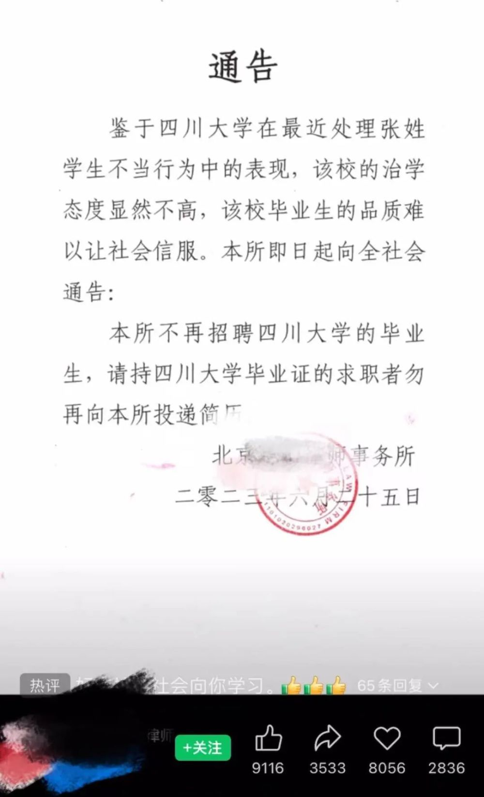

# 北京一律所称不再招聘川大毕业生，川大回应：是否聘用是其自由

有律师认为，律所不招聘哪个学校的学生，这本身是其律师所内部的事，但以公告的形式对外发布就不妥当了。

**全文2280字，阅读约需5分钟**

**新京报记者 赵利新 编辑 张树婧 校对 柳宝庆**

6月25日下午，北京一律所发布通告称，鉴于四川大学对张姓同学的处理，认为该校毕业生品质难以信服，故该所不再招聘四川大学毕业生。6月26日，北京海淀区律师协会工作人员回应称，已经约谈该涉事律所，律所也删除了相关言论，如果真的触及到一些底线或者法律红线，会根据相关法律条文处罚。

6月26日下午三时许，记者发现，涉事律师事务所此前发布的通告已被删除，该律师事务所王姓负责人告诉记者，现在不接受采访。有其他律师认为，该律师事务所此前发布的通告是明显的就业歧视，该律所是知法犯法。也有律师认为，该律师事务所涉嫌侵犯四川大学名誉权、荣誉权。四川大学法学院行政人员告诉记者，目前还不知道此事，“不知道涉事律师事务所此前聘用没聘用过川大学生，如果他们聘用过以后，觉得我们学校学生不行，那以后不用我们学校的学生，也是他们的自由。”

**━━━━━**

**律所发通告不再招聘川大学生**

**视频短时成热搜**

6月25日下午，北京某律师事务所在其官方微信视频号上发通告称：鉴于四川大学在最近处理张姓学生不当行为中的表现，该校的治学态度显然不高，该校毕业生的品质难以让社会信服。本所即日起向全社会通告，本所不再招聘四川大学的毕业生，请持四川大学毕业证的求职者勿再向本所投递简历。

_▲律所通告。视频截图_

当日下午五时，关于该通告的视频点赞量达到8065，转发量达到3533次，评论条数达到2836条。该视频成为多个网络信息平台的热搜。该律师事务所官方视频号，截止到6月26日，一共发布了约280条短视频，点赞量大多是个位数。但涉事通告一经发布，迅速引起网友热议。有网友认为，该律所的举动是炒作，只是为了刷存在感。但也有不少网友支持这一举动。

据媒体此前报道，6月25日晚，该律所负责人王先生向媒体表示，涉事通告并无就业歧视之嫌。他表示，四川大学应当对网友所反映的关于张某的系列问题作出回应，比如其高中同学称被霸凌、保研资格等情况。他还提到，该所曾经有过四川大学毕业生应聘，但因不符合录取条件未录取。

**━━━━━**

**“如果用过我们学校学生，**

**可以对学生做出评价”**

记者拨打四川大学法学院党政办公室、法学院教学管理科、法学院学生科等部门官方电话，接线人员均表示，目前还不清楚这个事件。有负责本科生日常管理的行政教师告诉记者，“不知道涉事律师事务所用没用过川大学生，如果他们用过，觉得我们学校学生不行，以后不再聘用，那是律师事务所的自由。”

上述教师表示，目前川大法学院学生每年毕业不到200人，但有约一半人会选择继续读研深造，还有相当一部分毕业生选择去机关单位、事业单位和国企工作，去律师事务所的毕业生不算多，但也多是选择去知名律师事务所工作。

记者在北京法律服务网上获悉，涉事律师事务所经批准成立于2017年7月11日，执业律师有四名。据企查查APP显示，该律师事务所注册资本为50万元人民币，注册地点为北京市海淀区知春路。

据公开资料显示，四川大学法学院在2022年软科“中国最好学科”排名中，该校法学院在全国同行中排名第10位。据该校官网信息显示，该校法学院本科专业为法学专业，是首批国家级一流本科专业建设点，有法学硕士一级学科授权点和法律硕士专业学位授权点，法学博士一级学科授权点。

**━━━━━**

**多位律师称该所涉嫌劳动歧视或侵犯大学名誉权**

北京市中闻律师事务所执业律师张新年认为，作为向公众提供法律服务、维护当事人合法权益、维护法律正确实施的律师事务所，一言一行都应该注意社会影响，最起码要有最基本的法律底线思维，“劳动者享有就业不受歧视的权利。川大学生如果真来应聘被拒，完全可以申请劳动仲裁，同时申请劳动主管部门介入查处。”

多位律师公开表示涉事律师事务所涉嫌违反相关法律。一位四川律师告诉媒体，我国法律对就业歧视有明文规定，例如我国《劳动法》第十二条就规定，劳动者就业，不因民族、种族、性别、宗教信仰不同而受歧视；《就业促进法》第三条也明确，劳动者就业不因民族、种族、性别、宗教信仰等不同而受歧视，“北京这家律师事务所以就业者毕业院校作为劳动者的入职筛选条件，显然违背了平等就业的立法精神，对劳动者构成了歧视。”

也有律师表示，根据我国《劳动法》第十二条，虽然“学校”这一因素并非《劳动法》明文规定的歧视行为之一，且律所具有用工自主权，但对四川大学学生这一单独群体不予招聘，剥夺了四川大学学生和其他学校学生一样享有的平等就业权，破坏了社会公平，突破了律所用工自主权范畴。

河南王城律师事务所主任张水山告诉新京报记者，该律师事务所的公告涉嫌违反《民法典》，涉嫌侵害四川大学的名誉权、荣誉权，四川大学可以提起诉讼以维护自己的合法权益。根据《民法典》相关法条规定，民事主体享有荣誉权。任何组织或者个人不得非法剥夺他人的荣誉称号，不得诋毁、贬损他人的荣誉。民事主体享有名誉权。任何组织或者个人不得以侮辱、诽谤等方式侵害他人的名誉权。名誉是对民事主体的品德、声望、才能、信用等的社会评价。“律所不招聘哪个学校的学生，这本身是其律师所内部的事，但其以公告的形式对外发布就不妥当了，尤其是不招聘的理由显然是以偏概全，推论不合逻辑。所以，我认为该律师事务所的行为并没有违反《劳动法》和《就业促进法》，而是涉嫌侵犯了大学的名誉权、荣誉权。”

**值班编辑 康嘻嘻 李加减**

**相关报道**

北京一律所称不再招聘川大毕业生，称该校毕业生的品质难以让社会信服

律所称不再招聘川大毕业生，媒体：叫板可以，为何一竿子打翻一船人

