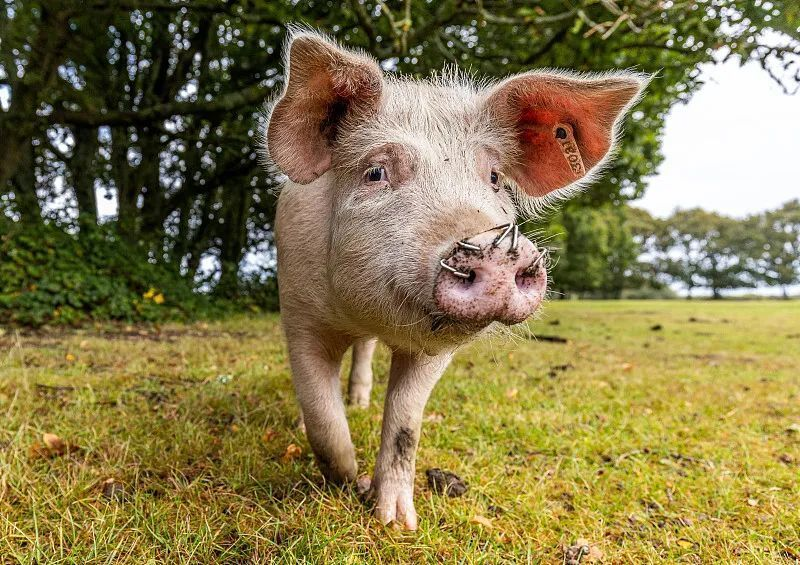

# 头部猪企签约“互不挖人”，最高月薪可达10万，有技术懂管理人才稀缺

兽医会管理，月薪几万起？

**文｜《财经》实习生 宋佳旻 记者 叶徐彤**

**编辑｜余乐**

6月20日，在牧原集团召开的“牧原养猪节”共创共享论坛上，会上，四家养猪龙头企业牧原、正大、温氏、双胞胎签订了《互不挖人“公约”》。

“公约”中提到：“为减少内卷，文明发展，我倡议：不挖人、不拆台。如有违约，加倍反制。”多家媒体均联系到牧原、温氏的工作人员，证实了该信息的真实性。

_网上流传的“公约”内容。图源网络_

这一“公约”流出后，引发网友热议。大家的关注点主要有两个：第一，养猪业已经卷到这种程度了吗？第二，巨头联合起来操纵劳动力市场，打工人的日子是不是要更难过了？

针对第一个疑问，一位养猪业内人士告诉我们，近几年业内的“挖墙脚”现象确实十分普遍。既懂技术又懂管理的人才稀缺，因而成为各大公司的争夺热门，月薪最高可达10万以上。但是，由于行业整体不景气，互挖墙脚导致的人力成本上升已让企业不堪重负。

针对第二个疑问，对外经济贸易大学法学院副教授卢杰锋认为，目前这个“公约”的噱头意味更强，如果后续企业以这一“公约”为由拒绝录用劳动者，劳动者可以以侵犯其就业权为由向劳动行政部门举报。

**养猪行业“挖墙脚热”转冷**

养猪行业的“挖墙脚”之风要追溯到非洲猪瘟的传入。2018年8月3日，农业农村部通报了中国首例非洲猪瘟疫情，随后病毒很快传播到全国大部分地区，重挫养猪行业。据国家统计局数据：自2018年起，连续三年全年生猪出栏数下降。直到2021年，全年生猪出栏和猪肉产量才有所回升。

非洲猪瘟传入后，国内养猪企业在2019年兴起了一波“挖墙脚热”。至今已从事养殖工作31年，曾就职于新希望集团16年的杜先生告诉我们，当时各家猪企都需要懂动物医学的人来防治疫病。此外，在猪瘟传入后，生猪产量减少，价格上升，相关从业者纷纷扩建猪场，也需要人手来打理猪场。

“在猪瘟严重的情况下，有技术、懂管理的人员的重要性就体现出来了。”杜先生说。

杜先生表示，在养殖生猪的劳动市场上，最受追捧的是兽医岗位。在猪场扩招的背景下，兽医，特别是懂管理的兽医非常吃香，能做到兽医总监或者农场经理收入就会很高。“兽医月薪能开出2万，既有技术又懂管理的话，月薪10万以上也很常见。”

据媒体报道，近年来，头部养猪企业员工数量整体呈现扩张趋势。牧原股份员工数量从2017年年末的2.7万人一路增长到2021年年末的13.75万人；新希望2017年年末为6.13万人，2021年年末超过8万人。

杜先生称，在目前的劳动力市场上，大公司因为工资给的更高更容易挖到人。小公司可能会在工资和奖金之外多给一部分合伙分红，来吸引到更多人才。

但是，行业的整体状况已经越来越不允许猪企再“重金挖角”。

生猪行业当下陷入周期低位，猪价持续低迷。华创证券最新发布的研报称，5月份猪价维持低位，养殖亏损扩大，行业已处于周期底部。当前生猪养殖亏损已持续超过5个月，资金压力下行业出现主动或被动的产能去化，5月能繁母猪存栏量环比-0.6%，相较于4月去化加快，若仔猪开始亏损，行业产能去化或进一步加速。

从年初至今，猪企陷入连续亏损，部分猪企目前或已经开始调减产能。据中国商报记者不完全统计，在16家上市猪企中，5月份生猪出栏量环比下降的企业有8家，其中正虹科技出栏量环比降幅最大，达到23.18%。

在这样的背景下，猪企订立“公约”的目的就很明显了。清华大学国家战略研究院特约研究员刘旭指出，如果该公约长期持续，企业就可以压低员工的薪资待遇。“如果竞争对手要挖角，就要给被挖的人涨薪。跟他一个等级的员工也跟着会涨薪。当公司都不挖角了，就不会面临涨薪的压力了。”

**专家：“公约”如果落实涉嫌违反《反垄断法》**

那么，这样的“公约”有法律效力吗？对企业和员工有什么影响？

北京京润律师事务所劳动人事业务部主任孙小瑞律师表示，签署“公约”利好行业的头部企业，有利于它们保证现有员工的稳定性，减少了人才的流失。而对行业末端的企业来说，签订这种协议就会弊大于利，提高他们引进人才的难度。

“长远来看，这一协议限制了劳动者的流动性，从而降低了行业的创新性，对行业的整体影响是不利的。”

从劳动法角度，企业这一“公约”的合法性处于擦边地带。孙小瑞律师认为，这一“公约”的合法性要看如何定义“挖人”的概念。如果公约只规定企业不能主动挖人，没有限制劳动者跳槽，那就不违反符合劳动法的规定。“但是，如果约定了签订协议的企业之间，不得再招用从其他企业离职的员工，那就损害了劳动者就业的权利，在法律上是无效的。”

刘旭指出，四大养猪企业的互不挖人公约涉嫌违反《反垄断法》。互不挖角协议通常被认定为是横向垄断协议，因为其限制的是人才市场的有效竞争。另外，某些经营者之间之所以签订互不挖角协议，更主要是因为他们之间存在直接的竞争关系，或者潜在竞争关系、间接竞争关系。

是否要依据《反垄断法》对企业进行处罚，惩罚力度如何，要视断协议是否达成和实施的情况而定。刘旭表示，《反垄断法》对于垄断协议的达成和实施的处罚程度不同。如果达成了垄断协议但还没有实施，处罚会比较少。关键在于证明该协议是否已经实施。假如企业以该公约为由撤回了录用某个竞争对手员工的承诺或放弃了相关意向，那就属于实施了垄断协议。相关涉事员工可以向国家反垄断局举报。

刘旭认为，这项互不挖人公约所指的“挖人”其实比较难界定。即使员工是自主跳槽到竞争公司，原公司也较难举证该员工是主动还是被动的，基于结果仍可能会判定该员工是被挖角的。

卢杰锋表示，在美国的一些高科技公司，以及特许经营行业中，曾出现过互不挖人协议，但总体上不多见。美国和欧盟对这种互不挖人协议大多从劳动力垄断的角度予以规制。

他认为，如果这样的“公约”获得落实，可能会限制劳动者的择业权利，限制用人单位的用工自主权，并影响劳动力市场的正常竞争，“用人单位同意不招揽、雇用或招聘彼此的劳动者，基本上放弃对劳动力的竞争，具有排除、限制劳动力竞争的效果，涉嫌劳动力市场垄断行为。”

目前“公约”情况到底是噱头还是已经落实，有待更多信息披露。

