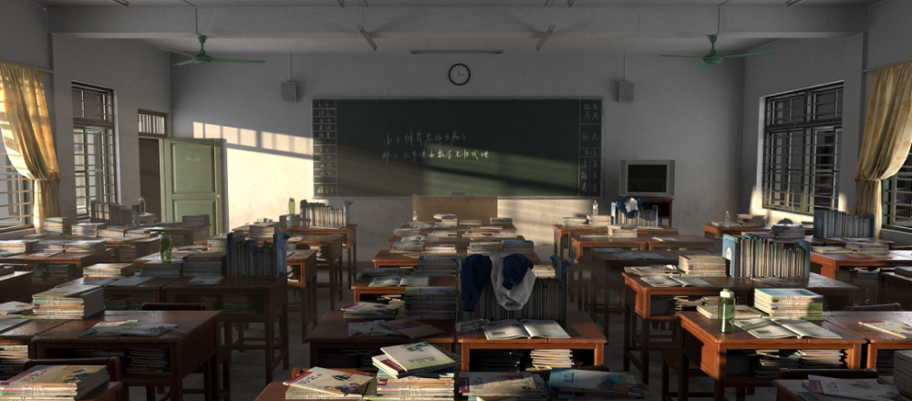
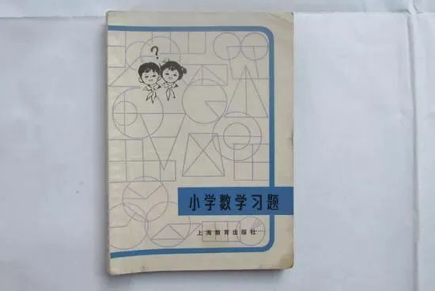

# 教辅三巨头，寄生高考40年

**撰文 | 续紫君**

**编辑 | 马 路**

每年高考结束，废品回收站都会迎来丰收的季节，知识在这里以一块钱两斤的价格回收。其中，包含学子心血的教辅材料最能让回收站老板喜悦，因为够沉、够多。

作为应试的伴生物，教辅图书已经发展成为整个图书行业的基石。疫情或者双减，亦不能改变其发展势头。四十多年间，教辅行业见证了教育的众多变化，同时也催生出许多行业巨头。

**01、混乱的开始**

6月，高考刚刚结束两天，网上便能买到正版的高考真题卷。高考试卷的保密级别为绝密级，尽管它已经短暂的向千万考生公开，在不借助工具的情况下，能够第一时间一字不差的复刻出来，辅以答案及解读，并不是件易事。算上中间的印刷和推向市场的过程，可以说这是一场争分夺秒的战争。

2019年，知名教辅出版企业曲一线发动200名员工和100多名重点中学名师共同协作，第一本高考真题卷于6月8日出片，9日入库。到了11日，北京、河南的准高三学生便能做上这份热乎的真题卷。而此时，据全国高考结束仅过去三天。

教辅行业同样有窗口期。生产教辅资料的企业在帮助考生卷起来的同时，自己也卷得厉害。

所谓，一个人的努力可以提高分数，一群人的努力就是提高分数线。自1977年恢复高考以来，教辅行业的狂热见证了考生们的相恨相杀。

1978年的高考，有610万人报考，录取40.2万人，录取率低到6.5%。想要在这种程度的竞争中杀出一条血路，光靠指定教材肯定不行。当时，我国教育图书的出版几乎处于空白状态，教师没有教学参考书，学生没有课外资料。很多老师只能用铁笔和蜡纸为学生自制教辅资料。

上海教育出版社在1979年出版了《小学数学习题》，油墨印刷，没有精致纸张，但这丝毫没有影响它的畅销，这本草草装订的习题册重印了24次，累计销量超240万册。

_▲图 | 上海教育出版社《小学数学习题》_

“搞教辅，能赚钱”，没有什么比这个口号更吸引人的了。80年代，中国教辅行业开始疯狂增长。1977年，中国文教图书只有0.95亿册，到了1989年，增长到了25亿册，十年涨了20多倍。这同时意味着，算上人数变化，学生人均做题量增加了20倍以上。

从当时的眼光看，教辅是一个高速发展且潜力无限的行业。谁都想在这个行业中捞上一笔，但不是谁都有能力去搞研发。很多出版社就像今天的营销号一样，找个合适的稿子洗一洗，直接出版。质量差一些没关系，反正市场上供不应求，总有不明真相的学生买。

当时不少做教辅的年轻编辑，一年能编辑二十本书。短短几年时间，就能住进了花园洋房，买上小轿车。

90年代，教辅图书逐渐供应充足，倒逼市场竞争。教辅行业迎来了群雄逐鹿的时代，我们所熟知的几大教辅巨头，也正是在这一时期出现。

**02、南有王后雄**

别名“雄哥”的王后雄，被公认是最早的教辅大佬。

1987年，年轻的雄哥进入黄冈县一中当一名普通的化学老师。当时，化学老师们讲课方式相当朴素，无非是给学生看看样品，背背方程式。枯燥的教学方法让学生们对化学兴趣缺缺，成绩感人。

雄哥却带着实验的家伙什们走上讲台，带大家看山花改变液体的颜色，在一瞬间把泥土化为液体，鼓捣出五彩缤纷的火焰。学生对化学的兴趣一下被激发出来，成绩提升明显。最终，他带的两个班高考成绩比其他班平均高出6.8分，先后有15名学生获取全国和湖北省中学化学竞赛大奖。

王后雄“名师”之称由此一炮打响。1990年，全国大规模开展中学化学竞赛，华中师范大学领到了编写竞赛辅导丛书的任务。华中师范大学的编辑们听说黄冈一中有一位化学老师名声在外，便想邀请雄哥出山。

接下了这项任务后，王后雄白天正常教学，晚上熬夜肝教辅，最终推出了系列丛书《高中化学竞赛基础教程》、《初中化学竞赛跟踪辅导》。前者一年之内重印3次，后者3个月内重印3次，印数均达数十万。火爆程度，超乎想象。

现在的人可能很难理解那个年代人们对奥赛的狂热。奥赛于上世纪50年代起源于东欧国家，一开始叫做“国际数学奥林匹克”，简称IMO。1986年，我国正式组队参加IMO。为了让每年参加国家集训队的20多个学生安心备战，每一位参赛的学生都得到了免试上大学的保证。

这个保证后来演变为，只要是在数学、化学、计算机等五科高中联赛取得好成绩的学生，都可以获得推荐、保送上大学的机会。由于奥赛成绩于升学之间的微妙关系，一个针对智力前5%学生的专项选拔，演变成全体师生的追逐的对象。奥赛课外班有如过江之鲫，有关竞赛的辅导书自然也成为了抢手货。

_▲图
| 电视剧《小舍得》_

曾经有新疆的家长，专程跑到两三千公里外的湖北黄冈，花了两千元路费，就为给孩子买了几本王后雄的辅导书。有家长激动地表示：“我的孩子说，做您的书，让他感觉自己越来越聪明。”

90年代的教辅行业，是王后雄的时代。1994年在第10届教师节上，王后雄被授予“全国模范”和“人民教师奖章”称号，并受到了最高领导的接见并合影。

之后，王后雄又出版了《化学重难点手册》等20多本化学教辅书。值得一提的是，一度火热的《黄冈密卷》也是由王后雄主编。但由于黄冈中学“高考工厂”的名号远播，致使很多人误以为《黄冈密卷》是来自黄冈中学。

这并非王后雄蹭黄冈中学热度，雄哥本身就是黄冈人，编撰的密卷叫《黄冈密卷》也没毛病，其中道理与“海参炒面”无异。

可以说，王后雄凭一己之力，把教辅产业从群魔乱舞时代带领到了名师时代。但局限在于，王后雄所编著的教辅只是针对化学这一门学科，对提高学生整体成绩有限。虽然王后雄团队曾将业务延展至其它学科，但销量并未像化学教辅那样炸裂。

市场缺位，教辅行业需要一位集大成者。接棒者任志鸿出现了。

**03、北有任志鸿**

任志鸿是山东人，出身教师家庭。从山东滨州师专中文系毕业后，他在县里的中学担任语文老师。

1991年，一家出版社请他所在的学校编写文教图书，任志鸿只负责其中几个章节。由于编得又快又好，在第二年他接到了出版社独立编写一本书的业务，并承担起了助销工作。

当时任志鸿对市场并不了解，但是不会做销售的老师不是好编辑，通过给全国各地的语文教师写推荐信，10万套书很快被销售一空，他自己从中赚了30万。那是1993年，他一个月工资才几百块。

1994年，任志鸿停薪留职，和两个朋友开了个书店，以开办书店的名义编写和销售图书。书店开办的第二年，净利润就达到了120万。

这笔横财引来了前同事的嫉妒，把他举报到了滨州新闻出版局。由于没有相关资质，任志鸿哥几个吓得不轻，疯狂埋书毁灭“罪证”。结果市里来的人并不是来找他麻烦，而是来找他合作的。

1994年，高考改革，免费读大学将成为往事，毕业后也不再由国家统一分配工作。1997年，高校全面并轨，学费年涨幅30%-50%。很多人开始怀疑，上大学是否真的有必要。几年间，高考人数始终维持在260万上下，处于历史最低位，这也是教辅行业最具挑战的日子。

掌握发行资质的出版局，同样面临经营上的困难。1996年，在国家出版体制改革，出版局开始自负盈亏。滨州新闻出版局找上任志鸿的原因呼之欲出。

任志鸿以每年5万的价格把出版局下属的书刊经营部承包下来，开始名正言顺地从事书刊经营事业。

在1997年，他推出了大名鼎鼎的《优化设计》。这套书完全抓住了老师的痛点，一站式解决了老师最头疼的备课、出考卷的难题，一经发行后马上热销。任志鸿迅速成为征订市场上的最大玩家，志鸿优化也成为全国教育图书市场中知名品牌。

1998年，任志鸿正式成立天鸿书业，并成为我国第一个同时获得“出版物国内总发行权”、“全国性连锁经营权许可”的民营企业。《优化设计》走向全国，公司业务飞速发展,。2000年，天鸿书业销售过亿，
一跃成为中国领先的民营图书发行企业。

有人说，任志鸿是商业界最懂教辅的老师，教辅界最懂商业的老板。如果说王后雄开创了教辅的名师时代，任志鸿则是将策划、研发、销售与品牌整合到一起，开创了教辅产业化的时代。

**04、零售之王卫鑫**

从北京亦庄开发区的旧宫地铁站出站，随手拦下一辆出租车，只要说出“曲一线”三个字，不用导航，大部分司机就能立刻知道往哪走。遇到热情的司机，还会主动跟你聊起曲一线的传奇故事：“曲一线策划的‘5·3’系列教辅几乎全国高中师生人手一册”“曲一线老板为人低调，是个干实事的”。

问师傅这些评价从何而来，他笑笑说，在这跑车多年，不知道曲一线的人已经不多了。

上面这段节选自曲一线官网中的一篇报道。这家公司生产了属于所有人的青春疼痛文学——《五年高考三年模拟》。

在2014年，央视新闻曾发起过一个名为“对你影响最大的一本书”的评选活动，《五年高考三年模拟》力压《红楼梦》、《围城》，排名第七。

很长一段时间，《五三》占据着北京西单图书大厦、王府井书店高考畅销书排行榜第一，在蛮荒时期，全国教辅平均退货率达30%，《五三》的退货率则维持在个位数、连续几年全国最低。北京市语文特级教师徐克兴曾如此评价《五三》：5·3实为高考科学备考领军之作，集学考之精粹，成名世之奇书。

北京市数学特级教师乔家瑞则如此评价：谁选用了5·3，谁就掌握了科学的复习方法；谁选用了5·3，谁就会取得理想的高考成绩。

_▲图
| 电视剧《小欢喜》_

这本书是否称得上“奇书”，很难判断。但用了就会取得理想的高考成绩，肯定是过誉了。关于这一点，真故研究室编辑部有数位反例。

教辅行业的创业者，一般都是老师下海。除了前面提到的王后雄和任志鸿，还有世纪金榜的张泉，江西金太阳的陈东旭、万唯教育的武泽涛等等。但神奇的是，教辅行业最大爆款，《五三》的缔造者卫鑫，最早搞养殖的。

卫鑫来自河北沧州市肃宁县，这里是盗版教辅的聚集地，对教辅行业，卫鑫有一种耳濡目染的熟悉感。

任何人的成功，都离不开时代的背景。卫鑫创业之时，正逢上我国高考改革。1999年，我国高校开始扩招，高考录取率从1998年的35%左右骤然增加到54%左右。到了2001年，中国15%的青年都可以进入大学，高等教育从精英教育进入大众化阶段。这也大大提振了教辅市场。

当时，卫鑫已经靠卖练习册获得第一桶金，这笔钱用他的话来说是：可以买上万只鸭子。

尝到甜头的卫鑫决定正式进军教辅行业。由于不是教师出身，不会编题，卫鑫想到，何不出一本真题合集。卫鑫搜来全国的近五年的高考真题卷、近三年的优秀高中模拟卷集成一本，《五三》的名字由此而来。他还把试题打散按专题和难度罗列，与其他教辅打出了差异化，因此一经发售，便俘获市场。

巅峰期，五三能占据市面上20%的市场份额。

2021年7月，河南遭遇特大暴雨。多地书店遭遇水淹，损失惨重。卫鑫宣布承担水灾中《五三》系列的全部损耗，并在第一时间向河南配货，让河南学子尽快做上新的五三。

_▲图 | 河南暴雨让书店损失惨重_

**05、教辅行业的赢家**

卫鑫的五三能够取代任志鸿和王后雄，背后也有潜藏的意义。教育已经从“名师时代”开始向“刷题”时代迈进。名师固然好，但是讲究的是因材施教，统一印刷的教辅材料显然无法满足。

反观五三的题海战术，具有相当的普适性。这有些类似如今AI大模型，需要海量的数据来训练，刷完一本五三，几套密卷，看什么题都似曾相识。从人类碳基到硅基的发展方向来看，这种培养方式十分的科学。五三一代人毕业之后，网络上开始流行一个词，叫“小镇做题家”。

如今，各位教辅大佬开始了新的征程。王后雄加入了小熊图书，成为一个网红被mcn重新孵化运营。任志鸿的上市公司世纪天鸿募资2.91亿，开始拥抱AI。卫鑫卖茶叶亏了3亿后，继续跨界。依托“五三”品牌打出“考神附体”“知识的味道”的口号，卖雪糕、手机、护肤品。

回顾教辅行业四十年，虽然小有波折，但整体向上的趋势无法撼动。

2004-2006年，各省自主命题。2008年，高考人数连续多年下滑。2012年，国家勒令教辅行业降价40%。2014年之后，互联网教培行业兴起。种种变化，看似都在消减这块蛋糕，实际上，却未曾改变教辅出版业向上发展的趋势。

而今，我国每年出版的教辅图书数量、种类不计其数，教辅相关企业有近万家，市场规模超过2000亿元人民币，成为我国图书市场的最重要组成部分。

2020年一季度，疫情最紧张的时候，国内教辅图书销量同比增长2.8%。2021年第三季度，在双减政策实施后，上海书城的教辅销量同比增长13%，全国教辅教材在图书市场占比提升甚至有所提升。

疫情和双减，也不能阻止教辅出版行业。

反而，随着经济不景气，就业难的情况出现，让人们日益产生对个人能力提升的需求。越来越多的人参与到考公、考研、考教师中，相关配套的教辅图书的需求有所上升。

教辅为什么能成为图书行业的基石？回答这个问题或许要冲供需两端来解释。需求端无需多言，家长望子成龙、师生相互内卷的情况由来已久。

从供给端看，地方新闻出版局、出版社、策划公司、大型书店，本质上是利益共同体，教辅图书是它们难以割舍的富矿。时至今日，教材教辅依旧占据新华书店出版业务的大半壁江山。

一个值得思考的问题是，到底是教辅市场让教育变得内卷，还是教育内卷成就了教辅市场？从地域上看，两者呈正相关。山东的世纪天鸿、星火、世纪金榜，河南的天星教育，湖北的王后雄，江苏的春雨教育。可以发现，每个教辅领军品牌都来自教育大省。

今年高考前，网上流传这样一则视频。晚上9点20分，一位来自国外的老师指着一栋楼问他的中国朋友：这是一座工厂吗，为什么每晚都是灯火通明？中国朋友告诉他，这是一所学校。

在了解中国普通高中生的日常作息后，这位外国友人的灵魂受到了暴击。接连发出OMG的感叹之后，又用that's crazy 结尾。

有理由相信，灯火通明的教室里，陪伴学生们杀死时间的，是各个门类的教辅书。

