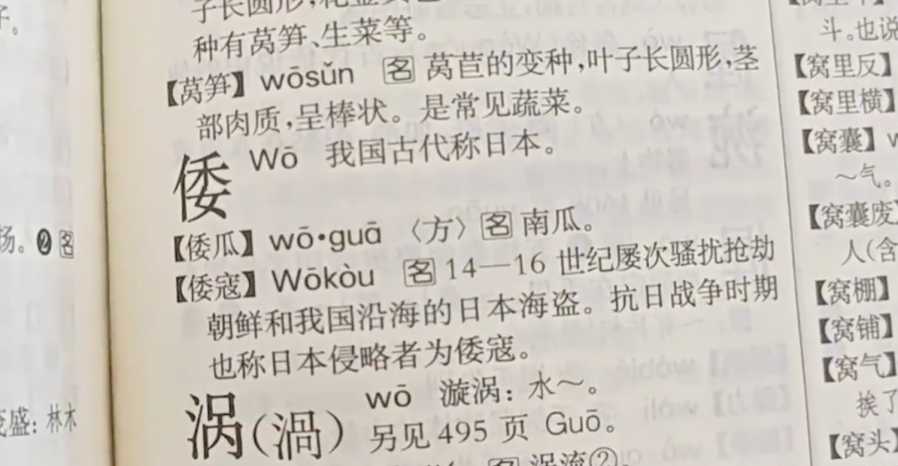
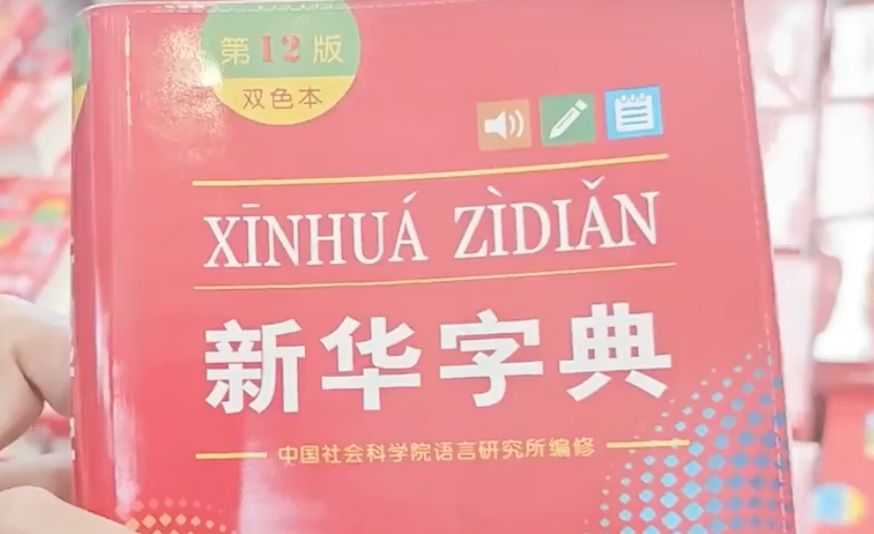
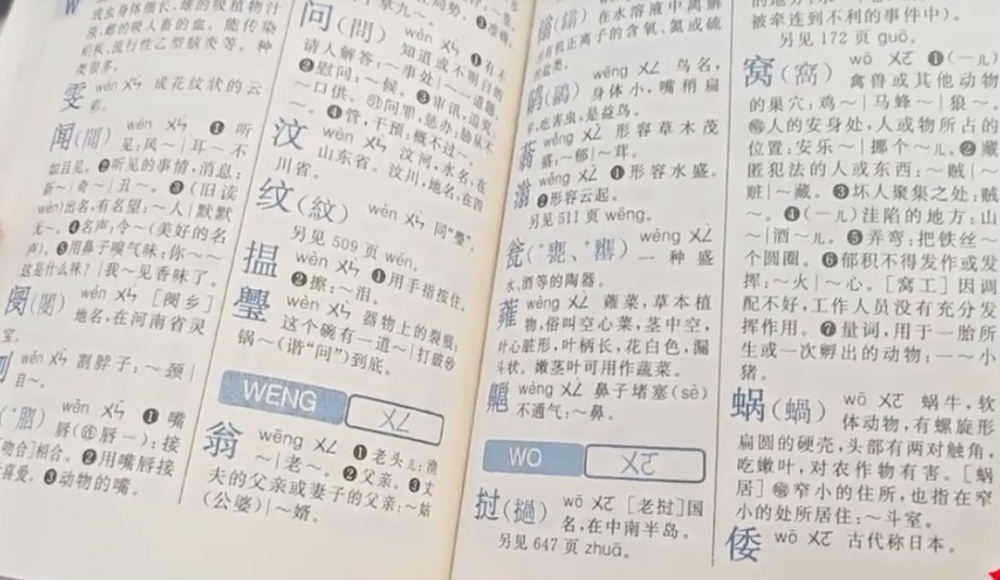

# 新版《新华字典》删除“倭寇”一词引争议，出版社回应：正在了解

近日有网友反映“倭寇”一词被移出《新华字典》，第一反应是纳闷，第二反应是震惊，第三反应是愤慨。

商务印书馆出版到第7版的《现代汉语词典》对“倭寇”的释义为“14--16世纪屡次骚扰抢劫朝鲜和我国沿海的日本海盗。抗日战争时期也称日本侵略者为倭寇”。

而第十二版的《新华字典》把它们硬生生地分别开来，“倭寇”不再组成词语了。

据果然视频，对此，出版社工作人员回应称，正在跟作者方沟通了解，去年也有过类似的情况，字典的编写和出版是有相应规则的，新的版本不断地在修订，一些字的收词和释义会发生变化。

倭寇，是指13世纪到16世纪左右侵略朝鲜、中国沿海各地和南洋的日本海盗集团的泛称，除沿海劫掠以外主要从事中日走私贸易，因中国古籍称日本为倭国，故称倭寇。

（果然视频等）

编辑：赵珊珊

