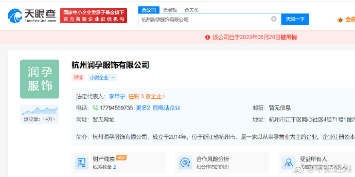
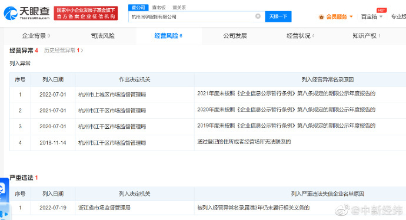
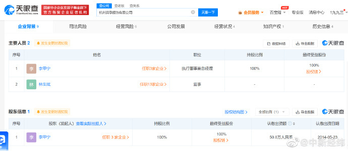

# 林生斌关联服饰公司被吊销，该公司被列入严重违法失信名单

天眼查App显示，近日，林生斌担任监事的杭州润孕服饰有限公司经营状态从存续变更为吊销。去年7月，该公司因被列入经营异常名录届满3年仍未履行相关义务，被浙江省市场监督管理局列入严重违法失信名单（黑名单）。该公司成立于2014年5月，注册资本50万人民币。经营范围为批发零售服装服饰、箱包鞋帽、皮革制品、办公用品、日用百货。

**此前报道：**

林生斌为缅怀亡妻子女成立的品牌公司“潼臻一生”已注销

