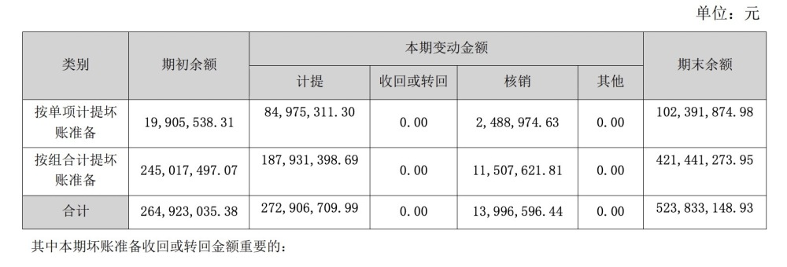
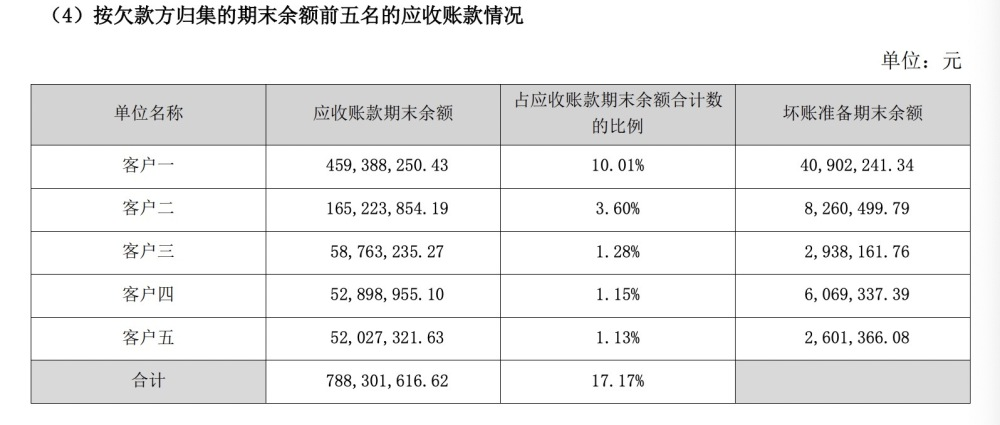

# 核酸检测企业开始打官司讨债了

界面新闻记者 | 李科文

界面新闻编辑 | 谢欣

天眼查数据显示，短短半年时间，曾经的新冠核酸检测龙头上市公司达安基因已经与4家第三方医学检验室对簿公堂。

具体来看，达安基因分别将珠海市思达医学检测实验室、北京方圆平安医学检测实验室、北京星云医学检测实验室和上海泛亚医学检验所告上法庭，案由均是买卖合同纠纷。

对此，达安基因董秘办相关工作人员对界面新闻记者表示，公司应收账款回款进度一切正常。此次将部分第三方检测实验室告上法庭是因为，部分第三方检测试验室注销或破产，通过法院强制执行的方式达成回款。

达安基因由于核酸检测试剂而被公众熟悉。同时新冠核酸检测也让达安基因的业绩达到了前所未有的新的高度，营收一举突破百亿大关。过去三年，其绝大部分收入来源于新冠核酸检测。2019年至2022年，达安基因分别实现营收10.98亿元、53.41亿元、76.64亿元与120.46亿元；实现净利润分别为9218.18万元、24.49亿元、36.18亿元与54.12亿元。

不过，快速增长的业绩下，达安基因也面临着越来越大的应收账款压力。据2022年年报，达安基因应收账款高达40.65亿元，占总营收的33.74%，占总资产的27.55%。其中，账龄在1年内的应收账款高达38.47亿元。

此外，达安基因还合计计提坏账准备5.23亿元。其中，有某位客户的坏账准备就高达4090.22万元。

到了2023年第一季度，达安基因应收账款仍有34.97亿元，应收账款仍占达安基因总资产的25.28%。此外，达安基因的信用减值损失减少了5127.62万元，同比增加125.75%。

可以看出，达安基因加大了应收账款催收力度，应收账款余额减少。不过，由于其应收账款的基数过于庞大，收款压力仍扛在达安基因的肩上。这也就能猜测与理解为何在短短半年内，达安基因将4间第三方医学检验室告上法庭。

不过，虽然从公开信息难以判断此次达安基因连续起诉是否是因为核酸检测业务，达安基因方面也称，具体情况需要其向公司法务了解。不过，上述几家被告在过去几年确实都承担了其所在地的核酸检测工作。

据天眼查，珠海市思达医学检测实验室成立于2022年3月，经营许可范围涉及检验检测服务，其官方微信公众号显示其承担了珠海市金湾区卫生局的新冠核酸检测业务。北京方圆平安医学检测实验室成立于2019年，经营许可范围涉及医学检验医疗服务，其在北京市政府审核合格的新冠核酸检测机构名单内，曾承接通州区核酸检测项目。北京星云医学检测实验室成立于2016年，经营许可范围涉及检验检测服务，据北京市经开区政府官网，其曾为北京经开区提供新冠核酸检测服务。上海泛亚医学检验所成立于2013年，经营许可范围也涉及检验检测服务，据上海市杨浦区人民政府官网，其曾为上海市杨浦区提供新冠核酸检测服务。

界面新闻此前曾报道，在常态化核酸检测终止后，大批检测机构将陷入财务危机，可能出现大额计提减值的风险。

起初，像金域医学、迪安诊断等提供新冠核酸检测服务等第三方检测公司被市场判断，存在巨大的应收账款回款压力风险。

在2022年，金域医学的应收账款达70.25亿元，占总营收的45.39%，占总资产的50.57%。其中，应收账款坏账损失2.56亿元。到了2023年第一季度，金域医学的应收账款仍有65.89亿元，占总资产的49.14%。

在2022年，迪安诊断的应收账款达99.56亿元，占总营收的49.08%，占总资产的47.28%。其中，应收账款坏账损失2.86亿元。到了2023年第一季度，迪安诊断的应收账款仍有103.49亿元，占总资产的48.9%。

虽然金域医学、迪安诊断均表示重点抓紧应收账款回款，不过他们的应收账款基数实在有点大。而这一从侧面显示，既然连几家龙头第三方检测机构都面临如此大的回款压力，那么像此次几家被告这样的、中小型第三方检测机构的回款压力就更大了，甚至已经有机构被注销或是破产。

如2022年，达安基因将北京金准医学检测实验室以买卖合同纠纷对簿公堂。现在北京金准医学检测实验室已注销，其实控人王学刚被限制消费。

追溯行业链条推导也可见，应收账款的压力风险已从下游的、提供新冠检测服务的第三方检测实验室传导到像达安基因这样提供核酸检测试剂的中上游公司。

类似达安基因，像圣湘生物、之江生物、华大基因等也是踩在当时核酸检测风口上的中上游企业。从财务报表上推测，他们也存在应收账款难追回的压力。虽然位于中上游的应收账款处境相比于下游提供服务的第三方检测机构要好，但若下游回款失败，位于中上游的企业也难免受到波及。

例如，圣湘生物在新冠核酸检测期间提供的业务是全流程解决方案。2022年，圣湘生物的应收账款为12.77亿元，占总资产的13.91%，其中应收账款坏账损失为4596.18万元。到了2023年第一季度，圣湘生物的应收账款仍有10.41亿元，占总资产的11.93%。信用减值损失加回了887.7万元。

华大基因也是在新冠核酸检测期间提供综合性解决方案。2022年，华大基因的应收账款为22.06亿元，占总资产的15.35%，其中应收账款坏账损失为1.85亿元。到了2023年第一季度，华大基因的应收账款仍达15.58亿元，占总资产的11.39%。此外，华大基因的信用减值损失也在减少，原因也是期收回上年应收账款。华大基因早在2022年就表示，核酸检测不再是公司发展的方向，业务会回归到疫情之前的状态。

之江生物的核酸检测试剂盒业务则贡献了其42.13%的营业收入。2022年，之江生物的应收账款为2.28亿元，占总资产的4.8%，其中应收账款坏账损失为634.97万元。到了2023年第一季度，之江生物的应收账款也有2.04亿元，占总资产的4.5%。

