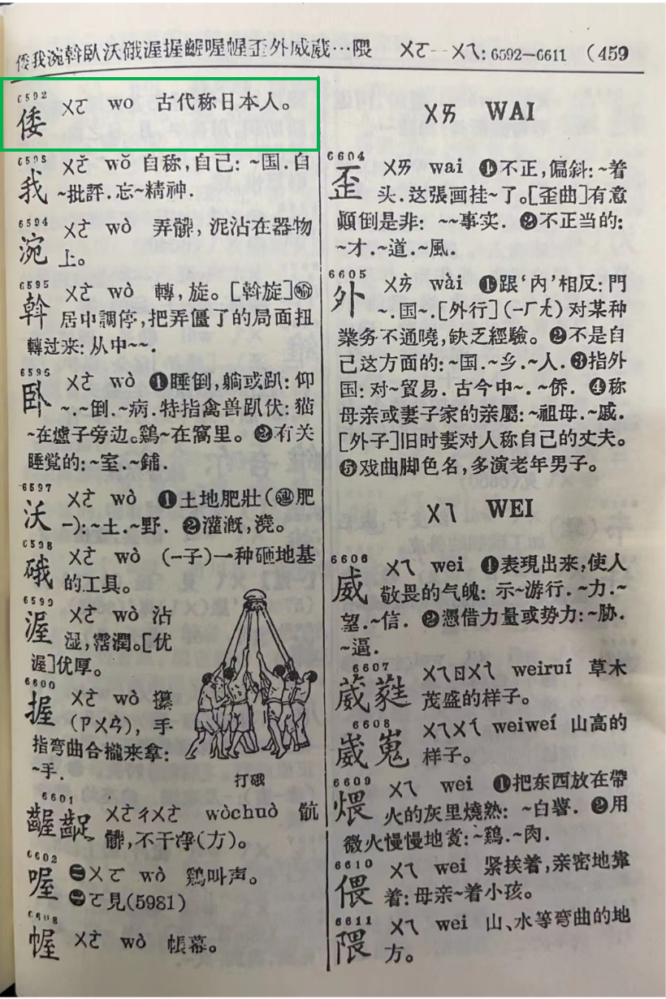
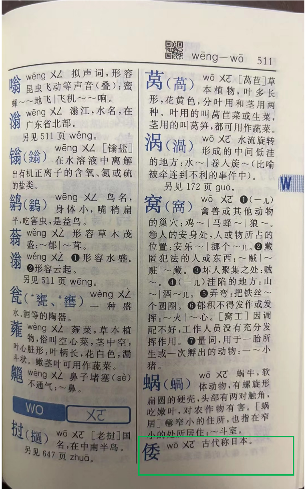
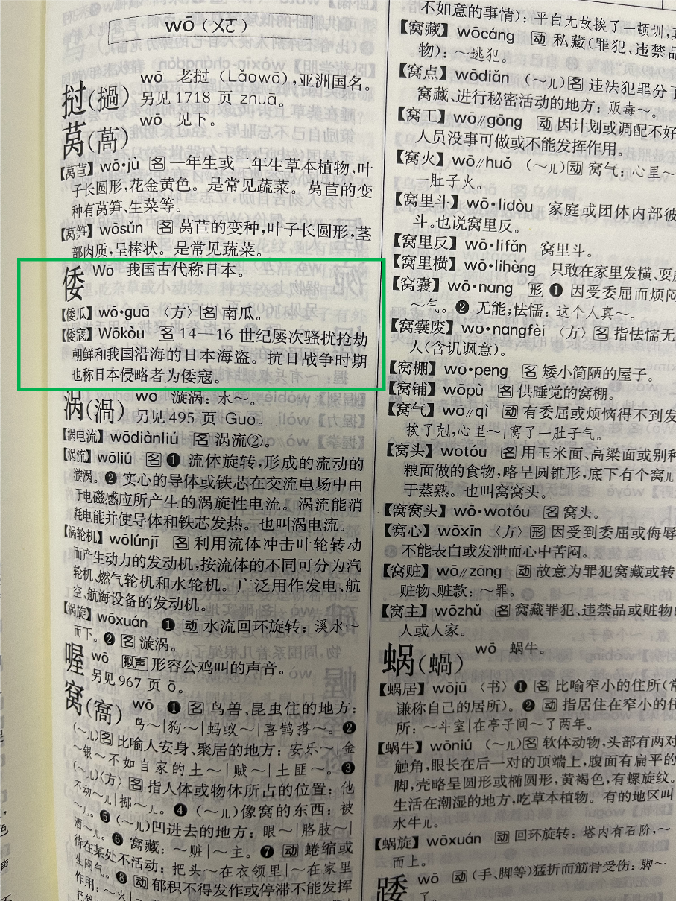
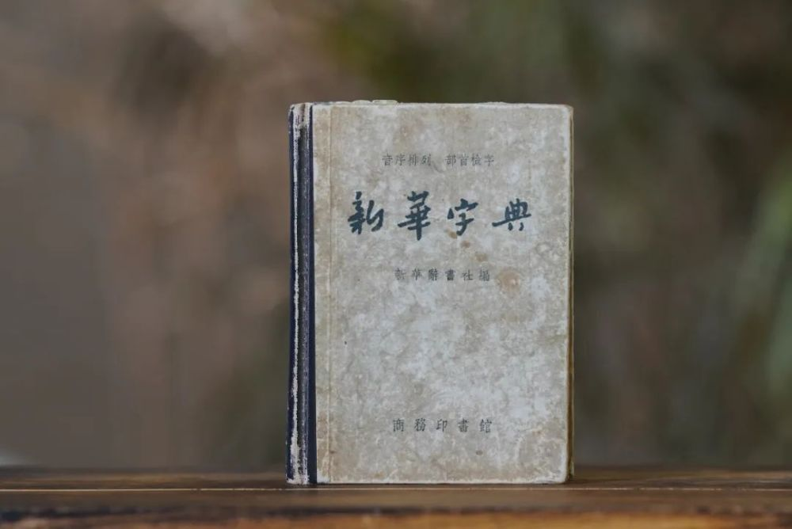
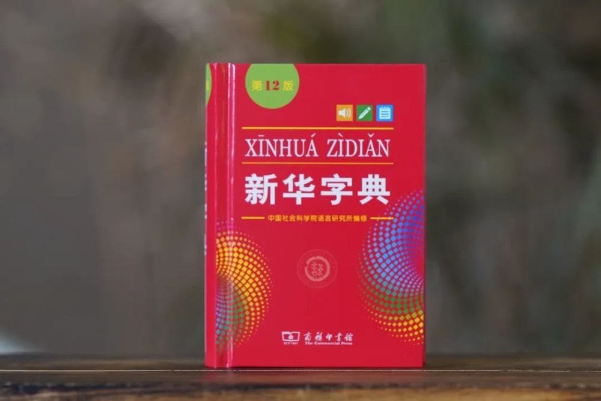

# 网传“新版《新华字典》删‘倭寇’一词”？媒体调查：假消息

近日，有网友反映“倭寇”一词被移出新版《新华字典》，引发社会舆论关注。有媒体报道援引商务印书馆工作人员回应称，已知晓此事，正了解详细情况。

对此，“中国出版营销周报”微信公众号6月27日刊文介绍，据中国出版传媒商报社第一时间调查了解，此报道不实。调查情况如下：

1.《新华字典》作为小型字典，重在收字，从上世纪50年代至今，所有版本中，在“倭”字下都未曾收录“倭寇”这一词语，因此所谓“新版删除”该词不属实。

_《新华字典》1957年版内文“倭”字 本文图均为 中国出版营销周报 图_

_《新华字典》第12版内文“倭”字_

2.商务印书馆出版的《现代汉语词典》和《新华词典》，作为中型词典，各个版本里均一直收录有“倭寇”一词。

《现代汉语词典》第7版内文“倭寇”一词的解释为：14-16实际屡次骚扰抢劫朝鲜和我国沿海的日本海盗。抗日战争时期也称日本侵略者为倭寇。

_《现代汉语词典》第7版内文“倭寇”一词_

澎湃新闻记者注意到，在《新华字典》App中，收录的第12版《新华字典》同样未收录“倭寇”这一词。而第12版《新华字典》早在2020年就已发行，并不存在所谓“倭寇”一词被移出新版《新华字典》的情况。

_《新华字典》1957年新1版封面_

_《新华字典》第12版封面_

公开资料显示，《新华字典》是新中国第一部现代汉语字典，在中国辞书史上具有里程碑的意义。首次出版于1953年，原由新华辞书社编写，魏建功主持编写工作。首版和1954年修订版由人民教育出版社出版发行。1956年新华辞书社并入当时的中国科学院语言研究所（1977年改属中国社会科学院）词典编辑室，此后该字典的修订和维护工作主要由该所担负；1957年新1版至2020年第12版均由商务印书馆出版发行。

