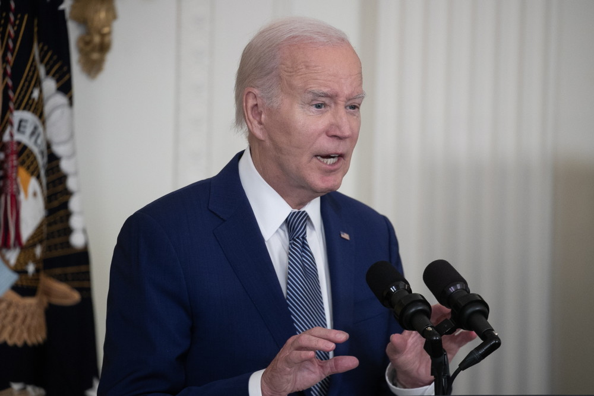
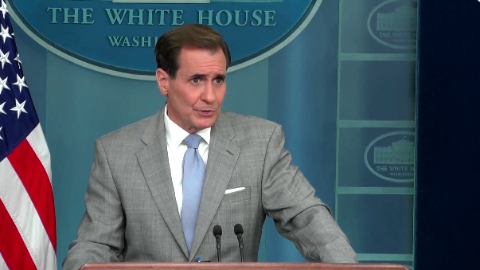
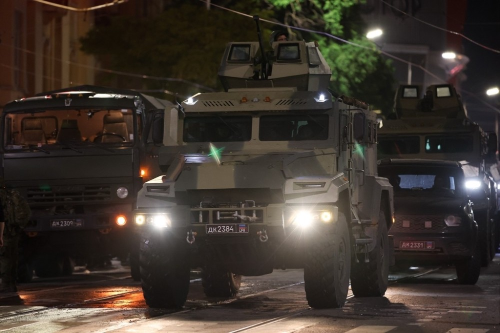

# 美方谨慎密集表态：和莫斯科直说了，我们真没掺和“瓦格纳事件”

（观察者网讯）前有塞尔维亚总统表示有外国势力参与和支持“瓦格纳叛乱事件”，后有俄外长拉夫罗夫透露有关部门正调查是否有西方间谍机构在其中发挥作用。待“疯狂星期天”的事态逐渐平息，难得一直保持沉默的美西方彻底坐不住了，26日起接连对此密集发声，但措辞都相当谨慎。

综合美联社、路透社等27日报道，美国总统拜登、国务卿布林肯、国家安全委员会发言人柯比、国务院发言人米勒等“排队”表态，称美国没有在“瓦格纳事件”中扮演任何角色，强调此事是俄罗斯内政，并表示事后曾通过各种外交途径直接向俄罗斯传达了美方这一态度。

另据塔斯社早前援引意大利媒体报道称，出于发生核事件的担忧，北约也第一时间与俄国防部进行了“非正式接触”， 澄清其与“瓦格纳事件”没有任何关系。

_截图自美联社_

“就连出了名跑偏话题的美国总统拜登也不‘满嘴跑火车’了。”美联社如此形容此次美方表态之慎重。

当地时间6月26日，拜登首次就俄罗斯“瓦格纳事件”发表讲话，撇清美方与事件的关系。他特别强调，美国及其盟友向莫斯科方面明确表示他们完全没有参与其中，“瓦格纳事件”属于俄罗斯的“内部矛盾斗争”。其声称，如此是为了避免普京找借口将事件归咎于西方或北约。

拜登周末也就此事和乌克兰总统泽连斯基通了电话，重申美国会继续支持乌克兰。拜登还表示，近期他可能再次与泽连斯基通话，以确保双方“意见一致”。

他也拒绝就此事是否会影响乌克兰冲突做出评价，称现在下结论还为时尚早，“这一切的最终结果有待观察。无论接下来发生什么，我将确保盟友和合作伙伴在解读、应对局势方面保持一致。”

_美国总统拜登发表讲话 图自澎湃影像_

同一天的白宫新闻发布会上，美国国家安全委员会发言人约翰·柯比对记者进一步表示，拜登有关西方国家没有参与此事的信息是通过各种外交渠道直接传达给俄罗斯的。他没有提到俄方反馈。

“我们还向所有盟友和合作伙伴明确表示，美国过去和未来都不会参与这些事件，我们认为它们是俄罗斯的内部事务。我们也通过适当的外交渠道向俄方传达了相同的信息”，他说。

柯比还补充道，美方将继续关注如何帮助乌克兰在战场上取得成功，而不是猜测此次事件对俄罗斯国内的政治局势将造成何种影响，美国政府在俄罗斯的内政问题上不会偏袒任何一方。

对于外界有关俄国防部长绍伊古去留的猜测，柯比亦阐明，“绝对没有迹象表明，俄罗斯军队的指挥链发生任何变化。”

_柯比 视频截图_

美国国务院发言人马修·米勒当天在记者会上的发言也是大同小异，其透露美国外交官24日就曾与俄方接触沟通，强调美国政府将此事视为俄罗斯内政，美国只是一个“单纯的旁观者”。

被问及如何定义俄罗斯国内发生的事件时，米勒拒绝将之称作“政变企图”，也拒绝谈论普里戈任的最终动机。但他声称，是普京唤醒了“1917年（十月革命）的幽灵”，而不是美国政府的任何一个人。

对于拜登政府上下全员表现出的小心翼翼，美联社的描述相当有意思：从表面上看，瓦格纳事件给俄罗斯带来的紧张局势应该是美国所喜闻乐见的；但实际上，整个周一，连瓦格纳创始人普里戈任的名字，美国官员们都在绞尽脑汁地尽量避免在公开言论中提及。

文中特别提到，去年普京宣布俄罗斯对乌克兰发动“特别军事行动”时，拜登曾发表了一份激情昂扬的谴责声明，怒称普京不应继续掌权俄罗斯；“而今天柯比说，‘我们认为，应该由俄罗斯人民来决定他们的国家领导人是谁’。”

_当地时间6月24日晚间，瓦格纳武装人员撤离顿河畔罗斯托夫
图自IC photo_

生怕发生任何误解的还有北约。俄媒塔斯社援引意大利《共和报》25日报道称，“瓦格纳事件”的消息传到西方和北约领导人的办公桌上时，出于危机升级和核事件发生的担忧，北约很快与俄国防部进行了“非正式接触”。

《共和报》称，西方希望立即澄清他们的军队与这场冲突毫无关联，并表明他们“没有在叛乱者采取的行动中发挥任何作用”。

美国“政客”新闻网24日注意到，在“瓦格纳事件”发生的整整一天时间里，该媒体联系的北约官员都不愿意对此次冲突作出过多评价，或者透露北约的任何应对措施，连北约发言人也仅仅只是简单回应称“正在监测局势”。

26日，北约秘书长斯托尔滕贝格在立陶宛出席活动时发表讲话，其表示北约正密切关注“瓦格纳事件”的发展情况，以及瓦格纳雇佣兵集团可能被重新部署至白俄罗斯的消息，他称必要时将作出“快速反应”，北约近几年已加强在东翼的力量。

讲话中还发生了一个小插曲：当着德国国防部长皮斯托里乌斯的面，斯托尔滕贝格一个嘴瓢，把“瓦格纳事件显示出俄罗斯政权的脆弱”这句话，错说成“显示出德国政权的脆弱”，引得一旁皮斯托里乌斯忍不住发笑反问，“德国政权吗？德国政权现在还是很稳定的。”

**本文系观察者网独家稿件，未经授权，不得转载。**

