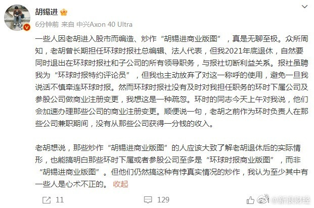
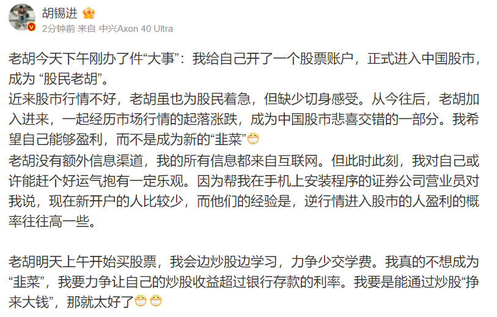

# 胡锡进回应商业版图：没有从那些公司获得一分钱的收入

6月27日消息，胡锡进回应在多家公司任职高管称，那些炒作“胡锡进商业版图”的人中有一部分人“心术不正”；那些环时下属或者参股公司至多是“环球时报商业版图”，而非“胡锡进商业版图”；自己退休时已与与报社切断利益关系；作为环时负责人在那些公司兼职期间，没有从那些公司获得一分钱的收入。

据了解，6月26日下午，胡锡进自称正式进入中国股市，明天开始买股票。企查查APP显示，胡锡进关联企业3家，分别为环球时报在线（北京）文化传播有限公司、金色环球传媒股份有限公司、北京环球艺动影业有限公司，任职包括副董事长、董事长及董事。

