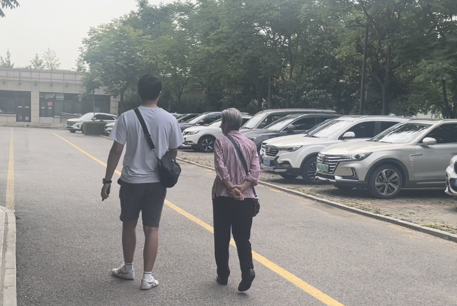
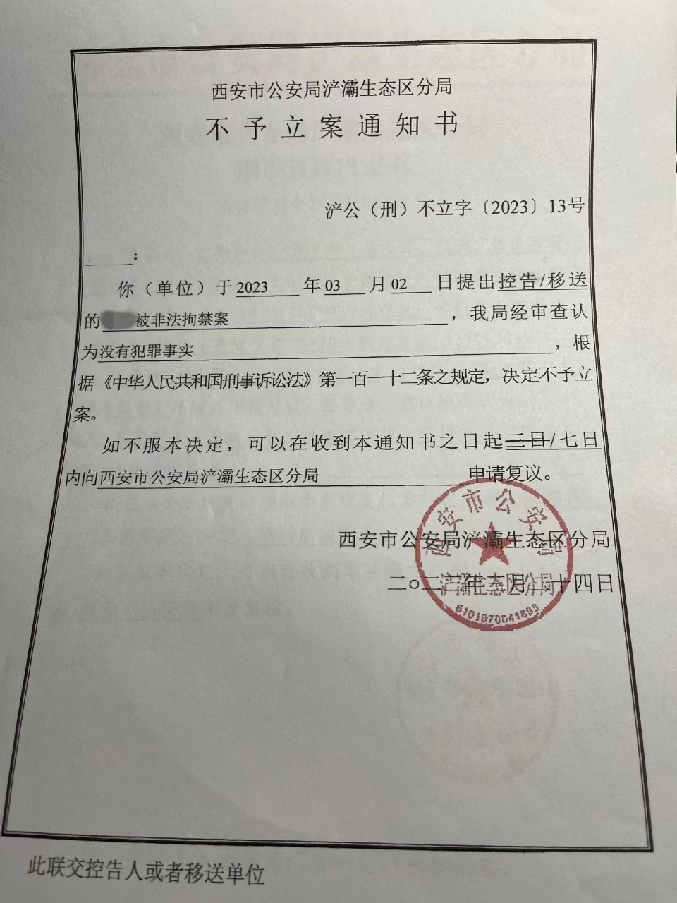
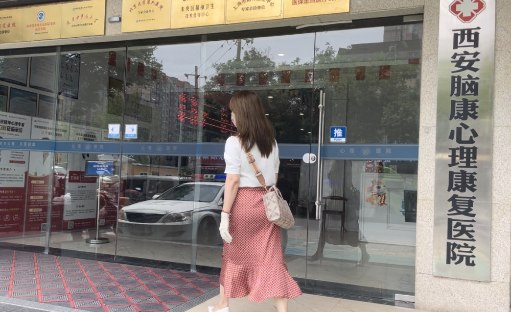

# 西安一妻子将丈夫送进精神病院，丈夫出院后又将其送进精神病院

**“情绪不稳、疑人害己”，再加上其他医院的诊断证明，妻子找人将丈夫送入精神病院；然而，丈夫出院后，将妻子也送进了精神病院。双方都认为对方有病，各执一词，都要为自己“被精神病”的“惨痛经历”讨个说法，也都认为对方的强行送医涉嫌非法拘禁。**

**那么，这对夫妻究竟谁有病？还是双方都将精神病院当作合法拘禁场所，以达到报复对方的目的？**

丈夫控诉：被妻子强送到精神病院

6月中旬的西安，有时高温灼人有时阴雨绵绵，忽冷忽热，天气暴躁。

“她把我在精神病医院关了80天”，6月16日，渊强（化名）自称他遭遇妻子的非法拘禁。

渊强和妻子开了一家公司，育有一儿一女。渊强认为，自己被送进精神病院，妻子是早有铺垫的。“从2021年开始，我们吵架变得频繁，她说我情绪不稳，是不是工作压力大等，建议我去医院看看。”家人说得多了，渊强也就重视了，他先后去过多家医院看过。有时是自己去的，有时是家人陪着去医院看的，吃过一些药，当时他觉得这是家人对他的关心。

2022年10月10日傍晚6时30分，渊强称他遭遇了人生中最黑暗的时刻：“我下班刚走出公司楼门口，突然冲上来5名陌生壮汉，把我架到一辆越野车上，用我的帽子堵住我的嘴，击打我的头部、胸部，并用膝盖压在我胸口上使我不能动弹。同时还抢走了我的手机、车钥匙、银行卡、电脑等。”

渊强说，车子行驶约半个小时后，他被带到了西安市精神卫生中心（三级甲等精神病专科医院），之后被绑到医院的担架上、推进有三道铁门的病房，医院的人强迫他换上病号服。“1个小时后，我在病房里见到妻子，我才明白，这一切是她早有预谋的。”渊强说，他怀疑妻子有外遇，女人变心才会如此狠心。

入院80天，想见儿子和母亲未果

让渊强不解的是，在西安市精神卫生中心住院的80天里，他想见的人医院从未让见过。“我从被强行送进的第一时间，就提出要见母亲和儿子，医院让我给母亲和儿子打了电话，但始终未让见面，理由是因为疫情管控。可我妻子带来的朋友，却能见我，并劝我，让我承认自己有病，安心治疗。”

_渊强手写被强送精神病院的过程_

渊强告诉记者，在精神病院，他每天都有“无穷无尽的检查和治疗”，遭受了电针治疗、头皮扎针、吃药等等。“我活动的地方不足80平方米，里面有70多人。不能反抗，不能激动，一反抗一激动，治疗手段会更多。我多次要求出院，都无人理睬。”想起在精神病院度过的80天，渊强总结为“失去人身自由、受尽折磨，尤其是医院在还未确诊的情况下，一入院就给我用精神病药物，电击治疗，这是对我身体的一种损害。”

渊强21岁的儿子告诉记者，医院不让他和奶奶见父亲，他打12345市民热线，给卫健委和纪委都反映过。2022年10月27日，西安市精神卫生中心通知他，说可以去接父亲出院了，因为在先一天，医院给父亲做出的诊断是焦虑抑郁状态和偏执状态。当他去接父亲出院时，又被医生以“谁送进来谁接走”为由而拒绝。直到入院80天后的2022年12月29日，父亲才出院。渊强儿子说：“医生说我爸能不能出院，得我妈签字，说我妈是我爸的监护人。”

_渊强住院期间，其儿子和近八旬母亲为“解救”渊强一直在外四处奔走_

病历显示：两家医院确诊男方有精神疾病

记者在渊强提供的西安市精神卫生中心的住院病案上看到，入院记录显示：渊强从2021年3月开始，情绪不稳、易发脾气，和母亲吵架、和客户吵架……主要体现为怀疑妻子有外遇，私下收集妻子外遇证据，情绪低落……曾于长安医院、城北脑康医院就诊，2021年12月曾于西安精卫中心门诊就诊，诊断为“焦虑抑郁状态”，建议心理治疗。2022年9月30日，于空军军医大学第一附属医院就诊，诊断“抑郁症，双相情感障碍，精神分裂症”，建议住院治疗，未遵医嘱。患者在家情绪不稳，行为冲动，打妻子、毁物，家属难以管理，由患者妻子带来急诊就诊，要求住院治疗。依据《精神卫生法》第三十条第二款第二项，患者既往于空军军医大学第一附属医院就诊考虑存在精神疾病，已存在危害他人安全行为，符合非自愿住院标准。

病案记录中，2022年10月26日诊断为偏执状态、焦虑抑郁状态……出院诊断亦如此。渊强说，就是在2022年10月26日医院经过对他病情论证后，才给出的这两个“状态”，本来已经同意他出院了，后来又改口，说谁送来的谁接。“我妻子不同意，我又被关了两个月。”渊强说，怀疑妻子出轨的证据，在他入院第一天表明可以给医生看，“医生先说可以拿来，后来我儿子把存在电脑里的证据拿来了，医生又说没有必要。”

出院后前往北京检查精神正常

出院后的渊强坚持认为自己没病。他想知道，偏执状态、焦虑抑郁状态是一种怎样的定义？更想证明自己没有精神病。他前往北京安定医院做精神专项检查。检查结果说他没有精神问题。

他给记者提供了北京安定医院的各项检查单。记者看到，渊强于2023年1月31日，前往北京安定医院普通精神科就诊。渊强说：“医生先跟我谈了话，之后又跟陪我一起检查的儿子和表哥问了话。”7项检查结果分析报告单显示：33项轻躁狂症状清单（HCL-33）结果为“正常”；心境障碍问卷（MDQ）结果为“报告未见异常”；匹兹堡睡眠质量指数量表检查（PSQI）结果分析为“睡眠质量很好”；艾森克个性测验-
成人版（EPQ）结果分析为“无精神质倾向”；抑郁自评量表测评（SDS）结果为“无明显抑郁症状”；症状自评表测评（SCL-90）结果分析为“无明显心理问题”；焦虑自评量表测评（SAS）结果分析为“无明显焦虑症状”。

对此，渊强失落地说：“这些报告又不能说明啥，只会让他们认为之前在西安给我把病看好了”。

“我在西安市精神卫生中心住院期间，妻子还向西安市雁塔区法院申请鉴定我为限制行为能力人。当时我母亲收到了法院的通知，鉴定需要西安中院摇号产生鉴定机构，摇出的机构是西安市精神卫生中心，我不同意。”渊强说，西安市精神卫生中心不能既当运动员、又当裁判员。因此，这个鉴定没能进行。

妻子委屈：丈夫出院后将我强送精神病院

就在渊强前后多次向记者反映自己在精神病院的遭遇时，渊强的妻子屈艳（化名）也在四处讨说法。她告诉记者，丈夫出精神病院后没几天便离家出走，直到今年2月5日，给她打电话说要回家。

当天，屈艳见到了丈夫和儿子。没说几句话儿子就出了门，约过了五六分钟，进来5名自称是精神病院的陌生男子，“上来就给我胳膊打了一针，很快，我全身没劲儿。我是被他们架着出门的。”一个多小时后，屈艳被带到了位于西安城北的西安脑康心理康复医院（二级精神病医院）。

在该医院，屈艳说她被迫换病号服，稍不服从就被电警棍击打，并强制灌药，将她捆绑在病床上、接受电击治疗。屈艳说，她跟医生明确表示，送她来的丈夫曾在此看过精神疾病，医生不予理睬。屈艳要求与家人联系，被拒绝。后来妹妹找不到她，报警求助。

妻子亲属报警寻人，丈夫谎称带她在上海看病

在屈艳入院的第3天晚上，她的亲朋好友找到了她。屈艳的朋友赫先生说，那两天里，他们查找了西安的多个医院，都没找到屈艳的住院记录，大医院没查到，就找小医院，想到渊强曾在西安脑康医院看过病，便前往打听，也没问出信息。2月7日，他们一行人向主管部门求助，才问出屈艳的确入住该院。当晚8时，家人前往医院将屈艳接了出来。

屈艳的同事孙某提供了一段电话录音，录音时间显示为2月6日，她给渊强打电话，询问屈艳下落，渊强称屈艳因肺结节住院，需做手术、无需探视。一段屈艳妹妹提供的录音显示，西安市公安局浐灞分局十里铺派出所致电渊强，渊强对民警说，他带着妻子在上海看病。

渊强将妻子送进精神病院的理由是：她无故打人骂人、情绪激动，伤人毁物，疑人害己。他给记者看了几段视频，一段是妻子和儿子争吵间、拿凳子欲砸人的视频，一段是妻子在家里爬至摄像头前、砸毁摄像头的视频。渊强说，从法律上讲，如果不送她去看病，他是有责任的。

她出院后控告医院非法拘禁

2月7日晚上，屈艳从精神病院出来立即前往最近的公安未央分局徐家湾派出所报警。

屈艳认为丈夫是在报复自己：“我没有精神病，也没有任何医院关于精神疾病的诊断证明，西安脑康医院听我丈夫的一面之词，就把我当精神病人对待，在没有确诊的情况下给我吃精神病药，给我扎针、捆绑、电击……他们这是非法拘禁……”

因为管辖地的原因，屈艳控告医院非法拘禁一案最终由公安浐灞分局十里铺派出所受理。

记者了解到，今年3月24日，公安浐灞分局出具不予立案通知书，原因是“没有犯罪事实”；屈艳遂申请复议，刑事复议决定书决定维持原决定；屈艳又向西安市公安局申请复核，结果还是被维持原决定。复议和复核决定书显示的理由都一样：不予立案决定认定的事实清楚、证据充分。5月23日，屈艳就此向灞桥区检察院申请立案监督。

_警方出具不予立案的通知_

屈艳的病案显示，2月6日开始服用精神类药物。屈艳提供的一段家门口的视频显示，2月5日晚9时25分，屈艳家门口陆续走进5名男子，2分钟后，她的两个胳膊分别被两名男子抓着走出院子。

记者发现，屈艳入院病历上记录的“病史”与渊强入院的情况极为相似，都是疑人害己、情绪不稳、打人骂人、脾气大，怀疑丈夫有外遇，家属无法管理，为求进一步诊治，家属联系医院，由医院的工作人员及患者丈夫、儿子带来就诊。门（急）诊诊断一栏里，屈艳被诊断为“精神分裂症”，出院情况标注着“未愈”，在出院记录中的诊断栏里结果为“精神分裂症？”

屈艳质疑，“刚入院既然确诊了精神分裂症，怎么治疗了两天后又怀疑不是精神分裂症”？她说，通常的情况是入院时候怀疑有病，出院时应该确诊，怎么反着来的？

出院后检查“存在重度焦虑倾向”

为证明自己没有精神病，屈艳于今年2月10-13日在空军军医大学第一附属医院心身科做了检查。

记者在其提供的7项测评报告中，看到结果分别为“无明显躁狂症状”“没有焦虑症状”“没有抑郁症状”“暂无抑郁倾向”“不存在精神分裂症状或有较轻的精神分裂症状”，90项症状自评量表（SCL-90）的结果显示没有明显心理问题。但在焦虑自评测试（SAS）的评估结果提示：“目前存在重度焦虑倾向”，分析内容：“可能多数情况下处于严重的紧张、不安、急切甚至惶恐之中……即使睡着也噩梦不断……”

“医生给出的解释是受到了惊吓所致。”屈艳说，“本来我好好的，被强送精神病医院折腾出来的毛病”。

而针对把丈夫送进精神病院的理由，屈艳认为十分充分。她给记者提供了2022年至今年间数份家暴的报警记录，她说丈夫怀疑她出轨，经常殴打她，“有一次把我打骨折了。”除此之外，丈夫一份来自空军军医大学附属第一医院的诊断，显示为抑郁症、双相情感障碍，精神分裂症。尽管渊强对该诊断不予认可，但是该诊断成为西安精卫中心收治他的重要依据之一。

家暴是否属实？6月13日，公安浐灞分局十里铺派出所民警张警官说，屈艳报警次数很多，内容也不全是家暴，还有其他，“出家暴的警情，我们发现两人身上或多或少都有伤。因为家庭矛盾，主要以劝合为主。有些现场就调解了，有些当事人撤案了。”

两家医院：均认为自己收治患者没问题

对于夫妻二人的质疑，记者先后走访了西安脑康医院和西安精卫中心。两家涉事医院均认为自己收治“非自愿”患者没问题。

6月8日，记者以屈艳同事的身份，一起到西安脑康医院暗访。

_屈艳前往西安脑康复心理康复医院讨说法_

在西安脑康医院的会客厅内，屈艳提起在该医院的遭遇，情绪激动和对方发生争执，该院副院长和医务科工作人员起身离开。该院齐姓副院长说，人是她丈夫要求、医院派人上门带来的，虽然没有其他医院的就诊病历，但医院也收初次就诊者，家人也提供了相关的伤人毁物视频，符合非自愿患者住院条件。该副院长称，屈艳入院时间太短，无法给出确切的诊断结果，这也是病案上会在“精神分裂症”后面打问号的原因。“既然没确诊，为何给吃精神类药品？”该问题齐副院长没有正面回答，只说，当时屈艳的状态很激动，他们是可以采取相应措施的。

同时，齐副院长否认医生有打人的行为。

6月12日，记者前往西安精卫中心采访。该院医务科的工作人员介绍说，收治流程是符合收治条件的，满足伤人伤己其中一条就可以，渊强的妻子提供了他打伤人的照片和就诊记录，以及他本人曾经在其他医院关于精神疾病的就诊证明。至于不能探望的原因则是因为疫情。

卫健部门：经调查两家医院收治流程规范

渊强对西安市精神卫生中心违规收治、作出的焦虑抑郁状态和偏执状态诊断等相关质疑，以及屈艳质疑西安脑康医院将她一个正常人当作精神病人对待的问题，记者先后向西安卫健委以及西安未央区卫生健康局了解情况。

6月20日上午，记者与屈艳来到西安市未央区卫健局。医政医管科工作人员介绍说，屈艳反映的事情他们调查过不止一次，西安脑康医院收治屈艳的程序是符合规范的。该工作人员表示，他们能做的就是收资料、协调启动医疗事故技术鉴定，但这个鉴定是用来调解双方矛盾的，没有司法鉴定的法律效力强，而当下的情况是西安脑康医院拒绝调解。对于医院拒绝患者联系家属以及本人质疑医院诊断有误，建议屈艳去法院起诉，届时法院会启动司法鉴定程序，继而根据结果判定。

6月21日下午，西安市卫健委答复称，之前接到长安警方的协助调查函就已经详细地调查过，西安精卫中心在收治渊强方面没有问题。

屈艳给记者提供了一段西安卫健委医政医管处就渊强相关投诉的完整答复。“按理说谁投诉的给谁答复，但不知道为什么，西安卫健委给我答复了。”

这份录于今年1月11日的音频，内容为西安卫健委工作人员向屈艳核实渊强是否已经出院，称他们调查是因为收到了公安长安分局的协助调查函，关于西安市精神卫生中心收治渊强的流程是否规范，以及渊强是否患有精神类疾病。卫健委工作人员说，经调查，渊强入院收治流程合规，患病有诊断依据，住院期间有治疗。诊断结果为符合妄想性障碍中偏执状态的诊断标准。根据《精神卫生法》第三十条规定，渊强符合严重精神障碍的诊断，有危害他人的风险。对其实施住院治疗合规合理合法，经过医院治疗，经对其精神状态、攻击性及自杀风险、自知力症状等评估符合出院标准。

精神科资深医生：若诊断不明确是不能用药的

6月17日，记者采访了一位资深的精神科医生，就渊强和屈艳均控诉“被精神病”的问题，他说，精神疾病患者的收治，分自愿住院（即患者本人同意）、“非自愿住院”（即除个人自行到医疗机构进行精神障碍诊断外，疑似精神障碍患者发生伤害自身、危害他人安全的行为，或者有伤害自身、危害他人安全的危险的，其近亲属、所在单位、当地公安机关应当立即采取措施予以制止，并将其送往医疗机构进行精神障碍诊断），以及强制医疗三个部分。第三个部分主要针对涉及的刑事案件，经鉴定不负刑责的精神病人，经法院判决需强制医疗。

这位精神科医生表示，此事件牵扯到的是第二种情况，即“非自愿”住院。“非自愿”住院条件有两个：伤害自身、危害他人安全的行为，或者有伤害自身、危害他人安全的危险的。伤害自己的情形，必须经过近亲属同意，但有危害他人的行为或是有危害他人安全行为的，家人或者是其所在的单位、民政以及公安等都有权利送医。医院在收治时，家属提供患者的既往病史是很重要的收治依据，再加上家属的陈述，如果门诊收治时就能够诊断，收治即可直接用药，如若当下难以下诊断的，需先收治观察72小时，观察最长不超过两周，医生会根据收治的依据，进行微检查，再加上精神检查，主要是通过谈话，来发现入院者有哪些不正常的地方，确诊了才能用药，观察期间是不能用药的。

该医生表示，这对夫妻无需向谁证明自己没病，不认可医院的诊断，可起诉医院，行政部门不作为的，可进行行政诉讼，法院会启动精神病鉴定程序。为避免干扰，当事人可向法院申请找外地的机构鉴定。

律师观点：“夫妻双方是彼此的监护人”这是对法律的误读

北京尚权律师事务所律师房立刚认为，法律对于成年人设立监护人有严格的规定，须经人民法院特别程序认定该成年人为无民事行为能力人或者限制民事行为能力人，才能为其设立监护人。也就是说，正常人是没有所谓的监护人的。很多人想当然地认为夫或妻一方是另一方的监护人，这是对法律的误读。

夫妻任何一方，既不能未经法院认定，也不能在没有出现法定的伤害他人的情形下，就擅自以监护人的名义将对方送往精神病院强制其住院治疗。

医疗机构也不能未经严格审查监护人资格以及进行严谨的精神疾病诊断，特别是不遵守法律关于收院治疗的程序规定和实体规定，未严格审查是否有“伤害他人”的情形，就依据夫妻一方的说辞直接对另一方实施限制人身自由的住院治疗措施。

如果发生擅自强制住院的情形，卫生行政部门应当对该医疗机构的违法行为作出行政处罚，医疗机构也应当为其违法的医疗过错行为给患者造成的损害承担赔偿责任，特别是相关人员对不符合住院治疗情形的患者或者正常人实施强制住院的，还应当承担非法拘禁罪的刑事责任。

房立刚介绍，成年人是否需要监护人，首先要认定该成年人是否为无民事行为能力人或者限制民事行为能力人。

根据《民法典》第二十四条的规定：“不能辨认或者不能完全辨认自己行为的成年人，其利害关系人或者有关组织，可以向人民法院申请认定该成年人为无民事行为能力人或者限制民事行为能力人。”

《民法典》第二十八条规定：“无民事行为能力或者限制民事行为能力的成年人，由下列有监护能力的人按顺序担任监护人：（一）配偶；（二）父母、子女；（三）其他近亲属；（四）其他愿意担任监护人的个人或者组织，但是须经被监护人住所地的居民委员会、村民委员会或者民政部门同意。”

关于收治：医疗机构未按诊断规范诊断的对患者造成的损害需担责

《精神卫生法》规定，疑似精神障碍患者的亲属在患者发生伤害自身、危害他人安全的行为，或者有伤害自身、危害他人安全的危险的，应当将其送往医疗机构进行精神障碍诊断，并及时出具诊断结论。这里只是说到诊断，而是否强制住院，法律很明确的一个原则是：即“精神障碍的住院治疗采取自愿原则。”

其中分为：

1.精神障碍患者发生伤害自身的行为或者有伤害自身危险的，经其监护人同意，医疗机构应当对患者实施住院治疗。

2.精神障碍患者发生危害他人安全的行为，或者有危害他人安全的危险的，患者或者其监护人对需要住院治疗的诊断结论有异议，不同意对患者实施住院治疗的，可以要求再次诊断和鉴定。再次诊断结论或者鉴定报告表明，不能确定就诊者为严重精神障碍患者，或者患者不需要住院治疗的，医疗机构不得对其实施住院治疗。再次诊断结论或者鉴定报告表明，精神障碍患者有上述情形的，其监护人应当同意对患者实施住院治疗。

自愿住院治疗的精神障碍患者可以随时要求出院，医疗机构应当同意。房立刚说，基于上述规定，本案夫妻双方均将对方送进医疗机构强行住院治疗，都违反了住院治疗自愿性原则的规定。

医疗机构除了需要家属提供既往病史病历及打架毁坏物品的视频等收治条件，医疗机构有没有听取患者本人的意见，如若无视患者本人的异议，未告知患者在诊断过程中享有再次诊断和鉴定的权利，直接对其采取了住院治疗措施，违反了诊断程序，严重损害了患者或者正常人的合法权益。

法律规定了对患者进行住院治疗需要经过监护人的同意，不代表监护人就有权利将患者随意放入医疗机构进行强制住院治疗。

《民法典》第一千二百二十二条规定：“患者在诊疗活动中受到损害，有下列情形之一的，推定医疗机构有过错：（一）违反法律、行政法规、规章以及其他有关诊疗规范的规定；（二）隐匿或者拒绝提供与纠纷有关的病历资料；（三）遗失、伪造、篡改或者违法销毁病历资料。”

若医疗机构违反法律规定的诊断程序，所作出的住院治疗诊断依据并不充分，在医疗机构强制住院治疗期间，给患者的身心造成了极大的伤害，而医疗机构对患者的损害明显存在过错，应对患者承担赔偿责任。

关于自由：医师剥夺患者或者正常人的人身自由涉嫌非法拘禁

《刑法》第二百三十八条规定：非法拘禁他人或者以其他方法非法剥夺他人人身自由的，处三年以下有期徒刑、拘役、管制或者剥夺政治权利。具有殴打、侮辱情节的，从重处罚。

非法拘禁罪，是指以拘押、禁闭或者其他强制方法，非法剥夺他人人身自由的行为。

若医疗机构的诊断医师未按照法律规定的诊断程序和收治标准就轻易将人关入精神病医院，损害了患者甚或正常人的合法权益，明知擅自强制住院治疗的措施，有非法剥夺了他人人身自由的可能，对不符合强制住院条件的人，仍采取追求或者放任的心态进行强制住院，具有非法拘禁犯罪的主观故意。

法律延伸“被精神病”者住院期间的抗辩途径，缺失亟待法律规范

陕西恒达律师事务所高级合伙人、律师赵良善认为：根据《精神卫生法》第二十六条规定，采取自愿医疗的原则，并非强制。

赵良善强调，实践中，疑似精神疾病患者或者无精神病患者被送至精神病院的案例并不罕见。进入精神病院，疑似精神疾病患者或者无精神病患者的反抗及申辩往往是苍白无力的。尽管《精神卫生法》第25条规定了当事人对诊断有异议的，可以在接到书面诊断结论后10日内提出复诊申请，甚至对医院住院治疗与隔离措施有异议的，可以诉讼，但是这也只是事后的补救性办法，且这些法律规定极不具有可操作性，对受害者的权益保护难有实际意义，毕竟法律赋予了医师极大的检查评估主观判断权，而且受害者提出复诊时早已遭受被强制医疗的精神及肉体的痛苦，无法弥补。不少“被精神病”者因强行医疗深受其害，归结于受害人住院期间的抗辩途径的缺失，因此，立法部门完善受害人住院期间的抗辩途径相关法规迫在眉睫。

赵良善介绍，判断是正常医疗还是非法拘禁关键在于患者自愿住院就医的权利是否被限制和剥夺。根据《精神卫生法》规定，精神疾病患者的治疗实行自愿原则，针对是否住院医疗，患者本人有知情权和同意权。实践中，如患者确实病情较重，不具备分辨能力，那么针对是否住院医疗，就要以监护人意见为主，患者意见为辅。如医院违背了上述患者与家属或监护人意见采纳的原则，则侵犯了患者自愿住院就医的权利，涉嫌非法拘禁。

赵良善呼吁，随着社会快速发展，很多人迫于生活、工作压力不同程度患有精神类疾病，比如抑郁症、焦虑症等，但这类疾病轻微、控制得当时，并不会对他人造成损害，立法部门应当出台相应法律法规来保障这类人的权益。针对精神类疾病的治疗和控制，立法部门应当出台细则。

**华商报大风新闻记者 苗巧颖 编辑 董琳**

