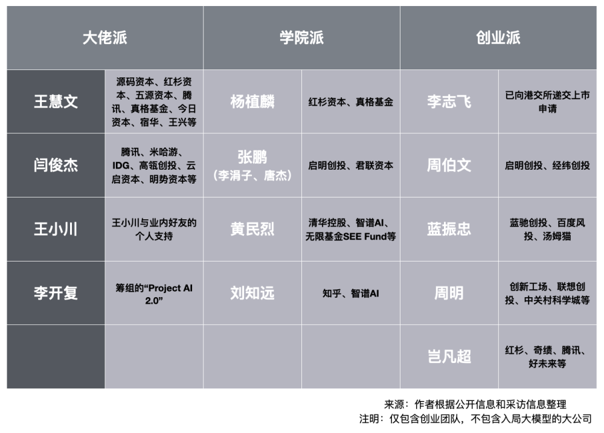

# 中国大模型，生在大佬资本局：沈南鹏等亲自组局，清华系占半壁江山

_图片由AI生成_

腾讯新闻《潜望》作者 张小珺

红杉中国创始及执行合伙人沈南鹏最近有些事必躬亲。他亲自约见每位大模型创业者，与他们单独吃饭交流，每人大约3小时。

在中国创投行业，红杉被认为是应对此轮AI浪潮最激进的基金之一。多位不同基金的投资人表示，
**就在一些基金还在几家初创企业中摇摆时，红杉在多个大模型及应用的创业局里都“放了钱”。**

而沈南鹏的表现也象征着此轮创业潮的特征之一——此番皆为“诸神之战”，大佬们披甲上阵。

“他们觉得时代又来了，都来劲了，又可以亲自上阵。”一位美元基金投资人说。据了解，
**除了沈南鹏，源码资本创始合伙人曹毅、奇绩创坛创始人兼CEO陆奇、今日资本创始合伙人徐新、真格基金管理合伙人戴雨森等，都是这轮创投潮中的积极派个人代表。**

“这次都是老板，像分析师一样。”他们独揽了从找项目、看项目、见创始人，到谈条款等所有环节，甚至有些基金连公众号都在老板的亲手指挥下写作完成。就在这部分VC界大佬群起沸腾时，另一边，这也导致“下面的年轻投资人根本就没有事做”。

不仅投资人如此，中国大模型以及其上的应用层创业者，在融资过程中也呈现出两极分化严重的现象。如王慧文、闫俊杰、杨植麟、王小川等被认定为第一梯队的创业人选，VC会扎堆抢份额，估值水涨船高。有些公司在第一轮面向机构股东的估值就已高达10亿美元，他们往往在开放给机构股东前自己先会投一小轮——开场即是独角兽，这在互联网应用的时代不可想象。但这只是极少数个例。更普遍的大量的被暂时认定为第二、甚至第三梯队的创业者们，则在一级市场境况惨淡。

一面狂热、一面冷峻——这是中国大模型现状。

**01**

**中国大模型舰队的高调组局现象**

中国大模型的关键人物都集中在少数的几个局里。

在王慧文下决心创业之初，源码资本创始合伙人曹毅连续见了他几次面。
**曹毅承诺说，只要王慧文入局，他愿意把相当于源码主基金规模一半的资金额度，等比押注匹配王慧文个人。**

曹毅投资师承沈南鹏，曾是红杉最年轻的副总裁，于2014年离开并创立源码资本。该基金被认为是新锐派代表之一。

一开始，王慧文正在几个想法之间剧烈变化。

他想拿5000万美元支持中国通用人工智能（AGI）事业。选择之一是，这5000万美元分散投给5个项目；选择之二是，5000万美元中一部分，比方说3000万美元给自己买一张船票，其余2000万美元给其他人买一到两张船票；但很快，他全然放弃了前两个想法，而是选择为自己“买了一张全家福”——创立人工智能公司光年之外。

**虽然源码的实际投资额没有曹毅承诺得那么多，但由于他快速且坚决地下注，源码成为了光年之外第一轮开放给机构股东的领投方。其他参与本轮融资的投资方是一众投资圈明星，包括红杉资本、五源资本、腾讯、真格基金、今日资本、宿华、王兴等。**
该轮融资估值超10亿美元，交易结构复杂。严格意义讲，这轮融资属于光年之外的天使轮，天使轮即跻身独角兽的故事，在古典互联网时代，可谓闻所未闻。

光年之外是中国大模型创业舰队中备受瞩目的一支，项目特色是创始人有创造千亿级市值公司的创业经验（是美团联合创始人），带资入组诚意大，有号召力和令人信服的格局。虽不懂AI技术，但王慧文在组织、战略、节奏把握和产品能力上突出。

除了王慧文的局， **大模型创业舰队** 还至少包括以下这些，清华系盘踞半壁江山。

1、前商汤科技副总裁闫俊杰创立的MiniMax。该公司已达独角兽规模，但行事颇为低调。投资方包括腾讯、米哈游、IDG、高瓴创投、云启资本和明势资本等。

2、杨植麟创立的月之暗面。杨毕业于清华和CMU，被认为是中国顶尖的AI研究人员之一，曾与图灵奖得主杨乐昆和约书亚·本吉奥分别发表过合作论文。他目前是清华交叉信息研究院助理教授，也是循环智能联合创始人。这个项目很多VC愿意投，因为杨年轻，本人有技术号召力，团队里也有众多技术明星。同时，他积累了一些创业经验，大模型是他的第二个创业项目。据了解，红杉对这个项目有孵化作用，红杉与真格是天使轮投资方。

3、清华计算机系李涓子和唐杰教授担任首席科学家的智谱AI。该项目特色是，首席科学家的学术地位高，产品ChatGLM推出得早且效果不错。该公司CEO张鹏是李涓子和唐杰同门师弟，师从王克宏教授。张鹏说，他们所在的知识工程实验室有既做科研又做工程落地项目的传统，智谱AI脱胎于此前尝试的业务：科技情报系统。正是做这套系统期间，他们找准大模型赛道，于2020年开始投入。

这家公司的气质更偏学院派和技术理想主义，张鹏对内有一句名言： **“我们现在不管融多少、挣多少钱，都是我们通向 AGI 这条路上的盘缠。”**
该公司目前为B轮，投资方包括启明创投和君联资本。据了解，按照国家知识成果转化的相关规定，清华大学也占该项目一部分股份。

4、王小川创立的百川智能。王小川是搜狗创始人和前CEO，项目优势是创始人有技术背景，在这轮创业中最大的标签是做过搜索引擎。他们获5000万美元融资，启动资金来自王小川与业内好友的个人支持。

5、前Google科学家、出门问问创始人兼CEO李志飞。他原本打算另起炉灶创业做通用大模型，但很快，随着巨头和资金疯狂涌入，大模型的门槛被踏得粉碎。于是，他选择了一条更现实的路——基于出门问问原有业务继续做大模型底层及各类应用。这让他暂无融资需求。5月底，出门问问向港交所递交上市申请。

6、周伯文创立的衔远科技。他是清华大学电子工程系长聘教授，在工业界也有建树，曾任IBM人工智能基础研究院院长、Watson
Group首席科学家；2017年回国任京东高级副总裁，负责AI研究与平台部相关业务。目前该公司完成了数亿元人民币规模的天使轮，投后估值为10亿元人民币，投资方包括启明创投和经纬创投。

7、蓝振忠创立的西湖心辰。他目前是西湖大学教师、深度学习实验室负责人。蓝毕业于CMU，后在Google
AI部门做自然语言处理和计算机视觉的研发，曾主导研发了谷歌大模型BERT的轻量化版本：ALBERT。回国后，蓝创业起步做心理咨询的垂类模型，通用大模型出现后他意识到这个很容易被颠覆，因而转型。西湖心辰的投资人包括蓝驰创投、百度风投和汤姆猫。据了解，王慧文曾接触并想收购西湖心辰，邀蓝振忠加盟，但最终没谈拢。

8、前微软亚洲研究院副院长周明创立的澜舟科技。投资方包括创新工场、联想创投、中关村科学城等。

9、清华计算机科学与技术系长聘副教授黄民烈创立的聆心智能。投资方包括清华控股、智谱AI、无限基金SEE Fund等。

10、岂凡超创立的深言科技。他是清华2017级博士毕业生，师从清华计算机科学与技术系教授、人工智能研究院常务副院长孙茂松。孙茂松是深言科技的首席科学家。投资方包括红杉、奇绩、腾讯、好未来等。

11、清华计算机科学与技术系副教授刘知远创立的面壁智能（刘知远也是孙茂松的学生）。投资方包括知乎和智谱AI，知乎CTO李大海已兼任面壁董事兼CEO。

12、创新工场董事长兼CEO李开复筹组的“Project AI 2.0”项目。

13、旷视联合创始人兼CEO印奇联合前微软全球执行副总裁沈向洋、沈南鹏在上海组局。

……

一位基金管理合伙人将这轮大模型创业者分三派：大佬派、学院派和已在路上的创业者。

**“最后一拉发现，就这十来个项目。大家就集中在投这十来个项目，融不到钱的就融不到钱。”** 另一位基金的创始合伙人说。

“所有人都知道哪些人要创业，这是前所未有的。”一位基金的合伙人说。据他观察，中国创投行业2023年上半年的情形是，一线投资人见面会先对一遍你见了谁，发现大家都见过，接着交流观点，最后，“所有人都一起进了”；而二线投资人见不到其中许多创业者。同时，一线基金也大多由老板亲自去见创业者，所以“这次投资对年轻的投资人不友善，大佬直接跟大佬都认识，不需要通过年轻人找项目”。

**这轮大模型创业潮，大佬之间高调的组局现象显著。**
不管是投资人与投资人、投资人与大佬型创业者，抑或投资人与有号召力的顶尖技术人才，在开局时刻当即组团。有时，他们也充当了彼此的说客，比如红杉之于杨植麟。

上述创始合伙人分析称，组局背后有多重成因：其一，大模型创业是太过昂贵的游戏——这不仅体现在人才密度高及相应的人力成本上，更体现在资金门槛上。“要做大模型，怎么也得融个2亿美金以上，或者说pipeline里头有2亿到3亿美金——人家排着队要给你钱的，得有这么多。”他估算称，“差不多一个创业公司一年烧5000万美金到1亿美金是很正常的。”其二，它的商业化落地周期漫长甚至遥遥无期，要打持久战役。其三，这件事不是一个人就能干出来，需要一组人，包括但不限于算法、架构和工程的顶级人才。

而更关键的是， **这次机会实在太大了，即便大佬们也害怕擦肩而过。**

况且，此次形势特殊。“不太像自然增长，而是有点拔苗助长的意味。”一位参投了上述大模型项目的投资人称。

“这个时代跟淘金时代很像。如果你那个时候去加州淘金，一大堆人会死掉，但是卖勺子、卖铲子的人永远可以赚钱。”陆奇曾说道。他判断，大模型是平台型机会；以模型为先的平台，将比以信息为先的平台体量更大。“有可能这是历史上第一个10万亿美元的公司。”所以不论如何，很多人都要奋力一搏。否则，“The
price is too big（代价实在太大）”。

于是，大佬与大佬们在中国AI浪潮的起点通过资本结盟。他们既是朋友，又是利益共同体。他们开出手中一张张巨额支票，原因很简单——
**重金赌注大方向和他们信任的人。**

这场豪赌甚至违背了一些VC内部判断标的的准则。未来应用场景是什么、商业模式如何、烧钱要烧多久才能看到回报，甚至这里究竟有没有创业公司的机会、VC能不能从中获利等现实考量，很多并无清晰答案。但他们为自己购置了最奢侈的入局门票。也因为有钱，这增加了所有人的底气。

后来，没参投的投资人再去约见某些创始人，对方礼貌地回绝了。他说，自己实在太忙，因而，只有时间见投过钱给自己的人。

**02**

**久违的狂热下，投资人出手异常审慎**

如果你以为，过去5个月中国VC在新一轮技术革命的高亢情绪中积极出手，那就大错特错了。

针对这股骤起的技术浪潮，投资人心态迥异。一位互联网公司高层人士观察调侃称，他今年见到的VC大体分三类，第一类是兴奋派，他们觉得这是弯道超车的一次良机；第二类是保守派，这类VC大概率是过往红利的既得利益者，不希望大变革发生；第三类则是焦虑派，因为今年一二月份刚把项目处理好，春节ChatGPT火了后，所有规划要推翻重来，因而很焦虑、很沮丧。

**表面看，中国风投业正经历着自移动互联网浪潮红利消弭后，久违的狂热。**

“所有人都被搅动了。”蓝驰创投管理合伙人朱天宇说，“过去三五年都没有见过，这么密集的创始人在active地想要干什么事。”

据他观察，这些人很多经历过移动互联网增长陡峭的黄金时期，不少人已“成功上岸”，过去两三年要么赋闲、要么旅居海外，“到后来都感觉要养生了”。但最近，他们全出来了。而他自己，这几个月生活轨迹骤变，每周见项目的数量是过去的3至4倍。

这从技术突破上有迹可循。深度学习奠基人、全球前十大AI科学家之一的特伦斯·谢诺夫斯基（Terrence
Sejnowski）表示，大语言模型带来了深度学习新范式。最大改变是，此次生成模型采用自我监督学习方法，不再依赖标记数据——以前需要给数据打标签，这是有监督学习，需要人工标注因而耗费资源；而通过自我监督，可以直接使用数据。

“美妙之处在于，你只需要训练它预测下一个单词或句子。如果训练数据无穷，就不再有约束了。”他说，“一切都将在你的有生之年发生转变。”

更直接的是，从去年Midjourney、Stable
Diffusion诞生起，AI就从纯粹的技术演化变成终端用户可感知的产品，ChatGPT更将此推向高潮。技术突破外加杀手级的终端产品，成为AI浪潮的引爆点。

投资人的共识是：AI浪潮不同于元宇宙、区块链等短暂风口，它有长期价值支撑，会是未来十年的机遇。现在只是开端。所以不论主动或被动，他们都在尽可能多地搜罗AI项目，各地黑客马拉松也如火如荼。

**然而，中国VC过去5个月真实的出手数量与这种看似火热的情绪相比，反差巨大。**

综合多位基金的投资人称， **今年真实的交易数量，和在去年处于市场冷淡低迷中的投资数量并无二致，有的基金甚至比去年同期缩减了三成。**

“大家都在积极地看。”上述基金创始合伙人说，“但是你说大家在很active地出手么？也没有。”他所在的基金和市场上很多基金一样，截至当时，今年一个AI项目都没出手。

谨慎的原因有很多。 **第一层原因是，中国大模型还没有稳定下来一个格局，因而上面的应用难以生长。**
而通用大模型到底是巨头的盘中餐还是创业公司的新机会，尚无定论。

一种观点是，OpenAI有机会，是因为美国巨头都“打瞌睡了”，而中国第一波觉醒势要追赶的就是巨头们。所以一类从根本上相信大企业更有机会的投资人，会谨慎把钱投向要做通用大模型的创业者。另一类投资人相对纠结。“红杉是钱多，要钱不够多，你也不会在多家公司都放一点。”倘若不是同时下注，就要从牌桌上挑选最有可能决胜的一家，但现在除了分析创始人，可供判断的维度太少，难以决断。

**第二层原因是，如果不投通用大模型，投资人就会看垂直领域大模型。这也面临两难。**
首先，垂直领域的数据需要特别且稀缺；其次，它具备的能力必须不是大模型“伸伸手就能做的”，比如大量的文字生文字就是大模型能覆盖的能力，价值不大。那么，究竟哪些行业数据足够深，能建立的门槛足够高，创业公司又能做，答案亦不清晰。这导致“划掉一些不应该投的很容易，但回答什么是应该投的，没有答案”。

一位投A轮左右轮次的投资人观察说，“中国这种项目还比较少，大家都在一窝蜂地搞通用大模型”，所以作为投资人“要是不投大模型，国内标的有限”。

**第三层原因是，一切变化太过迅疾，投资人们找不到恒定不变的锚点是什么。**
“现在，就觉得什么东西都像在流沙上一样。”这在VC中滋生出一丝悲观主义气息——既然底层的大模型什么都能做，上面的应用看起来只是在“雕花”。“在移动时代，一个产品很惊艳，那很好；但今天会想，它能让你体验这么好的原因，底层如果是大语言模型，但这个模型不是团队自己的，同时模型本身也会变”，这就让以前认知中的很多经典意义上的护城河失效了。

另外，大部分投过上一轮AI和软件企业的投资人，在这一轮更加克制。因为他们知道，若商业模式仅限to
B，一来，中国的商业环境对于SaaS产品“土地不平整”，大量企业没有数字化，SaaS产品无用武之地；二来其商业化落地会相当迟缓。

这些都致使面对今天激动人心的技术大爆发，很多中国VC的态度是：仍在观望中。

不过，在一片谨慎的VC间，这几家基金稍显例外—— **若单从投资项目数量看，源码、奇绩、真格、蓝驰、五源、红杉等，在场上的表现相较同行更活跃。**

朱天宇理性分析道，他们也对比了互联网爆发的时间图谱，结论是AI还处在很早期的阶段，“有些现在冒出来的应用，不一定是稳定的、能站得住的机会”。即便如此，这几家基金表现踊跃，背后原因很容易理解——蓝驰、奇绩、真格是投天使轮的基金，而红杉、源码、五源近些年也加重了投早期的力度。越是投早期，越是笃信“人是生产要素里最活跃的因素”，他们更乐于在没有一张BP、只有人的阶段出手。

“很多人觉得变化太快，现在不敢下手。但现在就是要bet on
founders（赌注创始人）。”朱天宇说，“founder是船长，他在惊涛骇浪里navigate（导航），出现变化让他来解决。”

但总体而言，中国大部分VC的真实出手数量远远低于他们表现出来的高涨情绪。 **“我想很客观说，除了大佬，事实上拿到投资的人是有限的。”**
另一位美元基金的合伙人说道。

**03**

**向垂直的大模型场景跑马圈地**

在中国，创业公司们正一条腿奋力追赶OpenAI，争取复现它的能力；另一条腿已经迈入新场景的跑马圈地中。

他们的目标和方向早就默默分化，李志飞是其中典型代表。刚开始，他一心想复制ChatGPT，探索AGI天花板；但不久他的心态变了——这位在AI领域已创业十年的老兵认为，不想清楚商业模式而一味地做通用大模型，到最后会很痛苦，尤其在中国这个比美国竞争激烈10倍的市场。

**“我其实是希望劝一些人不要去做大模型。**
与其现在就匆匆忙忙跳进去做通用大模型，不如多想想我做出了通用大模型以后又怎么样。”他说，“包括大佬们。他们可能走进了一个，他们不知道是什么、也不一定像他想象中擅长、最后也不一定是喜欢（的地方）。”他目前训练的模型是百亿规模。

**“你看现在十几个团队，但做非常通用的大模型可能也就三四个团队。”**
在蓝振忠看来，通用大模型有强大聚拢效应，OpenAI这样的先行者有先发优势。而大模型与产业做深度结合，或者做个性化大模型（比如帮不愿意将私有数据交给巨头的公司做大模型），这些是创业公司可另辟蹊径的机会点。他称，西湖心辰会做情感对话模型，相比现有大模型，他们会更注重训练它的情商。

周伯文将生成式人工智能能重塑格局的场景分为两类：存量市场和增量市场。第一类是在已有场景上进一步提升效率，比如将其应用至客服、办公等场景，但总体这类是帮已占据这些场景的的公司做大做强。另一类才是创业公司的机会，这类市场由于没有大模型出现，导致“从来没有人想过这些问题可以这样解决，因此没有哪家企业在这些场景上把它全做起来了”。而由于生成式人工智能的诞生，可以孕育出新场景和新模式。他的创业方向是做压缩消费者和商品之间关系的通用大模型及应用。

到最后，多位创业者表达了相似观点： **能跑出来的中国大模型创业公司，很可能是垂直整合型。**
即，在做底层大模型的同时，自己找准一个主应用场景，收集用户数据并做快速迭代，两条腿走路，缺一不可。

“一横一纵都要做，但是纵（指垂直应用），可能比横的要粗一点。”一位基金的管理合伙人判断道，“通用大模型是圣杯，大家都要拼一下，但实际上chance
slim（机会很小）。你看OpenAI，到后来也没几个VC，而是非常规的机构。”

金沙江主管合伙人朱啸虎公开称，金沙江是国内垂直AIGC出手最多的早期机构之一，他认为不要迷信通用大模型，对于大部分创业者，“场景优先、数据为王”，应当训练自己的垂直模型。

朱天宇的观点是，通用智能在三五年就会把人类存量的数据和知识吃完，接下来靠什么？就靠在新的场景里带出增量的数据飞轮持续投喂。谁率先找到那个场景，让AI改变这个场景的效率和体验，让赚钱、赚数据、赚知识这三个飞轮同时转起来，这个垂直方向就会是谁的。

但具有巨大增量的新场景究竟是什么？没有人能给出肯定答案。

可以看到，中国大模型生态尚不繁荣。在美国，OpenAI正快速构建自己的生态，这是与OS（操作系统）类似的底层机会，区别在于这一代AI产品经理更需要洞察怎么应用好Plugin（插件）。而在中国，以智谱AI为例，虽然它已是国内聚拢开发者较多的大模型，但对比OpenAI的生态仍然薄弱。以他们6月25日刚举办的50人小规模发布会看，它目前的发力点是私有化模型部署和共享算力平台，帮助生态伙伴构建垂直大模型，而其生态伙伴大多还没想好用大模型做什么，处于试用和摸索阶段。

一位垂类公司创始人说，生态不繁荣的根本原因是，国内还没有人做出让人足够吃惊的产品。

就在市场火热、大小公司纷至沓来争夺大模型基础设施之时，字节跳动创始人张一鸣也亲自带队研究大模型。他不仅自己阅读论文，在他、梁汝波（字节跳动CEO）、杨震源（字节跳动VP）等与一家投资团队视频交流中，
**张一鸣抛出了一个很根本的疑问：未来如果这个模型是PaaS（平台即服务），开源和不开源有什么区别呢？**

据知情人士透露，杨震源与智谱AI接洽，有意与其大模型产品合作。

也许，中国大模型的竞争不在底层，如何深入场景应用、建立一个繁荣生态才是平台们的重中之重。而最终，能得到大模型底座圣杯的各路创业者和
VC凤毛麟角，甚至于根本没有。

一位对AI有研究的连续创业者说，经过中国大模型上半年的狂飙后，很多从业者已冷静下来。他们意识到，“这次是机会，也是残酷的被剥夺”。在美国，创业者想到的一些创业方向，有的很快被ChatGPT自己做了，有的被Sam
Altman任总裁的Y Combinator所投资的公司做了，同时，“微软也是以垄断者的角色往下推进”。而中国的格局更不明朗。

**“我们看到的是，一半是继续狂热的未来，一半是创始人意识到自己可以运作的空间并不那么大。”** 他说。

最新消息显示，王慧文由于疑似抑郁的健康问题暂时从光年之外离休，而光年之外一直被认为是大佬创业舰队中拿钱、招人进展最迅猛，也是最有旗帜性的一家。多位业内人士对这个突然的消息表达了意外，并真诚地希望他快点好起来。这更给中国大模型的当下现实增添了几分冷峻色彩。

就在一团团迷雾中，中国人工智能正走过它崎岖而混沌的序章。

