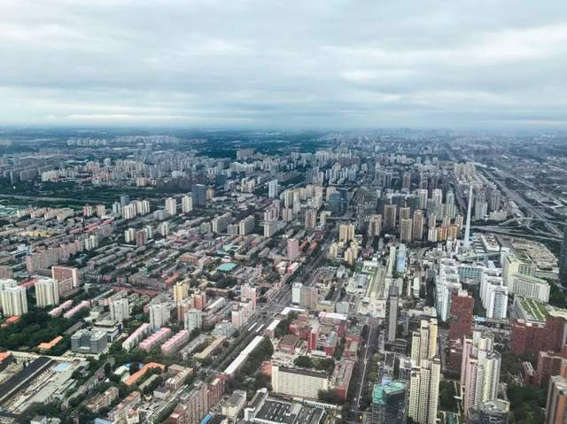

# 中国近20城放松住房限购，限制性购房政策有望进一步松动

**文/庞无忌**

近期，中国多地调整放松限制性购房政策。

**江苏省连云港市**
住建局26日出台9条措施，进一步优化房地产政策。其中主要涉及优化公积金贷款与提取，将首套公积金首付比例由30%降至20%，继续发放购房补贴，延长土地出让金缴交时限，推行“房票”安置等。

**江苏省扬州市**
25日发布新政称，自7月1日起，在市区购买改善性住房的，不再执行限购政策，其原有住房不再执行限售政策，有效期一年。这是今年2月出台楼市新政约4个月后，扬州市再度出手调整优化当地楼市政策。
**经过两次调整，扬州楼市限购限售政策已基本放开。**

**福建省福清市**
6月15日公布的一份官方文件指出，在该市购买新建商品住房的，不再执行限转售政策。当地自2017年7月起，参照福州做法，规定购房合同签订满2年，并已取得不动产权证的住房方可转让。
**福清市也成为今年第一个正式官宣取消住房限售的城市。**

今年已百余地出台政策超300次

据中指研究院统计，2023年以来，已有百余地方出台房地产调控政策超300次，其中济南、长沙、厦门等近20个城市放松限购政策，部分热点二线城市如杭州已多次出台政策优化限购措施。

放松限贷和限售政策的城市数量也有所增加。

自去年以来，已有多城松绑限售政策。据诸葛数据研究中心不完全统计，截至今年6月中旬，包括郑州、青岛、苏州、金华、南京、常州、东莞、西安等超20城放松限售政策，取消限售的城市有哈尔滨、常州、廊坊、衢州、福清等少数几个城市，大多是三四线城市。

限制性购房政策适配度有所下降

以限购、限贷、限售、限价为代表的行政性、限制性购房政策一度被视为各地楼市调控工具箱中的“杀手锏”。不过，随着中国房地产市场进入新阶段，业内普遍认为，中国房地产市场难再现过去的狂飙式发展。

当下，多地楼市调整压力加大，面临市场信心恢复缓慢、交易活跃度走低等情况，限制性购房政策在因城施策时，适配度已有所下降。

中指研究院市场研究总监陈文静指出，当前，楼市企稳仍受到了多个因素的影响和制约：

一是宏观经济面临着较大压力，居民收入预期尚未出现明显好转。

二是新房、二手房价格未回归上升通道，购房者对房价仍有下跌预期。

三是购房者对期房烂尾的担心仍在、当前个别房企偿债压力较大，也对市场预期形成扰动。

下半年或更多城市放开促市场恢复

陈文静认为，下半年或有更多城市逐步放开限制性政策，力促市场企稳恢复，特别是普通二线和三四线城市。

据克而瑞研究中心统计，上半年，多地松动限制性购房政策。其中，广州、长沙等14城放松限购；湖南省及青岛、合肥等十余城市放松限贷；深圳、贵阳等7城市放松限价；郑州、厦门等城市放松限售。

展望后市，克而瑞研究中心认为， **地方房地产调控政策或持续放松，一线城市以及杭州、成都等强二线城市有望进一步解绑交易限制**
，以支持刚性和改善性购房需求；

**三四线城市或全面放开购房行政限制**
，加码房票、购房补贴、契税减免等财税支持政策。除个别强三线外，该机构认为，其余城市可考虑全面放开限购，限贷等限制性政策。

来自：国是直通车

编辑：高琰瑭

责编：魏 晞

